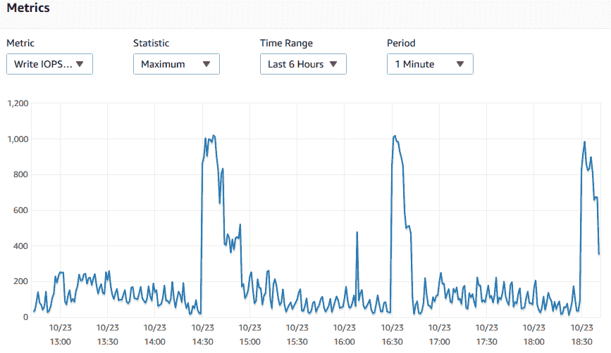
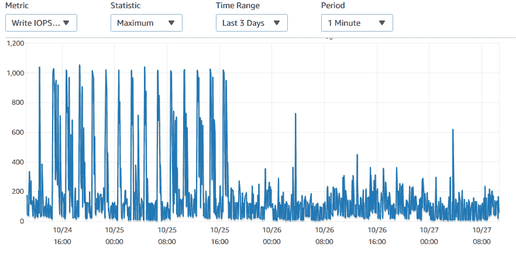

# 数据库危机:我们如何提高大型数据库插入的性能

> 原文：<https://levelup.gitconnected.com/database-crisis-how-we-improved-performance-for-large-database-inserts-156adcd2fe8e>

微服务架构

当 MySQL 中要求每 2 小时更新大约 10 条 lac 记录时，我没有考虑太多，因为批处理和更新所有记录就足够了。但是我不知道我错了。

我们花了大约 15 天编写整个应用程序，花了 1 个月解决每个补丁产生的问题。下面是对随后发生的事件以及我们为稳定应用程序所采取的措施的描述。

这个博客是为那些:

*1。希望优化他们的数据库代码*

*2。后端开发人员处理微服务架构中的多个模块。*

*3。或者只是想了解公司如何让软件技术为他们服务*

# 要求

该模块本质上是一个基础设施，用于根据通过面板输入的一些指标创建产品列表页面的版本。品类经理可以根据他们的订单和印象、运输时间或者是否应该首先看到新产品来定义他们是否希望产品得到提升。这些版本的产品页面可以向所有用户展示，也可以通过对访问我们网站的流量进行细分，在 A/B 测试实验中相互竞争。大多数公司都这样做，以确保该特性对他们的业务是正确的。

该项目旨在根据预定义的指标动态计算这些产品的位置

根据分配给指标的权重，产品将被分配分数，该分数每 2 小时重新计算一次，您在网站或移动应用程序上看到的产品页面也会相应改变。

我们通过 Java 微服务架构实现了这一点，在该架构中，服务被相应地划分

1.  第一个根据类别经理分配的权重计算产品得分
2.  第二个处理 Solr 中的搜索数据库
3.  第三个向前端传送数据。

# 初始架构:

一旦分数通过面板输入，每两个小时应用程序将计算特定类别中每个产品的分数和排名，插入或更新数据库中的分数，并将它们添加到 Solr。只有当所有数据库操作都成功完成时，Solr 中的等级更新才必须通过队列服务发送到服务，因为数据必须通过服务保持一致。

在计算出每个类别的排名后，数据必须被写入数据库。类别的结构是这样的，它们被分为父母和孩子。父类别包含其所有子类别产品，首先处理，然后处理其所有子类别，因为可以从父类别中检索数据，而不是再次计算。Java 中的每个线程都被分配了一个父线程及其所有子线程类别。所有这些数据必须每 2 小时在数据库中替换一次，但是因为我们不能承受可用性的损失，所以我们使用了 insert on update 查询。

# 问题是:

由于这是一个多线程应用程序，多个线程在完成操作后会发送一个数据库批量更新。这通常是同时发生的。现在，对于一个家长类别，我们谈论的是 50k 记录。同样在 A/B 实验中，一个类别可能有 5 个版本。因此，大约有 250，000 个查询会同时访问数据库。

对于子类别的处理，5-10，000 之间的任何数量的更新将被一起发送。

此外，由于我们已经使用了 insert on update 查询，MySQL 将首先检查数据库中是否存在该记录，然后决定是更新还是插入，这意味着每个查询都要执行两次操作。

总而言之，这种情况每两个小时就发生一次

每 2 小时观察到一次主要的尖峰。我们的应用程序不仅在它应该做的事情上表现不佳，而且它还通过占用数据库线程及其处理时间而开始妨碍其他应用程序的性能。一些真正关键的应用程序，如网站上的 checkout 开始滞后，周五也快到了，这意味着这个问题需要立即解决，因为周末是各种销售的黄金时间。

然后，我们审计了所有的用例，看看我们是否可以减少数据库插入，或者在不太重要的用例中偷工减料，或者只是使用一些其他技术来减少影响。

这里的另一个约束是，在 Solr 中重建缓存时，数据必须持久化。这意味着数据不能在计算分数后刷新，因为它们是另一个模块的备份。将所有数据保存在同一个数据库中也很重要，因为如果我们在 SQL 中移动数据库，连接会很麻烦。

# **我们的解决方案:**

因此，为了快速修复，我们将查询分为插入或更新，这样每个查询只需要一个操作。然后，我们在每个类别线程的末尾收集所有的查询，而不是立即触发它们。一旦所有的线程都完成了它们的执行，我们就做了一个合并的查询列表，将它们分成大小相等的 10k 的批处理，并从一个线程中启动它们。

但是等等，如果查询中途失败，并且所有产品分数都没有在 DB 中注册，该怎么办呢？向 Solr 发送更新可能是致命的，因为数据库之间的数据会不一致。为了解决这个问题，我们将 10 个 lac 批量插入/更新查询打包到一个事务中，使其原子化。

我们考虑的另一个选择是使用 MySQL 的 [LOAD DATA INFILE](https://dev.mysql.com/doc/refman/8.0/en/load-data.html) 方法，该方法实际上接收一个 CSV 文件并填充整个表。这个神奇的解决方案应该比插入查询快 20 倍左右。然而，由于开发、测试需要更长的时间，而且我们时间紧迫，所以我们决定在事务中使用单线程批处理。

这一切都是在和时间赛跑，因为排灯节的销售额预计会很高。如果这不起作用，我们将不得不在周末关闭应用程序，或者在下一个版本中彻底改变方法。所以下一次项目被部署到生产时，这是一个疯狂的战场环境。很多事情都取决于此。所有的监控屏幕都打开了，眼睛盯着图表。

应用程序 cron 开始运行，计算分数，一切运行顺利。当应用程序开始触发数据库查询时，紧张程度达到了历史最高水平。此外，我们的内部日志系统晚了半个小时，这意味着我们无法获得应用程序处理的实时更新。你对印巴比赛有过这种焦虑吗？

开门见山地说，这很有效。写峰值从 45 分钟下降到 5 分钟，CPU 使用率大幅降低。

所以总结一下这个问题，

# 哪里出了问题

1.  可变大小的批次(一些数据库命中只有 5 条记录，而一些有 50000 条记录)
2.  多线程(多倍增加负载)
3.  更新查询时插入(每个查询 2 次命中)

# 我们在下一个版本中做对了什么

1.  固定大小的批次
2.  单线程数据库命中
3.  将查询区分为插入或更新
4.  交易中的包装批次

影响最大的解决方案是将查询包装在一个事务中。原因是，

> 如果事务对数据库进行了修改，InnoDB 必须在每次事务提交时将日志刷新到磁盘。当每次更改后都进行提交时(与默认的自动提交设置一样)，存储设备的 I/O 吞吐量会对每秒潜在的操作数设置一个上限。

因此，当我们的应用程序将所有更新写入数据库时，它不必每次都写入磁盘，相反，它只在整个批处理成功时才这样做。这允许 SQL 继续写入数据库，并决定是否只将它写入磁盘一次，而不是在每次批处理之后。由于主设备和从设备之间的复制被延迟，有一个大约一分钟的写 I/O 峰值，但是考虑到其余的收益，这是值得的。其余的解决方案通过减少每批的 CPU 使用量来提高性能。

该应用程序最终稳定下来，同时不再对生产环境造成任何破坏，并让所有其他应用程序平静地工作。

希望这篇文章有意义，并给你一个解决你所面临的任何数据库问题的方向。我也希望你喜欢读它，就像我喜欢写它一样。再见。