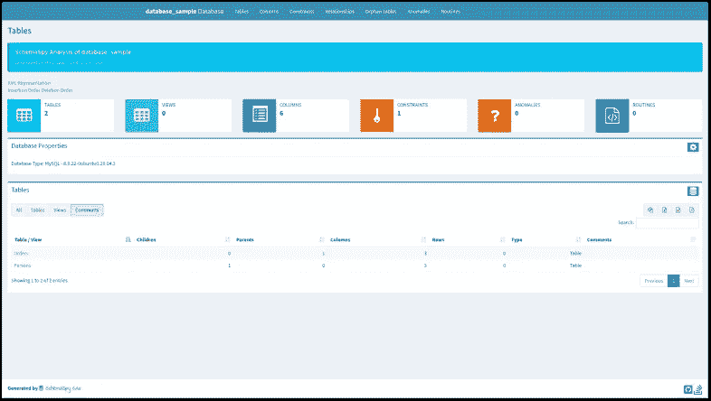

# 如何用 SchemaSpy 记录数据库

> 原文：<https://levelup.gitconnected.com/database-documentation-with-schemaspy-e9071eecd45a>

## 免费获取完整的图表！

在我的咨询任务中，我经常从技术团队那里得到数据库导出和平面文件列表，但是经常(总是？)没有关于这些数据的名副其实的文档。

我遇到的团队的人员流动、专业知识的缺乏或时间的缺乏通常意味着我必须在开始分析之前“记录”我得到的数据。

今天，我要谈谈 [SchemaSpy](http://schemaspy.org/) :一个 Java 应用程序，我用它来构建 HTML 格式的文档，开始探索和记录我的客户的信息系统中的不同实体和实体之间的关系。

SchemaSpy:一个得益于优秀文档的自由软件

为了工作，你需要在你的工作站上安装 [Java 8](https://www.java.com/download/) ，并且可以在你的命令提示符下访问。然后，这完全取决于您正在使用的数据库的类型，但是您需要为每个数据库下载连接器:

*   对于 MySQL，你要下载[MySQL 的版本和你的操作系统对应的连接器](https://dev.mysql.com/downloads/connector/j/)；
*   对于 PostgreSQL，需要下载[PostgreSQL 版本对应的连接器](https://jdbc.postgresql.org/download.html)；

例如，让我们以一个包含客户和订单的数据库为例。订单通过客户的唯一标识符链接到客户:

您将通过 SchemaSpy(在命令行中或使用社区提供的界面)获得以下形式的站点:

SchemaSpy 生成的文档主页

命令行中提供了易于访问的基本信息:

*   表、视图、列、约束的数量。
*   对于每个表，元素的数量；
*   数据库的属性；

最重要的是，用于探索的实用可视信息:由 Graphviz(由 SchemaSpy 提供)生成的不同表之间交互的模式:

数据库不同表之间关系的视图

一个令人兴奋的特性是，该工具可以使用开发人员在创建表格时可能使用过的注释，这些注释可能具有作为文档的价值。

就拿我们之前考虑的基数[加评论](https://dev.mysql.com/doc/refman/8.0/en/create-table.html)来说吧:

在工具生成文档之后，我们找到了注释！

> 在我看来，我们应该在尽可能低的级别，也就是数据库级别，推行这种良好的文档实践。

很好，不是吗？如果你是 Symfony 的开发者，这并不复杂:

简单来说。

## 如何生成文档？

Schemaspy 是一个 Java 命令行工具，因此您必须使用终端来创建文档网站。

> 如果你更喜欢点击的方式，那么试试 Joachim Uhl 的 [SchemaSpyGUI](http://schemaspygui.sourceforge.net/) 。

命令行参数的完整和通用形式如下:

以下是从文档中摘录的一些常见参数的描述:

*   **[ -t** *数据库类型***】**数据库的类型(如 ora、db2 等。).
    *使用-dbhelp 获取内置类型列表。默认为 ora*
*   **[-DP***path to drivers***]**schema spy 将在其中查找驱动程序的驱动程序路径；
*   **[-db***dbName***]**要连接的数据库名称；
*   **[-host***hostName***]**要连接的主机名/IP，如果数据库类型需要的话；
*   **[-port** *端口号* **]** 数据库类型需要时 DBMS 监听的端口；
*   **[-u** *用户***】**具有读取权限的有效数据库用户 id。
    *除非指定了****-SSO****，否则需要用户 id；*
*   **[-p** *密码* **]** 与该用户相关联的密码。
    *默认为无密码。；*
*   **[-o***output Directory***]**将生成的 HTML/graphs 写入的目录；

请随意查看 SchemaSpy 文档以获取更多信息，并在您当前的项目中尝试使用它来给同事留下深刻印象😎。

如果你喜欢这篇文章，[关注我](https://medium.com/@mickael-andrieu/)，我会在发布未来文章时通知你！

 [## 通过我的推荐链接加入 Medium-mickal Andrieu

### 作为一个媒体会员，你的会员费的一部分会给你阅读的作家，你可以完全接触到每一个故事…

medium.com](https://medium.com/@mickael-andrieu/membership)