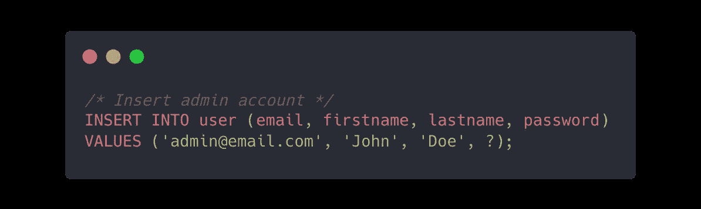
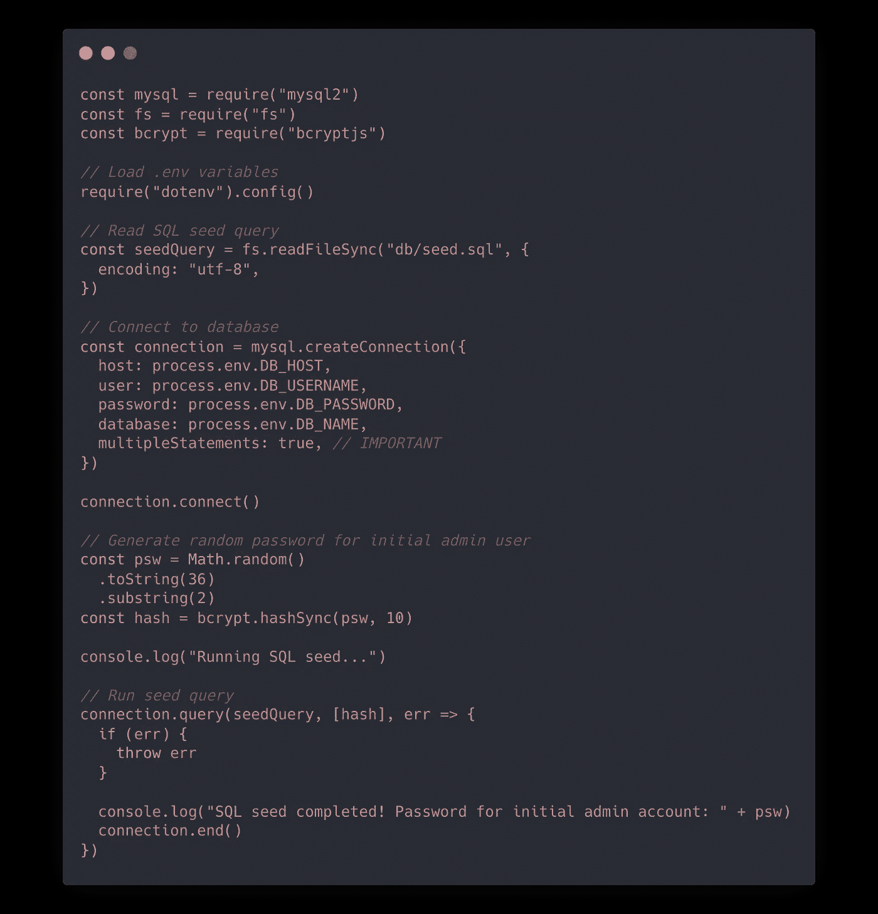

# Node.js 中的数据库播种

> 原文：<https://levelup.gitconnected.com/database-seeding-in-node-js-2b2eec5bfaa1>


[https://www . pexels . com/de-de/foto/person-die-eine-grune-pflanze-halt-1072824/](https://www.pexels.com/de-de/foto/person-die-eine-grune-pflanze-halt-1072824/)

在本文中，我想谈谈使用 Node.js 和 MySQL 的数据库播种:它是什么以及如何实现它。你会注意到它实际上非常简单明了。对于本教程，我选择 MySQL 作为数据库系统，但这个过程也应该与任何其他工作。在这种情况下，可能需要对 SQL 查询执行进行一些小的修改。

让我们从解释数据库播种开始。[来源](https://en.wikipedia.org/wiki/Database_seeding)

> 数据库播种是用数据对数据库进行初始播种。设定数据库种子是一个过程，在此过程中，在安装数据库时会向数据库提供一组初始数据。当我们希望用将来要开发的数据填充数据库时，它特别有用。

因此，我们的目标是在初始化时向数据库“输入”虚拟数据。这非常有帮助，尤其是在开发过程中，或者对于在本地机器上运行开发环境(数据库)的新员工来说。

首先，我们创建一个新的 SQL 脚本，其中包含插入虚拟数据的查询。稍后将使用 Node.js 执行该脚本。

播种脚本:`./db/seeding.sql`



SQL 代码片段

这个 SQL 命令将新的数据集插入到`user`表中。`?`是一个占位符，当使用 Node.js 调用脚本时，它会被一个变量(初始密码)替换。

确保在运行脚本之前创建了数据库表，否则将会失败。大多数形式都会处理好这一点。

接下来，我们编写 Node.js 脚本，这是建立数据库连接和执行我们刚刚创建的 SQL 片段所必需的。

Node.js 脚本:`./db/index.js`



Node.js 脚本

这里发生了什么？

1.  使用`dotenv`加载环境变量
2.  阅读 SQL 片段
3.  连接到数据库(MySQL)
4.  生成随机密码(哈希)
5.  执行 SQL 片段

最后，如果一切正常，管理员密码将被记录到控制台。除了使用`dotenv`，您还可以使用`fs.readFileSync`从任何其他文件加载您的数据库凭证。

如果您没有使用 MySQL，您只需修改数据库连接设置。我确信有一个适用于您的数据库系统的 npm 包可以处理这个问题。

最后但同样重要的是，让我们扩展`package.json`脚本来简化节点脚本的执行。

```
{
  "scripts": {
    // ...
    "seed": "node db/index.js"
    // ...
  }
}
```

现在，您可以从终端使用一个命令运行数据库播种:`npm run seed`。就是这样！你的数据库充满了虚拟数据，你可以专注于重要的东西。

还有一个 GitHub 存储库，包括一个使用数据库播种的示例应用程序。看一看。

[](https://github.com/larswaechter/expressjs-api) [## GitHub-larswaechter/express js-API:用 TypeScript & Express.js 构建的 Node.js REST-API 示例

### 这个存储库是一个用 TypeScript 和 Express 构建的虚拟 Node.js REST-API。您可能希望将它用作…的代码库

github.com](https://github.com/larswaechter/expressjs-api)