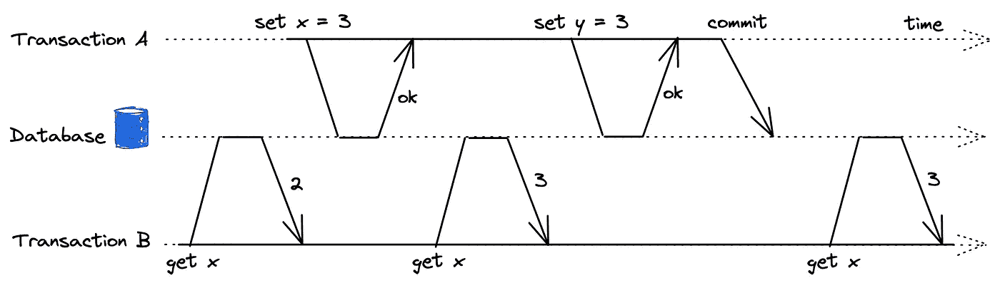
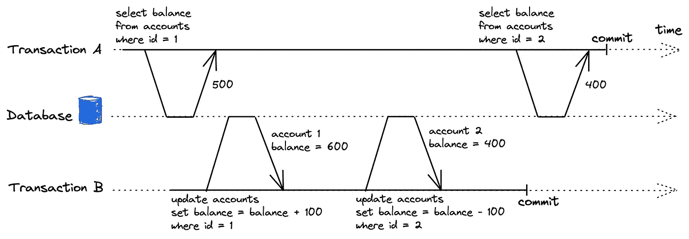
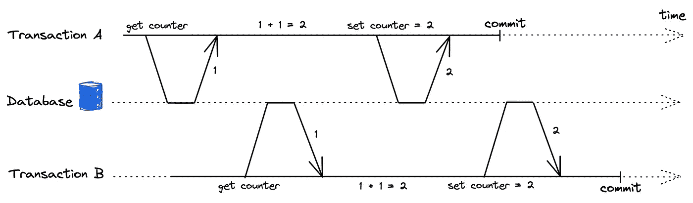
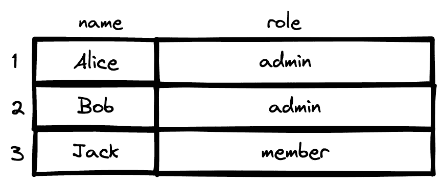
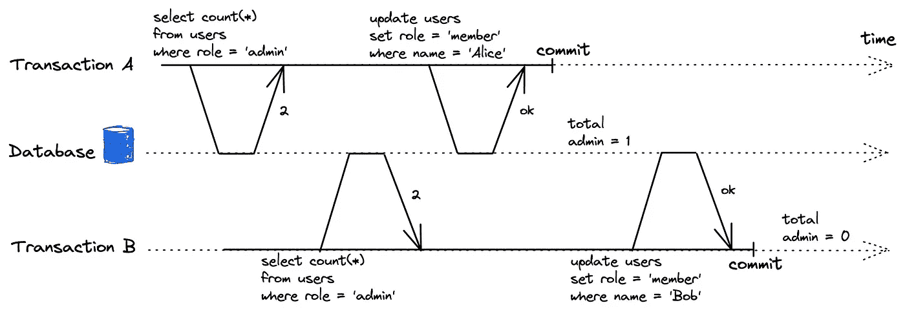
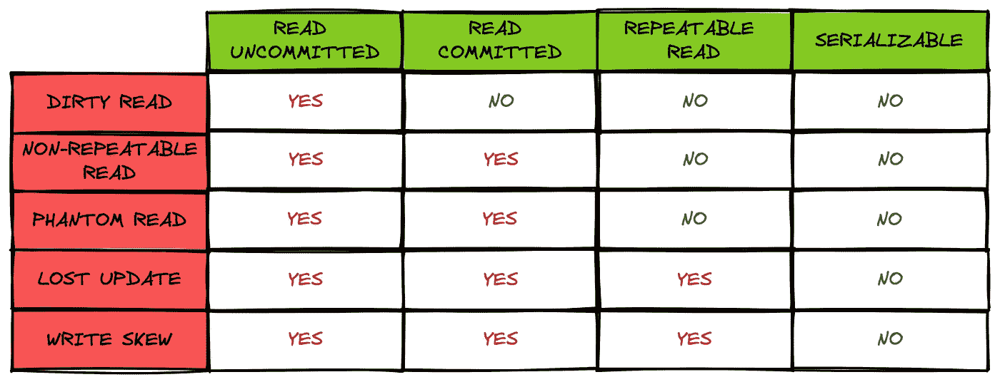
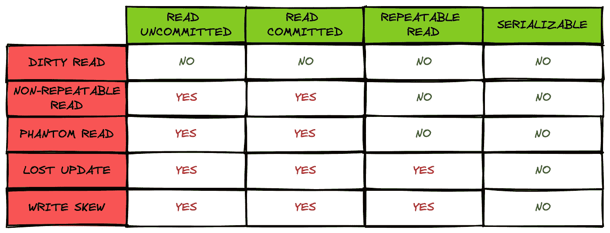

# 数据库事务隔离级别

> 原文：<https://levelup.gitconnected.com/database-transaction-isolation-levels-5d76c27d42bb>

有一天，朋友问我:“两个并发的事务能看到对方写的数据吗？”我毫不犹豫地回答:“没有！”。然而，答案并不像我想象的那么简单。

由 [kazuend](https://unsplash.com/es/@kazuend?utm_source=medium&utm_medium=referral) 在 [Unsplash](https://unsplash.com?utm_source=medium&utm_medium=referral) 拍摄的照片

# 数据库一致性

每个使用数据库引擎的人都会知道它的四个重要属性，即:**原子性、一致性、隔离性和持久性。**

关于第三个属性，**隔离**意味着并发执行多个事务的结果必须与顺序执行它们的结果相同。我们可以强制数据库连续运行事务以避免冲突。然而，在现实中，这种方式行不通，因为它没有很好的伸缩性。数据库处理的事务越多，性能就越差。现在，每个数据库引擎都有不同的隔离级别和实现，但是它们总是致力于运行尽可能多的事务，同时不断减少由并发事务引起的错误。

# 并发事务问题

在深入探讨隔离级别之前，让我们来看看不按顺序运行多个事务会发生什么。它们通常被称为竞争条件问题。

## 肮脏的阅读

*脏读*意味着一个事务可以看到其他事务没有提交的数据。

脏读问题

在上面的例子中，即使事务 A 没有被提交，事务 B 也可以看到 x (3)的新值。它使用户感到困惑，并可能导致不正确的决策。此外，它还违反了**原子性**属性。如果事务 A 失败，中间数据不会被丢弃，可能会被事务 b 保存到数据库中。

## 不可重复读取

*不可重复读取*是指一个事务在不同的时间点查询数据，但是因为数据已经被其他**提交的**事务**修改**而得到**不同的结果**的问题。

此图说明了银行系统中的*不可重复读取*问题。

不可重复读取问题

让我们假设一个用户总共有 1000 美元，并将它们平均分成两个账户。一天，他从账户 2 向账户 1 转账 100 美元(交易 B)。最后，账户 1 应该有 600 美元，账户 2 应该有 400 美元。同时，系统管理员查询两个账户的余额(交易 A)。管理员读取两次，一次在事务 B 提交之前，另一次在提交之后。现在，管理员看到不一致的数据，用户只有$900。在这种情况下，管理员可以简单地刷新网页，他将有正确的数据。

相比之下，这个问题在某些情况下变得更加严重，例如进行备份和执行分析查询。即使我们多次尝试运行该作业，我们也不知道结果是否是旧版本数据和新版本数据的混合。此外，这些作业非常耗时，在大型数据库上可能需要几个小时。

## 幻像读取

幻影读取是指一个事务在不同的时间点查询数据，但由于数据已经被其他**提交的**事务**插入**或**删除**而得到**不同的结果**的问题。

我们可以看到它与前面的问题非常相似。然而，在这种情况下，我们看到的数据比前一个查询更多或更少。从数据库系统的角度来看，也很难容忍暂时的不一致。

## 丢失更新

丢失更新问题

*丢失更新*发生在多个并发事务**从数据库中读取**相同的值，**修改**并且**写回**它们修改后的值。几乎所有的应用系统都会遇到这个问题。我们可以在某些情况下看到它，例如:增加脸书帖子上的赞或评论数，同时编辑维基页面…

## 写入偏斜

如果多个并发事务从数据库中查询数据，并基于此做出决策，将数据的**不同部分**写回，导致数据变得不一致，则称为*写偏斜*问题。

为了更清楚，我们举个例子。假设您正在为您的应用程序实现基于角色的访问控制(T21)授权。一个组织有两个角色:*管理员*和*成员。该系统确保一个组织至少有一名管理员才能正常工作。最初，有两个管理员，如下表所示:*

发生写入偏斜前的数据

Alice 和 Bob 刚刚开始学习这个新系统，他们将自己的角色换成了会员，看看会员能做些什么。不幸的是，它们同时发生，过程如下图所示:

写偏斜问题

应用程序创建了 2 个事务，他们检查组织中有多少管理员，他们都看到了 2，然后继续下一步:更新他们的角色。结果，现在没有管理员，违反了上述要求！

*写歪斜*是*丢失更新*的概括。在这种情况下，事务写入不同的数据，它们不会相互覆盖，但不一致仍然会发生。

我们刚刚讨论了并发执行多个事务时出现的一些问题。在下一节中，让我们看看 Mysql 和 Postgres 如何用它们的事务隔离级别来处理它们。

# Mysql 中的事务隔离级别

Mysql 提供了 4 个级别的事务隔离:

*   *读取未提交:*本级事务可以看到其他**未提交**事务的数据。
*   *READ COMMITTED:* 该级别的事务只能看到其他 **committed** 事务的数据。
*   *可重复读取:*一个事务在开始之前只看到**提交** **的事务的数据。这是 Mysql 中默认的**事务隔离级别。****
*   *可序列化:*Mysql 中最严格的级别。它试图通过使用**锁定**来顺序运行**事务**。该级别隐式地将所有普通的 SELECT 语句转换为 [SELECT … FOR SHARE](https://dev.mysql.com/doc/refman/8.0/en/select.html) ，并强制所有事务等待直到锁被释放。

Mysql 中的事务隔离级别

上表显示了每个级别可以处理的问题。我们之前讨论的所有问题都可能发生在*未提交读取*级别。这也是为什么在现代系统中很少使用的原因。*提交读*只能解决*脏读*问题，而*可重复读*几乎可以解决所有问题，除了*丢失更新*和*写偏斜*。SERIALIZABLE level 似乎是避免这些问题的最佳选择，但它的性能令人担忧，因为它几乎是串行运行事务的。

我们可以通过显式使用锁定( [SELECT … FOR SHARE 或者 SELECT … FOR UPDATE](https://dev.mysql.com/doc/refman/8.0/en/select.html) )在 *REPEATABLE READ* 级别实现 *SERIALIZABLE* 级别的可串行化。这种灵活性有助于开发人员根据他们系统的特点选择合适的方法。

# Postgres 怎么样？

Postgres 中的事务隔离级别

Postgres 也像 Mysql 一样支持 4 级事务隔离。

然而， *READ UNCOMMITTED* level 和 *READ COMMITTED* level 做的完全一样，也就是说 *dirty read* 问题并不会发生在所有级别的 Postgres 中。

此外，Postgres 中的 *SERIALIZABLE* level 实现了与 Mysql 中相同的目标，但实现方式不同。与 Mysql 使用悲观锁不同，Postgres 使用[乐观锁](https://wiki.postgresql.org/wiki/SSI)来解决问题。基本上，Postgres 允许一个事务并发运行，不必等待其他事务。提交交易时，Postgres 会检查交易的数据是否被他人修改。如果为真，事务将被强制重试。这种机制在 9.1 版的 Postgres 中得到应用，并且很有前途，因为它提供了完全的可序列化性，同时只有很小的性能损失。

# 最后

事务隔离级别决定了运行并发事务的结果。根据数据库引擎的不同，有几个级别。开发人员需要理解它们，以便有效地解决竞争条件问题，同时仍然保持数据库的良好性能。

# 参考资料:

*   [https://en.wikipedia.org/wiki/ACID](https://en.wikipedia.org/wiki/ACID)
*   [https://dev . MySQL . com/doc/ref man/8.0/en/innodb-transaction-isolation-levels . html](https://dev.mysql.com/doc/refman/8.0/en/innodb-transaction-isolation-levels.html)
*   [https://www . PostgreSQL . org/docs/current/transaction-iso . html](https://www.postgresql.org/docs/current/transaction-iso.html)
*   [设计数据密集型应用](https://www.amazon.com/Designing-Data-Intensive-Applications-Reliable-Maintainable/dp/1449373321) —第 7 章

# 分级编码

感谢您成为我们社区的一员！在你离开之前:

*   👏为故事鼓掌，跟着作者走👉
*   📰查看[升级编码出版物](https://levelup.gitconnected.com/?utm_source=pub&utm_medium=post)中的更多内容
*   🔔关注我们:[Twitter](https://twitter.com/gitconnected)|[LinkedIn](https://www.linkedin.com/company/gitconnected)|[时事通讯](https://newsletter.levelup.dev)

🚀👉 [**加入升级达人集体，找到一份惊艳的工作**](https://jobs.levelup.dev/talent/welcome?referral=true)