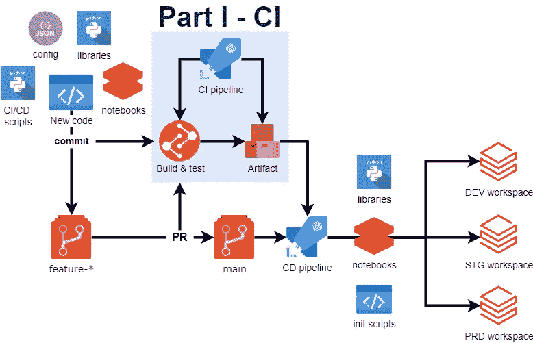

# 使用 Azure DevOps 的数据块 CI/CD:第一部分，CI

> 原文：<https://levelup.gitconnected.com/databricks-ci-cd-using-azure-devops-part-i-ci-e9cacd89b6c2>

关于多数据块环境的 CI/CD 系统的系列文章的第一部分，包括使用 Azure DevOps 的测试、包、笔记本和 init 脚本



使用 **Azure DevOps** 的**数据块 CI/CD** 的概要

**Databricks** —一个最初围绕 Spark 构建的平台，通过引入 Lakehouse 概念、Delta 表和许多其他最新的行业发展，已经成功成为满足数据科学和数据工程需求的领导者之一。尽管开始使用 **Databricks** 非常容易，但由于 **Spark** 的语言灵活性(它支持 **Scala** 、 **Python** 、 **Java** 、 **SQL** 和 **R** )以及笔记本的用户友好性，使其成为生产级工具并不是一项简单的任务，当然需要一些努力。在这个由两部分组成的系列文章中，我将概述如何使用 **Azure DevOps** 为**数据块**构建一个完整的 **CI/CD** 系统。

# TLDR——给我看看代码

用于此 **CI/CD** 流程的所有代码可在以下网址找到:

[https://github.com/szymonzaczek/databricks-ci-cd](https://github.com/szymonzaczek/databricks-ci-cd)

**免责声明:** **我没有包含任何将在 data brick 集群上运行的实际 data brick 相关代码，我只是分享 CI/CD 流程。**

在深入解释如何处理作品之前，让我简单地告诉你为什么我们在 [Ecovadis](https://ecovadis.com/) 中需要这样一个工具。

# 为什么 Ecovadis 中的数据块需要 CI/CD 系统？

Ecovadis 是一家为供应链企业提供环境、可持续性和道德评估的公司。随着市场的快速增长和公司规模的扩大，我们显然需要改变数据工程解决方案的方法，以防止成为业务需求的瓶颈。这就是为什么我们一直致力于实现**数据网格**架构，其中每个域都处理自己的数据。我们决定在新方法中使用的核心技术组件之一是**数据块**。

最近，对 **git** 库的原生支持被引入其中，但代码版本化只是我们需求的冰山一角——从分散在不同业务领域的许多 repos 中的许多内部制作的 Python 包驱动的过多笔记本的角度来看……嗯，我希望你明白这一点——如果没有一个针对与**数据块**相关的代码的简化的 **CI/CD** 系统，我们很快就不能提供任何新的功能，相反，我们将被处理与日常操作相关的错误和问题所淹没我们的未来不会很光明，不是吗？尽管如此，我还是强烈推荐看看 Ecovadis，这是一家提供旨在解决环境和社会挑战的服务的伟大公司，我们也碰巧在这方面使用了非常酷的技术，我希望你通过阅读这篇文章很快就会发现！

[](https://ecovadis.com/) [## 业务可持续性评级| EcoVadis

### 评估企业社会责任和可持续采购的评级平台。解决方案包括风险…

ecovadis.com](https://ecovadis.com/) 

事不宜迟，让我们使用 **Azure DevOps** 进入 **CI/CD** 系统获取**数据块**。首先，我将概述 **CI** 和 **CD** 的具体目标。

# CI 的具体目标

*   在运行 CI 管道的代理上安装所有 Python 依赖项
*   从所有`setup.py`文件中构建`wheel`文件
*   运行所有可用的测试文件
*   发布测试结果
*   为**数据块集群**创建初始化脚本
*   将所有东西打包成一个工件
*   发布工件

# 裁谈会的具体目标

*   与多个**环境** / **数据块工作区**无缝集成
*   在指定的**数据块集群**上安装所有 Python 依赖项
*   上传在 **CI** 步骤中构建的包(`wheel`文件)
*   将初始化脚本上传到 Databricks 工作区
*   将笔记本上传到 Databricks 工作区

# CI/CD 中包含的数据块功能

**本文介绍的 CI/CD** 系统将侧重于:

*   **Python 库**

**构建**(创建`.whl`文件)和**单元测试**Python 包，这些包将包含满足您的数据工程和数据科学需求的任何类和函数。

*   **笔记本**

他们最好广泛使用定制的库(应该与这个 CI/CD 进程挂钩)或可从 **pypi 安装的库。**我建议尽可能保持简洁，而将主要代码存储在 Python 包中；在这个过程中， **Python** 和 **SQL** 笔记本都被支持。

*   **初始化脚本**

Init 脚本通常包含您将使用的任何非标准设置，包括安装定制的库、pip 可安装的包、repo 中指定的需求或任何附加的 spark 变量。它们非常有用，因为它们可以与作业集群和实例池一起使用，这可以显著降低使用**数据块**的成本。

# CI/CD 中使用的基于 Azure 的工具

在这个 CI/CD 系统中，我们利用了以下 **Azure** 服务:

*   **Azure DevOps**
    -存储库
    - yaml 管道( **CI** )
    -工件
    -测试
    -发布( **CD** )
*   **Azure 的 KeyVault**
*   **Azure 的应用注册(服务主体)**
*   **Azure 的数据块工作区**

# CI/CD 中使用的基于代码的工具

为了调整 CI/CD 流程以满足我们的需求，我采用了以下基于代码的工具:

*   **JSON 配置**—Azure devo PS 变量的替代

整个进程的配置存在于单个 **JSON** 文件中。显然，不应该将任何敏感信息放在那里，例如连接字符串或秘密——它们应该存储在 **Keyvault** 中，并在需要时由管道检索。在 **Azure DevOps** 中使用配置的标准方法可能是使用**变量组**，然而，由于这些变量的历史无论如何都不会保留，它们可以从代码中单独更改，这意味着单个拉请求不足以让您的代码得到部署——您需要记住并(正确地)在 Azure DevOps 中添加/更改这些变量，否则 **CI/CD** 管道可能会失败。我和我的同事们已经与它们进行了激烈的斗争，为了我们的目的，JSON configs 工作得更好。

**JSON** 配置示例:

*   **数据块 API**

为了让您宝贵的代码进入 Databricks 工作区，在那里它可以真正地生活和工作，我们将利用一个强大的 **Databricks API** 。它将用于与在`config.json`中定义的工作区通信，它将允许把你的库、它的需求、笔记本和 init 脚本放到所有正确的地方。为了让这种交流顺利进行，我写了一些函数和类，我很快会和大家分享。 **Databricks API** 将在 **CD** 的相关文章中大量使用，即将问世。

*   **数据块连接(数据库连接)**

**Databricks Connect** 是一个允许将本地运行的代码连接到 Databricks 集群的库。在这里，它用于测试目的——作为包的一部分编写的单元测试将使用 dbconnect 进行测试。与直接在数据块上运行代码相比，它有一些限制，在这里列出:[数据块-连接-限制](https://docs.databricks.com/dev-tools/databricks-connect.html#limitations)。尽管如此，当使用 dbconnect 作为 **CI** 管道的一部分时，没有代码被部署到 data bricks——data bricks 只是用作本地代码的运行时，这就是我选择在这里使用它的原因。使用时，请确保使用匹配版本的数据库连接和数据块运行时([数据块连接需求](https://docs.databricks.com/dev-tools/databricks-connect.html#requirements))。

# 代码结构

这个 CI/CD 过程将对代码的结构做出一些假设，尽管您显然可以根据您的具体需求对其进行裁剪。它的设计目标是成为一个可扩展的工具，将各种新的 Python 包和附带的笔记本引入到不同的 Databricks 工作区，而这些不同的包存在于单个 git 存储库中。这样，只要您的数据块相关代码遵循标准的线性环境方法，您就可以完全控制何时将给定的 **PR** 的结果部署到下一个环境。显然，如果你在一个大型的工程师团队中工作，同时处理不同的功能，将你的代码分成不同的库可能是一个更好的主意，但是这是你自己的决定。在这种情况下，你仍然可以使用我在这里分享的发布过程，但是你可以跳过在单个 repo 中将你的代码分割成多个包。正如我前面提到的，你可以(也应该！)定制所展示的流程，以满足您的确切需求。

在主项目目录( [databricks-ci-cd](https://github.com/szymonzaczek/databricks-ci-cd) )中，除了一个配置文件，`README.md`文件，一个有用的`.gitignore`文件，还有一个`azure-pipelines.yml`文件。该文件是一个实际的 **CI** 流程——它包含将在 **Azure DevOps** 代理上执行的步骤，这些步骤将生成一个已构建并经过测试的工件，该工件已准备好部署到 **Databricks** 工作区。

除此之外，项目中的每个包都应该有一个指定的需求目录，其中包含`common.txt`和`dev.txt`文件([需求](https://github.com/szymonzaczek/databricks-ci-cd/tree/master/package1/requirements))。`common.txt`文件应包含对运行开发包至关重要的需求，而`dev.txt`文件将包含任何对您的工作有帮助但对包的功能不重要的附加包，如 linter/格式化工具、测试包等。

最后但同样重要的是，该项目包含`ci_cd_scripts`目录( [ci-cd-scripts](https://github.com/szymonzaczek/databricks-ci-cd/tree/master/ci_cd_scripts) )。它是一个 Python 脚本的集合，将帮助整个 CI/CD 过程，例如将 JSON 文件输出到 bash 变量中，建立路径需求和笔记本目录，以及与 Databricks API 本身的通信。基本上，它将包含流程本身的所有支持代码，而不是在数据块上实际执行任何操作的代码。`ci_cd_scripts`目录的内容是平面的——所有的脚本都直接存在于这个目录中，没有进一步的代码划分为子模块——这是因为 Python 代码并不意味着既作为模块/子模块运行，也作为脚本运行([相对导入](https://stackoverflow.com/questions/14132789/relative-imports-for-the-billionth-time))。

这些脚本被编写为**命令行应用程序(CLI)**——它们将作为脚本从 shell 中运行，它们接受各种参数，这些参数可以是在 Azure DevOps 代理上分配的字符串或 bash 变量(例如，`json.config`的内容将被映射到 bash 变量上)。虽然它们很可能是更好的方法，但是我使用标准的`sys`模块来编写那些CLI 脚本——对于这个过程来说，这是完全可行的。

整个目录和文件结构可能如下所示:

```
project
│   README.md
│   azure-pipelines.yml   
│   config.json
│   .gitignore
└─── package1
│       │   __init__.py
│       │   setup.py
│       │   README.md
│       │   file.py
│       └── submodule
│       │      │   file.py
│       │      │   file_test.py     
│       └── requirements
│       │      │   common.txt
│       │      │   dev.txt
│       └─  notebooks
│              │   notebook1.txt
│              │   notebook2.txt
└─── package2
|       │   ...
└─── ci_cd_scripts
        │   requirements.py
        │   script1.py
        │   script2.py
        │   ...
```

显然，在这里我试图创建一个尽可能健壮的 versataile 结构，但是你可以根据你的需要很容易地定制它——例如，为了在主项目目录中有一个`setup.py`,并在存储库中的所有包中构建一个库，你所需要做的就是在`azure-pipelines.yml`中改变一个引用，你就可以处理你的情况了。

# 持续集成 CI

**CI** 流程的一部分被默认设置为在`dev`环境下运行(如`config.json`中所定义)——这意味着它将连接到分配给该环境的 Keyvault，它将使用`dev` Databricks workspace 等。当然，如果你的用例是不同的，你可能会改变它，因为你觉得合适。

## Azure 的神器

在设置 Azure 的管道之前，您应该为您的工件创建一个 feed，并将 Universal package 连接到它——我发现这个选项最适合我的特定需求，因为它允许自动处理包版本。有关这方面的更多信息，请参考[链接](https://docs.microsoft.com/en-us/azure/devops/pipelines/artifacts/universal-packages?toc=%2Fazure%2Fdevops%2Fartifacts%2Ftoc.json&bc=%2Fazure%2Fdevops%2Fartifacts%2Fbreadcrumb%2Ftoc.json&view=azure-devops&tabs=yaml)。

## 服务主体

作为所呈现的 **CI** 管道的一部分，在 **Azure DevOps** 代理和其他 Azure 的服务——**key vault**和 **Azure CLI** 之间有一个连接。为了使流程正常工作，Azure DevOps 和 Azure Resource Manager 之间必须有一个适当订阅的连接。要进行设置，请参考[链接](https://docs.microsoft.com/en-us/azure/devops/pipelines/library/connect-to-azure?view=azure-devops)。

## **基于代码部分的布局**

整个 **CI** 流程在`azure-pipelines.yml`中定义。我将在相关的 **Python** 脚本中分享每个讨论步骤的代码片段，但是您可以随时在 [databricks-ci-cd](https://github.com/szymonzaczek/databricks-ci-cd) 上参考整个存储库。

请注意，`azure-pipelines.yml`中的大部分步骤看起来与此相似:

```
- script: | 
   python ci_cd_scripts/file1_cli.py arguments
displayName: 'Set env variables from JSON cfg file'
```

这意味着运行 **CI** 管道的 Azure DevOps 代理正在运行带有`arguments`的`ci_cd_scripts/file1_cli.py` Python 文件。当给定的 Python 文件第一次出现在代码中时，我包含了它们的代码，并且我尽了最大努力提供了管道中每一步的简要说明。

## CI 设置

如何运行 **CI** 流程首先要考虑的是确定`trigger`的类型。我决定使用`trigger`，这里使用的是 pushed 分支中的管道版本。这里，流水线被触发用于`release*`和`main`分支。更多信息请参考[链接](https://docs.microsoft.com/en-us/azure/devops/pipelines/build/triggers?view=azure-devops)。

接下来要做的是决定由哪个代理来管理你的管道。说实话，我对 PowerShell 不是很熟悉，因此我求助于标准的 Ubuntu 机器。

我还对 Python 版本使用了矩阵策略——基本上，这意味着如果我在这里指定了多个 Python 版本，管道将会运行多次。在这里，如果需要使用一个以上的 Python 版本，它只是作为一个简单的工具来扩展代码测试。

## 正在读取配置

`azure_pipeline.yml`的这段代码运行`ci_cd_scripts/read_config_cli.py`文件，传递`config.json`作为参数。

`read_config_cli.py`的内容:

`read_config.py`的内容:

这部分管道将`config.json`的内容设置为正在运行的 **Azure DevOps** 代理会话上的 bash 变量。所以基本上这允许稍后从 bash 控制台本身引用变量，这在处理各种环境时非常方便。

## 从 Keyvault 的

Keyvault 中的秘密可以使用我们之前设置的服务连接来检索(**不要**将秘密放在代码版本化的存储库中！).我倾向于使用的密钥库通常位于防火墙之后，因此，为了实现这一点，我们需要将运行我们管道的代理的 IP 列入白名单。通过这样使用它，来自 Keyvault 的秘密被映射到 bash 变量——就像之前从一个 **JSON** 文件中读取的配置一样。如果你试图访问的 Keyvault 不在防火墙后面，可以跳过白名单。

您可以在 **Keyvault** 中放入任意多的参数——该脚本将下载所有参数(如果您只想下载特定的秘密，只需更改`SecretsFilter`)。不过，在这个 CI 流程中，我们将使用`databricks_token`secret——这是一个**个人访问令牌**,您可以在 **Databricks UI** 中直接生成。有关如何操作的更多说明，请参考[链接](https://docs.databricks.com/dev-tools/api/latest/authentication.html)。

取回机密后，我们应该从**密钥库**白名单中删除代理的 IP——我们不希望未经授权的人访问我们宝贵的机密，不是吗？

## 查找 Python 包的要求

在安装依赖项之前，让我们确保`pip`已经升级并且轮子已经安装在其中。

`find_files_cli.py`的内容:

`find_files.py`的内容:

我使用`find_files_cli.py`来建立 repo 中需求目录的路径。我以这样的方式写了这个脚本，作为第一个参数，你必须提供你想调用的函数，然后你提供必要的参数。在函数`find_files_in_nested_dir_job()`的情况下，您提供工作目录、嵌套目录的深度(项目结构中有多少个目录)、您将在其中查找单个文件的嵌套目录(在本例中为`requirements`)、您正在查找的文件的扩展名(在这里为`txt`)，以及可选的文件名(没有扩展名)和用于命名 bash 变量的后缀。像我在这里做的那样运行这个脚本将导致在 Azure DevOps 代理上创建一个 bash 变量，该变量将存储包内模块的`requirements`子目录中带有`txt`扩展名的文件的绝对路径。这是通过调用以下代码行来实现的:

`print(f”##vso[task.setvariable variable={variable_name}]{string_output}”)`

如`find_files.py`中`output_list_as_bash_variable_ado()`功能所定义。Azure DevOps 代理上 Python 代码中的这种打印内容为一个名为`variable_name`的 bash 变量赋值`string_output`。尽管这种方式看起来有点不太好，但这是我发现的从 Python 脚本内部分配 bash 变量的最佳方式。当然，这个 bash 变量将只包含 string(当导出变量到 bash 时，Python 类型将不被保留),但是它的内容将非常容易恢复，通过调用`string.split(',')`函数，这将产生一个整洁的列表，其中包含从需求目录到文件的路径。猜猜会发生什么——通过这样的设置，同一个项目中的多个包被一起处理！是不是很酷？

需求 bash 变量内容的一个例子:

`/home/vsts/work/1/s/module/requirements/common.txt,/home/vsts/work/1/s/module/requirements/dev.txt`

所以请注意，实际上有两个文件输出到这个变量。

## 在本地安装 Python 需求

`process_requirements_locally_cli.py`的内容:

`process_requirements_locally.py`的内容:

一旦建立了所有需求文件的路径，我们就可以继续安装它们了。为了正确地处理它，我再次求助于一个简短的 CLI Python 脚本，它与参数一起被调用，参数是一个 bash 变量，包含需求文件的路径和我们希望安装哪种依赖项。因为现在这样做是为了测试的目的，所以我在这里选择了`dev`需求——这意味着模块的`requirements`目录中的任何`dev.txt`文件中指定的所有依赖项都将被本地安装。

## 查找 setup.py 文件

我们将再次利用`find_files_cli.py`，但这一次是为了找到`setup.py`文件，然后用它们构建`wheel`文件。我们指定工作目录、嵌套目录的深度(这里是 1，因为我们要在项目的下一个目录中查找文件)、`None`作为字符串(在函数内部解析为通配符`**`)、`py`用作扩展名，最后`setup`用作扩展名之前的文件名，这导致将`setup.py`文件的路径输出到 Azure DevOps 代理上的 bash 变量`setup_files`。

`setup_files`变量的一个例子:

`/home/vsts/work/1/s/package1/setup.py`

## 在本地构建包

`build_packages_cli.py`的内容:

`build_packages.py`的内容:

构建`wheel`文件的标准方式是在终端中运行`python setup.py bdist_wheel`。为此，我求助于使用`subprocess` Python 模块——这样我可以非常容易地利用我在上一步中创建的`setup_files` bash 变量。通过将`sys.executable`传递给`subprocess.check_call()`，我们确保了我们在这项工作中使用了正确的 Python 解释器。运行这个脚本会为我们项目中的任何包生成`wheel`文件，因此您编写的代码已经正式变成了可安装的 Python 库。有了这个，你可以非常容易地在任何你想要的地方使用你的 Python 代码——例如，你可以使用 Databricks UI 将它直接上传到 Databricks 集群。另一方面，你可以继续阅读，找出自动完成这项工作的方法。然而，在此之前，我们应该**测试**转化为库的代码。

## 设置数据块连接

为了对刚刚构建的库运行单元测试，除非您想 100%在本地运行它们，否则您应该使用`dbconnect`库连接到 **Databricks 集群**。事实上，这非常简单，我们已经做好了这样做的所有准备——除了`databricks_token`之外，这一步中使用的所有变量都取自`config.json`—这个**必须从密钥库中检索**。

## 运行测试并发布结果

由于到 Databricks 集群的连接已经建立，我们现在可以运行测试。为此，应用使用`pytest`库的标准方法。这些测试的结果被本地输出到`TEST-LOCAL.xml`文件中，该文件随后被用于将测试结果发布到 Azure DevOps 测试实用程序中，这有助于您跟踪测试结果的演变以及代码的增长。请记住，因为我没有在 repo 中包含任何实际的 Python 包，所以我也跳过了包含测试文件。

## 准备工件目录

为了创建一个部署工件，让我们准备在一个地方收集所有的东西。这包括`config.json`和`ci_cd_scripts`，它们也将在 CD 工艺中大量使用。

## 找到。whl 文件，并将它们复制到工件的目录中

`copy_files_cli.py`的内容:

`copy_files.py`的内容:

我们可以着手完成我们的艺术品了。这里的第一步非常简单——找到`wheel`文件(默认情况下，它们被输出到各自父目录中的`dist`目录),并将它们复制到指定的路径，这里是将被打包成可部署工件的目录。

## 找到笔记本并将其复制到工件的目录中

`discover_and_copy_notebooks_cli.py`的内容:

由于笔记本是只能在数据块上直接使用的实体，并且不需要在 Azure DevOps 代理上对它们做任何事情，所以我采用了在一个脚本中处理它们，而没有将任何变量输出到 bash shell 中。但是值得注意的是，笔记本的结构保存在工件中——源自`package1`的笔记本将被放在目录`package1`中，一旦它们被部署到 Databricks workspace 中，这将导致保存文件和目录的结构。为了给下一篇关于 **CD** 过程的文章提供一个小小的剧透，Databricks workspace 上的文件结构将如下所示:

```
cd_deployed_dir_name
└─── notebooks
       └── package1
       │      │   notebook1.py
       │      │   notebook2.py    
       └── package2
              │   notebook1.py
              │   notebook2.py
                  ...
```

因此，每台笔记本电脑的来源和包装会有非常明显的区别。

## 创建初始化脚本

`create_init_script_cli.py`的内容:

`create_init_script.py`的内容:

init 脚本是一个 bash 脚本，每次 **Databricks** 集群启动时都会执行。通过利用这一功能，您可以大幅削减成本——它允许对任何工作负载使用作业集群而不是交互式集群，因为您可以完全使用这些 init 脚本来设置集群。在此 **CI** 流程中，脚本将升级 pip，使用针对`common`需求指定的 pip 安装 **Python** 库，并安装在此流程中构建的`wheel`包。初始化脚本的示例:

```
#!/bin/bash
pip install --upgrade pip
pip install azure-mgmt-datafactory>=2.2.0
pip install azure-identity>=1.7.1
pip install dbfs/FileStore/jars/databricks_ci_cd-0.1-py3-none-any.whl
```

## 将需求文件复制到工件的目录中

下一步是将所有的需求文件复制到工件目录中。由于早期的需求是以两个文件的形式指定的:`dev`和`common`，脚本需要正确地处理它。由于工件是软件开发过程的最终产品，它将永远不需要`dev`依赖——只有对其功能至关重要的库才会被发布。

## 人工制品的包装和出版

剩下的最后一步是将我们的工作打包成一个工件，放到一个`zip`文件中，并发布它。我个人的偏好是使用`UniversalPackages`任务而不是`PublishBuildArtifact`任务，但是为了方便起见，我还是把它们都包括在内。前者提供了一个非常简洁的版本处理(它可以自动创建工件的增量版本),所以如果您不想在每次推送一些更改时手动更改版本，我推荐您尝试一下。

## 概述

一旦完成了 **CI** 的设置过程，并且管道成功地完成了它的运行，您应该会在 Azure DevOps UI 中看到下面这个辉煌的屏幕:


这意味着 **CI** 管道已经成功运行！现在让我们简要地看一下我们精心准备的艺术品。其文件结构如下所示:

```
artifact
│    config.json
│    databricks_init_script.sh
│    package1.whl
│    package2.whl
│    requirements.txt
└─── ci_cd_scripts
      │    requirements.txt
      │    script1.py
      │    ...
      └─── notebooks
             └── package1
             │      │   notebook1.py
             │      │   notebook2.py    
             └── package2
                    │   notebook1.py
                    │   notebook2.py
                        ...
```

关于工件最重要的一点是，它包含了**用于**数据块**上数据处理的所有内容**，唯一的例外是秘密——它们保存在 keyvault 中，将在 **CD** 步骤中从那里检索。还请注意，有两套`requirements.txt`文件。在`artifact`目录中的一个用于已构建的`wheel`包的依赖关系，而在`ci_cd_scripts`目录中的一个包含运行脚本的依赖关系，这些脚本将在 **CD** 进程中使用。在工件级别维护这样的文件结构允许在将笔记本部署到 Databricks 工作区时保持相同的结构，从而确保一个非常整洁的工作环境。

只是提醒一下——你可以在我的 Github repo 访问这里分享的所有代码:

[https://github.com/szymonzaczek/databricks-ci-cd](https://github.com/szymonzaczek/databricks-ci-cd)

# 摘要

在**多环境**设置中使用**数据块**可能看起来令人生畏。尤其是如果你不喜欢只使用笔记本，并且还需要一种健壮的方式来处理 Python 包。当然，尽可能降低成本总是一个好主意，所以通过使用 init 脚本来设置作业集群而不是交互式集群来利用作业集群看起来确实非常合理。当然，任何代码都不应该在没有正确测试的情况下使用，对吗？

如果你同意以上的陈述，我希望这篇文章对你有用。最后，我们现在只剩下一个工件，它包含了在数据块上进行基于 Python 的处理所需的一切。

在下一部分，我将分享**持续部署**流程——我将展示如何将您珍贵的包和笔记本电脑运送到您选择的任何环境的步骤。所以，如果你对如何做感兴趣，请继续关注，不要犹豫，在评论中分享你的反馈。