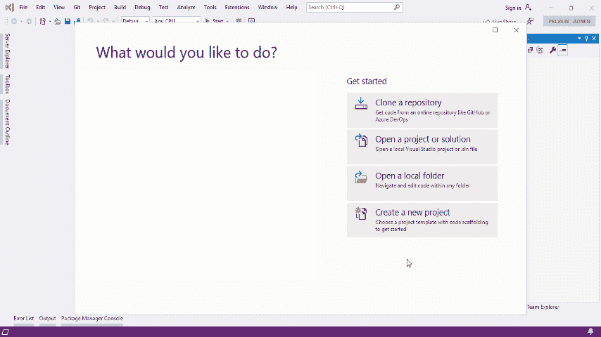

# DataGridView 自动筛选-DataGridView 中的 Excel 筛选

> 原文：<https://levelup.gitconnected.com/datagridview-autofilter-621f80f71b63>

# DataGridView 中的 Excel 筛选

**滚动恐怖！**

*你曾经面临过从大量数据中获取所需行的问题吗？手动放置光标向下滚动整个表格很痛苦吗？您是否需要在一次单击的实例中有多条记录？*

# **不要害怕**， **DataGridView 自动筛选在这里**

过滤是帮助用户根据需求轻松分离数据的最常用技术之一。在 C#中，DataGridView 用于以行和列的形式表示数据。默认情况下，没有简单的方法来过滤掉这些数据。为了实现这个目标，我们回到 2006 年…

# 真的*老是金！*

微软公司的 Karl Erickson 介绍了使用 DataGridView 进行类似 Excel 的过滤的基本概念。

在官方文档***"***[***构建 DataGridView 列标题单元格的下拉筛选列表***](https://docs.microsoft.com/en-us/previous-versions/dotnet/articles/aa480727(v=msdn.10)?redirectedfrom=MSDN)***"***中，他首次创造了术语**自动筛选**，并提供了一个类库，允许开发人员集成基本的筛选功能，如下图所示。

**来自微软官方文档的快照**

为此，目标框架是微软。NET Framework 2.0，而 C#和 Visual Basic 是两种主流语言，开发过程使用 Microsoft Visual Studio 2005 进行。您可以从[微软下载中心](https://www.microsoft.com/en-us/download/details.aspx?id=23459)轻松下载示例代码压缩文件。

**来源:官方 NuGet Logo**

到 2010 年，微软推出了 [NuGet 包管理器](http://nuget.org) ⁴，允许开发者安装包含可重用代码片段的包。

2014 年 7 月 2 日，一位名叫 zqb 的中国程序员创建了这个类库的 [NuGet 包](https://www.nuget.org/packages/DataGridViewAutoFilter/1.0.0) ⁵，它带有一个定制的表单，允许对每个字段进行基本的条件处理，例如

*   等于
*   不平等
*   GreaterThan
*   更伟大的平等
*   莱斯坦
*   小于等于
*   包含
*   不包含

**显示等级等于 1 的记录**

听起来很棒，但不幸的是所有的文本字符串都是用中文硬编码的，这对不熟悉这种语言的用户造成了障碍。

# 有什么解决办法？

经过六年的等待，终于推出了一个通用版的 **DataGridView AutoFilter⁶** 和一些代码修改、错误修复和对以下已知语言的支持:

*   阿拉伯语
*   乌尔都语
*   西班牙语
*   日本人
*   中国人
*   英语
*   俄语

**带多语言选项的表单**

# 如何入门？

您可能想知道创建这样一个允许用户根据需求过滤数据的基本表单需要哪些步骤。这是一项困难的工作吗？不需要，只需按照指导您完成此任务的步骤操作即可。

# 让我们开始吧！

## 步骤 1:创建一个新项目。

*   打开 Microsoft Visual Studio。
*   创建新的。NET Framework Windows 窗体项目。

**创建 Visual Studio 项目**

## 第二步:下载 NuGet 包。

*   导航到项目/管理 NuGet 包。
*   搜索并安装**DataGridView-自动筛选**和 **MoreLINQ** 。

**注意:如果你正在创建一个. NET Framework 2.0 应用程序，请使用栈溢出可用的** [**这个**](https://stackoverflow.com/a/29119974/4517075) **扩展方法，而不是 MoreLINQ。**

**获取 NuGet 包**

## 步骤 3:设计用户界面。

1.  从**工具箱**中拖拽一个 **DataGridView** 到表单上。
2.  选择选项**“停靠在父容器中”**以填充整个表格。

**DataGridView 拖放**

3.从**工具箱**中拖放一个**状态条**。

**状态条拖放**

4.点击添加按钮添加两个**toolstrip status label**，并相应地将名称改为**FilterStatusLabel**&**showall label**。

**重命名 ToolStripStatusLabels**

5.将 **FilterStatusLabel** 的**属性**设置如下:

*   清除**文本**。
*   将**可见**从**真**变为**假**。

**设置 FilterStatusLabel 属性**

6.将**显示标签**的**属性**设置如下:

*   将**字体**改为粗体。
*   将**文本**改为**显示&全部**。
*   将**链接行为**从**系统默认**更改为**悬停下划线**。
*   将 **IsLink** 从**假**改为**真**。

**设置 ShowAllLabel 属性**

7.按 Ctrl+w 然后 Ctrl+u 打开**文档轮廓**并将 **StatusStrip** 放在 **DataGridView** 下面。

**将 StatusStrip 放在 DataGridView 下面**

## 步骤 4:构建人物模型。

1.  右键单击 TestApp.csproj 图标并添加一个类 Person。

**构建人物模型**

考虑一个具有诸如等级、职业、工作、工资、比率和随机生成的日期等属性的人。方法 **PopulateList** 获取一个**人员**的列表，并将生成的数据分配给它。

**人物模型**

2.按下 **F6** 到**建立解决方案。**

**建立人物模型**

## 步骤 5:分配 DataGridView 数据源。

1.  单击 DataGridView 旁边的小箭头。
2.  从**选择数据源**，选择**添加项目数据源**。
3.  选择**对象**点击**下一个**。
4.  选择**TestApp/TestApp/Person**&**点击**完成**。**

****

****将数据源分配给 DataGridView****

## **步骤 6:操作列**

1.  **pinup**文档大纲** &将 DataGridView 的 **AutoSizeColumnsMode** 属性从 **None** 设置为 **Fill** 。**

****

****填充列标题****

**2.通过按下 **F2** 简化每一列的名称。**

****

****重命名列****

**3.从**DataGridViewTextBoxColumn**到**DataGridViewAutoFilterTextBoxColumn**设置每列的 **ColumnType** 。**

****

****改变列类型****

## **第七步:编码**

**1.创建 Person 类的私有对象和 Person 类型的私有列表。**

**2.从 Form1 事件列表&中选择**加载**事件，粘贴代码。**

**3.创建方法 **EnableGridFilter** ，采用布尔**值**来启用或禁用数据过滤。将这个**值**分配给每列的 **FilteringEnabled** 属性。**

**4.从 ShowAllLabel 事件列表中选择 **Click** 事件&粘贴代码。**

**5.从 DataGridView 事件列表中选择 **DataBindingComplete** 事件&粘贴代码。**

**6.从 DataGridView 事件列表中选择 **KeyDown** 事件&粘贴代码。**

**7.最后保存并按 **F5** 调试项目。**

# **万岁！我们完了**

*****DataGridView 自动筛选演示*****

# *****源代码*****

# **结局？**

**一点也不！现在就加入我们，通过访问[**datagridview auto filter**](https://github.com/TelicSolutionsInc/DataGridViewAutoFilter)⁷github 知识库为图书馆做出贡献。使用相同的技术生成了不同外观和感觉的演示表单，如下所示。**

****

****基础外观&手感****

****

****新城看起来&感觉起来****

****

****材质外观&手感****

**要获得所有这些演示表单的源代码，请访问[**datagridviewautofilterdemo**](https://github.com/TelicSolutionsInc/DataGridViewAutoFilterDemo)**⁸**github 资源库。**

# **参考**

****【1】:*为 DataGridView 列标题单元格构建下拉筛选列表***
[https://docs . Microsoft . com/en-us/previous-versions/dot net/articles/aa 480727(v = msdn . 10)？重定向自=MSDN](https://docs.microsoft.com/en-us/previous-versions/dotnet/articles/aa480727(v=msdn.10)?redirectedfrom=MSDN)**

****【2】:*快照来自微软官方文档***
[https://docs . Microsoft . com/en-us/previous-versions/dot net/articles/images/aa 480727 . datagridview auto filter 01(en-us，msdn.10)。gif](https://docs.microsoft.com/en-us/previous-versions/dotnet/articles/images/aa480727.datagridviewautofilter01(en-us,msdn.10).gif)**

****【3】**:***Visual Studio 项目下载链接***
[https://www.microsoft.com/en-us/download/details.aspx?id=23459](https://www.microsoft.com/en-us/download/details.aspx?id=23459)**

****【4】:*NuGet 数据包管理器*** [https://www.nuget.org/](https://www.nuget.org/)**

****【5】:*datagridview auto filter 1 . 0 . 0*** [https://www.nuget.org/packages/DataGridViewAutoFilter/1.0.0](https://www.nuget.org/packages/DataGridViewAutoFilter/1.0.0)**

****【6】:*DataGridView-自动筛选 NuGet 包*** [https://www.nuget.org/packages/DataGridView-AutoFilter](https://www.nuget.org/packages/DataGridView-AutoFilter)**

****【7】:*datagridview auto filter GitHub 库*** [https://github.com/TelicSolutionsInc/DataGridViewAutoFilter](https://github.com/TelicSolutionsInc/DataGridViewAutoFilter)**

****【8】:*DataGridViewAutoFilterDemo GitHub 知识库*** [https://GitHub . com/TelicSolutionsInc/DataGridViewAutoFilterDemo](https://github.com/TelicSolutionsInc/DataGridViewAutoFilterDemo)**