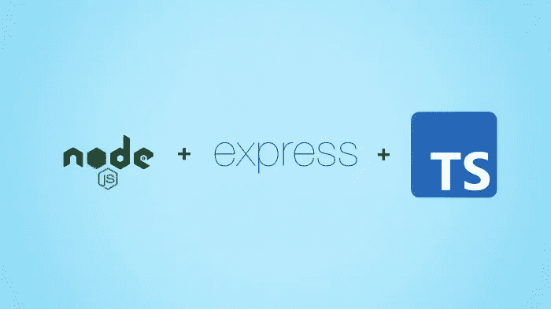
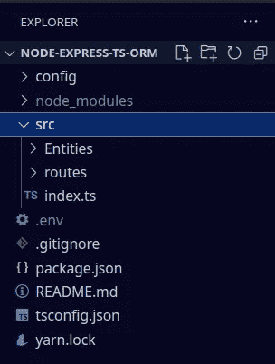
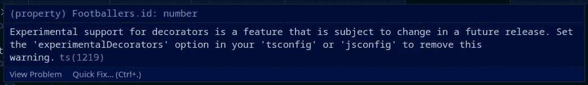
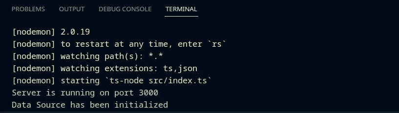
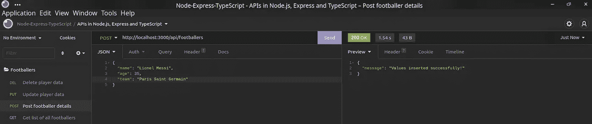
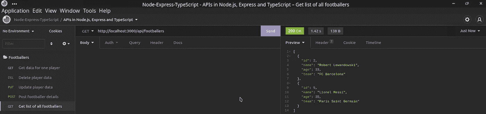

# TypeORM 中的 DataSource，一种连接数据库的新方法

> 原文：<https://levelup.gitconnected.com/datasource-in-typeorm-a-new-way-to-connect-to-your-database-cdc6622f9bbc>



> **在我们开始之前:**本文将介绍最近对 TypeORM 进行的一些更改，以建立与数据库的连接。这篇文章是我之前文章的延续。我已经根据需要在本文的必要之处提供了相同内容的链接。

***第一步* :** 在开始之前，设置我们的项目环境是很重要的。同样可以参考我的文章 [**在 typescript**](https://medium.com/geekculture/setting-up-a-node-js-project-environment-with-express-js-and-typescript-best-practices-284cc37c5aa1) 中设置 node.js 项目环境。完成设置后，我们将创建一个 **src** 文件夹，我们将在其中转移 index.ts 文件。因为我们现在将 index.ts 文件放在不同的位置，所以我们将更新 package.json。

```
"scripts": {
    "start": "nodemon --exec ts-node src/index.ts",
    "build": "tsc"
 }
```

在本文的后面部分，我们将更深入地研究“src”文件夹，以及我们将 index.ts 文件转移到其中的原因(参见步骤 4)。

***步骤 2:*** 完成项目设置后，我们将添加我们需要的依赖项，以便用 TypeORM 初始化我们的项目，type ORM 最终将连接到我们的 PostgreSQL 数据库，从而帮助我们根据需求创建 API。我们将在项目中添加 typeorm、postgreSQL 和 dotenv。

```
yarn add typeorm
yarn add pg
yarn add dotenv
```

既然我们已经安装了基本的依赖集，我们将返回到 **src** 文件夹。在其中，我们将创建另外两个名为**实体**和**路线**的文件夹。现在在根级别，我们将创建一个**。env** 文件和一个名为 **config** 的文件夹。



项目结构

***第三步:设置数据库配置*** 。在 config 文件夹中创建一个名为 ormconfig.ts 的文件。这是我们初始化数据源的地方。你可以参考下面的代码要点来初始化你的数据源。

在 env 文件中添加您的数据库凭证，然后从那里获取它。出于安全原因，我们将数据库凭证隐藏在 env 文件中。要将您的凭证添加到 env 文件中，只需在其中添加以下行:

```
DATABASE_URI=YOUR_DATABASE_URI
```

现在，您可以根据需要调用 connectDB 来访问项目结构中的各种文件。比方说，我想对我的 index.ts 文件调用 connectDB，这就是它的实现方式。

```
// Import DB config
import connectDB from "../config/ormconfig";// Create connection with DB
connectDB
```

现在，让我们比较一下与我们的数据库初始化连接的旧方法的变化，即 **createConnection** 方法。你可以参考下面的代码要点来理解 createConnection 是如何使用的。

比较两者，您会注意到以前 createConnection 方法使用的键-值对的数量与 DataSource 使用的键-值对的数量相同。不同之处在于，对于 DataSource，我们使用 **connectDB** 上的**初始化**函数，然后通过**然后**函数将其推进**，当连接成功建立**时，它基本上在控制台/终端上更新我们。**在出现错误的情况下，例如，如果您提供了不正确的数据库凭证或一些其他不正确的数据，它将在建立连接时抛出一个错误，从而暂停该过程。**

**注 1:**data source 方法被引入来代替 createConnection，后者已被弃用。本文讨论如何连接到 PostgreSQL 数据库，但是，您也可以使用相同的 DataSource 方法连接到其他数据库。

***步骤 4:*** 回到步骤 2，我们已经在 src 文件夹中创建了两个文件夹，即实体和路线。我们将创建一个基本的 API 来理解所有这些东西是如何连接在一起的。

**注 2:** 我之前写过一篇关于 [**路由我们 node.js 项目**](https://medium.com/geekculture/routing-our-typescript-api-in-express-js-and-using-typeorm-for-connecting-to-our-postgresql-db-bde5132b5102) 的文章，你可以在自己创建 API 的时候参考一下。首先，我在 Entities 文件夹中创建了一个名为 Footballers.ts 的实体。

实体是一个基于类的对象或模型，它将为我们完成所有的 SQL 操作，如创建表、从表中获取数据、添加数据、更新数据等。通过在后台执行 SQL 查询(如果您想查看将要运行的 SQL 查询，可以在 ormconfig.ts 文件中将**日志设置为 true** )。

**重要提示:**保存实体后，您会在文本编辑器中发现一条警告，内容如下:



装饰符是一种特殊类型的声明。要解决这个问题，只需删除 tsconfig.json 文件中以下代码行的注释。


现在我们的实体已经准备好了，我们准备为我们的 API 创建几个路由。为此，我们需要在 Routes 文件夹中创建一个名为 **footballerRoutes.ts** 的文件。我在以前的文章中已经详细介绍了[路由，你可以从那里实现它。我还在最后提供了到我的 GitHub 库的链接，所以您也可以从那里检查和实现它。](https://medium.com/geekculture/routing-our-typescript-api-in-express-js-and-using-typeorm-for-connecting-to-our-postgresql-db-bde5132b5102)

在我们的路由建立之后，我们只需要将它们调入我们的 index.ts 文件。您可以通过以下方式实现:

```
const app = express();// Import API routes
import footballerRoutes from "./routes/footballerRoutes";
```

为了使用这些路由，我们只需要使用 express.js 提供的 **use** 函数，use 函数有两个参数，第一个是我们要调用 API 的 API 端点，第二个是我们在顶部导入的足球路由。它可以按如下方式实现:

```
const app = express();// Fetching APIs from the routes
app.use("/api/footballers", footballerRoutes);
```

现在剩下的就是让我们监听我们对某个端口的应用。

```
// Import DB config
import connectDB from "../config/ormconfig";// Use environment variables
import dotenv from "dotenv";
dotenv.config();const port = process.env.port || process.env.SERVER_PORT;app.listen(port, () => {
    console.log(`Server is running on port ${port}`);
})
```

在你的。env 文件您可以为 SERVER_PORT 设置一个环境变量:

```
SERVER_PORT=YOUR_SERVER_PORT_NUMBER
```

**注 3:** 我们之所以将 index.ts 文件和 Entities 文件夹以及 routes 文件夹放在 src 文件夹中，很大程度上是因为更好的项目结构和可访问性。将我们所有的工作文件放在一个地方是一个很好的习惯。比方说，如果我想访问索引文件中的任何路径，我知道它在相同的位置。这有助于保持开发周期的可持续性。

现在我们已经设置好了一切，让我们试着运行我们的应用程序并发出一些请求。在终端中运行 yarn start，在您的项目目录中，您将看到以下响应:



启动服务时的应用程序响应。



发布插入足球运动员数据的请求。



获取获取所有玩家数据的请求。

到此，我想结束这篇文章，谢谢！

[***链接到资源库***](https://github.com/chinmaykarmokar/node-express-ts-orm)

**更新:**在我的文章[关于在 Next.js 中使用 redux 和 Axios 进行 API 调用](https://medium.com/@chinmaykarmokar/integrate-apis-in-next-js-with-redux-and-axios-10-step-guide-3d20a2bc9365)中，我已经通过安装和实现在我的 Next.js 应用程序中使用的 CORS 更新了这个应用程序的存储库。要加 CORS 做什么:

```
yarn add cors
```

# 分级编码

感谢您成为我们社区的一员！在你离开之前:

*   👏为故事鼓掌，跟着作者走👉
*   📰查看[升级编码出版物](https://levelup.gitconnected.com/?utm_source=pub&utm_medium=post)中的更多内容
*   🔔关注我们:[Twitter](https://twitter.com/gitconnected)|[LinkedIn](https://www.linkedin.com/company/gitconnected)|[时事通讯](https://newsletter.levelup.dev)

🚀👉 [**加入升级达人集体，找到一份惊艳的工作**](https://jobs.levelup.dev/talent/welcome?referral=true)