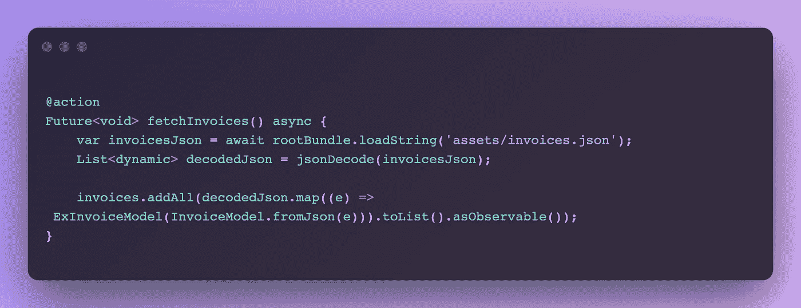
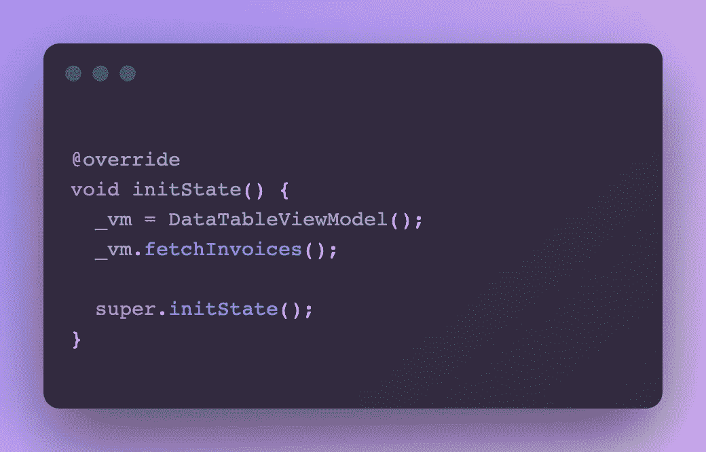
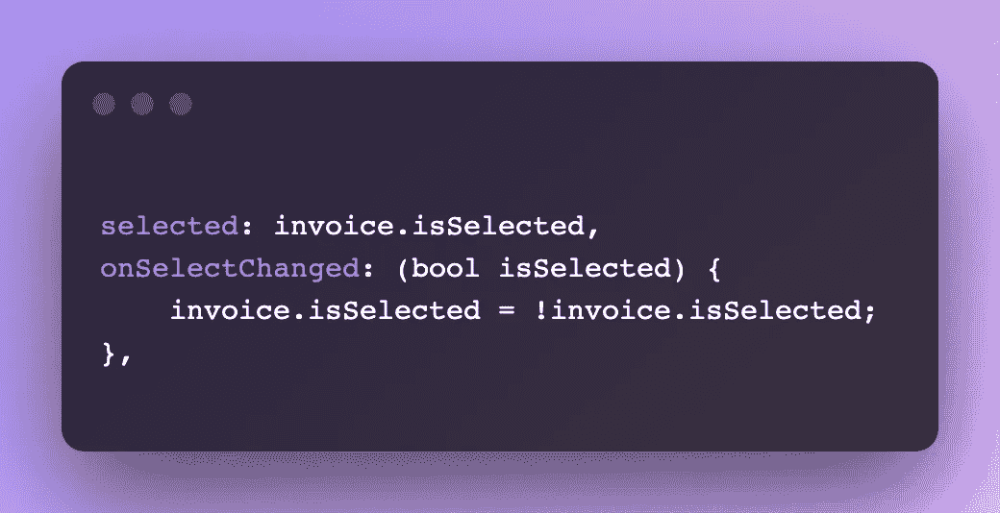

# Flutter 中使用 MobX 实现的数据表

> 原文：<https://levelup.gitconnected.com/datatable-with-mobx-implementation-in-flutter-8c5994b118e1>

今天我们将看看如何实现由 MobX 支持的 Flutter 数据表。我们将创建**月度发票表**。它显示特定用户每月的个人发票。我们将读取的所有必要数据都将保存在本地 json 文件中，该文件在 assets/ folder 中指定为 invoices.json。

**GIF:**

**TL:DR/源代码:**

[](https://github.com/Abdulsametileri/Flutter-DataTable-with-MobX) [## abdulsamiteleri/Flutter-带 MobX 的数据表

### 一个新的颤振项目。这个项目是颤振应用的起点。一些帮助您入门的资源…

github.com](https://github.com/Abdulsametileri/Flutter-DataTable-with-MobX) 

本文并不打算作为 MobX 的介绍。所以我们会假设你已经有了 MobX 是什么的基本知识。如果没有，你可以在[他们的网站](https://mobx.netlify.app/getting-started)上阅读基础。我认为它比 BLoC 更容易学习和实现。我是说，不要害怕使用它。:)

首先，我们必须准备发票模型来解析 json，如下所示。如您所见，它由 id、日期和金额组成。这些属性向我们展示了发票的样子。

相应的 dart 类是:

这个类可以通过复制我们的 json 文件使用网站[很容易地创建。也可以使用](https://javiercbk.github.io/json_to_dart/) [json_serializable](https://pub.dev/packages/json_serializable) 包。为了简单起见，我们不会在本文中使用这个包。

现在让我们看看我们的视图模型。您可以将视图模型视为包含所有应用程序逻辑、api 调用、业务规则等的模型。

我们将尝试一行一行地讲述代码做了什么。

我们开始吧。

他们的[网站](https://mobx.netlify.app/concepts)对可观察、计算和动作注释进行了详细解释。简而言之，你可以认为**是可观察的，**我们跟踪注释变量以根据它们的值改变 ui，**计算的**是可观察变量的派生形式，**动作**是改变可观察值的方式。

```
@observableObservableList<ExInvoiceModel> invoices = <ExInvoiceModel>[].asObservable();
```

**ExInvoiceModel** 是 InvoiceModel 的超集。该类扩展了 InvoiceModel 并添加了名为 **isSelected** 的新属性。

**isSelected** 只是一个逻辑属性。为了更改我们的复选框和总金额卡，我们需要跟踪它的值，所以我们必须在它上面放置可观察的注释。

```
ObservableList
```

是一种特殊类型的列表。Dart 不支持可观察的<t>类型。这些类型来自 MobX 包。MobX 会自动观察其中的所有项目。在添加、删除或更新项目的情况下，将发出相关的动作。这意味着您将被告知有什么变化。因此你可以很容易地处理它。</t>

```
@observableObservableList<ExInvoiceModel> invoices = <ExInvoiceModel>[].asObservable();
```

您还可以考虑不需要在 invoices 变量上添加可观察的注释。因为我们已经指出列表项是可观察的。其实都是你的逻辑问题。例如，如果你想跟踪从`null`到一个有值列表的情况，你必须把它。在这篇文章中，我倾向于这样写:

```
.asObservable();
```

不过是一个扩展方法。把它从列表<t>转换成观察列表<t>。</t></t>

```
@computed
List<ExInvoiceModel> get selectedInvoices => invoices.where((invoice) => invoice.isSelected).toList();
```

为了计算选中发票的金额，我们需要定义**selectedingvoices**变量。这是非常简单的方法。我们将根据 isSelected 值过滤数组。

```
@computed
bool get selectedInvoicesIsEmpty => selectedInvoices.isEmpty;
```

我们需要根据 selectedInvoices 中的项目隐藏或显示页脚。如果没有项目在那里，我们需要隐藏我们的金额卡页脚。

```
@computed
int get totalAmount => selectedInvoices.fold(0, (previousValue, element) => previousValue + element.amount);
```

你第一次能想到我们为什么不用还原法吗？因为我们必须处理对象类型。不是 int、string 等主要类型。Reduce 对主要类型有效，所以不适合我们的情况。



fetchingvoices

MobX 说，对 fetchInvoices 方法采取行动，由于这个方法，我们将变异 **invoices** 变量。请跟踪它。如果你仔细观察这个方法，它基本上就是读取本地 json，解码我们的 InvoiceModel 并添加我们的 observable invoices 变量。为了获取数据，我们需要调用这个方法。

现在，我们将看看我们完整的用户界面。

我们将一部分一部分地看。



为了获得初始数据，我们需要在 initState 生命周期中调用 fetchInvoices 方法。

我们需要用观察者小部件包装我们的数据表。因为我们会触发 UI 变量的变化。我们将把我们的可观察列表映射到 DataRow，所以我们需要调用 [map](https://www.tutorialspoint.com/dart_programming/dart_programming_map.htm) 方法。



这里面有两个重要属性。如果你想在每一行中选择复选框列，我们必须定义**onselectchanged**。请记住，我们将 isSelected 属性定义为 observable，MobX 跟踪该变量中的变化并触发 Observer 小部件，因此我们的 UI 会刷新，我们会在屏幕上看到我们的变化。

我们将用观察者小部件包装我们的页脚。因为我们需要根据**selectedingvoices**数组来绘制我们的 ui。如果我们的数组填充了项目，我们将需要计算总金额。如果不是这样，我们可以显示空的部件。

好吧，就这样。如果你想看更多的细节，你可以查看源代码。

[](https://github.com/Abdulsametileri/Flutter-DataTable-with-MobX) [## abdulsamiteleri/Flutter-带 MobX 的数据表

### 一个新的颤振项目。这个项目是颤振应用的起点。一些帮助您入门的资源…

github.com](https://github.com/Abdulsametileri/Flutter-DataTable-with-MobX)