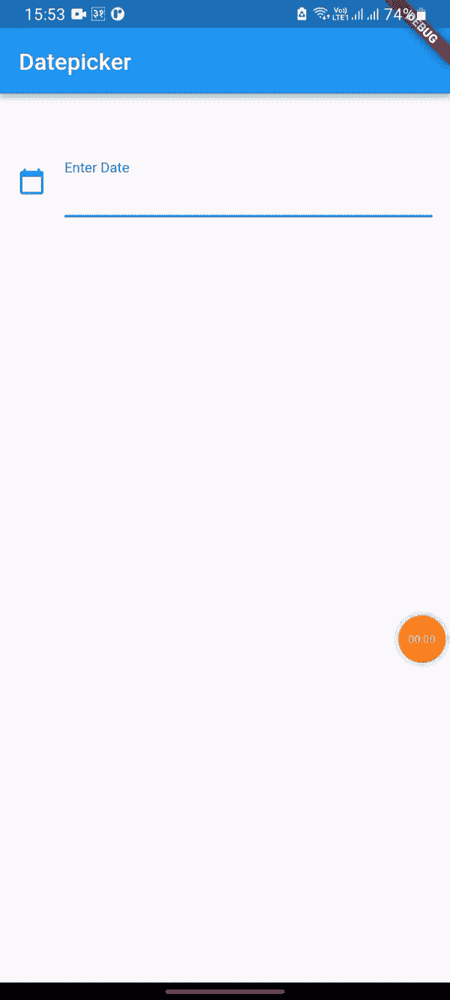
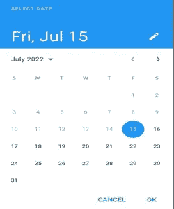

# 抖动中的日期拾取器

> 原文：<https://levelup.gitconnected.com/date-picker-in-flutter-ec6080f3508a>

日期选择器是移动应用程序和网络应用程序中最常用的部件之一。在本文中，我们将创建一个简单的工作示例，演示如何创建日期选择器并获取日期。

我们最终的应用程序将如下运行:



日期选择器

## 好吧，我们开始吧

首先，我们在 ***lib*** 文件夹中创建一个名为 ***homepage.dart*** 的新文件。正如上面的 gif，我们首先需要有一个文本字段。单击文本字段时，将打开日期选择器对话框，我们可以在其中选择日期。

我们可以按如下方式创建文本字段:

然后我们创建日期选择器。

*   初始日期:这里我们给出今天的日期。当日期选择器显示时，今天的日期将突出显示。
*   **lastDate:** 在这里，我们提供日历显示一年的数据有多远。
*   **第一个日期**:这里我们需要提供日期显示多早。如果我们必须禁止用户排除今天之前的日期，我们需要提供今天的日期作为。

```
firstDate:DateTime.now()
```



我们可以看到，15 年之前的日期是灰色的。

这样，我们可以显示日期选择器并选择日期。我们还可以格式化从日期选择器中选择的日期。

这里我们将日期格式化为 ***yyyy-MM-dd*** 。你可以通过点击这个[链接](https://api.flutter.dev/flutter/intl/DateFormat-class.html)来获得更多的格式。

选择日期和格式后，我们将 ***日期控制器*** 和**选择的**日期设置为:

```
setState(() { 
   dateController.text = formattedDate; 
});
```

# 让我们连接起来

我们可以成为朋友。在[脸书](https://www.facebook.com/nabin.dhakal.714/)、 [Linkedin](https://www.linkedin.com/in/nabindhakal/) 、 [Github](https://github.com/nbnD) 、 [Youtube](https://www.youtube.com/channel/UCW6oYt_3QSl7J2HSHNqwXWw) 、 [BuyMeACoffee](https://www.buymeacoffee.com/nabindhakal) 和 [Instagram](https://www.instagram.com/nbn_d_/) 上查找。

拜访:[颤振结](https://flutterjunction.com/)

**投稿:** [BuyMeACoffee](https://www.buymeacoffee.com/nabindhakal)

# 结论

希望这篇文章对你有所帮助，让你学到新的东西。我在这篇文章中使用了一些对你们中的一些人来说可能是新的东西。

如果你学到了新的东西或者想提出一些建议，请在评论中告诉我。

如果你喜欢这篇文章，请点击👏图标，它为您提供了传递所有新事物的动力。

此外，关注令人兴奋的文章和项目的更新。

通过分享学习对学习过程产生了巨大的影响，并使社区越来越大。

分享是吸引其他爱好者的磁石。

因此，让我们朝着扩大我们的学习社区迈出一小步。

与你的朋友分享这篇文章，或者如果你喜欢这篇文章，就在推特上发表评论。

# 在以下时间吃饱:

[](https://github.com/nbnD/date_picker) [## GitHub - nbnD/date_picker:一个简单的演示应用程序，用于在混乱中挑选日期

github.com](https://github.com/nbnD/date_picker) 

# 分级编码

感谢您成为我们社区的一员！更多内容见[级编码出版物](https://levelup.gitconnected.com/)。

关注:[推特](https://twitter.com/gitconnected)、[领英](https://www.linkedin.com/company/gitconnected)、[时事通讯](https://newsletter.levelup.dev/)

**升级正在改造科技招聘**👉 [**加入我们的人才集体**](https://jobs.levelup.dev/talent/welcome?referral=true)