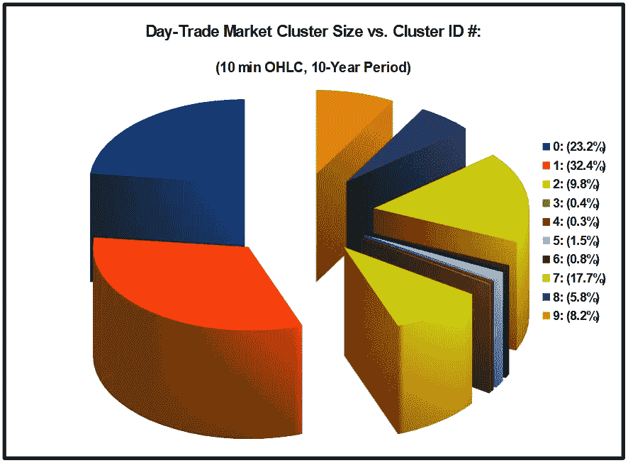
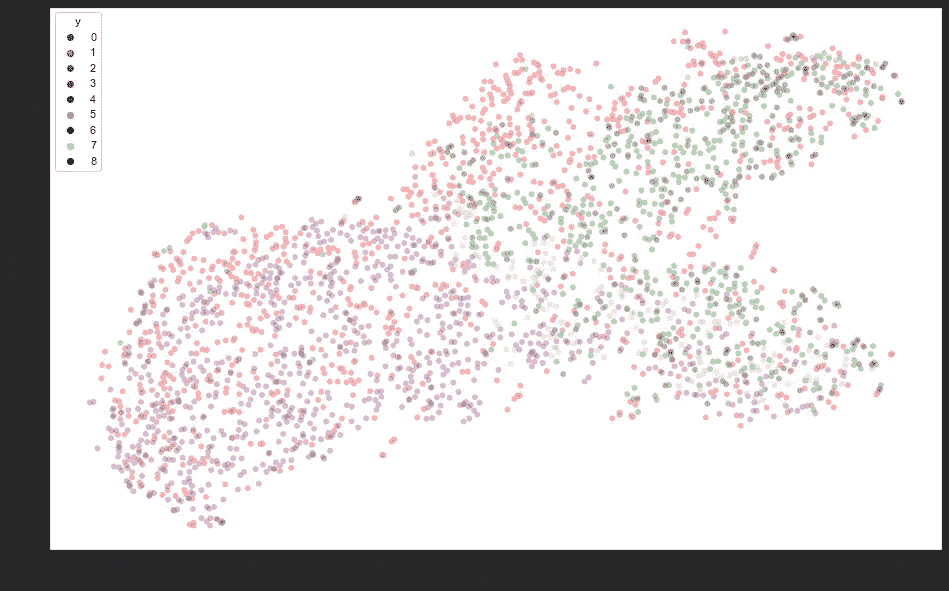
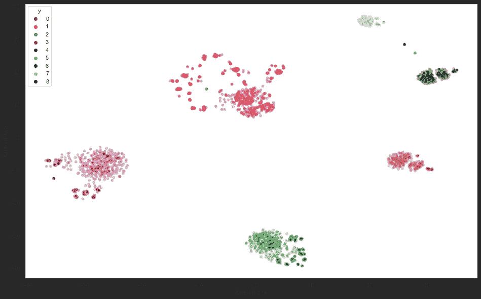
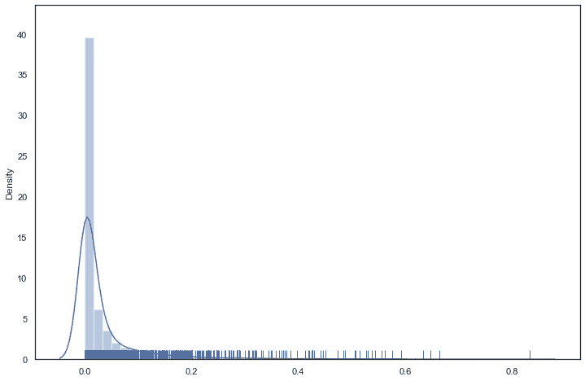
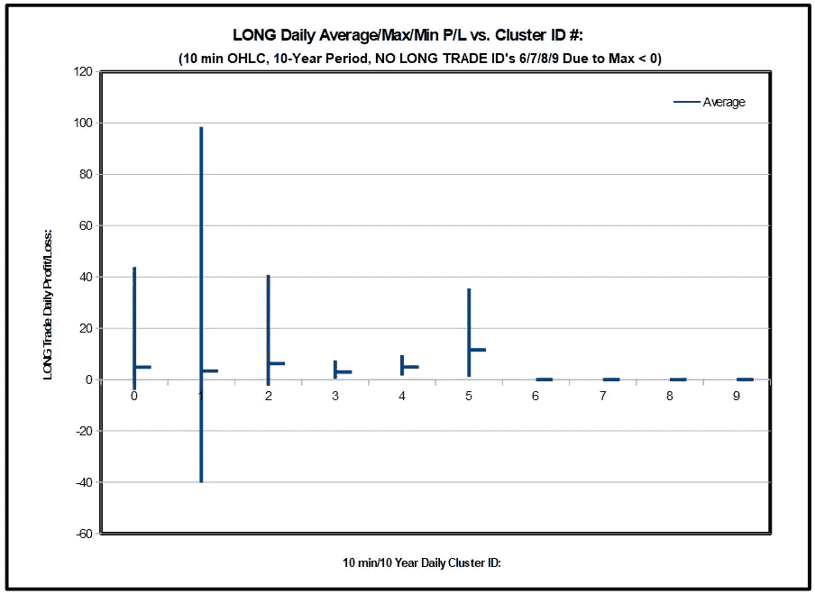
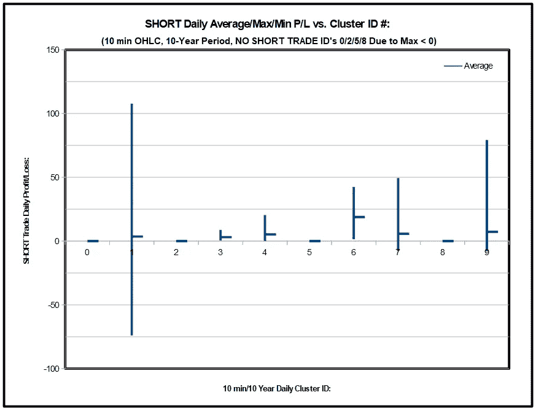

# 用人工智能做日内交易:什么时候持有，什么时候放弃，什么时候不玩！

> 原文：<https://levelup.gitconnected.com/day-trade-market-clustering-with-transdimensional-machine-learning-b088f585923a>

## 基于多维机器学习的市场聚类


iStock 上 [clearviewstock](https://www.istockphoto.com/portfolio/clearviewstock?mediatype=photography) 的照片。

# TLDR:

> ***用 TML 描述市场日内交易的能力可以使策略适合特定的市场“个性”。这些“个性”使得几乎 40%的交易日都不可能盈利！***

背景帖:[新的 AI 淘金热——跨维度机器学习(潘提供！)](https://medium.com/@andycarl_40001/the-new-ai-gold-rush-pan-provided-981c0f96e8e7)

提供了一个 Jupyter 笔记本，包括 GitHub 库 [***中的代码，这里***](https://github.com/afcarl/The-New-AI-Gold-Rush-Transdimensional-Machine-Learning) 。

# 一个例子:

*   对于给定的基础工具，10 分钟 OHLC 蜡烛线是从覆盖大约 10 年期间的分笔成交点数据发展而来的。
*   使用基准“买入/卖出”指标对蜡烛线数据进行回溯测试，每天有(9)个固定止损/基于 ATR 的止损/无止损案例。
*   每个案例都针对基线指标超参数进行了优化，针对多头和空头头寸进行了不对称优化，针对最佳和最差日损益进行了优化，记录了最大和最小日交易损益、交易数量以及相关的最佳超参数值。
*   对于每一天，对每(9)个病例的结果进行平均，以形成每天的“原始数据”向量。
*   使用 [TML](https://github.com/afcarl/The-New-AI-Gold-Rush-Transdimensional-Machine-Learning) 进行初步数据勘探，确定潜在集群的可能数量约为(9)。
*   “适应度函数”被修改，以帮助在超净进化过程中关注(9)个集群解决方案。

> **根据相对规模得出的“典型”日内交易市场“个性”:**



> **“之前”应用 TML(通过 tSNE 从 12 维到 2 维):**

```
time_start = time.time()
tsne = TSNE(n_components=2, verbose=1, perplexity=100, n_iter=1000)
tsne_results_orig = tsne.fit_transform( data_orig )
print('t-SNE done! Time elapsed: {} seconds'.format(time.time()-time_start))df_subset['tsne-2d-one'] = tsne_results_orig[:,0]
df_subset['tsne-2d-two'] = tsne_results_orig[:,1]
plt.figure(figsize=(16,10))
sns.scatterplot(
    x="tsne-2d-one", y="tsne-2d-two",
    hue="y",
    palette=['purple','red','darkcyan','brown','blue', 'dodgerblue','green','lightgreen', 'black'],
    data=df_subset,
    legend="full",
    alpha=0.3 )
```



> **应用 TML (12 日至 1000 日经 TML):**

```
...
metric = "jaccard"n_neighbors_max = 100
n_neighbors_min = 2min_dist_max = 0.99
min_dist_min = 0.0n_components_max = 1000
n_components_min = 1min_samples_max = 1000
min_samples_min = 2min_cluster_size_max = 2
min_cluster_size_min = 2...if ( num_clusters_found == 9 ):
    genome.fitness = 10000.0 / abs( clustered_COMB_sum_SE + 1)
elif ( num_clusters_found == 0 ):
    genome.fitness = -99999.0
else:
    genome.fitness = 10000.0 / abs( clustered_COMB_sum_SE + 1) — ( abs( num_clusters_found — 9 ) * 1000.0 )
...$$$$$$$$$$$$$$$$$$$$$$$$$$$$$$$$$$$$$$$$$$$$$$$$$$$
New best_fitness_so_far =  -2984.7710672587614 1New best: metric                    =  jaccard
New best: n_neighbors               =  98
New best: min_dist                  =  0.06658783809866256
New best: n_components              =  1000
New best: min_samples               =  3
New best: min_cluster_size          =  2
New best: cluster_selection_epsilon =  0.6658783809866257OUT: num_clusters_found              =  12
OUT: ratio_clustered                 =  1.0
OUT: clusterer_probabilities_sum     =  0.9558447965277097
OUT: clusterer_probabilities_sum_SE  =  184.0931575208609
OUT: clusterer_outlier_scores_sum    =  0.13366803680011266
OUT: clusterer_outlier_scores_sum_SE =  471.55167569985406
OUT: clustered_COMB_sum_SE           =  655.644833220715
$$$$$$$$$$$$$$$$$$$$$$$$$$$$$$$$$$$$$$$$$$$$$$$$$$$
…
$$$$$$$$$$$$$$$$$$$$$$$$$$$$$$$$$$$$$$$$$$$$$$$$$$$
New best_fitness_so_far = 182.75239956493343 104New best: metric = jaccard
New best: n_neighbors = 100
New best: min_dist = 0.9899882983797373
New best: n_components = 1000
New best: min_samples = 2
New best: min_cluster_size = 2
New best: cluster_selection_epsilon = 9.899882983797372OUT: num_clusters_found = 9
OUT: ratio_clustered = 1.0
OUT: clusterer_probabilities_sum = 0.9978606463926271
OUT: clusterer_probabilities_sum_SE = 1.649803561162849
OUT: clusterer_outlier_scores_sum = 0.03316588079964379
OUT: clusterer_outlier_scores_sum_SE = 52.31724504377773
OUT: clustered_COMB_sum_SE = 53.96704860494058
$$$$$$$$$$$$$$$$$$$$$$$$$$$$$$$$$$$$$$$$$$$$$$$$$$$
```

> **“在”应用 TML(通过 tSNE 从 1000-D 到 2-D):**

```
time_start = time.time()
raw_data = fit_HDBSCAN._raw_data
tsne = TSNE(n_components=2, verbose=1, perplexity=100, n_iter=1000)
tsne_results_1 = tsne.fit_transform( raw_data )
print('t-SNE done! Time elapsed: {} seconds'.format(time.time()-time_start))df_subset['tsne-2d-one'] = tsne_results_1[:,0]
df_subset['tsne-2d-two'] = tsne_results_1[:,1]
plt.figure(figsize=(16,10))
sns.scatterplot(
    x="tsne-2d-one", y="tsne-2d-two",
    hue="y",
    palette=['purple','red','darkcyan','brown','blue', 'dodgerblue','green','lightgreen', 'black'],
    data=df_subset,
    legend="full",
    alpha=0.3 )
```



```
...
unique_elements, counts_elements = np.unique(fit_HDBSCAN.labels_, return_counts=True)
print(“Frequency of unique values of the said array:”)
print(np.asarray((unique_elements, counts_elements)))# Frequency of unique values of the said array:
# [[ 0 1 2 3 4 5 6 7 8]
# [638 893 269 19 41 23 486 159 225]]threshold = pd.Series(fit_HDBSCAN.outlier_scores_).quantile(0.9)# threshold = 0.09822259079456185outliers = np.where(fit_HDBSCAN.outlier_scores_ > threshold)[0]
sns.distplot(fit_HDBSCAN.outlier_scores_[np.isfinite(fit_HDBSCAN.outlier_scores_)], rug=True)
...
```



> **多头交易特征，避免多头交易 38.5%的交易日与聚类 ID 6、7、8 和 9 相关。**



> **短线交易特征，避免 40.3%的交易日与聚类 ID 0、2、5 和 8 相关的短线交易。**



# 总结:

*   避免在 38%的交易日内进行与 6、7、8 和 9 相关的多头交易。
*   **避免在与 0、2、5 和 8 相关的 40%的交易日内进行短期交易。**
*   **市场有多重“个性”，单一的“一刀切”的策略是不够的！**
*   **识别单个市场“个性”的能力使得能够为特定的“*个性*”量身定制策略，以追求利润。**
*   **风险管理要求知道*“如何操作”*，但更重要的是，知道*“何时不能操作”！***
*   **使用 TML 将 12 维的原始数据向量转换成 1000 维向量以实现聚类分离，然后使用 tSNE 将其转换回 2-D 向量以用于可视化目的。**
*   ***跨维度机器学习(TML)* 可定义为整体应用视角查看数据、度量选择/创建、流形映射、AI/ML/DL 工具选择和适应度函数确定，仅由预期用例的细节驱动，更重要的是，与底层原始数据和流形映射维度的维度无关。**

# 灵感:

*   [UMAP](https://github.com/lmcinnes/umap) ，利兰·麦金尼斯
*   利兰·麦金尼斯，约翰·希利，史蒂夫·阿斯特尔斯
*   [整齐的](https://www.cs.ucf.edu/~kstanley/neat.html)，肯尼斯·斯坦利
*   [如何调整 tSNE 的超参数](https://towardsdatascience.com/how-to-tune-hyperparameters-of-tsne-7c0596a18868)， [Nikolay Oskolkov](https://medium.com/u/8570b484f56c?source=post_page-----981c0f96e8e7--------------------------------)

# 关于安德鲁(安迪)卡尔:

“GitHub AI 大脑中的大脑”和“GitHub 2 vec”NLP 生产力工具的热心开发者。一位充满激情的多学科航空航天机械工程师，在集成人工智能、混合强化机器学习( **Hybrid-NEAT** )、数据科学和基于混合强化学习的优化中的多学科模拟( **Hybrid-NEAT** )、复杂空中、空间和地面系统的设计和分析以及工程工具开发方面拥有丰富的经验。

*   [安迪的《GitHub AI 脑中之脑》](https://2strikehitter.com/AI_BrainofBrains.html)
*   [安迪的在线大脑](https://afcarl.github.io/)
*   [安迪在领英上](https://www.linkedin.com/in/andrew-andy-carl-3875a310b/)
*   [GitHub 上的安迪](https://github.com/afcarl)
*   [安迪在电脑控制的棒球投球机上](https://www.2strikehitter.com/):)