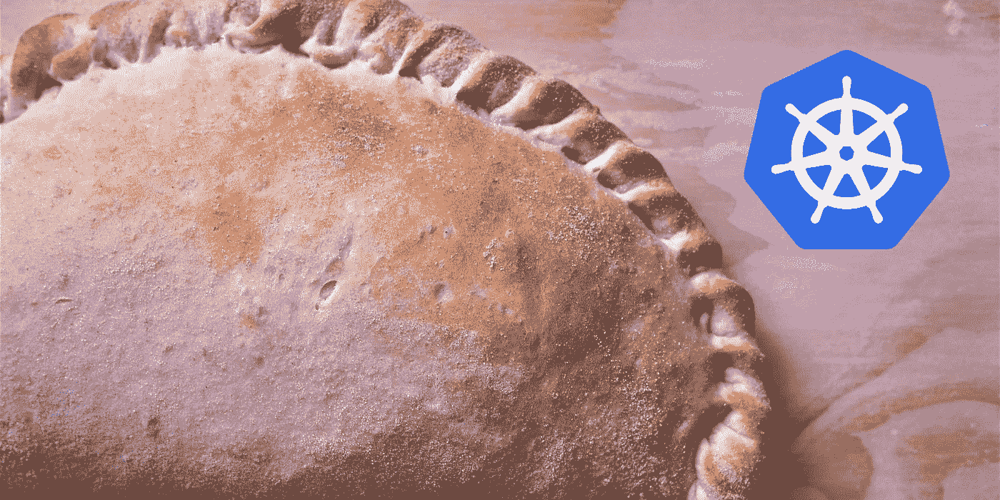
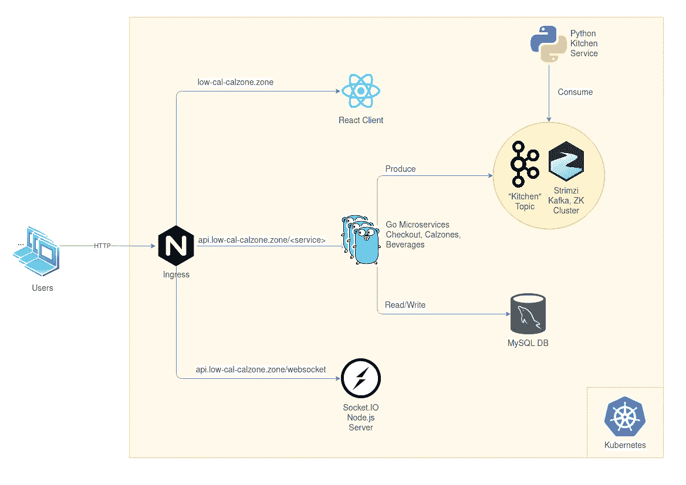
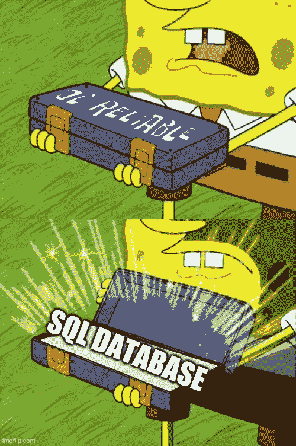
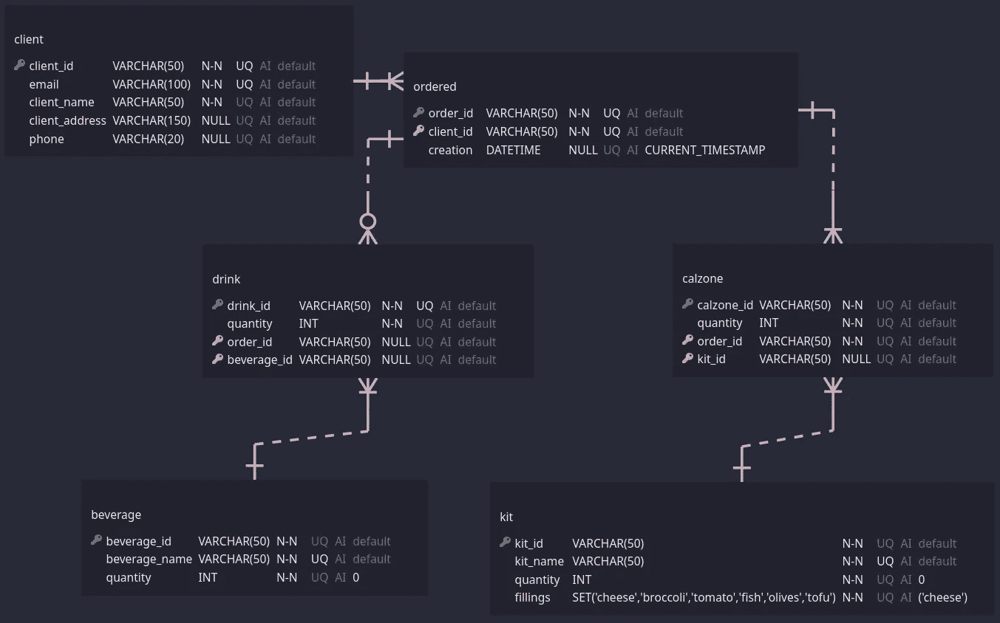
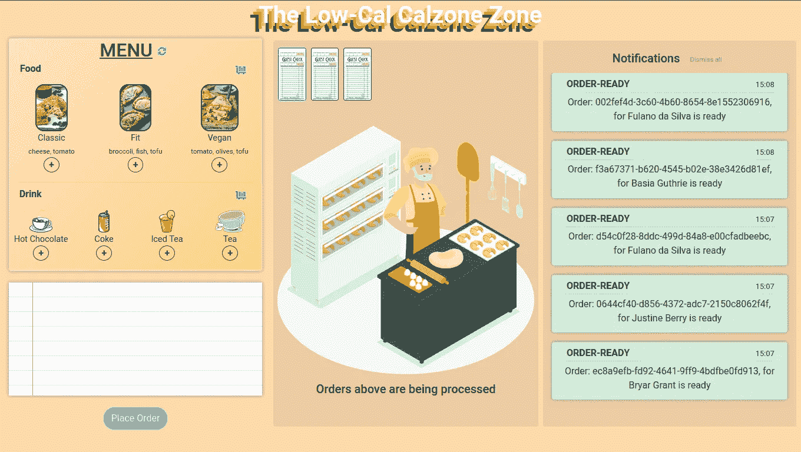
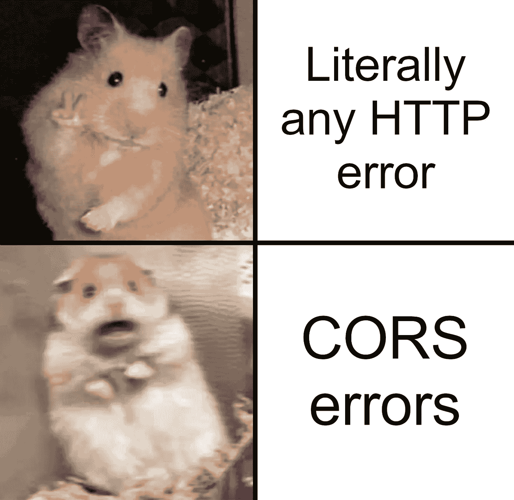
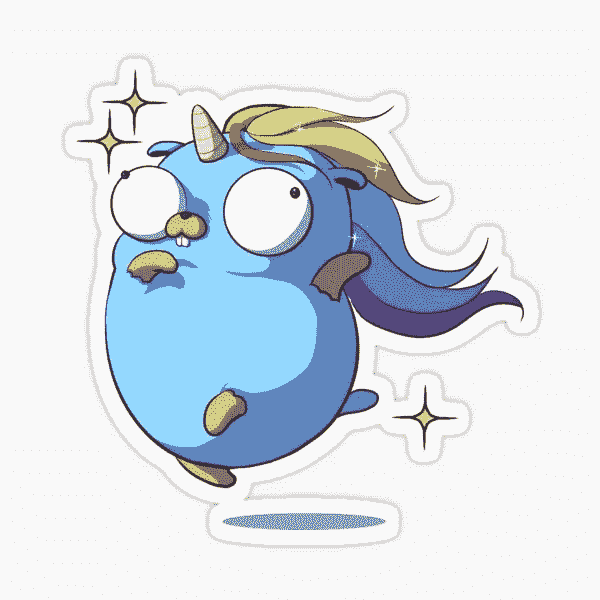

# Pod 中的数据库:Calzones、容器和微服务

> 原文：<https://levelup.gitconnected.com/dbs-in-a-pod-calzones-containers-and-microservices-74e47e3e01bc>

多克尔、卡夫卡和库伯内特的实例之旅



# 介绍

如果你从事软件或 IT 工作，你很有可能听说过 Kubernetes。如果你没有机会亲自使用它，你可能无法完全理解它到底是做什么的，甚至不知道它为什么存在。我想用我正在做的一个小项目来说明容器编排的世界，以及其中一个常见的应用:微服务。

想象一下:你想开一家速食意大利餐馆。那是什么，披萨店已经是意大利快餐店了？嗯，事情是这样的:你不想开一家披萨店。你是一个革新者，一个有远见的人，你想开一家*的烤饼店*和*的低热量烤饼店*。


*本·怀亚特解释烤饼是未来的趋势*

# 好吧，那你需要什么？

*   你需要从一个供应商那里购买成套的配料，每个成套的配料代表一种类型的烤饼，这样当你用完一种类型的烤饼时，你就可以重新进货。您将从单独的供应商处购买饮料，同样的补货政策。
*   您的收银员需要一个 web 界面来接受客户订单，并且他们需要能够看到他们下的哪些订单正在等待厨房处理。
*   因为您希望能够与您的客户保持联系，所以每个订单至少需要一个客户电子邮件和一个名称，但是一旦使用了电子邮件，就不必为来自该客户的每个订单重新输入其他详细信息。您还想保留所下订单的记录。
*   收银员需要 web 界面在每次加载时检查库存，并能够根据需要请求再次检查菜单的库存。他们还需要能够要求 calzones 和饮料重新进货。
*   任何订单准备就绪时，必须通知所有收银员，以便他们可以通知订单所属的客户，以及蛋糕或饮料何时重新进货。
*   你的*主厨*，一个很有威望，要求很高的个人，禁止非厨房工作人员进入厨房。这意味着收银员只需下订单，当厨房有空的时候，他们就会拿走，准备好，然后在订单准备好的时候通知收银员。


*巴西厨艺大师的厨师 rick Jacquin 展示了进入厨房的非厨房工作人员的遭遇*

现在我们知道了我们想要什么和需要什么，让我们来看看如何使用 Kubernetes 上的微服务架构逐一解决这些需求。

然而，在我们这样做之前，我想指出的是，虽然我认为微服务很棒，但就像生活中的大多数事情一样，没有灵丹妙药。微服务并不是 100%优于单片或无服务器架构(可能在[微服务](https://docs.aws.amazon.com/whitepapers/latest/microservices-on-aws/serverless-microservices.html)中，也可能不在其中)，反之亦然。

也就是说，微服务架构的两大优势是:

*   由于部署单元的大小，易于开发、测试和部署。
*   水平扩展的能力，即更低的功耗，更多的机器。

现在，回到*低卡路里的钙区*。

# 简而言之，解决方案

我不打算在这里覆盖这个解决方案的大部分代码，但是如果你想查看，点击[这里](https://github.com/chiniczR/Low-Cal-Calzone-Zone)查看 GitHub 上的全部代码。整体逻辑如下:

*   我们的目标库存将有每种类型的 25 份 calzones 经典、健康和纯素食——以及每种饮料的 25 份——茶、可口可乐、热巧克力、冰茶。
*   我们将使用 MySQL 数据库来跟踪客户、订单、菜单项和库存。
*   我们将有一个 React web 界面，有三个主要组件:一个菜单、一个显示我们所下订单的厨房视图和一个通知面板。
*   我们将通过一个定制的插座从收银员(当一件商品重新进货时)和厨房(当订单准备好时)获得实时通知。IO 服务器。
*   我们的 API 将有 3 个 Go 服务: *checkout* 、 *calzones* (其中我们请求所有 calzones 的列表或请求补货)和 *beverages* (与 *calzones* 的想法相同)。
*   我们将使用 Kafka 作为异步消息队列:当下订单时，checkout 产生一条消息，厨房最终将消费它，准备订单并发出通知。



*架构概述*

既然我们已经讨论了这个问题，那么让我们回顾一下每个需求和它在解决方案中的对应部分。

# 数据存储

有很多地方 NoSQL 数据库就足够了:数据非常多样化，或者数据量巨大，或者速度比一致性更重要。然而，作为企业关键应用程序的唯一数据库，您可能希望谨慎行事，使用好的 ol' SQL。



对于这个项目，我们将使用 MySQL，因为它是免费的、开源的且维护良好。现在，与任何关系数据库一样，我们需要定义对我们重要的实体和关系。在这种情况下，它们可以用下面的 ERD(实体关系图)来表示:



*用于低卡路里 Calzone 区的 ERD，使用 ERD 编辑器 VScode 扩展设计*

现在，记住:我们也要跟踪库存。这就是为什么*套件*和*饮料*表有一个数量字段，但是我们如何在每份订单上改变这个数量？如果库存中有足够的所需商品，我们如何才能允许下订单？这些问题的答案非常简单:触发器。

触发器是一些代码和函数，顾名思义，它们被触发运行特定的 SQL 操作，如插入、更新、删除等。出于我们的目的，我们需要三个触发器:

1.  在输入订购的 calzones 之前，检查是否有足够的匹配套件，如果没有，则返回错误。
2.  在输入订购的饮料之前，检查是否有足够的匹配饮料，如果没有，返回一个错误。
3.  订单被取消后(将在出错后发生)，根据订单消耗的数量重新填充套件和饮料。

这些触发器在代码中是这样的:

现在我们已经有了数据定义、初始数据和一些方便的触发器，我们终于可以设置它作为我们在 Kubernetes 上的集群的一部分运行了。

对于我们的 MySQL 数据库 Kubernetes 部署，我们将需要定义一个 PersistentVolumeClaim、一个服务(仅限内部)、一个定义要运行的初始数据创建和插入语句的 ConfigMap(可以指定为`/docker-entrypoint-initdb.d` —这个特定位置与我们将使用的公共 [MySQL 映像](https://hub.docker.com/_/mysql))和一个带有 DB 密码的秘密，以及一个配置为使用所有这些的部署。

你可以在这里阅读更多关于 Kubernetes 对象和定义它们的 YAML 文件的不同部分。这是我们的 MySQL 数据库部署对象模板的规范部分的外观:

应该注意的是，我确实使用了两个文件来建立数据库，一个常规的 Kubernetes YAML 文件和一个 [Kustomization](https://kubernetes.io/docs/tasks/manage-kubernetes-objects/kustomization/) 文件，后者与前者类似，但没有前者那么严格。

需要注意的一点是:在 [Docker](https://www.docker.com/blog/intro-guide-to-dockerfile-best-practices/) 和 [Kubernetes](https://cloud.google.com/solutions/best-practices-for-building-containers#properly_tag_your_images) 中，避免对将要使用的图片使用`:latest`标签，尤其是在制作中。例如，在本例中，我指定了 mysql:8.0.22。

然后用以下内容初始化数据库:

```
kubectl apply -k mysql   # With the mysql directory in the project
```

# 网络界面

在这里我们将有一个反应。JS web 应用程序，使用方便的 Create React App (CRA)工具创建，在启动和运行时看起来像这样:



*低卡 Calzone 区域前端应用的工作版本截图，也是在设置后端之后*

正如您在这里看到的以及我之前提到的，前端有三个关键组件:

1.  菜单栏，用户可以在其中编写订单，然后下订单。请注意，菜单上有重新载入/刷新菜单、重新储存食物和饮料的选项。
2.  厨房栏，用户可以在这里看到等待处理的订单。在请求结帐后得到 OK 响应后，订单将转到该列。订单在收到带有其 orderId 的订单就绪通知后离开此列。
3.  通知列，用户可以在其中看到从套接字收到的所有通知。IO 服务器，不管是自己的通知还是其他用户的通知。可能的通知包括错误(例如在结帐时)、商品重新进货和订单准备就绪。

在这种情况下，我们希望从 websockets 的使用中得到的是:

*   当结帐出错时，当用户请求重新进货(成功或失败)时，以及当他们想要清除通知时，用户将发出通知。
*   用户收听这类消息和厨房发出的通知(当订单准备好时)，并将它们添加到通知面板。
*   websocket 服务器监听所有这些类型的消息，并与所有其他用户共享其中的大部分消息。

我将整个应用程序定义为带有[挂钩](https://reactjs.org/docs/hooks-overview.html)的[功能性 React 组件](https://reactjs.org/docs/components-and-props.html#function-and-class-components)，我认为这使得整个应用程序更容易阅读和解释，所以我不会详细介绍应用程序本身，但为了更好地演示上面解释的内容，这是 React 客户端的套接字侦听器在 [useEffect](https://reactjs.org/docs/hooks-effect.html) 中定义的样子:

插座。IO 服务器看起来像这样:

这里可能最需要注意的是 [CORS](https://developer.mozilla.org/en-US/docs/Web/HTTP/CORS) 的配置。让我告诉你，CORS 错误[会让你发疯](https://stackoverflow.com/questions/tagged/cors)(特别是因为它们通常不像它们看起来的那样)，所以确保你已经(至少)正确设置了这个配置。



所以我们讨论了实际的 React 客户机和套接字。IO 服务器。我们怎么在 Kubernetes 上找到他们？

我们将使用 docker 文件构建我们的图像。这些文件的结构有些松散，并且有一组要执行的特定步骤。你可以在这里阅读更多关于 T4 的信息。

为了构建我们的 React 客户端映像，我们将使用以下 docker 文件:

至于我们将在 Kubernetes 上创建什么，正如您可以想象的那样，这次我们将不需要持久存储，也不需要密码或要安装的外部入口点(ConfigMap 和 secret 帮助我们在 MySQL 部署中实现的)。

对于 React 客户端和 Node.js 套接字。IO 服务器，我们需要的只是一个部署和一个服务(一个外部的——记住:它们都是从浏览器调用的)。它们非常相似，所以我将向您展示 React 客户端的 Kubernetes YAML 文件的样子:

现在我们已经有了数据库、前端和 websocket 服务器，我们可以继续关注主要的吸引人之处了:

# 后端微服务

在构建微服务时，有许多语言和框架可供选择。一个流行的配对是作为语言的 Java 和作为框架的 Spring Boot。就我个人而言，我同意这是一个可靠的选择，而且我并不反对 Java，但是我是一个围棋爱好者。



*典型的地鼠在其自然栖息地的罕见照片*

如果你正在寻找 Go 和 Java 之间的对比，只需在谷歌上快速搜索一下，你就会找到很多很多的对比。对于快速阅读，我建议检查[这](https://www.google.com/url?sa=t&rct=j&q=&esrc=s&source=web&cd=&cad=rja&uact=8&ved=2ahUKEwj0n8z3qajuAhUGxBQKHd2OCP0QFjAEegQIBhAC&url=https%3A%2F%2Fwww.bmc.com%2Fblogs%2Fgo-vs-java%2F&usg=AOvVaw0_mTWCKwSpLvVLuUEDPNPJ)之一。

这里真的没有正确的答案，这是一个偏好和具体情况的问题，但我喜欢围棋，而且，如上所述，有很多好的理由喜欢围棋(就像有很多理由不喜欢它一样)。

好了，既然已经解决了，那么框架呢？如果你在 GitHub 上搜索“Go 微服务”，最受欢迎的框架是 [Go Kit](https://gokit.io/) ，有近 20K 颗星。正如你从我到目前为止所写的内容中所能想象的，我不会说 Go Kit 是*绝对最好的 Go 微服务框架。我会说，我发现它很好地记录了例子，易于使用，组织良好，所以这是我为这个项目选择的框架。*

正如[在 Go Kit 文档上的这个](https://github.com/go-kit/kit/tree/master/examples/stringsvc2)示例所展示的，不同的职责将(*可以*是)划分为:**检测**和**记录**(确定如何监控应用程序的性能)**传输**(如何处理请求和如何构造响应)**服务**(实际的应用程序逻辑)，以及一个**主**部分，将所有这些集合在一起。

低卡 Calzone 区域的后端 API 将需要三个主要服务:

*   Beverages —处理从数据库获取可用饮料列表的请求和重新进货饮料的请求。
*   Calzones —处理从数据库获取可用 Calzones 列表的请求和重新存储 calzones (calzone 套件)的请求。
*   check out——在 JSON 中给定一个订单，处理一个执行结帐的请求，即(尝试)将其插入到数据库中，如果还没有客户端，也添加客户端，并且只有在有足够的所请求的食物和饮料的情况下。如果一切顺利，服务将返回 1 & *null* ，如果出错，将返回-1 &错误消息。

由于 Chekout 服务可能是最复杂和最重要的，所以我将重点关注它，跳过对其他两个服务的详细解释，但我将指出这三个服务有一个非常相似的关键部分:它们都访问数据库，要么是读取，要么是写入。结帐服务是唯一一个做得更多的服务，但我们会谈到这一点。

在我们开始服务之前，请注意:如果你从未使用过 Go，特别是在“ *webful* 的环境中，你可能想做一个非常[快速阅读](https://webdamn.com/parsing-json-data-using-golang/)关于如何在 Go 中使用 JSON。类似地，如果你想阅读关于使用 Go 访问 MySQL 数据库的内容(没有像 [Gin](https://github.com/gin-gonic/gin) 这样的特殊 web 框架)，[这里有](https://golangdocs.com/mysql-golang-crud-example)一个很好的资源。

最后，在服务本身(`[service.go](http://github.com/chiniczr/Low-Cal-Calzone-Zone/checkout/service.go)`)中，我们:

*   定义客户端、Calzone、饮料、订单和内容对象的结构，以及服务本身的接口。
*   在实际的 PlaceOrder(订单订单)函数中，我们定义了唯一的随机 id 和到数据库的连接(root 是用户， *test* 是密码， *mysql* 是我们为数据库创建的服务的名称，3306 是它运行的端口， *lccz* 是数据库的名称)。
*   检查给定的客户端是否存在，如果不存在，只要提供了名称，就尝试插入它们(如果不存在，则返回一个错误)。
*   最后，尝试将订单本身和所点的食物/饮料插入到相应的表格中。

这涵盖了结帐所涉及的大部分内容，对吗？嗯，仍然缺少一个重要的细节:当然，我们已经将订单存储在数据库中，但是它不应该，你知道，实际上被送到厨房去准备吗？

# 厨房

这就是一个叫做卡夫卡的小东西出现的地方。那么，卡夫卡的交易是什么？它是怎么做的呢？

与巴西 80 年代的热门电影“一只叫卡夫卡的蟑螂”没有关系

有很多方法可以描述它:事件流平台、异步消息队列、发布/订阅系统等等。然而，Kafka 背后的核心概念非常简单:有*个主题*，它们可以在提供安全数据存储的集群中复制，在那里你可以留下某种*消息* ( **产生**)，有人最终可以“捡起来”(**消费**它)，并且消息不会丢失。

这就是我们希望结账流程和厨房之间的沟通:结账“产生”订单，厨房最终“消费”订单。

卡夫卡和它的生态系统是既广泛又深刻的主题，所以我不会在这里详细介绍它们，但是如果你想了解更多，我建议好好看看 Kafka 文档中的这个页面。

此时，您可能想知道，“这很好，但是我如何让它在 Kubernetes 上工作呢？”对此，我简单地回答:Strimzi。Strimzi 提供了，嗯，引用 Strimzi 主页上用大而粗的字母写的话:

> 《几分钟后库伯内特斯上的卡夫卡》

有了 Strimzi，我们所要做的就是在我们的 Kubernetes 集群中安装和设置它，然后*很快* Kafka 就在 K8s 上了！现在，如何做到这一点可能会有所不同，取决于您的具体设置。在 Strimzi 网站上有一个关于 Minikube、OKD 和 Kind 的[快速入门](https://strimzi.io/quickstarts/)指南，但是我发现[这个](https://dev.to/azure/kafka-on-kubernetes-the-strimzi-way-part-1-57g7)也是一个非常好的通用指南。

好，那么，假设我们现在已经有了 Kafka 自举，并且在集群中的某个地方准备好了，我们将如何使用它呢？

好了，我们的结帐服务几乎完成了，只是我们现在要使用 Confluent 的 Kafka 客户端来初始化 Kafka 生成器，并将新订单作为消息推送到 Kafka 集群上名为“kitchen”的主题:

最后，我们可以使用以下 docker 文件“容器化”我们的服务:

Checkout 服务的“Dockerize”方法比其他两个 Go 服务(Calzones 和 Beverages)的“Dockerize”方法稍微复杂一些。这是因为，正如 Checkout Dockerfile 文件的注释中所指出的，在 Go 容器上运行 Kafka 客户端需要一些额外的组件，而其他服务不需要 Kafka(它们只从数据库读取数据或向数据库写入数据)客户端。

尽管存在差异，我们在 Kubernetes 上部署它们的方式本质上是相同的——部署和节点端口类型(外部)服务:

这就是收银员需要的服务！现在，我们可以将厨房实现为一个 [Python 服务](https://github.com/chiniczR/Low-Cal-Calzone-Zone/kitchen/main.py)，它只会做三件事:

1.  消费订单来自卡夫卡的“厨房”话题。
2.  “准备”订单(睡几秒钟)。
3.  向 websocket 服务器发出通知，这样收银员就会收到订单准备好的通知。

现在我们只需将厨房集装箱化:

并将它部署到我们的 Kuberentes 集群，只需*一次部署，无需服务—请记住，没有人需要从集群或外部访问厨房:*

*瞧吧*！低卡 Calzone 区域现在应该启动并平稳运行。只剩下一件事了:一种从浏览器访问它的方法。

# 进入

还记得 Go 程序没有为数据库指定 IP 地址，只指定了服务名“mysql”吗？对于集群中的任何服务来说，要访问另一个服务，它们只需要使用服务的名称，而不是特定的 IP 地址(很好，特别是如果您实际上只是在单个节点上运行，比如说，像我一样在 Minikube 上运行)。

如果是这样的话，我们应该能够使用地址“checkout”、“calzones”和“beverages”从 React 客户端调用后端，对吗？嗯，不完全是 React 客户机将从集群中提供服务，但是在浏览器上运行。如果我们想像现在这样从客户端调用后端服务，我们必须获取它们的 IP 和端口号，并将它们硬编码到客户端中，这将使您必须 1)总是检查服务的 IP 和端口是什么，以及 2)每次它们改变时更新 React 客户端的代码。

这就是入口的用武之地。根据 Kubernetes [文档](https://kubernetes.io/docs/concepts/services-networking/ingress/)本身:

> *[*Ingress*](https://kubernetes.io/docs/reference/generated/kubernetes-api/v1.20/#ingress-v1-networking-k8s-io)*将来自集群外的 HTTP 和 HTTPS 路由暴露给集群内的* [*服务*](https://kubernetes.io/docs/concepts/services-networking/service/) *。流量路由由入口资源上定义的规则控制。**

*现在，为了有一个入口，你需要一个运行的入口控制器。K8s 项目本身支持和维护 AWS、GCE 和 Nginx 控制器。由于我在 Minikube 上开发了这个项目，我使用了[这个](https://kubernetes.io/docs/tasks/access-application-cluster/ingress-minikube/)方便的指南来设置 Minikube 上的 Nginx 入口控制器，但是你可以查看[这个页面](https://kubernetes.io/docs/concepts/services-networking/ingress-controllers/)来获得关于其他控制器的更多细节。*

*我将用来调用 Ingress 的主机名—*low-cal-calzone . zone*—只是 K8s 集群 IP 的别名，我在我的 Linux 机器上通过编辑`/etc/hosts`文件(`C:\Windows\System32\drivers\etc\hosts`用于 Windows)并在我想要的名称旁边添加我的集群的 IP 地址来定义它，如下所示:*

```
*<Address>    low-cal-calzone.zone
<Address>    api.low-cal-calzone.zone*
```

*在 Kubernetes 上，一般来说，你可以找到带有`kubectl cluster-info`的地址。*

*我们将有两个入口:一个用于后端，它将路径中的第二个参数(例如 api.low-cal-calzone.zone/calzones/**get**)重定向到它路由到的实际服务:*

*一个用于前端，它不会专门重定向任何东西:*

*现在，女士们、先生们和尊贵的读者们，如果你打开你最喜欢的浏览器并访问`[http://the-low-cal-calzone.zone/](http://the-low-cal-calzone.zone/)`，你将会看到我们功能齐全的应用程序！*

**

# *完美？*

*嗯……这个解决方案确实涵盖了我们所有的需求，但是没有什么是完美的。具体来说，有几件事我本来想涵盖，但不得不省去(现在！)因为，如你所见，这篇文章几乎是[美国独立宣言](https://declaration.fas.harvard.edu/faq/what-word-count-declaration-independence)的三倍长:*

*   ***CI/CD** ，Jenkins + GitLab(不过，我确实自动构建了 Docker 映像。DockerHub 使得[变得非常简单](https://docs.docker.com/docker-hub/builds/link-source/)。*
*   *Prometheus + Grafana 的适当**监控**。*
*   *部署到**云**，并可能与其他服务集成。*

# *最后的想法*

*如前所述，微服务在*某些*情况下很棒**。它们提出了一种有趣的方法，一种你现在可能不会采用的方法，但是它们会一直存在，而且有可能，你会继续看到架构的使用在增长。***

*容器、容器编排和事件流平台以各种方式解决了各种问题。我希望这篇文章和项目能帮助您更好地理解或欣赏这些技术。*

*干杯！*