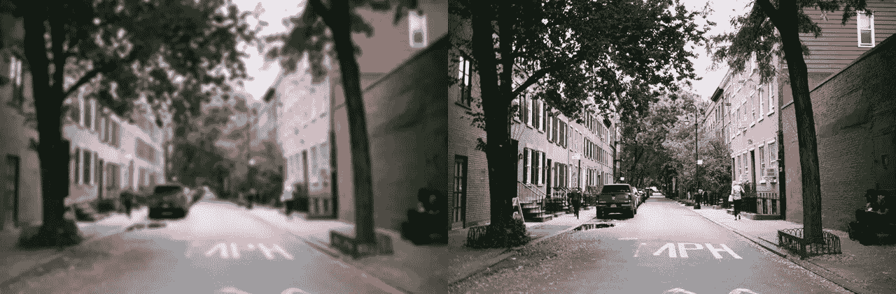
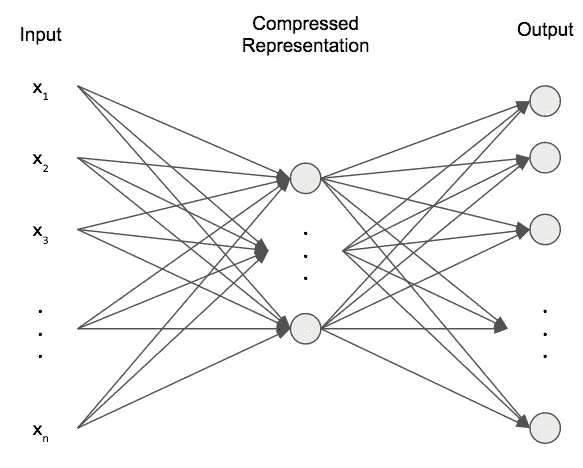
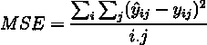
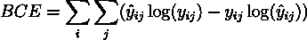
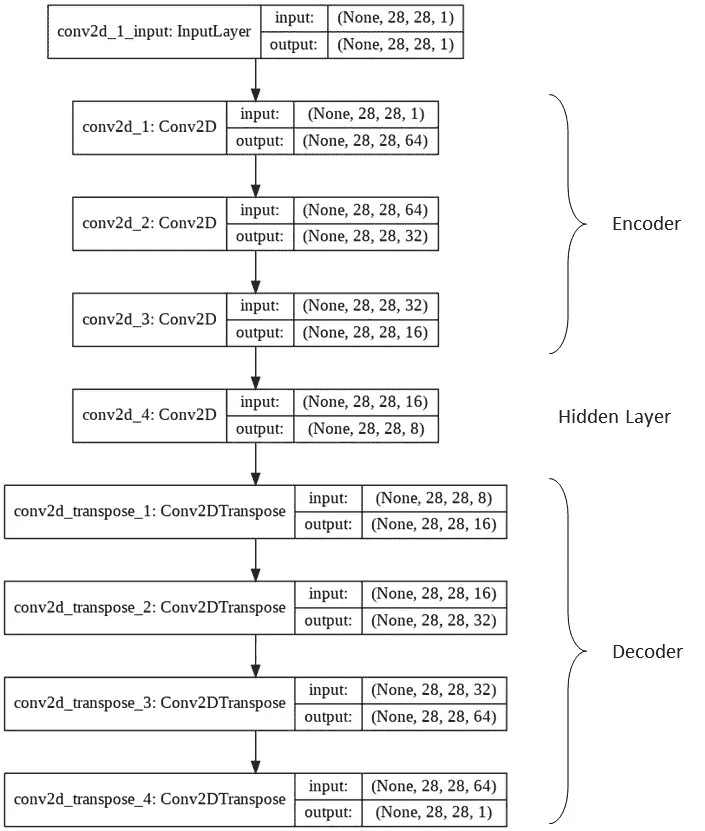
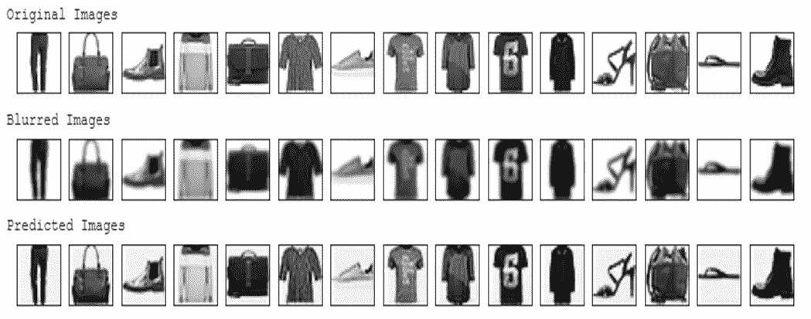

# 使用卷积神经网络和编码去模糊图像

> 原文：<https://levelup.gitconnected.com/de-blurring-images-using-convolutional-neural-networks-with-code-51d3f8d7b1d7>

CNN 可以用来从图像中提取一些隐藏的特征，并对它们进行“去模糊”。

> 注意，本文假设读者熟悉 CNN 的工作和功能。



机器学习算法可以用来将模糊的图像(左)转换为质量更好的图像(右)。这张照片是由[娜塔莉亚·塞加托](https://unsplash.com/@nathsegato)在[https://unsplash.com/photos/c168jRbeIEM](https://unsplash.com/photos/c168jRbeIEM)拍摄的。

# 理论

**卷积神经网络**是一种用于图像的特殊类型的神经网络。这些网络倾向于从图像中提取一些隐藏的特征，这些特征对于人眼可能是可见的，也可能是不可见的。因此，它们被广泛用于许多计算机视觉应用中，如对象检测、对象识别、对象跟踪、对象定位等等。

在了解了 CNN 的使用方式和位置后，了解它们在图像去模糊的应用中有多有用是很重要的。*自动编码器*有效地使用这些 CNN 来解决这个问题。关于他们的更多信息即将发布。

**自动编码器**用于拍摄输入图像，然后将该图像的细节存储为不同的格式，其大小小于图像的大小。这些存储的细节随后可用于*基于输入图像重建*相同的图像或不同的图像。自动编码器是图像重建以及生成新图像背后的基本概念，因此也用于许多一般的敌对网络中。

一个自动编码器，整体上有 *3 个*部分，一个**编码器**，一个**隐藏层，**和一个**解码器**。*编码器*接收输入，处理输入，提取特征，然后将数据存储在*隐藏层*中。一个*解码器*做与编码器相反的事情。它从隐藏层获取数据，然后*使用相同的数据重建*图像。



自动编码器的基本轮廓

对于本文，**编码器**仅由不同数量的滤波器的各种卷积层组成。这些层从输入图像(模糊图像)中提取特征，然后将这些特征转移到隐藏层。

同样，在这种情况下，**隐藏层**由卷积层组成，该层的输入是编码器的特征图或输出。

来自隐藏层的数据被传递到**解码器**。由于编码器涉及卷积层，所以对*解卷积*以得到与输入图像相似的图像是有意义的。在这种情况下，它是去模糊的图像。在图像的去卷积中，你采用一个具有权重的核，类似于卷积层，并将其乘以来自特征图的单个像素的强度。这个新矩阵取代了特征图中的像素。在训练整个模型的过程中学习每一层的核的权重。


这张 GIF 对反卷积的工作原理做了一个简单的解释。特征图被去卷积以获得上面所示的矩阵。

因此，至少在这种情况下，解码器仅涉及**反卷积层**或者有时甚至被称为**卷积转置层**。解码器中的去卷积层与为编码器选择的去卷积层具有相似的参数和属性。

现在我们已经准备好了自动编码器的架构。但是为了训练模型，我们也需要选择一个损失函数。有相当多的损失函数可用于实现目标。但是，我们将专注于**均方误差**和**二元交叉熵**损失函数。

**均方误差**是预测图像和地面真实值之间的像素差异的平方的*平均值。它的代表是:*



**二值交叉熵**损失是*预测图像和地面真实之间的像素交叉熵*的总和。它的代表是:



这两个损失函数给我们一个粗略的概念，地面真实情况与预测的图像有所不同。最小化这两种损失将有助于解决以前设计的 CNN 中使用的*权重*和*偏差*的调整。

# 密码

现在，在人们能够理解理论之后，我们可以深入前述概念的*实现*，以最终实现深度学习模型，从而对图像进行*去模糊*。代码使用 Python 中可用的 **Keras** 包实现。你可以在这个链接查阅完整的代码:[https://github.com/done-n-dusted/deblur-fashionmnist](https://github.com/done-n-dusted/deblur-fashionmnist)。

首先，我们需要加载数据集。我已经使用了**时尚-MNIST** 数据集，可以很容易地从 Keras 包中获取。

```
#loading the dataset
(X_train, y_train), (X_test, y_test) = datasets.fashion_mnist.load_data()
X_train, X_test = X_train/255, X_test/255
```

由于数据集中没有模糊的图像，我们需要通过模糊现有图像来创建一个新的数据集。为了模糊它们，我们可以使用 *OpenCV* 包中的 *GaussianBlur* 函数。选择的内核大小为 3 x 3。

```
def add_noise(X):
    result = []
    for img in X:
        noisy = cv2.GaussianBlur(img, (3, 3), 0)
        noisy = np.clip(noisy, 0, 1)
        result.append(noisy)
    return np.array(result)noise_train = add_noise(X_train)
noise_test = add_noise(X_test)
```

现在是时候建立我们的架构了。我构建的架构如下所示:



第一个 **conv2d_1、conv2d_2、conv2d_3** 代表*编码器*， **conv2d_4** 代表*隐藏层*，所有其他 **Conv2DTranspose** 层代表*解码器*。请记住，在这种情况下，输出维度必须与输入维度相同。因此，仔细选择内核大小。该架构可以编码如下:

```
from keras import models, layers
model = models.Sequential()#encodemodel.add(layers.Conv2D(64, (2, 2), strides = 1, padding = 'same', input_shape = (28, 28, 1)))
model.add(layers.Conv2D(32, (2, 2), strides = 1, padding = 'same'))
model.add(layers.Conv2D(16, (2, 2), strides = 1, padding = 'same'))#latentmodel.add(layers.Conv2D(8, (2, 2), strides = 1, padding = 'same'))#decode
model.add(layers.Conv2DTranspose(16, (2, 2), strides = 1, padding = 'same'))
model.add(layers.Conv2DTranspose(32, (2, 2), strides = 1, padding = 'same'))
model.add(layers.Conv2DTranspose(64, (2, 2), strides = 1, padding = 'same'))
model.add(layers.Conv2DTranspose(1, (1, 1), strides = 1, activation = 'sigmoid', padding = 'same'))
```

如上所述，可以采用任何损失函数。对于这个数据集，我个人发现使用**均方差** **误差**的结果更好。请随意选择你想要的。现在，我们需要编译这个模型，然后拟合数据。

```
model.compile(loss = 'mse', optimizer = 'adam')model.fit(noise_train.reshape(-1, 28, 28, 1), 
          X_train.reshape(-1, 28, 28, 1), 
          epochs = 100, 
          batch_size = 2000, 
          validation_data = (noise_test.reshape(-1, 28, 28, 1),                                                                                               X_test.reshape(-1, 28, 28, 1)))
```

在模型适合输入数据之后，现在是预测*去模糊*图像的时候了。

```
#utility function to pick samples to be testeddef get_samples(arr, n):
    temp = random.sample(range(len(arr)), n)
    result = arr[temp]
    return result, tempnum = 15
org, temp = get_samples(X_test, num)
blur = noise_test[temp]
preds = model.predict(blur.reshape(-1, 28, 28, 1))
preds = preds.reshape(-1, 28, 28)#plotting resultsplt.figure(figsize = (15, 15))
print('Original Images')
for i in range(num):
    plt.subplot(1, num, i+1)
    plt.xticks([])
    plt.yticks([])
    plt.grid(False)
    plt.imshow(org[i], cmap=plt.cm.binary)
plt.show()plt.figure(figsize = (15, 15))
print('Blurred Images')
for i in range(num):
    plt.subplot(1, num, i + 1)
    plt.xticks([])
    plt.yticks([])
    plt.grid(False)
    plt.imshow(blur[i], cmap=plt.cm.binary)
plt.show()plt.figure(figsize = (15, 15))
print('Predicted Images')
for i in range(num):
    plt.subplot(1, num, i + 1)
    plt.xticks([])
    plt.yticks([])
    plt.grid(False)
    plt.imshow(preds[i], cmap=plt.cm.binary)
plt.show()
```

上面显示的代码输出如下图所示。可以观察到预测图像非常接近原始图像。



模型的预测被训练来“去模糊”图像。

如果你想自己实现它，我建议你调整一些代码，使用*不同的数据集，优化器*用于模型编译，*架构*，*激活函数*等等。你可能会得到比我更好的结果。 ***万事如意！***

**谢谢 。希望您喜欢阅读这篇文章，并且至少对自动编码器、解卷积等有了部分了解。工作。祝您愉快！:)**

## 参考

[](https://medium.com/@jannik.zuern/but-what-is-an-autoencoder-26ec3386a2af) [## 但是什么是自动编码器呢？

### 在今天的帖子中，我想给你一个快速和肮脏的神经网络架构类型的介绍，称为…

medium.com](https://medium.com/@jannik.zuern/but-what-is-an-autoencoder-26ec3386a2af) [](https://www.coursera.org/projects/autoencoders-image-denoising) [## Keras 和 Python 中使用自动编码器的图像去噪

### 由 Coursera 项目网提供。在这个 1 小时的基于项目的课程中，您将能够:-理解…

www.coursera.org](https://www.coursera.org/projects/autoencoders-image-denoising) [](https://medium.com/apache-mxnet/transposed-convolutions-explained-with-ms-excel-52d13030c7e8) [## 转置卷积用… MS Excel 解释！

### 你已经成功地在 1D 回旋，2D 回旋和三维回旋中导航。你已经征服了…

medium.com](https://medium.com/apache-mxnet/transposed-convolutions-explained-with-ms-excel-52d13030c7e8)