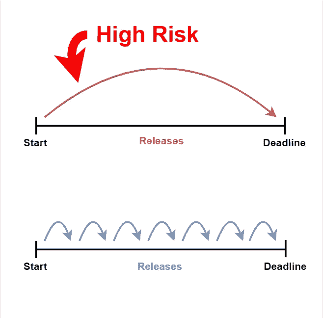
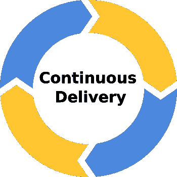

# 没有估计的截止日期

> 原文：<https://levelup.gitconnected.com/deadlines-without-estimates-4292101c024f>

在我的上一篇文章[为什么估算是浪费](https://medium.com/@BenTorvo/why-estimates-are-waste-742282550c77)中，我们讨论了一些估算的问题，但是这提出了一些关于管理截止日期的问题。大多数公司认为，为了赶上最后期限，我们需要估计和计划我们所有的工作。事实并非如此，今天我们将解释原因。

较小的释放降低了风险

# 大量释放的风险更高

大型组织中的软件交付通常是通过确定一个很久以后的截止日期来管理的，确定该截止日期需要什么，然后瞄准在该日期或之前交付。

这导致花费大量时间来估计和计划可以做什么以及以什么顺序做。应该认真对待这一规划工作中包含的风险，因为我们规划的未来越远，就越难做到准确。如前所述，评估只有在准确时才有价值。

*“浪费时间估计你知道会改变的事情是没有价值的，根据这些估计制定长期计划是鲁莽的”——*[*艾伦·霍鲁布*](https://holub.com/noestimates-an-introduction/)

在确定客户需求和向他们提供价值之间有大量的时间也会增加解决方案不起作用或不是客户想要的风险。

那么，我们如何降低大规模释放的风险呢？

# 频繁交付

我们可能设定了从现在起 12 个月的最后期限，但是是什么阻止了我们更快地交付呢？

我们可以在 3 个月内交付小型解决方案，而不是在 12 个月内交付大型解决方案。这给了我们更快的反馈，如果我们走错了方向，我们已经节省了 9 个月的开发时间。如果事情进展顺利，我们可以继续每 3 个月交付一次，同时纳入反馈，否则我们不会有。

连续交货

如果我们今天交付，而不是 3 个月后交付，会怎么样？

我们今天可能甚至不能得到一个工作版本，但是我们能得到多少呢？如果我们今天试着交付，很明显我们只需要关注最重要的工作。这在精神上让我们可以优先处理事情，而不是估计。

# 优先于规划

我们不需要计划，我们需要优先顺序。优先级让我们定义什么是重要的，今天尝试交付解决方案可以帮助指导我们。

我们需要确定工作的优先级，但我们只需要足够的优先级来继续工作。任何不尝试尽快向客户交付价值的努力都是浪费，会拖慢我们的进度。

这就是为什么为了更快地交付更多价值，我们需要做的就是:

1.  确定最有价值的任务。
2.  去完成那个任务。
3.  重复一遍。

如果你组织中的每个人在交付软件时都遵循这个过程，我相信它会比你见过的任何其他过程更有效。

联系我:

*   **推特:** [@BenTorvo](https://twitter.com/BenTorvo)
*   【ben@torvo.com.au】邮箱: [邮箱:](http://torvo.com.au/)
*   **网址:**[torvo.com.au](http://torvo.com.au)

