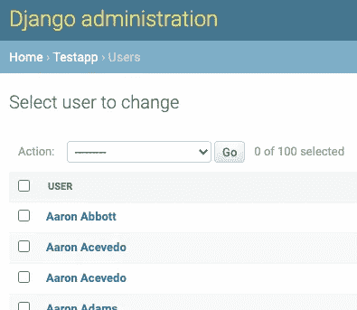
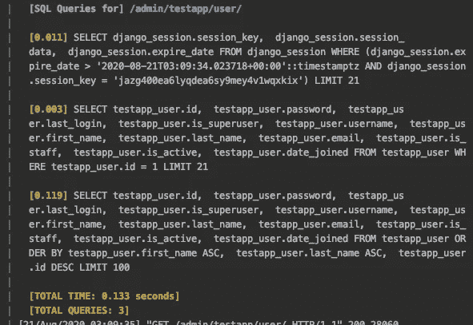
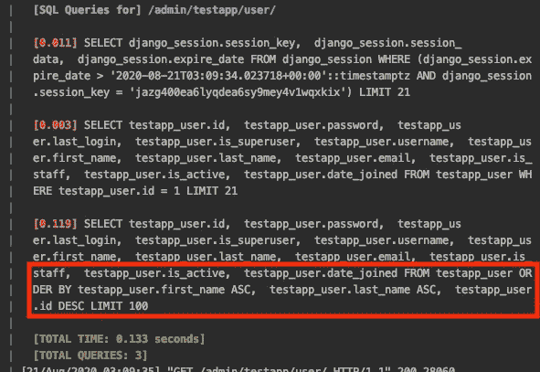
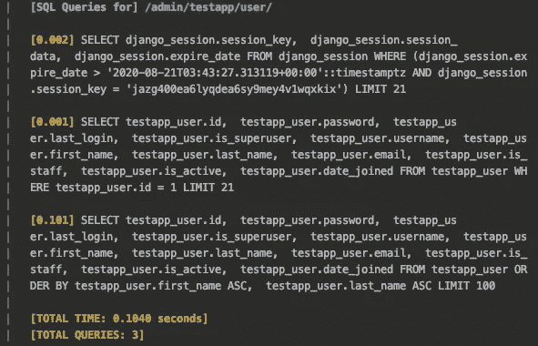
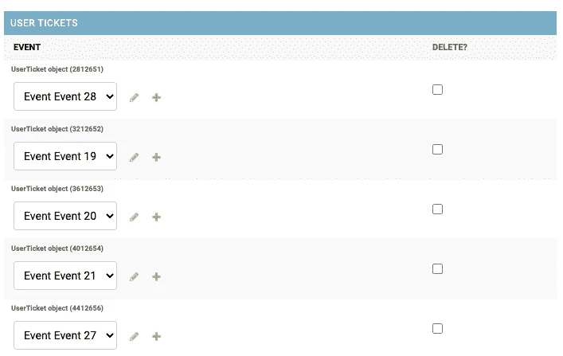
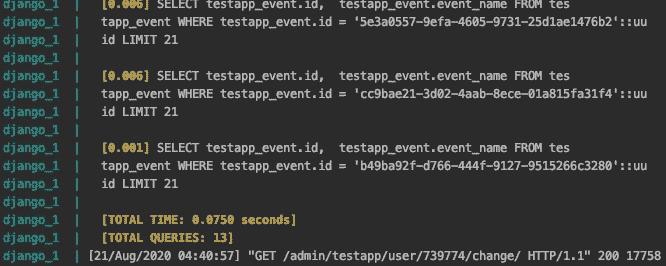
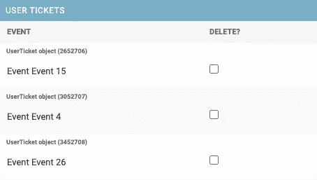
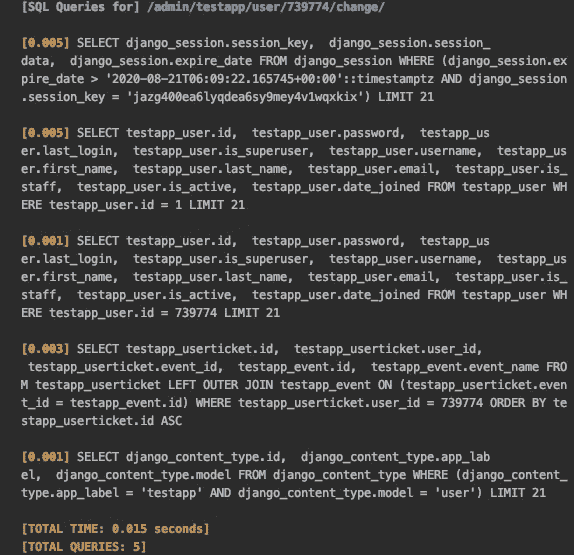

# 在单个管理优化 Django 中处理多个大型表第 3 部分

> 原文：<https://levelup.gitconnected.com/dealing-with-multiple-massive-tables-in-a-single-admin-optimizing-django-part-3-2c4ee2fec142>


[在优化 Django 的上一篇文章](/speed-up-your-django-admin-by-removing-sql-counts-optimizing-django-part-2-f5e09da667c)中，我们介绍了一种在使用 Django admin 时减少 SQL 内存占用的方法，代价是不能在表中显示正确的对象数。然而，即使这样，我们仍然会遇到 Django 管理变得异常缓慢的情况。在本文中，我将讨论一个导致 Django 管理变更列表和详细信息页面变得非常慢的场景，是什么原因导致的，以及如何修复它以使其在功能损失最小的情况下绝对可用。

# 场景:您希望在用户管理中查看用户的票证。

想象一下:你有一个装满票的桌子，你想访问它们并显示一些基本的细节，比如用户的名字。所以你这样做:

```
class User(AbstractUser):
    def __str__(self):
        return ' '.join([self.first_name, self.last_name])

class Event(models.Model):
    id = models.UUIDField(default=uuid.uuid4(), primary_key=True)
    event_name = models.TextField(default='')class Ticket(models.Model):
    user = models.ForeignKey(User, on_delete=models.CASCADE)
    event = models.ForeignKey(Event, on_delete=models.CASCADE, null=True)

class UserEventInline(admin.TabularInline):
    model = UserTicket

class UserAdmin(admin.ModelAdmin):
    model = User
    paginator = NoCountPaginator
    inlines = (UserEventInline,)

    exclude = ('user_permissions', 'groups',)

def get_queryset(self, request):
    return super().get_queryset(request).order_by('first_name', 'last_name')
```

# 让我们从用户管理变更列表开始。

如您所见，我们有一个简单的用户和事件，通过表有一个用户票。它应该是简单的，看起来像这样。



具有相应 SQL 的管理页面

SQL 已经通过我们的 NoCountPaginator 得到了改进，我们在前面的优化 Django 条目[中提到过。然而，关于 SQL 还有一些我们可以改进的地方。这是什么？](/speed-up-your-django-admin-by-removing-sql-counts-optimizing-django-part-2-f5e09da667c)



虽然我们是按名字和姓氏排序，但是请注意管理员仍然添加了一个额外的 ID 排序。

这是因为 Django 默认的按 pk 排序的行为。[据网站](https://docs.djangoproject.com/en/3.1/ref/contrib/admin/)称，“为了确保结果的确定性排序，如果 changelist 找不到提供总排序的单个或唯一的一组字段，它会将`**pk**`添加到排序中”。如果条目具有相同的可识别名称，这是有意义的(在示例中可以看到两个 Aaron Acevedo)。然而，如果您公开一些有保证的方法来区分结果(显示管理中的`**pk**`这样做)，您可以很容易地取消强制排序。

# 第 1 部分修复:NoPKChangeList

对此的代码更改相当简单，尽管代码本身看起来并不是这样。

这段代码复制自 Django 的默认 ChangeList 类，除了`get_ordering`方法禁用了额外的 pk 排序。因此，如果您将它添加到管理员中，SQL 将如下所示:

```
class UserAdmin(admin.ModelAdmin):
    model = User
    show_full_result_count = False
    inlines = (UserEventInline,)
    paginator = NoCountPaginator

    exclude = ('user_permissions', 'groups',)

    def get_changelist(self, request, **kwargs):
        return NoPkChangeList

    def get_queryset(self, request):
        return super().get_queryset(request).order_by('first_name', 'last_name')
```



时间上的微小差异，但它是那些可能突然爆发而没有警告的事情之一，所以如果你在加载你的变更列表时遇到缓慢，这可能会有所帮助。

完成后，让我们进入详细页面！

# 第 2 部分:详细页面！

现在，您可能希望您的用户管理员显示用户拥有的相关用户票证。我们通过 Django 的内嵌特性做到了这一点，该特性将用户的相关票据放在一个简单的界面中。所以内联看起来像这样:



简单内联查看门票

但是，如果你看一下 SQL，你会发现它是**而不是**效率低下。



有很多疑问。我不会把 13 个都展示出来，但你会明白的。为什么有这么多疑问？

再看一下内嵌。注意组合框中的文本是如何暗示一个呈现用户票的选择查询的。Django 并没有有效地处理这一点，对于内联的每一项，它都会调用一个 DB。如您所见，这些数据库调用的速度非常快！

对我们来说幸运的是，处理这个问题相当简单。让我们看看这个修复，并解释为什么这会减少查询次数。

# 第 2 部分修复:

与我们之前看到的普通 UserEventInline 不同，我们将对它进行如下改进:

```
class UserEventInline(admin.TabularInline):
    model = UserTicket

    fields = ('user', 'event')
    readonly_fields = ('user', 'event')

    def get_queryset(self, request):
        return super().get_queryset(request).select_related('event')
```

这是怎么回事？

嗯，我们在这里做的第一件事是**在 queryset** 上运行 select_related。Select_related 将为每个用户票证预加载相关的事件数据。

下一件事是**将事件字段设为只读**。您可能已经注意到“事件”列下每个条目的组合框。这意味着一个选择查询，因为在本例中，组合框必须用事件填充。对于少量的事件(我用 30 个事件填充了我的数据库)，这不是问题。然而，如果有更多的事件，不仅 SQL 会变得非常昂贵，HTML 页面也会变得大得无法加载。为了解决这个问题，我们通过将事件字段设置为只读来删除这个组合框功能。

## 看看结果:

这是更改后的内联外观:



并且查询次数已经显著减少。



# 最后

Django admin 很容易陷入 SQL 地狱，这主要是因为它提供了开箱即用的完整默认功能。通过一些调整和技巧，我们能够通过禁用我们不需要的东西来逃离这种死亡螺旋，比如能够更改与我们正在检查的对象相关的项目，以及禁用我们不需要的`pk`排序。

在下一集，我们将讲述一个可能失控的序列化场景，以及我们如何解决它！

如果你想让我在评论中涵盖其他内容，请告诉我！