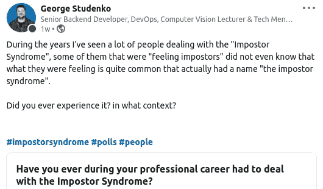

# 应对冒名顶替综合症

> 原文：<https://levelup.gitconnected.com/dealing-with-the-impostor-syndrome-3aeae509bc29>

## 你不是唯一一个觉得自己是骗子的人

## 什么是冒名顶替综合症？

冒名顶替综合症是指一个人感觉“像个冒名顶替者”或“是个骗子”。这通常发生在专业领域。

这个人觉得在任何时候他们的同事或雇主都会发现他们不知道自己在做什么或“不适合这份工作”，这可能会有后果。

很多人都有这种感觉，但不知道这实际上比他们想象的更常见，事实上，这种现象如此普遍，以至于“冒名顶替综合症”一词由此产生。

我有机会见到许多有这种感觉的人，他们中的许多人都是非常成功的人，尽管他们取得了巨大的成就、经验和教育，但他们仍然觉得自己是“一个骗子”。

## 什么时候会成为问题？

如果不断感觉到冒名顶替综合症，这可能是一件坏事，会让人们怀疑自己的技能，导致表现下降，让他们越来越努力地工作来弥补，久而久之会导致精疲力竭。

## 我对冒名顶替综合症的体验

对自己和自己所做的事情感到怀疑绝对不是一种好的感觉，我曾经经历过这种感觉，尤其是在我职业生涯的早期，甚至在成为一名开发人员 15 年后的今天，我仍然不时地感觉到这种感觉。

作为一名开发人员并不“容易”，技术不断变化，有太多的新东西需要学习以跟上时代，这使得开发人员更容易陷入“冒名顶替综合症”，有太多的信息和需要学习的东西，很容易感觉自己不知道事情。

## 为什么冒名顶替综合症不完全是一件坏事？

任何有这种感觉的人可能都会同意这是一件坏事，是的，这种感觉并不好。

然而，就像生活中的所有事情一样，冒名顶替综合症可能是一件“小剂量”的好事，它可能会推动你学习更多，并在事情上做得更好，尤其是在那些你不自信的事情上。

当然，只有你做点什么才是好的，否则，它可能会在那里停留很长时间。

更不用说，如果你“呆在你的舒适区”太久，随着时间的推移，你实际上可能最终“无法就业”(这发生在我身上，你可以在我以前的文章中读到:[我在 15 年的职业生涯中作为开发人员犯的 5 个错误](https://betterprogramming.pub/5-mistakes-i-did-as-a-developer-during-my-15-years-career-26527fc50895))。

另一个原因是，处于“事物谦逊的一面”可能比处于“事物无所不知的一面”更好。

你有没有遇到过一个“相信自己无所不知”的人？他们对自己所知道的事情如此确信，以至于他们甚至不会考虑其他事情，这意味着没有讨论我们将如何做这个或那个，他们甚至不会考虑其他人的意见。

## 你如何应对冒名顶替综合症？

1.  要知道你不可能什么都是专家。
2.  接受有些事情你只是不知道和/或没有经验。
3.  公开你不知道的事情，不要隐瞒，这对高层或领导来说更难，因为他们“应该知道”，但是如果领导说“我不知道”，那么他们就打开了学习的大门，创造了一个安全的环境，让其他人也可以承认他们也不知道。
4.  接受这样的事实:你将不得不在前进的道路上学习新的东西，而且你可能需要尽快完成。
5.  当你发现一些你没有信心并且需要继续努力的事情时，去了解更多吧！
6.  深入了解你需要处理的主题，但不要超过这个深度，有时你确实需要非常深入，但其他时候不一定，最好是*避免信息过载*，这实际上可能会导致情况变得更糟，因为你不了解每一个细节，并再次对自己产生怀疑。
7.  对于任何你想感到自信的事情，只有一个方法可以做到，练习，练习，再练习。

## 结束语

冒名顶替综合症是真实存在的，比你想象的更普遍，我敢说这是一种正常的感觉。

为了证明这一点，我创建了一个民意测验，即使可能没有大量的人投票，也很容易看出趋势。

冒名顶替综合症民意调查

你可以[点击这里](https://www.linkedin.com/posts/georgestudenko_impostorsyndrome-polls-people-activity-6851130363746492416-jWCV)查看投票结果。

我还可以告诉你，投赞成票的人都是伟大的开发者，所以我希望这能让你感觉更好。

## **你觉得这篇文章有用吗？**

分享你的评论和经验！让我们知道什么对你有效，什么对你无效。

如果你喜欢这篇文章并想看更多，请给这篇文章一些掌声。

要了解最新信息，请务必关注，直到下次！

**我们来连线**

你可以在这里找到我的社交网络链接:[https://linktr.ee/gnstudenko](https://linktr.ee/gnstudenko)