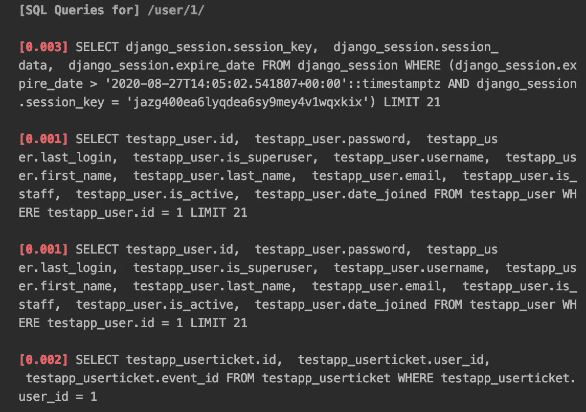
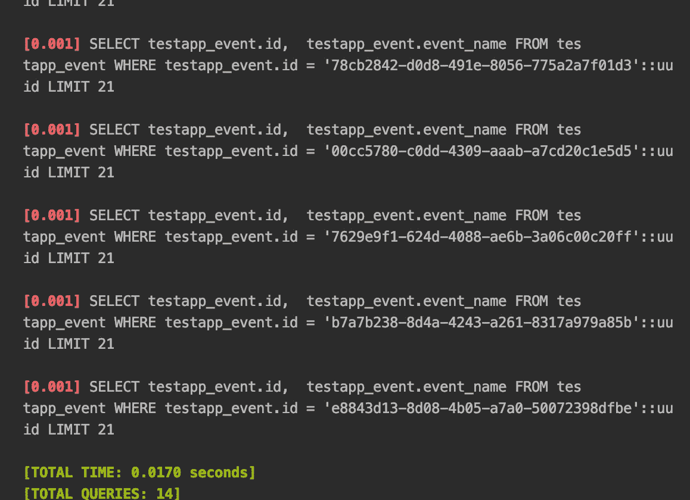
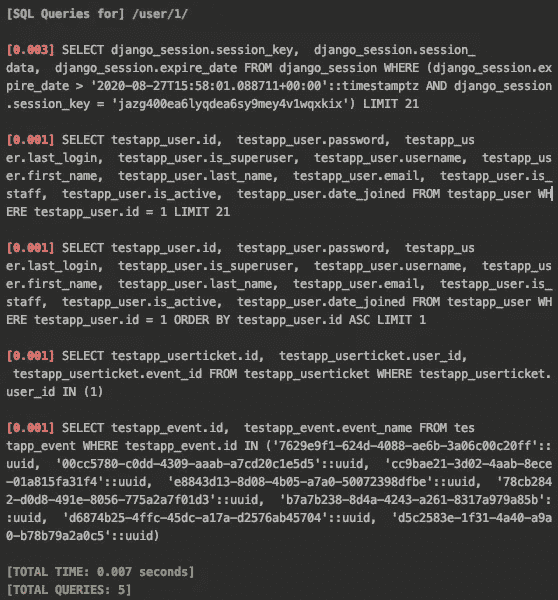

# 处理 n+1 问题！优化 Django:第 4 部分

> 原文：<https://levelup.gitconnected.com/dealing-with-the-n-1-problem-optimising-django-part-4-f02010c7931d>


这个问题在 Django Rest 框架的用户中是众所周知的，所以总是值得一提。如果您使用或打算使用 DRF，这篇文章将解释`n+1`问题是如何在最无关紧要的用例中出现的，以及如何轻松处理它。

如果你还没有尝试过 DRF，我全心全意地推荐你试一试。它减少了启动和运行 REST 框架所需的大量开发工作，同时仍然足够灵活，可以满足您几乎所有的编程需求

如果您曾经使用过 Django，您肯定会对 Django Rest 框架的序列化程序很熟悉。它验证输入的数据，有时将输入的数据加工成您所需要的形式，以满足任何后端需求。此外，它还将模型数据转换成 REST 端点为上游客户端指定的任何格式。

使用序列化器还可以做许多其他事情，我在这里就不一一介绍了。然而，我要介绍的是一个相对常见的用例，它会导致这些 SQL 查询再次爆炸:n+1 问题。

# 那么什么是 n+1 问题呢？

n+1 问题是这样的:[让我们以第 3 部分](/dealing-with-multiple-massive-tables-in-a-single-admin-optimizing-django-part-3-2c4ee2fec142?source=friends_link&sk=96a35d8e435719670b356ca4c4606c1c)中的例子为例:

```
class User(AbstractUser):
    def __str__(self):
        return ' '.join([self.first_name, self.last_name])

class Event(models.Model):
    id = models.UUIDField(default=uuid.uuid4(), primary_key=True)
    event_name = models.TextField(default='')class Ticket(models.Model):
    user = models.ForeignKey(User, on_delete=models.CASCADE)
    event = models.ForeignKey(Event, on_delete=models.CASCADE, null=True)
```

因此，我们有用户、事件和用户参加事件的门票。

现在，假设我们想要创建一个视图，在给定一个 user_id 的情况下，该视图返回用户、其姓名以及他要参加的活动的列表。其视图和序列化程序可能如下所示:

```
class UserTicketSerializer(ModelSerializer):
    event_name = SerializerMethodField()
    class Meta:
        model = UserTicket
        fields = ('event_name',)

    def get_event_name(self, ticket):
        return 'Event {}'.format(ticket.event.event_name)

class UserSerializer(ModelSerializer):
    name = SerializerMethodField()
    events = UserTicketSerializer(many=True, source='userticket_set')

    class Meta:
        model = User
        fields = ('username', 'name', 'events')

    def get_name(self, user):
        return user.__str__()

class UserView(APIView):
    def get(self, request, user_id, *args, **kwargs):
        user_obj = User.objects.get(id=user_id)
        serializer = UserSerializer(user_obj)
        return Response(serializer.data, status=status.HTTP_200_OK)
```

一个简单调用的结果如下所示:

```
GET /user/1/{
    "username": "admin",
    "name": "Mark Ang",
    "events": [ { "event_name": "Event Event 25"},
                { "event_name": "Event Event 27"},
                  ... [6 more]
    ]
}
```

# 那么问题出在哪里？已经开始了！

是啊，是啊，我们快到了。



我们还没完，这只是第一点。

问题出在 SQL 上。该 API 调用的 SQL 日志如下所示:



14 个巨大的查询！这只是开始。

如你所见，它很长。

令人望而却步的长。

那么问题出在哪里呢？

很简单，真的。这是因为嵌套的序列化程序，对于提供给它的每一张票，它都会为它进行一次 SQL 查询。对于`n`票，这是`n`查询，对于用户的单个查询，这是`n+1` SQL 查询。

您在这里看到的时间很短，因为它们是在数据库和服务器位于同一台机器上的设置中收集的。如果您的服务器需要 10ms 才能到达您的数据库，那么您将需要额外处理 140ms 的事务。随着 web 应用程序数据的增长，这可能会成为一个需要处理的问题。

# 那么，我们该如何处理呢？

最后我们得到了答案:预取！

那么什么是预取呢？好吧，把它想象成缓存与你正在寻找的物品相关的东西。

当您进行选择查询时(Django 的 QuerySet 会为您做这件事，所以您不会直接看到它)，您是在查询一个表上的特定数据。嗯，预取可以帮助你提前从不同的表*中收集相关对象的数据。在我们的例子中，我们可以预取与用户相关的票据，以及与这些票据相关的事件。*

*为什么这很有帮助？序列化程序试图从 queryset 中获取它需要的信息。因为默认情况下 queryset 没有相关的对象数据，所以序列化程序被迫执行新的查询。*

*但是通过预取相关数据，序列化程序不需要做任何事情！*

## *让我们看看这是怎么做到的！*

*让我们修改我们的 queryset，以包括一个预取，如下所示:*

```
*class UserView(APIView):
    def get(self, request, user_id, *args, **kwargs):
        qs = User.objects.filter(id=user_id). \
             prefetch_related('userticket_set__event'). \
             first()
        serializer = UserSerializer(qs)
        return Response(serializer.data, status=status.HTTP_200_OK)*
```

*并且生成的查询日志要短得多:*

**

*我们减少了多达 9 个查询！*

*SQL 更难看，但是谁在乎呢？！我们刚刚解决了我们的`n+1`问题！通过预取相关的票证及其事件数据，我们将查询数量从 14 个减少到 5 个。*

# *那么这个故事的寓意是什么呢？*

*不要低估预取的力量！当在同一个序列化器中处理多个相关对象时(当您在序列化器中嵌套一个序列化器时，通常会遇到它们)，预取可能是您最好的朋友！*

*当然，这里的警告是要确保你只预取你知道你需要的。不要随意预取，因为预取确实会使您的 SQL 在数据库中执行起来更加复杂和昂贵。然而，正如您所见，潜在的性能提升不容小觑。如果有疑问，总是衡量和比较结果，以确保你的优化是你想要他们做的。*

**感谢您通读本文！如果你想知道如何在你的 Django 应用程序中设置一个 SQL 日志，* [*点击这里查看这个系列的第一部分，这正是我要讨论的！*](/django-sql-debugging-with-an-sql-log-middleware-optimising-django-part-1-ca3b5c20d892?source=friends_link&sk=263f4d36dde6377b91df0acf4e5208aa) *或查看* [*这篇文章我解释了为什么远程工作正在接管世界*](https://medium.com/swlh/5-things-the-coronavirus-forced-the-world-to-learn-about-remote-work-66dc6efcaf04?source=friends_link&sk=a79ff0cf5e0aaf66865d628b6a661db4) *(好吧，这太容易了，但无论如何还是要查看一下！)**