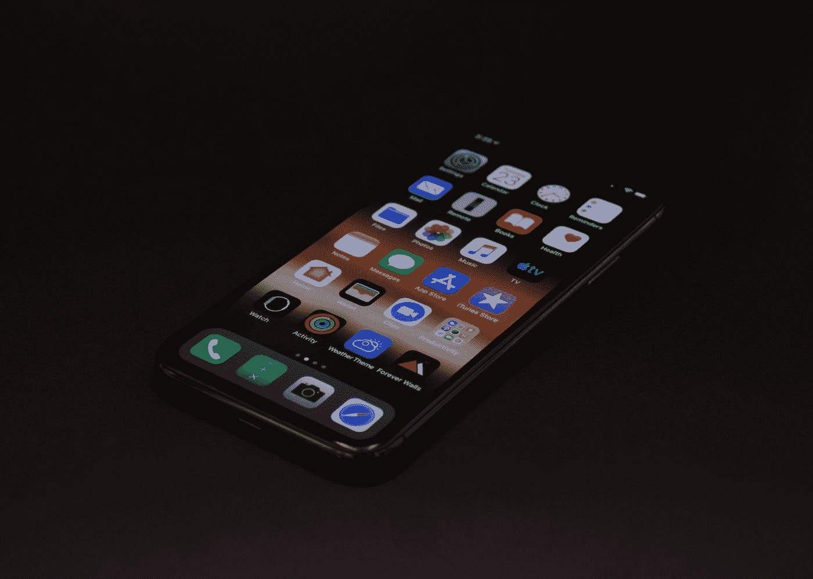

# 亲爱的苹果——一封来自非苹果开发者的信

> 原文：<https://levelup.gitconnected.com/dear-apple-a-letter-from-a-non-apple-developer-df229f234147>

## 苹果的围墙花园发展方式的问题

在 [Unsplash](https://unsplash.com?utm_source=medium&utm_medium=referral) 上由 [Maulik Sutariya](https://unsplash.com/@truemaulik?utm_source=medium&utm_medium=referral) 拍摄的照片

我目前正在与一家公司合作，我们正在为客户创建一个简单的应用程序。这是一个较小的项目，为每个平台创建一个原生应用程序没有意义。

虽然有一些很好的工具来构建跨平台的应用程序，但它们要么不是 iOS 上的选项，因为 web 应用程序会错过 web 推送通知，要么会带来不必要的障碍，比如你必须拥有一台 Mac 才能构建任何类型的 iOS 应用程序。

对于像我这样没有任何设备的开发者来说，苹果让他们几乎不可能开发出在他们平台上也能运行的应用。

# 渐进式网络应用

最初的想法是创建一个渐进式网络应用程序(PWA)。这将是一个完美的用例，我是 web 应用程序的忠实粉丝，因为它们易于开发并且(几乎)在任何地方都能工作。当我几年前创建我的第一个 PWA 时，它们在 iOS 上根本不受支持。值得称赞的是，自那以后这种情况已经发生了变化，[现代 iOS 版本(13+)支持 PWAs](https://love2dev.com/pwa/ios/) 。不过苹果的实现还是有局限性的。它们不支持 web 推送通知，不幸的是，我们应用程序的最大需求之一是接收推送通知的能力，这意味着 PWA 不是一个选项。

[Chrome 从 2015 年](https://developers.google.com/web/updates/2015/03/push-notifications-on-the-open-web)开始支持网页推送通知。遗憾的是[苹果仍然不支持 Safari](https://developer.mozilla.org/en-US/docs/Web/API/Push_API#browser_compatibility)——无论是在桌面上还是在 iOS 上。这是唯一不支持它们的主流浏览器，我看不出有什么好的理由。过去，有一种观点认为苹果不想要 pwa，因为它们会与他们的应用商店模式竞争，而且你可以在其中使用其他支付处理器。然而，他们现在支持常规的 pwa，所以这不再是一个争论，尤其是反对推送通知的争论。如果他们担心向用户发送垃圾邮件，就像其他浏览器一样，让它成为一个选择加入系统。有一些希望，苹果公司将在未来改变其立场，甚至有[change.org 请愿](https://www.change.org/p/tim-cook-apple-inc-implement-web-push-notifications-on-ios-devices)，但对我们的项目来说已经太晚了。

# 混合应用

当寻找 web 推送通知的变通办法时，唯一有效的解决方案似乎是使用 Apache Cordova 这样的工具的混合应用程序。这个想法是围绕一个 web 应用程序创建一个原生包装器，它基本上是一个带有显示 web 应用程序的 web 视图的原生应用程序。然而，与普通的 web 应用程序不同，可以通过这种方式访问一些本机 API。经过几次实验，我们最终得到了 [Capacitor.js](https://capacitorjs.com/) ，它似乎比 Cordova 更好用。他们有一个用于推送通知的[插件](https://capacitorjs.com/docs/apis/push-notifications)，适用于 Android 和 iOS。

虽然我应该说它说它支持 iOS，因为我没有办法测试它，这要感谢苹果的另一项政策:你只能用 Mac 开发 iOS 应用程序，而我没有。

我不是苹果的超级粉丝。我不同意他们的许多做法，尤其是他们的价格。然而，我知道其他人更喜欢 Mac/iOS，当我创建一个应用程序时，我想让这些人也能使用它。如果我没有 Android 手机，我就能做到这一点。Android Studio 可以在谷歌自己的 Chrome 操作系统上运行，但也可以在 Windows、Mac 和 Linux 等其他操作系统上运行。它包括一个模拟器，所以你可以轻松地测试，构建和发布一个应用程序，而不需要拥有一部 Android 手机(尽管你可能至少应该从朋友那里借一部来看看你的应用程序在真实设备上的感觉)。

但是，构建 iOS 应用程序的唯一官方方法是使用 XCode，它只能在 macOS 上运行。它还包括一个模拟器，所以你不一定需要拥有一部 iPhone，但它并不支持所有功能(例如，[他们去年才在模拟器中添加了推送通知](https://stackoverflow.com/questions/1080556/how-can-i-test-apple-push-notification-service-without-an-iphone/60085404#60085404)，所以仍然建议你也拥有一部 iPhone。不像便宜的安卓手机[，你不到 100 美元](https://medium.com/geekculture/its-crazy-how-good-and-cheap-phones-have-become-6e3101c5bca0)就能买到，iPhones 要贵得多。我知道有一些在没有 Mac 的情况下构建 iOS 应用的方法，比如虚拟机或 Hackintosh，但它们没有得到官方支持，而且据我所知，它们并不总是工作得很好。

Capacitor.js 会自动创建一个 XCode 项目，所以假设它可以直接运行(目前我还不能)，我需要花很多钱购买苹果设备，只需要按一次编译按钮，这太疯狂了。幸运的是，我们团队中有其他具有技术专长的人，他们可以访问 macOS/iOS 设备，可以开发 iOS 应用程序，但这仍然会带来很多开销和不必要的障碍。

# 苹果太大了

苹果能够逃脱这些限制性开发政策的唯一原因是因为它们太大了。一家拥有自己的移动操作系统、有类似限制的较小公司将在几个月内破产。发展和维护移动操作系统的唯一方式是应用程序，如果开发人员必须面对如此多的障碍才能在平台上发布他们的产品，他们中的许多人不会这样做，客户会迁移到一个不同的平台，在那里他们可以访问所有的应用程序。但苹果目前太大而不能倒，开发者必须想办法在 iOS 上发布他们的应用，让他们有机会成功。

作为非苹果开发者为 iOS 开发是一件痛苦的事情。你必须在他们的生态系统中，才能在他们的平台上开发应用。iOS 13+中的 PWA 支持是朝着正确方向迈出的一步，但如果没有实现推送通知等核心功能，它仍然不是一个好的选择。至于原生或混合应用程序开发，我希望他们能添加一种官方方式来构建 Windows 或 Linux 的 iOS 应用程序，但这种可能性似乎很小。