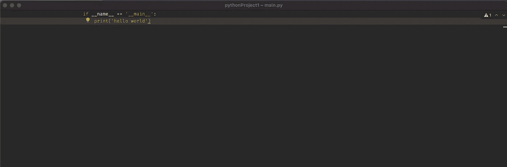
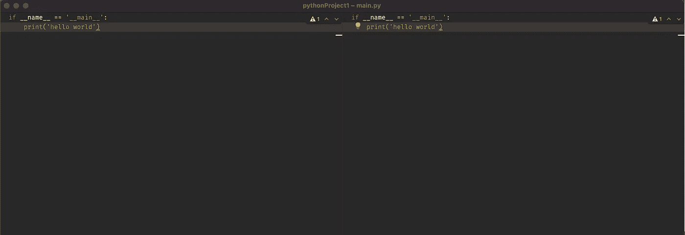
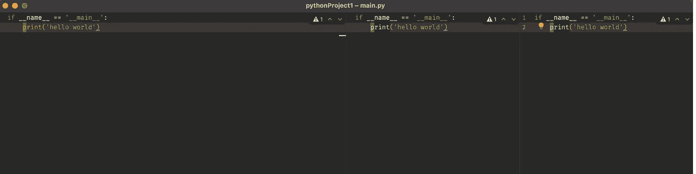

# 亲爱的 Vim，我:q！

> 原文：<https://levelup.gitconnected.com/dear-vim-i-q-5df03b763ae4>

## 我从 Vim 到 IdeaVim 的旅程


照片由 Amine Elhattami 拍摄

在我今天写这篇文章的时候，我已经用 Vim 作为我个人项目和工作的日常驱动程序三年了，主要是 Python。是的。我可以退出 Vim，但我绝不是超级用户。这篇文章是关于我寻找合适工具的旅程。

## 预示最后结果（或败局）的先兆

在我的 Vim 之旅开始时，我承认我更专注于加入 Vim cool kids 俱乐部，向我的同事展示高级功能。同样，依赖快捷方式和干净的界面也引起了我的共鸣。然而，当我开始处理复杂和更大的代码库时，我的注意力转移到了我正在生产的代码上。我开始遇到一些问题，这些问题我都处理得很成功:

*   缺少一个像样的调试器。
*   我花了大量时间管理和配置我的 vimrc。
*   对于大型项目，自动完成并不完美。
*   将 Vim 与 Tmux 一起使用时的性能问题。

我认为调试是交易的破坏者。我遇到过一些解决方案，声称使用 pdb 或一些类似 [pdb++](https://github.com/pdbpp/pdbpp) 或 [pudb](https://pypi.org/project/pudb/) 的 juice up 版本就是你所需要的全部，但事实并非如此！我尝试的所有工具要么功能有限，要么配置复杂(我花了大约一个小时让 pudb 全屏)。我也试过 [Vimspector](https://github.com/puremourning/vimspector) 。虽然这是一个很好的项目，但感觉很脆弱。但更重要的是，当我调试一个需要很长时间来执行的应用程序时，进程一直挂起，我一直丢失 stdout。我知道糟糕的配置会导致这些问题。但是当我试图正确地配置工具时，我并没有给我的工作增加价值。

## 寻找合适的工具

当我开始寻找 Vim 替代品时，我首先列出了我正在寻找的主要功能:

*   优秀的 python 调试器
*   快速接口
*   Vim 键绑定支持
*   接近完美的智能感知
*   需要很少的配置

然后，我上网看看其他人在用什么，并检查流行的 IDEs 文本编辑器的优缺点。首先，我不断发现博客帖子、线程和视频争论一些 ide 与 Vim 相比占用了多少内存。我认为这对现在的大多数开发者来说是不相关的。普通的工作笔记本电脑有 16 Gb 的内存，所以如果 IDE 提供了可靠的功能，谁会在乎它是否需要 2 Gb 的内存。然而，我倾向于认为启动时间越少越好。

在和一个朋友聊天时，他建议我用 I [deaVim](https://plugins.jetbrains.com/plugin/164-ideavim) 插件试试 Pycharm。这不是我第一次尝试 Pycharm，我知道它有很好的调试器和智能感知特性。我在 IdeaVim 的经历没有什么值得夸耀的。它有很多缺陷，缺少很多功能。然而，我决定尝试一下，因为我知道它可以检查出我正在寻找的几个特征。

## 有思想的皮查姆:好的、坏的和丑的

以下从较高的层面描述了我喜欢和不喜欢 IdeaVim 的地方。然而，如果你有兴趣了解我目前如何使用 IdeaVim 的更多细节，请查看[这篇文章](https://towardsdatascience.com/the-essential-ideavim-remaps-291d4cd3971b)。

**调试器、智能感知和接口**

首先，调试器和智能感知可以正常工作。即使是大型项目，它也有一个快速响应的界面。

**免分心模式**

正如我在介绍中提到的，我喜欢 Vim 干净的界面。我很高兴看到你可以用 Pycharm 在无分心模式下达到同样的效果。



默认情况下，当你打开一个缓冲区时，代码奇怪地居中。但是，您可以从配置中更改这种行为。

**IdeaVim**

第一个惊喜是，现在我们可以指定一个名为`.ideavimrc`的配置文件。这意味着我可以做如下事情。

```
""" Map leader to space ---------------------
let mapleader=" "

""" Common settings -------------------------
set showmode
set so=5
set incsearch
set nu
```

看着眼熟？没错，就是 vimscript。你甚至可以使用你现有的`.vimrc`。

```
source ~/.vimrc
```

另一个很好的特性是，您可以像下面这样绑定任何 Pycharm 操作。这在 IDE 和 IdeaVim 插件之间架起了一座桥梁。

```
:map <leader>d <Action>(Debug)
```

至于 vim 插件，IdeaVim 模仿了一些流行的插件。完整列表在此[此处](https://github.com/JetBrains/ideavim/wiki/Emulated-plugins)。

然而，IdeaVim 并不支持 Vim 的所有特性，模拟插件列表很短，而[错误列表](https://youtrack.jetbrains.com/issues/VIM?q=%23Unresolved%20sort%20by:%20votes)更长。此外，IdeaVim 需要与 Vim 一样多的配置，而且社区比 Vim 小。

而且，有些行为令人沮丧。例如，命令模式[没有自动完成](https://youtrack.jetbrains.com/issue/VIM-258)，如果您点击 tab，焦点将回到编辑器！垂直分裂是另一个故事。假设您有两个并排的缓冲区，如下所示。



如果你想增加第三个缓冲区。您可能会认为这三个缓冲区的宽度相等。不对！它将分割选定的缓冲区。最糟糕的是，我找不到改变这种行为的方法。



# 结论

第一，我不是 Jetbrains 赞助的；然而，这是我分享我的旅程的愿望的一部分，希望它可以帮助别人。

总之，Pycharm 可能不是最好的(因为我没有全部尝试)，只是碰巧我先尝试了一下，而且它符合我的用例。此外，在使用 IdeaVim 几周后，我意识到我更喜欢 Vim 键绑定，而不是编辑器本身，特别是因为我不是 Vim 超级用户。我知道你可以灵活地做 Vim 做的几乎所有事情。然而，由于你不能依赖鼠标使用 Vim，它迫使你使用快捷方式做任何事情，这使你更有效率。

# 在你走之前

在 [Twitter](https://twitter.com/amine_elhattami) 上关注我，我经常在那里发关于软件开发和机器学习的微博。