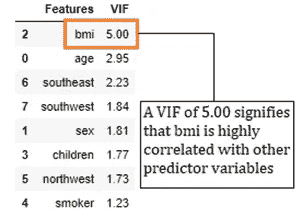
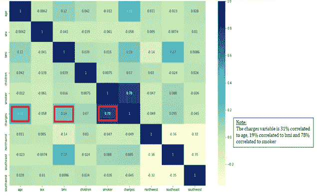
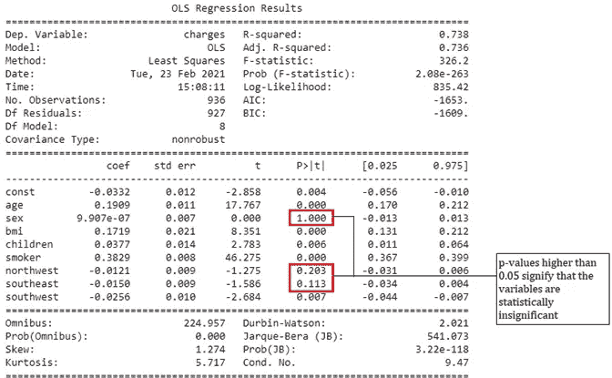
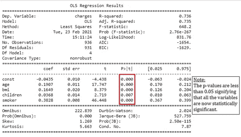
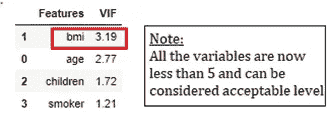

# 多重共线性死亡

> 原文：<https://levelup.gitconnected.com/death-by-multicollinearity-3c338252ce2b>

## 如何处理预测变量可以挽救你的 MLR 模型的生命

Amir-abbas Abdolali 在 [Unsplash](https://unsplash.com?utm_source=medium&utm_medium=referral) 上拍摄的照片

首先，我们必须了解什么是 MLR(多元线性回归的缩写)，以充分掌握多重共线性的概念。

MLR 估计一个响应变量(也称为因变量)与两个或更多预测变量(也称为自变量)之间的关系。例如，利润是一个因变量，完全取决于独立变量，如产品数量、销售成本、管理费用等。，而且从来不是反过来。利润将线性依赖于所有这些独立变量。当我们阅读这篇文章时，我们会看到一个真实的 MLR 的例子，它显示了一个人的体重指数、年龄或吸烟习惯如何直接影响他们的保险费用。我们将看到多重共线性的存在是如何削弱你的 MLR 模型的

**了解 MLR 模型及其参数:**

**典型的 MLR 方程如下:**

**电荷= β0 + β1.bmi + β2 .年龄+ β3 .性别+ β4。儿童+ β5 .地区+ β5 .吸烟者+ ϵ**

**费用** =响应变量，一般用 Y 表示

**bmi、年龄、性别、儿童、地区、吸烟者**=预测变量，分别用 X1、X2、X3 和 X4 表示

**β0 =** Y 轴截距(始终为常数)

**β1，β2，β3，β4，β5 =** 回归系数

**ϵ =** 误差项(残差)

*创建 MLR 模型时的重要假设是预测变量之间不应高度相关。一个好的 MLR 模型将遵循以下过程，即如果 bmi 增加β1 个单位，费用变量将增加 1 个单位，保持其他预测变量不变，如果年龄增加β2 个单位，费用变量将增加 1 个单位，保持包括 bmi 在内的其他预测变量不变。如果模型不符合这一假设，我们会说预测变量表现出高度多重共线性。*

# **那么，到底什么是多重共线性呢？**

当你开始你的机器学习之旅时，你会遇到这个术语。这个术语一开始听起来很拗口，但是一旦你深入研究这个主题，希望你能掌握这个术语。多重共线性可以定义为预测变量彼此相关，而不仅仅是与响应变量相关的情况。让我们抛开技术术语，通过想象一些真实的生活场景来理解这个概念。

> **案例 1:无多重共线性**

让我们想象你正在为你的家人做一道美味的肋眼牛排。你要准备肉，加入盐、胡椒、迷迭香、百里香等配料，并按照戈登·拉姆齐的建议，加入一小块黄油。每种配料都会给你的牛排增添风味。现在，如果这些成分没有互相压倒对方，一起工作，他们将创造你味蕾的交响乐。在这里，配料是预测变量，风味是你的反应变量。由于这些成分不会相互冲突，它们将避免多重共线性。让我们看看下面给出的另一个例子，以便更好地阐明我们的概念。

由[埃莫森·维埃拉](https://unsplash.com/@emersonvieira?utm_source=medium&utm_medium=referral)在 [Unsplash](https://unsplash.com?utm_source=medium&utm_medium=referral) 拍摄的照片

> **情况 2:高度多重共线性**

现在想象一下，你的晚餐做好了，你想吃点甜食。你冲到厨房，开始搅拌白面粉、可可粉、鸡蛋和糖，却发现你的罐子里只剩下非常有限的白糖了。然后你记起你曾经在卢克餐厅喝咖啡的时候(吉尔摩女孩参考😁)而且你已经收藏这些红糖包有一段时间了。你用红糖代替白糖，做一份甜点，结束你的渴望。现在在这种情况下，白糖和红糖彼此高度相关，你很难分辨哪种糖给甜点增加了更多的甜味。同样，你的 MLR 模型也很难解码哪个预测变量实际上对你的响应变量产生了影响。

# 交易还是不交易？？

即使模型显示高度多重共线性，相关变量也不会影响模型的整体拟合度，也不会影响预测。简而言之，它不影响良好拟合统计。正如你在我们的白糖/红糖例子中看到的，甜点的整体甜度不会受到影响。因此，如果您对解码每个单独的预测因子对您的模型的影响不感兴趣，那么您不必担心丢弃变量。

## **什么时候是你模特的麻烦制造者？**

这是一个问题，因为它破坏了预测变量的统计显著性，因为它增加了系数的标准误差，这意味着它增加了系数的方差，使得预测非常不重要。现在，即使您的模型仍然能够做出很好的预测，但质量会受到影响，因为您的模型没有经过训练，无法区分每个预测变量对响应变量的影响。

# **检测问题！！！**

**VIF:** 这是一个定量指标，告诉我们单个预测变量与其他预测变量的相关程度。例如，如果没有多重共线性，1.7 的 VIF 意味着特定系数的方差比其应有值大 70%。

它通常用 1/1 R2 来表示

*行业标准规定的一般经验法则:*

a) VIF≥ 5:应治疗高度相关和可变

b) 1>VIF>5:中等相关，但可接受

c) VIF = 1:不相关

治疗前的 VIF

# **诊断潜在症状:**

1.  **相关矩阵:**可以通过热图工具可视化的相关矩阵将帮助我们进行双变量数值分析，并可以向我们显示一个变量与其他变量之间的相关性。(*注意，相关矩阵一次比较一个变量，而 VIF 将一个变量与所有其他数值变量相关联。)*这个矩阵可以给我们一个关于如何处理高度相关变量的合理想法，并指引我们忽略那些看起来不太相关的变量。*(注意:高相关系数意味着两个变量高度相关，但并不总是意味着 VIF 总是很高)*

2. **P 值:**第二级诊断是检查每个变量的 P 值。如果变量的 p 值大于 0.05，那么它们可以被称为统计上不显著的，在考虑 VIF 之前，最好去除这些值。

T **创建预测变量:**

1.  检查预测变量的 p 值是否大于 0.05，以便移除这些变量。删除这些变量将提高每个变量的 VIF。
2.  检查是否有对业务领域和潜在问题陈述没有任何意义的变量。您可以查看关联热图，以了解某些变量是否与 MLR 相关。例如，如果你看到电荷和性别有-0.058 的关系，意味着它们只有 5.8%的相关性。删除这些值以提高 VIF 值。
3.  如果你仍然看到一个或多个变量的 VIF 大于 5.00，即使你已经用以上两种方法处理了它们。丢弃如此高的 VIF 变量将极大地改善其他剩余变量的 VIF。

# **后处理:**

更新后的模型将具有低于 5.00 的 VIF 值和低于 0.05 的 p 值。

> T **创建的 p 值:**

足够重要的 p 值仍然存在

> **治疗过的 VIF:**

治疗后更新的 VIFs

C **结束语:**本练习的最终目标是帮助您创建最佳的 MLR 模型，以便为解决现实世界的问题创建更好的预测。

*如有任何与数据分析相关的疑问，请随时联系我..更多即将推出！！！*

再见！！😊