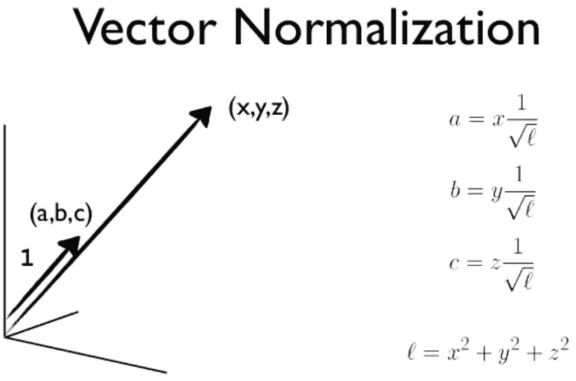
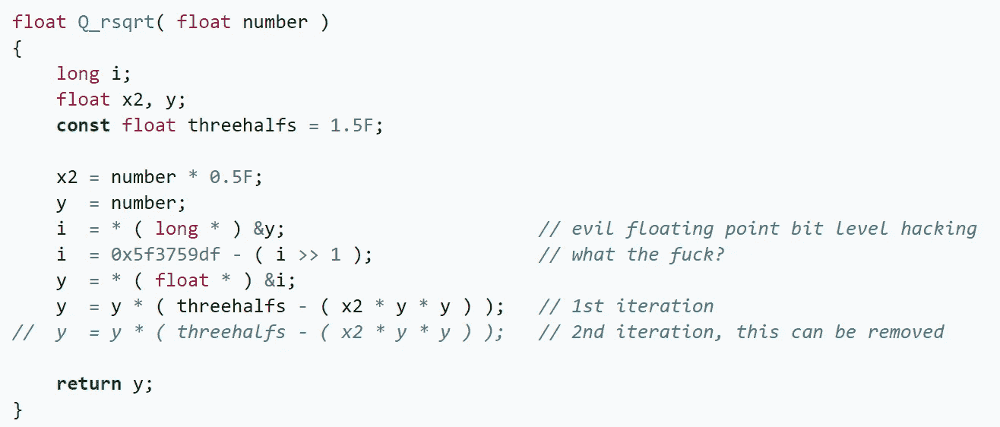
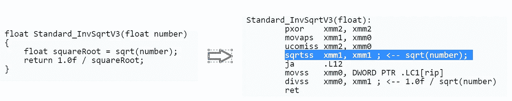
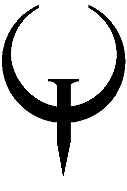

# 地震 3 的平方根倒数黑客之死

> 原文：<https://levelup.gitconnected.com/death-of-quake-3s-inverse-square-root-hack-32fd2eadd7b7>

## 巧妙优化背后的故事，以及为什么它现在只是民间传说


照片由[艾拉·唐](https://unsplash.com/@elladon?utm_source=medium&utm_medium=referral)在 [Unsplash](https://unsplash.com?utm_source=medium&utm_medium=referral) 拍摄

对于没有听说过这个代码技巧/优化的人来说，前提是，我们需要做“**1/√x”**整整一堆次来渲染 3D 图形和酷炫的着色器。如果你没有学过向量微积分，或者像我一样只拿到了 B+，那么你可能会非常模糊——也许这有所帮助(也可能没有):



取 arb 长度的向量，使其正常长度为 1。为什么？谁知道呢…享受酷炫的 3D 吧

# 回到过去

很久以前，我们编写了这样的代码来实现平方根倒数:

```
*def* isqrt(*l*):
    return *l* **(-1/2)   # 1/sqrt(l)
```

C 语言中的编译器和标准库可以有效地运行如下代码:

**但是，**这很慢，因为内部的 sqrt 实现往往是反复试验，利用[牛顿法](https://en.wikipedia.org/wiki/Newton%27s_method)。看看苹果的 [sqrt.c](https://opensource.apple.com/source/Libm/Libm-47.1/ppc.subproj/sqrt.c.auto.html) 的源代码，你会看到一些查找表优化第一步的证明。我测试了这个基础版本，并测量了性能以供参考。

## 那么这有多慢呢？

嗯，它确实很快，但如果你运行它 50，000 次，在我的 i7 Surface 笔记本电脑上需要 1.269 秒。让我们看看 Quake 优化的速度有多快，以及它是如何完成的。

# 雷神之锤 3 版本

我使用了 Python 版本的雷神之锤 III 的优化/破解平方根倒数，这是由艾利克斯·莱利的 github 帖子提供的。我不会去解释为什么它会起作用，因为它已经被详细解释过很多次了。(但是 TLDR；它混合使用一个神奇的起点+数字的原始位表示，以达到 1%以内的近似精度[ [Ref 1](https://medium.com/hard-mode/the-legendary-fast-inverse-square-root-e51fee3b49d9) ]。

那么到底好了多少呢？使用上述实现方式，大约比**快 3-4 倍**，但是精度略有损失(< ~1%)。

注意原始的 C 代码有更酷的注释，如下所示:



这方面的历史是有据可查的。简而言之，人们认为这是天才 ID 创始人约翰·卡马克和他的团队，然后是《汇编与图形的禅》的作者迈克尔·阿布拉什，以及其他几位杰出的程序员，直到线索汇聚到前施乐 Parc 工程师格雷格·沃什从 80 年代后期的工作

# 英特尔终结了乐趣— SSE

令人惊讶的是，就在雷神之锤 3 发布几年后，英特尔发布了 x86 SSE 扩展，其中**在硬件**中包含了 SQRT 功能！哇，乐趣结束了！！

在今天的语言中，如果你写 x**(-1/2) →它不调用一个牛顿例程，它只是调用(在 Intel 上)RSQRTSS 指令，噗它就完成了。

## HW 有多快？

在我的系统上，SSE sqrt 的运行速度比牛顿方法快 10 倍，比 Quake 的方法快 3.5 倍。LinkedIn 上的一篇很棒的[帖子展示了 ASM 的样子:](https://www.linkedin.com/pulse/fast-inverse-square-root-still-armin-kassemi-langroodi/)



今天的编译器利用硬件调用

这变得更加有趣，因为最新的英特尔 AVX 指令进一步优化了向量调用(回想一下你的计算机架构课程中的 SIMD 和[弗林的分类学](https://en.wikipedia.org/wiki/Flynn%27s_taxonomy))。

所以这个故事的寓意是——优化技术很酷，但最终，硬件会赶上来；)但如果外面的天才们没有挑战极限，那么我们就不会有《雷神之锤 3》，谁知道上证综指和 AVX 会不会发展得如此之快。向外面的黑客们致敬！



[维基共享雷神之锤](https://en.wikipedia.org/wiki/Quake_(series)#/media/File:Quake_logo.png)标志

# 参考

1.  关于历史、数学和算法的逐步指南—[https://medium . com/hard-mode/the-legendary-fast-inverse-平方根-e51fee3b49d9](https://medium.com/hard-mode/the-legendary-fast-inverse-square-root-e51fee3b49d9)
2.  Python 版本—[https://github . com/ajcr/ajcr . github . io/blob/master/_ posts/2016-04-01-fast-inverse-square-root-python . MD](https://github.com/ajcr/ajcr.github.io/blob/master/_posts/2016-04-01-fast-inverse-square-root-python.md)
3.  上证和 AVX 现代测试—[https://www . LinkedIn . com/pulse/fast-inverse-square-root-still-Armin-kassemi-langroodi/](https://www.linkedin.com/pulse/fast-inverse-square-root-still-armin-kassemi-langroodi/)
4.  好的 ppt 总结—[https://www . slide share . net/mak sym _ zavershynskyi/fast-inverse-square-root](https://www.slideshare.net/maksym_zavershynskyi/fast-inverse-square-root)