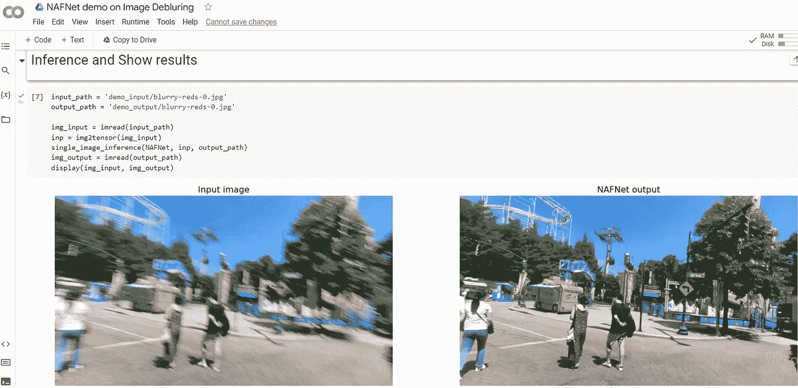

# 使用人工智能和 Python 去模糊图像。

> 原文：<https://levelup.gitconnected.com/deblurring-images-using-ai-and-python-2e4f295c95d1>

AI 可以对你很想发布但因为最终变得模糊而无法发布的图片/图像进行去模糊吗？


并排输入和输出(源 Nafnet Github 库)

人工智能(AI)一直在以非常快的速度发展，无论是计算机视觉、NLP(自然语言处理)、语音合成、艺术创作……不胜枚举。但是它能使你的图像模糊吗，因为有人分散了你的注意力而变得模糊的完美照片？


**去模糊 Gif**

当然可以，而且非常简单。

引入 **NAFNET** (非线性激活自由网络)进行图像恢复。


Nafnet 的输入和输出图像(图片由作者提供)

图像去噪和去模糊方法的现状。它可以去模糊，降噪，并增加您的图像的分辨率。
所以，拿出你想要升级的旧图片和视频，让我们开始吧:

我们将使用 **Google Colab** 来运行 NAFNET 模型和输入图像。


Google Colab 图像

*(Google colab 允许我们在浏览器中运行代码，而无需在本地安装任何东西。)*

(如果你不熟悉 colab 或者不想运行整个代码，**在本文**的末尾有一个 web 应用**的链接，你可以在那里直接上传你的图片**并摆弄模型。但是**我强烈建议你尝试一下代码**。)

这是模型的官方实现的 GitHub 库。
[https://github.com/megvii-research/NAFNet](https://github.com/megvii-research/NAFNet)


Nafnet Github 知识库。

我将使用 **Deblur Colab** 演示笔记本来演示该模型。别担心，你不用写任何额外的代码。所有的代码都已经写好了，你只需要运行它。)

转到存储库并点击选项“**在 Colab 中打开**”。


你会看到一个新的谷歌 colab 笔记本，看起来像下面的图片。


Google Colab Git 克隆库

运行笔记本第一个单元格中给出的以下命令。

```
!git clone https://github.com/megvii-research/NAFNet%cd NAFNet
```

上面的命令使用 git 命令从 GitHub 克隆 Nafnet 代码，并更改当前目录。

下一个单元安装所需的库和 Nafnet 库。pip 命令用于安装 python 库。运行该步骤需要一分钟。

```
!pip install -r requirements.txt!pip install --upgrade --no-cache-dir gdown!python3 setup.py develop --no_cuda_ext
```


Colab 安装库步骤 2

下一个单元格使用以下代码从作者的 google drive 下载**预训练模型。使用 *gdown* 库连接到驱动器并下载模型。预训练模型的大小为 272 MB。**

```
import gdowngdown.download('https://drive.google.com/uc?id=14D4V4raNYIOhETfcuuLI3bGLB-OYIv6X', "./experiments/pretrained_models/", quiet=False)
```


Google Colab Google drive

现在我们需要一个图像来测试代码，幸运的是，笔记本确实为我们提供了**两个演示图像**，这样我们就可以检查笔记本是否设置正确。以下命令可以做到这一点。它从作者的驱动器下载了两个演示图像。

```
gdown.download('https://drive.google.com/uc?id=1kWjrGsAvh4gOA_gn7rB9vnnQVfRINwEn', "demo_input/", quiet=False)gdown.download('https://drive.google.com/uc?id=1xdfmGUKNDXtnWakyxcGq2nh8m18vHhSI', "demo_input/", quiet=False)
```


Google Colab 获取演示图片

下一段代码设置 PyTorch、NumPy、matplotlib 和 OpenCV。它通过将整个过程分成 4 个功能来实现。
1。imread
2。img2tensor
3。显示
4。单一图像推理

```
def imread(img_path):
    img = cv2.imread(img_path)
    img = cv2.cvtColor(img, cv2.COLOR_BGR2RGB)
    return imgdef img2tensor(img, bgr2rgb=False, float32=True):
    img = img.astype(np.float32) / 255.
    return _img2tensor(img, bgr2rgb=bgr2rgb, float32=float32)def display(img1, img2):
    fig = plt.figure(figsize=(25, 10))
    ax1 = fig.add_subplot(1, 2, 1)
    plt.title('Input image', fontsize=16)
    ax1.axis('off')
    ax2 = fig.add_subplot(1, 2, 2)
    plt.title('NAFNet output', fontsize=16)
    ax2.axis('off')
    ax1.imshow(img1)
    ax2.imshow(img2)def single_image_inference(model, img, save_path):
  model.feed_data(data={'lq': img.unsqueeze(dim=0)})
  if model.opt['val'].get('grids', False):
    model.grids()
    model.test()
  if model.opt['val'].get('grids', False):
    model.grids_inverse()
    visuals = model.get_current_visuals()
    sr_img = tensor2img([visuals['result']])
    imwrite(sr_img, save_path)
```

下一个单元格使用 create_model 函数加载模型。


下一个单元接收演示输入图像，并输出模型处理后的图像。



Colab 上的输出(图片由作者提供)

瞧啊。！现在你有了，用人工智能去模糊图像。

但是我们如何在不运行代码的情况下使用我们自己的图像呢？
这是一个无需运行任何代码就可以拖放的链接。要使用它，只需上传您的图像，然后点击提交。图像在 CPU 上运行时可能需要一些时间来处理。下面给出的例子花了 50 秒来处理。
https://huggingface.co/spaces/chuxiaojie/NAFNet


拖放应用程序

**给你，AI 去模糊图像。此外，该模型有一个去噪选项，您可以在提交图像去噪时选择该选项。** 如果你喜欢看这样的文章， **s *支持作者通过使用这个[链接](https://medium.com/@arjungullbadhar/membership)成为一个*** 媒介会员。

[](/colorize-black-and-white-photos-using-python-and-ai-5b3e5f85df44) [## 使用 Python 和 AI 给黑白照片上色。

### 想知道你以前的黑白照片在现实中是什么样子吗？让我们找出答案。

levelup.gitconnected.com](/colorize-black-and-white-photos-using-python-and-ai-5b3e5f85df44) [](/cartoonize-yourself-using-python-and-ai-24fdd4913206) [## 使用 Python 和 AI 卡通化你自己

### 你有没有想过，作为一个迪士尼角色，你会是什么样子？让我们来了解一下！

levelup.gitconnected.com](/cartoonize-yourself-using-python-and-ai-24fdd4913206) 

*嘿伙计们，*

我对媒体写作很陌生，希望听到你的反馈。如果你喜欢我写的东西，不要犹豫，竖起大拇指或者留下提示。如有疑问或推荐，欢迎随时 ***留言评论。*** *我看了每一条留言，尽可能快的回复。*

阿尔琼·古尔巴达尔