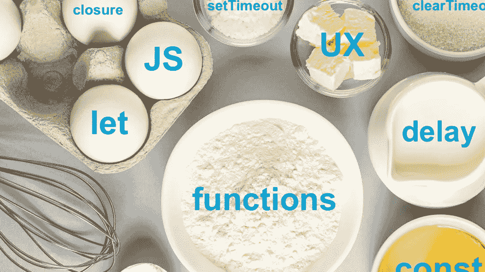
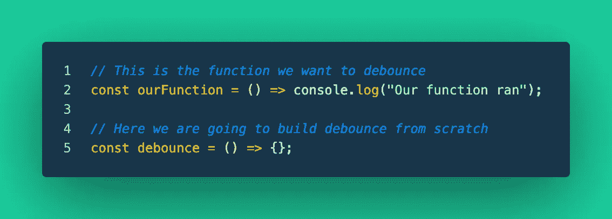
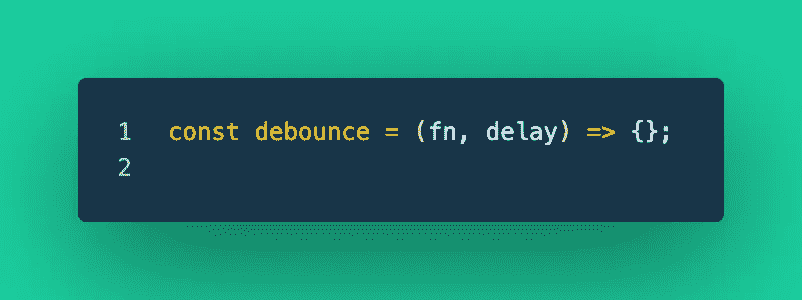
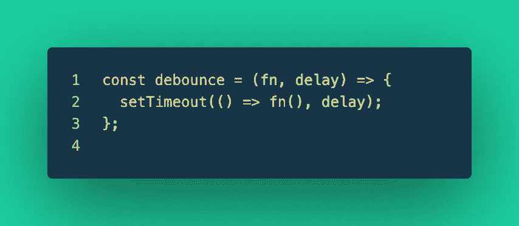
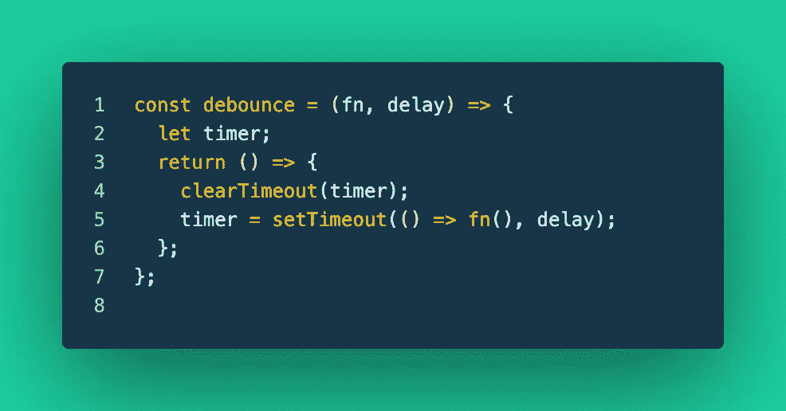
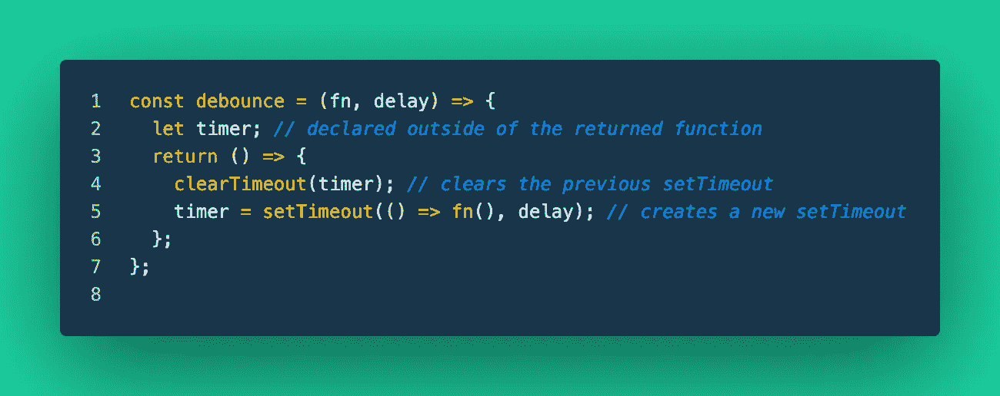
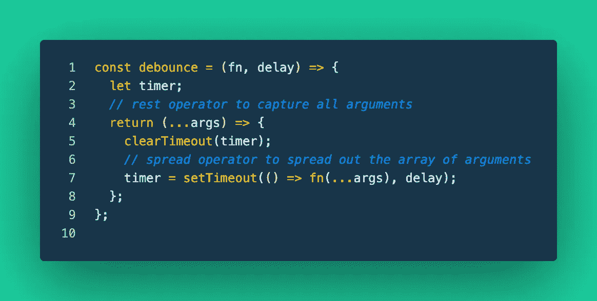
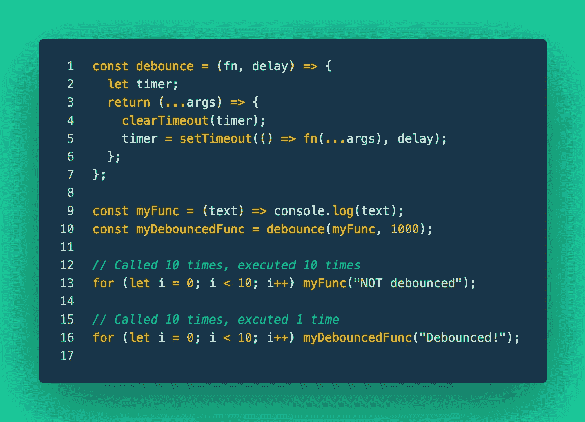

# 从头开始去抖

> 原文：<https://levelup.gitconnected.com/debounce-from-scratch-8616c8209b54>



几个 JavaScript 库都有自己的预烘焙去抖函数，允许你传递你的函数，一个延迟时间，然后你就可以开始比赛了。

然而，我发现自己想知道更多关于这些去抖功能中的神奇之处。一旦发现了这种魔力，会有哪些常见的用例呢？这篇文章将深入探讨反跳的内部工作原理，然后在另一篇文章(不久的将来)中展开，在另一篇文章中，我将使用这个自制的反跳函数来限制搜索栏中的 API 调用，但稍后会详细介绍。

在这篇文章中，我将回答这两个问题:

*   去抖应该做什么？
*   我如何从头开始构建去抖？

当您想要限制某个功能的执行次数时，去抖功能非常有用。我们经常发现自己处于这样的情况，我们有一个与频繁触发的事件相关联的功能(例如，滚动、onchange、按键)。如果为输入字段中的每一次按键事件或窗口中的每一次滚动事件执行一个函数，我们可能会发现自己调用函数数百次，从而使应用程序的效率荡然无存。

因此，去抖有效地限制了函数的过度执行，从而使我们的 web 应用程序更具性能。嗯，这是我们第一个问题的良好开端！我们来看第二个问题:我们如何让自己去抖？

首先，我将声明一个名为“ourFunction”的函数，我们最终将去反跳(限制它的执行次数)，然后声明一个实际的去反跳函数的开始。



函数去抖和一个去抖函数

去抖功能将用于限制和延迟我们功能的执行。因此，我们可以从逻辑上得出结论，去抖需要这两个项目作为它的参数:延迟函数和延迟时间(以毫秒为单位)。



带参数的去抖功能

接下来，我们将希望仅在延迟时间过后才执行传入的函数。为此，我们将使用内置的 JavaScript [setTimeout](https://developer.mozilla.org/en-US/docs/Web/API/setTimeout) 函数。



在去抖中利用 setTimeout

setTimeout 函数接收一个要执行的函数，并在执行传入的函数之前等待一段“延迟”时间...这听起来很像我们试图用去抖功能实现的目标。我们的去抖功能只是 setTimeout 的重现吗？

目前……是的。虽然我们的反跳函数会延迟传入函数的执行，但它仍然会每次都调用它的 fn 参数。

我们倾向于仅调用 fn 一次去抖，并且这一次是在“延迟”时间量过去之后。为此，我们需要能够重置 setTimeout。[封](https://developer.mozilla.org/en-US/docs/Web/JavaScript/Closures)来救援了！



利用一个结束

这是怎么回事？！我们的去抖现在返回一个函数？

此时，当调用去抖时，它应该接收一个要执行的函数(fn)和在函数执行之前应该经过的时间量(延迟)。然后去抖初始化变量“定时器”并返回一个匿名函数。在这个匿名函数中，去抖的魔力终于显现出来了。

让我们从返回函数的底部开始:

```
timer = setTimeout(() => fn(), delay);
```

timer 变量被分配给 setTimeout 的函数调用，如前所述，它将在经过“延迟”时间后执行其第一个参数(匿名函数)。调用 setTimeout 的结果是返回该 setTimeout 的 ID。因此，我们现在将这个 setTimeout 的 ID 存储在 timer 中。

如果我们向上看一行代码，我们会看到:

```
clearTimeout(timer);
```

这是我们去抖功能的实际去抖部分。假设我们已经调用了一次去抖函数，并启动了 setTimeout 来倒计时“延迟”时间。但是，让我们假设在第一个“延迟”时间过去之前，我们刚刚第二次调用了去抖函数…现在会发生什么呢？

因为“延迟”时间还没有过去，clearTimeout 将清除原始的 setTimeout，防止它调用作为参数接收的函数。但这怎么可能呢？(参见下面的代码注释)



关闭的显著好处

我们可以访问原始的 setTimeout ID，因为它被分配给了 timer。然而，定时器是在去抖返回语句之外声明的，因此“[关闭](https://developer.mozilla.org/en-US/docs/Web/JavaScript/Closures)来拯救！”

去抖动已经发生。我们希望去抖的函数只有在去抖版本被调用并且“延迟”时间已经过去的情况下才会执行。如果“延迟”时间尚未过去，去抖将清除先前的 setTimeout，并创建一个新的 setTimeout，该 setTimeout 必须等到“延迟”时间过去后才能执行。

最后一步:启用一些参数的使用。



在这里，我使用 [rest 参数](https://developer.mozilla.org/en-US/docs/Web/JavaScript/Reference/Functions/rest_parameters)语法(第 4 行)访问所有可能传递给我的去反跳函数的去反跳版本的参数。然后这些参数被传递给第 7 行传入函数的函数调用，并使用[展开](https://developer.mozilla.org/en-US/docs/Web/JavaScript/Reference/Operators/Spread_syntax)语法展开。

压轴戏:这里有一个工作代码样本，你可以在 chrome 开发工具中试用，或者在任何你喜欢运行 JavaScript 的地方查看我们自制的去抖功能。



动态去抖

我们有去抖函数(第 1 行)、myFunc(第 9 行):它将文本记录到控制台，还有一个去抖版本的 myFunc，名为 myDebouncedFunc(第 10 行)。这两个 for 循环将调用 myFunc 的非去抖版本和去抖版本。

在第一个 for 循环中，myFunc 被调用 10 次，然后执行 10 次。然而，在第二个 for 循环中，myDebouncedFunc 被调用了 10 次，但只执行了一次！为胜利而去抖！

我们可以在 Lodash 等 JavaScript 库中找到的预烘焙版本的去抖非常有用。然而，花时间深入了解反跳的内部工作原理，无疑会让你对其应用的理解和欣赏有所增长。保持冷静，继续去抖！