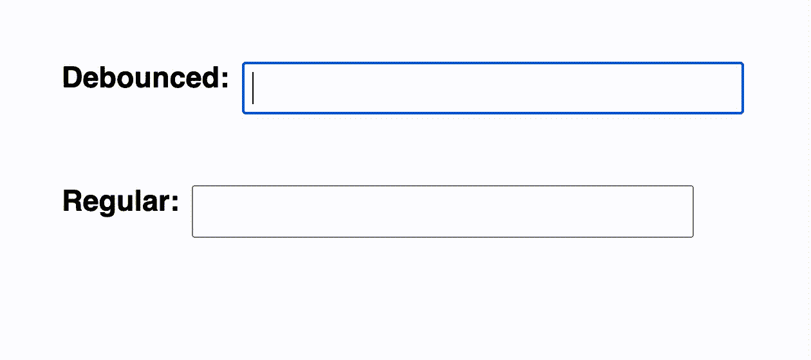

# JavaScript 中的去抖——提高应用程序的性能

> 原文：<https://levelup.gitconnected.com/debounce-in-javascript-improve-your-applications-performance-5b01855e086>

## 解释去抖函数以及如何在 JavaScript 代码中使用它来提高性能



***了解一种类似的技术叫做*** [***节流***](https://skilled.dev/course/throttle)

你有没有注意到，当你输入一个搜索结果时，会有一个延迟，然后才会出现结果。该功能通常由一个名为`debounce`的函数控制(它也可以是一个具有类似结果的`throttle`函数)。`debounce`功能延迟`keyup`事件的处理，直到用户停止输入一段预定的时间。

这避免了用户界面代码需要处理每个事件，也大大减少了发送到服务器的 API 调用的数量。处理输入的每个字符会损害性能，并给后端增加不必要的负载。

从头实现去抖是一个常见的面试问题。它测试你对中级和高级 JavaScript 概念的理解，比如:异步编程、回调、作用域和闭包。这也是在现实世界的应用程序中使用的提高性能的实用解决方案，并表明您了解为真实用户编写良好代码的工具。


我建了一个课程帮助你 [**掌握编码面试>**](https://skilled.dev)

[](https://skilled.dev) [## 编写面试问题

### 一个完整的平台，在这里我会教你找到下一份工作所需的一切，以及…

技术开发](https://skilled.dev) 

去抖是节流的表亲，它们都提高了网络应用的性能。但是，它们用于不同的情况。当您只关心最终状态时，可以使用去抖。例如，等待直到用户停止键入来获取提前键入搜索结果。当你想处理所有的中间状态，但速度可控时，最好使用节流。例如，在用户调整窗口大小时跟踪屏幕宽度，并在页面内容改变时重新排列页面内容，而不是等到用户完成。

让我们深入了解一下去抖是什么样的:

去抖是一个高阶函数，它是一个返回另一个函数的函数(为了清楚起见，这里命名为`executedFunction`)。这样做是为了在`func`和`wait`函数参数和`timeout`变量周围形成一个[闭包](https://developer.mozilla.org/en-US/docs/Web/JavaScript/Closures)，以便保存它们的值。以下是每个变量的定义:

*   `func`:在去抖时间后，您想要执行的功能
*   `wait`:在执行`func`之前，您希望去抖功能在最后一次接收动作之后等待的时间。对于我们的 typeahead 示例，它是最后一次按键后等待的时间。
*   `timeout`:用于指示正在运行的去抖的值。

我们可以使用去抖功能:

```
var returnedFunction = debounce(function() {
  // All the taxing stuff you do
}, 250);

window.addEventListener('resize', returnedFunction);
```

因为去抖返回一个函数，所以第一个例子中的`executedFunction`和第二个例子中的`returnedFunction`是同一个函数。每次调整窗口大小时，都会执行`executedFunction` / `returnedFunction`。

我们的`executedFunction`扩展了参数`(...args)`以允许去抖函数接收任意数量的参数传递给回调函数。

我们声明一个名为`later`的回调函数，它是在去抖计时器结束后执行的函数。这是`setTimeout`到期后将被调用的内容。

接下来，我们`clearTimeout`阻止了回调的执行，从而重新开始去抖。然后我们(重新)声明`timeout`，开始去抖等待周期。如果在另一个事件之前已经过了完整的`wait`时间，那么我们执行`later`回调函数。`timeout`被设置为`null`，这意味着去抖已经结束。这执行`func(...args)`。

有一个更高级的版本，我们可以将一个`immediate`标志传递给`debounce`。目前我们总是等到去抖结束才执行回调，但是使用`immediate`，你可以改变它，使函数在前沿执行，直到它延迟调用足够长的时间耗尽定时器，才允许你再次执行。

这也是这个函数的注释版本。

去抖的常见情况是`resize`、`scroll`和`keyup/keydown`事件。此外，您应该考虑将任何触发过度计算或 API 调用的交互用去抖封装起来。

*如果您觉得本文有帮助，请点击*👏*。* [*关注我*](https://medium.com/@treyhuffine) *了解更多关于 React、Node.js、JavaScript 和开源软件的文章！你也可以在*[*Twitter*](https://twitter.com/treyhuffine)*或者*[*git connected*](https://gitconnected.com/treyhuffine)*上找到我。*

[](https://gitconnected.com/resume-builder) [## 软件工程师简历生成器| gitconnected

### 免费打造不到 5 分钟的高质量软件工程简历。同步您的个人资料，我们会处理…

gitconnected.com](https://gitconnected.com/resume-builder)