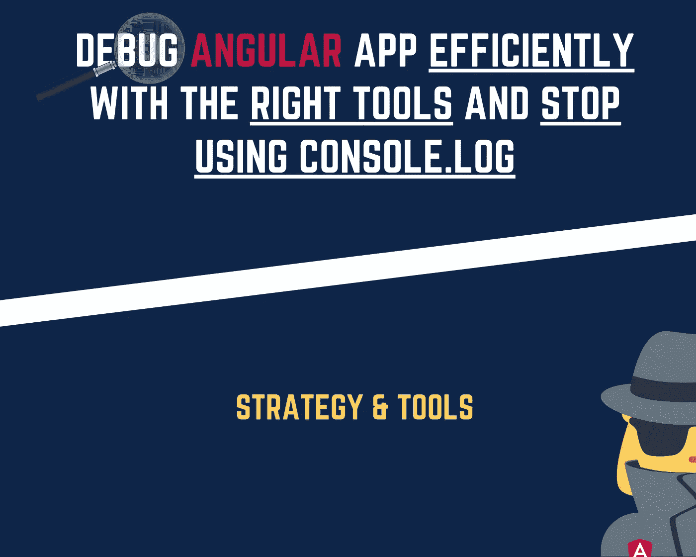
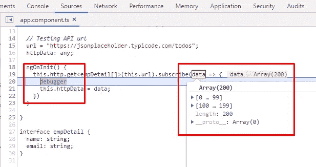
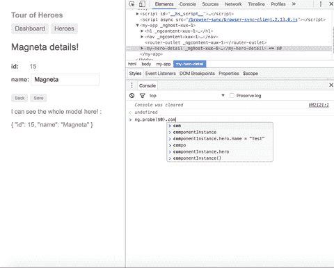
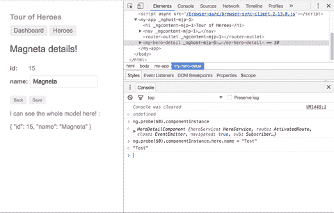
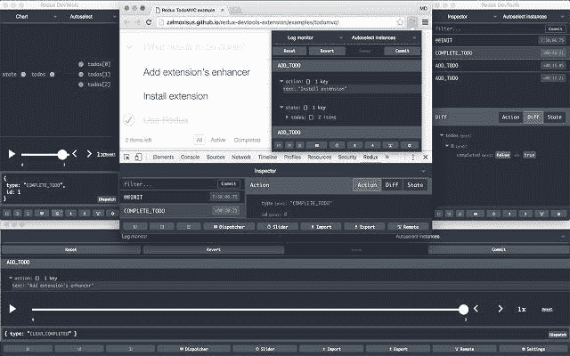
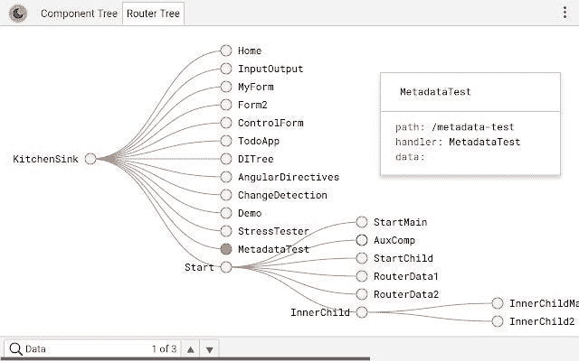

# 使用正确的工具高效调试 Angular app，停止使用 console.log

> 原文：<https://levelup.gitconnected.com/debug-angular-app-efficiently-with-the-right-tools-and-stop-using-console-log-e7f5f62c490f>

## 调试策略和工具



应用程序总会有 bug。这就是为什么调试技能是必不可少的，每一个加速这个过程的工具都会受到欢迎，不是吗？

在本文中，我将展示我的调试策略。他们主要是根据我自己的经验。接下来，我将列出我通常使用的工具。最后是奖金

欢迎在评论区让我反馈来丰富那些想法和工具；)

准备好了，我们走！

# 调试策略

## 出了什么问题？

确定问题所在已经解决了一半。你需要理解这个问题，并且头脑中有一个清晰的想法。触发事件时是错误吗？还是一种意想不到的价值观或行为？不管是什么，我们需要知道错误何时出现？在哪里？并确定全局区域。

主要有两类问题:

*   控制台上显示一个错误。
*   **奇怪的行为或意想不到的行为**


## **控制台显示错误:**

这通常不太复杂。控制台已经在给你提示了。你所需要的是理解错误，并找到触发错误的原因。

## **奇怪的行为或意想不到的行为:**

这种类型更费时间，也更复杂。这次我们没有提示。我们需要寻找它。

无论我们有错误还是奇怪的行为，我们都需要找出问题的根源。有时候，即使在谷歌上搜索了一个错误，我们也找不到一个明确的解释。因此，不可能有一些策略来帮助发现或理解问题。

这里有一些策略，你可以用它们来有效地发现问题。

## 调试策略

*   运用你的预感或直觉。

使用您的直觉是找到导致 bug 的区域的最快方法。当然，只有当你是开发代码的人时，它才更容易访问。即使您不是该代码的开发人员，随着时间的推移和经验的积累，每次都做这个练习来增强您的直觉总是很好的。

*   **画出或写下超出预期行为的情景**

总是建议从纸和笔开始。我很懒，一步一步画，导致了奇怪的行为，对我来说是痛苦的。所以我会跳过它，继续测试不同的东西。我发现这不是合适的方式，因为有时我会不断尝试，浪费时间。写下来组织了我的思路，给了我更多的提示去测试正确的区域，而不仅仅是随机测试。

*   **定义区域的消除过程。**

当我对显示的错误没有任何线索时，我通常会使用这种策略。我从使用我的朋友谷歌开始。但这并不总是那么容易。所以到目前为止我找到的最好的方法就是淘汰。我称之为消除过程，因为我从一步一步地消除代码中的困惑开始，以确定是什么触发了错误。这是如此有效，也保护你的神经。

*   **外部眼睛**

你尝试了几乎所有的方法，但仍然没有效果，*！！*也许问题的根源还没有确定。这就是为什么有一双外部的眼睛是必不可少的。

*   **让你的神经元暂停一下。**

这种策略令人难以置信。你有没有休息过，休息过后，你就找到了解决方法？嗯，有时候，我们的神经元只是累了，需要休息一下。有时睡了一会儿后。

因此，休息对你的神经元来说至关重要，也许这是你为了修复 bug 而必须解决的真正问题。

下面是一个策略的例子，以及根据 bug 的类型我最常用的策略:


当我的控制台显示错误时，我通常使用直觉或排除过程策略。他们会为我做这项工作。相反，一个意想不到的行为会通过直觉或写下场景或通过外部的眼睛来解决。排除过程不会帮助你理解奇怪的行为，因为它是导致意外行为的所有谜题的组合。因此，我不会在这种情况下使用这种策略。

接下来，我们将看到可以大大加快调试过程的工具。

# 调试工具

下面，我根据我的经验列出了最好的工具。我没有详细介绍每一个工具，因为它更多的是给出熟练调试的关键。如果你想更详细地介绍某个工具，请在评论区告诉我。

## 类型脚本编译器

*   TypeScript 编译器非常智能。好好利用它。
*   有时在代码中找到一个 bug 就像运行一个:

```
***ng build***
```

它不仅编译组件，还编译模板，并为您提供出错信息的摘要。

*   如果您没有使用 Angular CLI，请启用源地图。).编译器将更加强大，并向您显示您需要修复的确切代码行。
*   一定要启用源代码映射，这样编译器可以帮你更多。

如果您想发现关于 TypeScript 的更有趣的事情，请查看以下文章:

[](/how-to-get-the-most-from-the-typescript-compiler-angular-aae7fb53e0cf) [## 如何充分利用 TypeScript 编译器— Angular

### 让 TypeScript 编译器为您服务

levelup.gitconnected.com](/how-to-get-the-most-from-the-typescript-compiler-angular-aae7fb53e0cf) [](/how-to-avoid-using-the-any-type-in-typescript-14c0a0805473) [## 如何避免在 TypeScript 中使用 any 类型？

### 避免在代码中键入 any 的 3 个技巧

levelup.gitconnected.com](/how-to-avoid-using-the-any-type-in-typescript-14c0a0805473) 

## 浏览器开发工具

对我来说，浏览器开发工具是发现 bug 的最佳盟友。我最喜欢也是每天使用的是 Chrome 开发工具:

[](https://developers.google.com/web/tools/chrome-devtools?utm_source=dcc&utm_medium=redirect&utm_campaign=2018Q2) [## 谷歌开发者

### " type": "thumb-down "，" id ":" missingtheinformationneed "，" label ":"缺少我需要的信息" }，{ "type"…

developers.google.com](https://developers.google.com/web/tools/chrome-devtools?utm_source=dcc&utm_medium=redirect&utm_campaign=2018Q2) 

*   **断点**
*   **调试器语句**

确保源映射被激活，以便能够使用调试器语句:



*   **浏览器的控制台**

—使用$0 获取所选元素的引用:


$0 获取对所选元素引用的访问

—使用`**ng.probe($0)**`检查组件的范围，并直接操作其各种属性。

—通过`**ng.probe($0).componentInstance**`也可以访问组件实例:



访问组件实例

—访问组件很好，但在更改组件属性后查看 UI 更改更好。这也有可能得益于棱角分明又有了:`ng.probe($0)._debugInfo._view.changeDetectorRef.detectChanges()`

这将获取组件视图的变更检测器的引用，并触发检测变更。



变化检测

*   **网络活动**
*   **性能分析**

## 弯管

角形管道存在于模板中，通常用于将输入转换为输出。因此，以某种方式表示数据。您可以欺骗并使用它们进行调试。我已经使用过几次 ***json*** 管道，这为我节省了很多时间。

*   异步管道
*   Json 管道

通过这些管道，您可以在与模型交互时快速查看模型的所有属性的实时变化。

```
// in template (HTML)
***{{ arrayName | async | json }}*** // or ***{{ arrayName | json }}***
```

这里调试她最有趣的是 ***json*** 管道。有时我们也需要 ***异步*** 管道，以防出现异步数组(Promise，Observable)。

## 冗余开发工具

状态更改错误是最难调试的错误。因此，装备是必不可少的。Chrome 有一个状态改变的扩展叫做 [Redux DevTools](https://chrome.google.com/webstore/detail/redux-devtools/lmhkpmbekcpmknklioeibfkpmmfibljd) 。当然，只有当你的应用架构支持它并处理状态时，你才能使用这个工具。在 Angular 中，如果你使用 NgRx 包，那么你的应用程序处理状态。



冗余开发工具

这个工具的特别之处在于，您可以重放您的测试，查看更改，并随时停止。

## 占卜 Chrom 插件

如果你是一个可视化开发者，没有比[更好的预兆](https://chrome.google.com/webstore/detail/augury/elgalmkoelokbchhkhacckoklkejnhcd?hl=nl)让你的应用程序的调试过程如此可视化。

我已经谈论过这个高效的工具，并且还在谈论它，因为它是一个必备的工具！

*   获取组件树+属性菜单
*   注入图
*   应用模块
*   路由器树



预兆

# 奖金

你想知道更多关于 TypeScript 工具的知识以便为你的 Angular 应用程序做好准备吗？这篇文章是给你的:

[](/get-equipped-with-the-right-typescript-tooling-angular-6f789e222b30) [## 在 Angular 中配备正确的打字工具

### 通过丰富您的工具箱来改善您的开发体验

levelup.gitconnected.com](/get-equipped-with-the-right-typescript-tooling-angular-6f789e222b30) 

亲爱的读者朋友们，感谢你们的支持和宝贵时间。我希望这对你有用和有帮助。

**关注我上** [**中**](https://medium.com/@famzil/) **、**[**Linkedin**](https://www.linkedin.com/in/fatima-amzil-9031ba95/)**、**[**Twitter**](https://twitter.com/FatimaAMZIL9)**了解更多文章。**

不久后见(ﾉ◕ヮ◕)ﾉ*:･ﾟ✧)

**FAM**