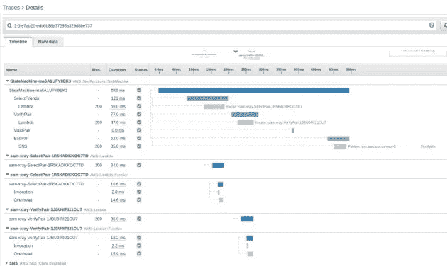

# 用 AWS X 射线调试 AWS Lambda 函数

> 原文：<https://levelup.gitconnected.com/debugging-aws-lambda-functions-with-aws-x-ray-ad4dce87a797>


作者图片

AWS X-Ray 是一种收集分布式应用程序中正在进行的工作的数据的方法，用于识别性能问题和执行错误。

当执行错误发生在模糊案例中时，X 射线可以通过提供每次执行的综合跟踪来帮助识别这些案例。这在分布式、事件驱动或无服务器应用程序中是非常宝贵的。

AWS X 射线集成了

*   亚马逊弹性计算云(亚马逊 EC2)；
*   亚马逊弹性容器服务(亚马逊 ECS)；
*   弹性负载平衡；
*   亚马逊 API 网关；
*   AWS Lambda 而且，
*   AWS 弹性豆茎。

此外，AWS X-Ray SDK 可以捕获元数据并请求

*   MySQL 和 PostgreSQL 数据库(自托管、亚马逊 RDS、亚马逊 Aurora)；
*   亚马逊 DynamoDB
*   亚马逊简单队列服务；而且，
*   亚马逊简单通知服务。

SDK 可用于 Java、Go、Node.js、Python、Ruby 和。网络语言。

当使用 AWS Lambda 时，我们唯一能看到的是当我们的 Lambda 函数运行时，在我们的 CloudWatch 日志中写了什么。然而，当我们看不到 API Gateway、Lambda 和其他函数或服务之间发生了什么时，解决函数的问题可能是一个挑战。通过用 X 射线检测 Lambda 函数及其相关服务，我们提高了用函数解决问题的能力。

本文将讨论如何使用 AWS X 射线跟踪 Lambda 函数。使用 Python 作为 Lambda 函数语言，可以在 GitHub 上获得本示例中使用的文件。

## 我们简单的 Lambda 函数

为了说明我们将如何启用 X 射线跟踪，我将使用一个无服务器应用程序模型(SAM)应用程序，它具有 HTTP API 网关、Step 函数和几个 Lambda 函数。

该模板构建了这种架构:


示例架构

到 API 网关的连接启动状态机，状态机反过来执行 Lambda 函数。这是异步执行。焦点在于实现 X 射线，尽管同样的方法也可以用于同步状态机。

> 当 API Gateway 启动异步状态机时，返回给用户的输出是状态机执行细节。对于同步状态机，我们必须等到执行完成后才能将数据返回给用户。对于长时间运行的工作流，延迟用户响应可能会导致用户怀疑请求会失败。

在我们的状态机和函数执行之后，我们必须查看 API 网关日志、状态机执行日志和每个 Lambda 函数的日志。这可能很耗时，而且容易出错。例如，在部署 SAM 模板并执行

`curl -X POST api-endpoint`

我们有一个用于 API 网关、状态机和每个 Lambda 函数的 CloudWatch 日志文件。如果状态机不执行，我们必须查看状态机日志文件，然后查看一个或多个 Lambda 函数日志。

如果应用程序成功执行，但花费的时间比预期的长，那么找出执行延迟的唯一方法就是向 Lambda 函数添加多个日志语句，然后检查每个日志文件。有更好的方法。

## 添加 X 射线

为每个应用程序组件启用 X 射线使我们能够获得每个应用程序执行的完整视图。我们可以看到每个组件的调用和处理时间，以及过程中是否有错误或执行失败。

要在我们的应用中启用 X 射线，我们必须:

*   在模板中添加对 API 网关的跟踪；
*   向模板中的步骤函数添加跟踪；
*   向模板中的每个 Lambda 函数添加跟踪；
*   调整授予 AWS X 射线访问权限的 IAM 角色；
*   将 AWS X-Ray SDK 包含到 Lambda 部署包中；而且，
*   重新部署模板。

(为了方便示例，使用了不同的模板文件。)

要在 API 网关 REST API 上启用跟踪，只需添加

```
TracingEnabled: true
```

到 SAM 模板中的 API 网关定义。

示例 GitHub 项目使用 HTTP API，它不支持 TracingEnabled 指令。因此，如果您使用 HTTP API 网关，那么与 X 射线的集成目前是不可用的。

在状态机上，启用跟踪将如下所示:

```
StateMachine:
    Type: AWS::Serverless::StateMachine
    Properties:
      Type: STANDARD
      Logging:
        Destinations:
         - CloudWatchLogsLogGroup:
             LogGroupArn: !GetAtt StateMachineLogGroup.Arn
        Level: ALL
      DefinitionUri: statemachine/asl.json
      Role: !GetAtt StateMachineExecutionRole.Arn
      Tracing:
        Enabled: true
      DefinitionSubstitutions:
        SelectPairFunctionArn: !GetAtt SelectPair.Arn
        VerifyPairFunctionArn: !GetAtt VerifyPair.Arn
        SavePairFunctionArn: !GetAtt SavePair.Arn
        NotifyPairFunctionArn: !GetAtt NotifyPair.Arn
```

在 Lambda 函数中，我们的云信息资源是

```
SelectPair:
    Type: AWS::Serverless::Function
    Properties:
      CodeUri: functions/poc-select-pair/
      Handler: app.lambda_handler
      Runtime: python3.7
      Role: !GetAtt LambdaExecutionRole.Arn
      Tracing: Active
```

AWS 有几个 AWS 管理的 IAM 政策，允许访问 X 射线。您可以为 Lambda、状态机和 API 网关角色选择其中之一，或者创建自己的角色来为服务提供最小特权。必须更新组件的 IAM 角色，以包括适当的 X 射线 IAM 策略。

有两种方法可以将 AWS X-Ray SDK 包含到 Lambda 函数部署包中。第一个是将 SDK 包含到每个 Lambda 函数中，这增加了每个部署包的大小，并导致 SDK 的多个副本被上传。第二种，也是首选的，是使用 Lambda 层，在调用每个 Lambda 函数时将 SDK 包含到其中。(有关 Lambda 层的更多信息，请参见文档

通过在模板中添加 Lambda 层，我们可以将该层添加到每个 Lambda 函数中(如果需要，可以有选择地添加)。我们甚至不需要对 Lambda 函数做任何修改，就可以让 X-Ray 提供关于其操作的细节。添加层就像在模板中定义它一样简单:

```
xray:
    Type: AWS::Serverless::LayerVersion
    Properties:
      LayerName: aws-xray-sdk
      Description: Dependencies for the blank sample app.
      ContentUri: aws_xray_sdk/.
      CompatibleRuntimes:
        - python3.7
        - python3.8
```

然后调整 Lambda 函数以包含该层。

```
SelectPair:
    Type: AWS::Serverless::Function
    Properties:
      CodeUri: functions/poc-select-pair/
      Handler: app.lambda_handler
      Runtime: python3.7
      Role: !GetAtt LambdaExecutionRole.Arn
      Tracing: Active
      Layers:
        - !Ref xray
```

请注意函数定义中的跟踪和层声明。这些命令指示 Lambda 用函数加载命名层，并启用 X 射线跟踪。

> 这里的记录了如何正确构建图层。如果您希望在许多项目中使用同一个图层，最好是单独创建它，然后简单地使用图层 ARN 将其包含在函数中。

一旦我们部署了支持 X 射线的更改，我们就可以对端点执行 curl 命令，然后在 AWS X 射线控制台中查看结果。

在 AWS X 射线控制台中，我们可以看到状态机的源图。


x 射线源图

这个视图向我们展示了成功执行的每个步骤，因为它们周围都有一个绿色的环。阻止执行的代码错误，显示为红色或黄色圆圈。如果您有许多要跟踪的执行，根据执行的执行状态，可能会有绿色、黄色和红色的混合。如果我们从状态机的角度看，我们会看到


状态机视图

我们可以看到状态机成功执行。然而，这并不意味着没有发生错误。例如，如果状态机决定采取一个 Lambda 功能状态代码为 200 的动作，并对状态代码为 500 的动作采取不同的动作，则选择将成功完成，并在状态机中显示“绿色”,除非收到不同的状态代码。

时间轴视图也很有趣。



x 射线时间线视图

在这个视图中，我们可以看到函数初始化和执行需要多长时间。因为我们已经为 X 射线跟踪配置了状态机和所有 Lambda 函数，所以显示了整个序列。

## 潜得更深

到目前为止，我们还没有对基于 Python 的 Lambda 函数进行任何修改，以便在 AWS X-Ray 中显示一些数据。这是 pos-select-pair/app.py 函数，我们将在本文的下一部分使用它。

```
import json
import random

def lambda_handler(event, context):

    friends = [
        "Pei Pacetti", "Sung Spears", 
        "Ashlee Alderson", "Aimee Acker",
        "Keneth Koehler", "Joseph Julio", 
        "Vida Vickrey", "Isaac Iannuzzi",
        "Janey Jeske", "Oralia Ostendorf"
    ]

    print("start")
    first = choose(Friends=friends, Chosen=None)
    second = choose(Friends=friends, Chosen=first)

    return {"statusCode": 200, "body": {"first": first, "second": second}}

def choose(**kwargs):
    friends = kwargs.get('Friends', None)
    chosen = kwargs.get('Chosen', None)

    # Select a random number from 0 to size of list

    random.seed()
    while True:
        number = random.randint(0, len(friends))
        print(f"number = {number}/{len(friends)} friend = {friends[number]}")

        if chosen != friends[number]:
            return friends[number]
```

没有任何进一步的努力来调整代码，我们可以开始问这样的问题“时间都花在哪里了？”、“如何才能降低开销？”、“怎么才能加快功能？”等。

有时，我们可能需要更多地了解在一个更大的函数中正在发生的事情。这是通过将 SDK 直接导入 Lambda 函数并与 xray_recorder 交互以将函数划分为段和子段来实现的，因此我们可以使用注释和元数据在跟踪中提供额外的细节。

将 X 射线与 Lambda 一起使用时，X 射线会自动为 lambda_handler 创建一个段。*段*包含关于用于执行应用程序逻辑的计算资源的信息，比如资源名称、请求细节和完成的工作。

*Subsegments* 允许我们进一步分解细节，以包含关于到其他资源(如数据库、HTTP APIs 和其他 AWS 服务)的下游连接的信息。子段提供了更细粒度的计时信息和应用程序为完成原始请求而进行的下游调用的详细信息。

在更大的函数中，我们可能有兴趣了解特定部分是如何执行的。我们对这些代码块使用子段。这使得我们的函数看起来像:

```
segment = xray_recorder.begin_subsegment('choose-1')
first = choose(Friends=friends, Chosen=None)
xray_recorder.end_segment()

segment = xray_recorder.begin_subsegment('choose-2')
second = choose(Friends=friends, Chosen=first)
xray_recorder.end_segment()
```

使用这种方法，我们可以很容易地看到特定的代码是如何在我们的函数中工作的。我们还可以检测函数，而不必实现增强/子段关系。通过在每个函数上使用@xray_recorder 装饰器，我们可以获得这些函数的单独跟踪信息。

```
import json
import random
from aws_xray_sdk.core import xray_recorder

def lambda_handler(event, context):

    friends = [
        "Pei Pacetti", "Sung Spears", 
        "Ashlee Alderson", "Aimee Acker",
        "Keneth Koehler", "Joseph Julio", 
        "Vida Vickrey", "Isaac Iannuzzi",
        "Janey Jeske", "Oralia Ostendorf"
    ]

    print("start")
    first = choose(Friends=friends, Chosen=None)
    second = choose(Friends=friends, Chosen=first)

    return {"statusCode": 200, "body": {"first": first, "second": second}}

@xray_recorder.capture("choose")
def choose(**kwargs):
    friends = kwargs.get('Friends', None)
    chosen = kwargs.get('Chosen', None)

    # Select a random number from 0 to size of list

    random.seed()
    while True:
        number = random.randint(0, len(friends))
        print(f"number = {number}/{len(friends)} friend = {friends[number]}")

        if chosen != friends[number]:
            return friends[number]
```

因为 X-Ray 自动为 Lambda 函数创建根段，所以除了导入 X-Ray SDK 之外，我们不需要做任何额外的更改。

当我们查看 X 射线控制台时，我们可以看到我们的*选择*功能已经被执行了两次，这是正确的，我们可以看到它在时间线中的什么位置被执行以及执行了多长时间。这是手动创建上述分段和子分段的替代方法，由于 X 射线和 Lambda 之间的紧密集成，Lambda 函数不经常需要手动创建分段和子分段。

AWS X-Ray SDK 文档中提供了关于这些特定功能的更多信息。

## 使用 PyTest 实现

如果您使用 PyTest 对您的函数执行单元测试，您可能会注意到测试失败:

```
$ pytest -v
====================================== test session starts =======================================
platform linux -- Python 3.7.3, pytest-6.2.1, py-1.10.0, pluggy-0.13.1 -- /usr/bin/python3
cachedir: .pytest_cache
rootdir: /home/pi/code/aws-xray-sample
plugins: apiritif-0.9.5
collected 1 item                                                                                 

tests/test_select.py::test_select FAILED                                                   [100%]

============================================ FAILURES ============================================
__________________________________________ test_select ___________________________________________

    def test_select():

>       data = app.lambda_handler({}, "")

tests/test_select.py:6: 
_ _ _ _ _ _ _ _ _ _ _ _ _ _ _ _ _ _ _ _ _ _ _ _ _ _ _ _ _ _ _ _ _ _ _ _ _ _ _ _ _ _ _ _ _ _ _ _ _ 
functions/poc_select_pair/app.py:14: in lambda_handler
    first = choose(Friends=friends, Chosen=None)
/usr/local/lib/python3.7/dist-packages/aws_xray_sdk/core/models/subsegment.py:58: in __call__
    meta_processor=None,
/usr/local/lib/python3.7/dist-packages/aws_xray_sdk/core/recorder.py:428: in record_subsegment
    subsegment = self.begin_subsegment(name, namespace)
/usr/local/lib/python3.7/dist-packages/aws_xray_sdk/core/recorder.py:292: in begin_subsegment
    segment = self.current_segment()
/usr/local/lib/python3.7/dist-packages/aws_xray_sdk/core/recorder.py:270: in current_segment
    entity = self.get_trace_entity()
/usr/local/lib/python3.7/dist-packages/aws_xray_sdk/core/recorder.py:390: in get_trace_entity
    return self.context.get_trace_entity()
/usr/local/lib/python3.7/dist-packages/aws_xray_sdk/core/context.py:99: in get_trace_entity
    return self.handle_context_missing()
_ _ _ _ _ _ _ _ _ _ _ _ _ _ _ _ _ _ _ _ _ _ _ _ _ _ _ _ _ _ _ _ _ _ _ _ _ _ _ _ _ _ _ _ _ _ _ _ _ 

self = <aws_xray_sdk.core.context.Context object at 0xb2f23250>

    def handle_context_missing(self):
        """
        Called whenever there is no trace entity to access or mutate.
        """
        if self.context_missing == 'RUNTIME_ERROR':
            log.error(MISSING_SEGMENT_MSG)
>           raise SegmentNotFoundException(MISSING_SEGMENT_MSG)
E           aws_xray_sdk.core.exceptions.exceptions.SegmentNotFoundException: cannot find the current segment/subsegment, please make sure you have a segment open

/usr/local/lib/python3.7/dist-packages/aws_xray_sdk/core/context.py:124: SegmentNotFoundException
-------------------------------------- Captured stdout call --------------------------------------
start
--------------------------------------- Captured log call ----------------------------------------
ERROR    aws_xray_sdk.core.context:context.py:123 cannot find the current segment/subsegment, please make sure you have a segment open
==================================== short test summary info =====================================
FAILED tests/test_select.py::test_select - aws_xray_sdk.core.exceptions.exceptions.SegmentNotFo...
======================================= 1 failed in 5.56s ========================================
$
```

从所有这些信息中，我们只关心一行:

```
ERROR    aws_xray_sdk.core.context:context.py:123 cannot find the current segment/subsegment, please make sure you have a segment open
```

出现这个错误是因为我们构建了在 AWS Lambda 环境中执行的代码，而 X-Ray 为处理程序创建了根段。但是，当使用 Pytest 运行代码时，没有顶级段。

我们可以通过调整我们的测试脚本来导入 X-Ray SDK 并创建顶部片段来解决这个问题。

```
from functions.poc_select_pair import app
import datetime
from aws_xray_sdk.core import xray_recorder

def test_select():

    # Start a segment
    segment = xray_recorder.begin_segment('test-select-pair')
    data = app.lambda_handler({}, "")
    # End a segment
    xray_recorder.end_segment()

    assert "statusCode" in data

    assert data["statusCode"] == 200
```

添加`segment = xray_recorder.begin_segment('test-select-pair')`行是我们成功执行测试所需要做的全部工作，或者至少是因为其他原因而失败。

## 结论

不需要太多额外的努力，我们就可以提供关于单个 Lambda 函数或一组函数的执行的额外工具，就像这里看到的那样。查看一个 Lambda 函数，如 poc-save-db/app.py，我们可以看到代码中没有任何内容专门引用 AWS X-Ray。这意味着您可以轻松地用现有的 Lambda 函数实现 X 射线，而无需修改代码。

如果要实现额外的跟踪元素，比如注释和元数据，可能需要内置逻辑来处理没有为函数启用跟踪的情况。

这里的例子有些做作，但是在查看 X 射线数据时，我们可以看到 Lambda 的大部分时间都花在了调用函数上。

> 小心不要把 Lambda 函数做得太小。

由此得出的一个结论是，如果函数太小，最好将函数合并到相关代码中，以减少执行任务的开销。在本例中，准备函数花费了 340 ms，执行时间为 2 ms。

整个状态机的总执行时间是 1 秒多一点，但是如果在一个大的状态机中有许多小函数，调用函数的时间比执行函数的时间多，那么整体性能就不会令人满意。

如果没有 AWS X-Ray 提供的洞察力，我们可能会疑惑为什么执行功能和完成工作需要这么长时间。在本例中，最好将几个较小的函数组合起来，以减少总的调用时间。这可能会使组合函数变得复杂，但有时稍微复杂一点可能会比 Lambda 函数和状态机的性能更好。

## 参考

[AWSλ](https://aws.amazon.com/lambda/)

[AWS Lambda 图层](https://docs.aws.amazon.com/lambda/latest/dg/configuration-layers.html)

[AWS 步进功能](https://aws.amazon.com/step-functions/?step-functions.sort-by=item.additionalFields.postDateTime&step-functions.sort-order=desc)

[AWS X 射线](https://aws.amazon.com/xray/)

[建立λ层](https://aws.amazon.com/blogs/compute/using-lambda-layers-to-simplify-your-development-process/)

[无服务器应用模型](https://aws.amazon.com/serverless/sam/)

## 关于作者

Chris 是一名高度熟练的信息技术、AWS 云、培训和安全专家，他在云、安全、培训和流程工程方面处于领先地位，能够简化和交付高质量的产品。他是七本书的合著者，在技术、管理和信息安全出版物上发表了 70 多篇文章和书籍章节。他丰富的技术、信息安全和培训经验使他成为帮助公司应对技术挑战的关键资源。Chris 是 AWS 社区构建者计划的成员。

## 版权

本文版权 2021，Chris Hare。