# 在 Unity 中调试脚本

> 原文：<https://levelup.gitconnected.com/debugging-code-in-unity-cf6d7d46037>

## 进入奥金人

## //超越调试。登录并进入代码编辑器

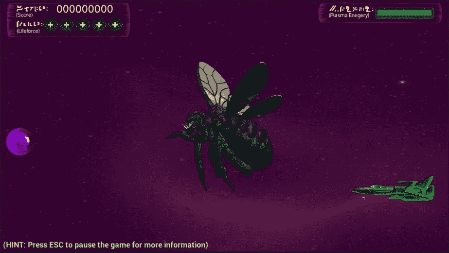

我们有一只虫子要踩扁

如果你上过任何关于如何在 Unity 中制作游戏的在线课程或看过 YouTube 视频，你会遇到使用 **Debug 的建议。Log()** 或**调试。LogError()** 以便对您正在制作的游戏进行故障排除。现在我不是在这里告诉你停止使用它们，当你意识到在哪里寻找时，它们在孤立的小问题上是有帮助的，但是你会发现自己浪费了很多时间在脚本中放入和删除它们。它们使用起来很贵，而且会造成不必要的混乱。

**还有更好的办法！**

如果您以前从未编写过代码，那么调试的概念对您来说可能是陌生的。没关系。这真的不是很难开始，这就是我们今天要做的。

## 概观

调试代码是在代码运行时遍历代码以查看是否出现预期结果的实践。当您不确定问题的确切来源时，这尤其方便。

大多数现代 ide 都允许您使用调试工具。今天的文章不是关于选择最好的 IDE。我将使用 JetBrains Rider，因为它是我的首选编辑器，可以轻松地与 Unity 集成。然而，如果你安装了合适的插件，VS 代码也可以调试 Unity 脚本。Visual Studio 也有能力执行这些相同的功能。

你可以在[Unity-Manual:调试 Unity(unity3d.com)中的 C#代码](https://docs.unity3d.com/Manual/ManagedCodeDebugging.html)上阅读更多关于设置你最喜欢的 over 的细节

## 开始—添加断点

我假设你已经安装了你选择的 IDE，并且正在使用 Unity。如前所述，我正在使用 JetBrains Rider 2021，因此从现在开始的所有步骤都将使用 JetBrains。

首先，我们需要打开想要调试的脚本，并设置一些断点。

***断点****——这是代码自动停止执行的地方，需要你一行一行的逐步执行。*

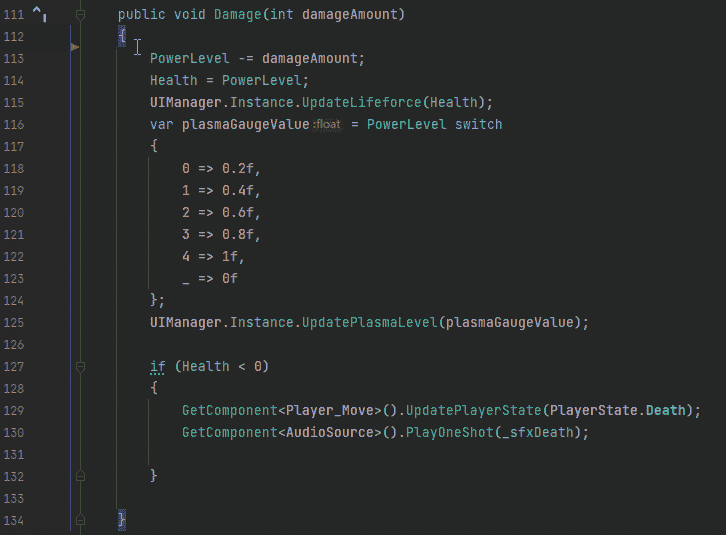

设置断点

设置断点很简单，并且在大多数代码编辑器中都是一样的。

这里有一个我想调试的方法。现在我可以添加调试。在我想查看的每个位置将 Log()消息记录到控制台，但是正如我提到的，这太慢了。因此，我将设置一个断点，以便进行调试。

断点表示为添加到窗口中的小红圈。我移动鼠标找到我想要的点，然后左键点击添加断点。

好，这就是我要停止代码执行的地方，这样我就可以调试了。

在我们继续之前，请注意我们可以在整个代码中添加多个断点。这在以后会变得很方便。

## 在调试模式下运行场景

断点在哪里？检查。让我们调试这个坏男孩，并确保事情按预期运行。

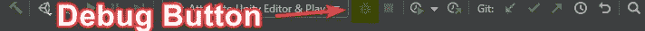

工具栏中的调试按钮

首先，我们可以按下位于右上角工具栏中的**调试**按钮。这与在 Unity 中点击播放按钮是一样的。编辑器将连接到 Unity 并告诉它运行，你的游戏将正常运行，直到它到达断点。这恰好是我的玩家的伤害方法被调用的时候，所以让我们看看实际情况。

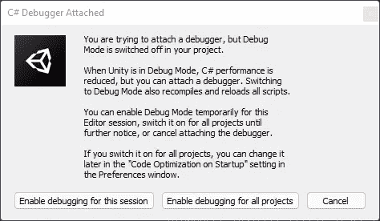

Unity 引擎询问你想做什么

如果这是你第一次使用脚本调试，那么 Unity 会提示你选择一个选项。仅针对此会话，下次重新打开 Unity 并尝试调试时会询问您，并且所有项目将始终调试而不显示此窗口。

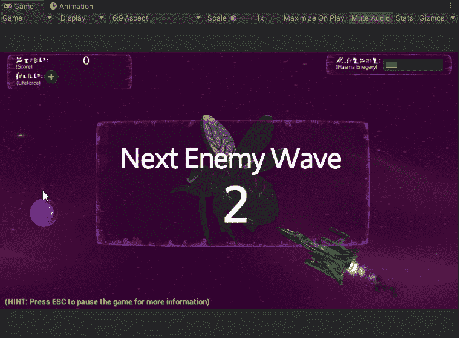

运行直到停止

游戏一直运行到玩家受到伤害。当飞船撞上玩家模型时就会发生这种情况。注意到游戏如何冻结了吗？这是我们希望发生的。现在，如果我们跳回我们选择的编辑器，我们应该注意到一些变化。

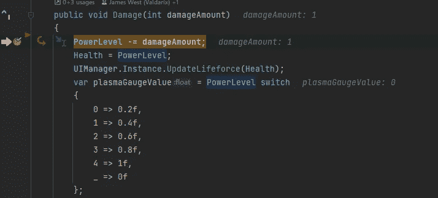

代码在断点处停止

注意到箭头了吗？选中标记的断点和突出显示的行？这意味着我们的代码目前停止在这个位置。它不能继续下去，直到我们告诉它这样做。我们在屏幕上也有一个新的窗口(还是 JetBrains Rider ),叫做 Debugger。

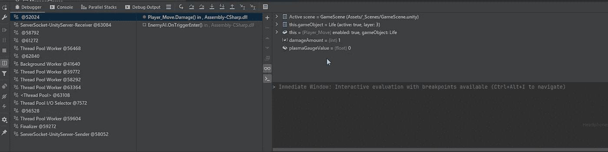

调试器

让我们从左到右分解这个屏幕，我们将最后覆盖顶部工具栏。

最左边的按钮是程序的主要控件。您可以将鼠标悬停在这些按钮上，查看每个按钮的作用，但对于我们的目的来说，唯一重要的是看起来像暂停/播放按钮的绿色按钮。这是“恢复代码”按钮，如果我们单击此按钮，代码将自动重新开始运行。

第二个面板是堆栈，上面是我们的相关代码片段。栈不在本文讨论范围之内，请注意，您可以通过它来查看许多东西的当前状态。突出显示的项目在下一个面板中为我们提供了有关它的详细信息。

第三个面板是堆栈中所选项目的详细信息。在这种情况下，恰好是我的**玩家移动。**法伤害()。注意，我还可以看到关于调用我的断点的方法的信息，即 **EnemyAI。OnTriggerEnter()** 方法。

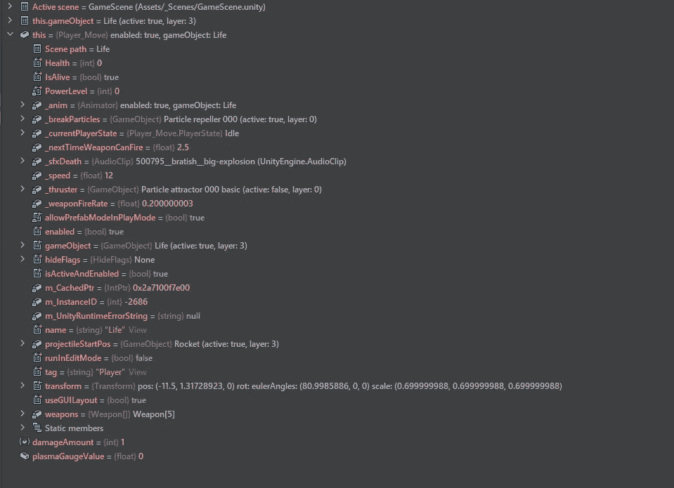

展开当前项目的信息。

最后，我可以在最后一个面板中看到关于该方法的信息。这些信息是断点时刻的数据，所以当我单步执行代码时，它可能会改变。如果我展开*这个*项，它会告诉我关于当前脚本的所有信息。这些项目中的许多也可以向下钻取。

最后，我们有顶部菜单栏。我们将更详细地讨论这一点。我们关心的部分是这一小部分:

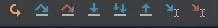

调试控件

这里也有几个按钮，出于我们的目的，我们将只看这篇文章需要的基础知识。

跳到光标处

跳转到光标处按钮正如它所说的那样，它将代码跳转到光标处。它不会执行断点和光标之间的任何代码。如果您认为是一行代码导致了问题，并想跳过它，这是很方便的。

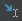

运行到光标处

同样，如果您认为光标和断点之间的代码行是问题所在，这也很方便。这将只运行允许您查看问题在执行时是否重现的代码部分。

如果你认为你知道问题在哪里，这两个很好。如果你迷路了就不会了。这就是这些的来源。

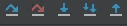

踩过去，用力踩过去，踩进去，聪明的踩进去，踩出来

**跨过**——弯曲的蓝色箭头，移动到方法中的下一行代码。连续单击此按钮或按下键盘快捷键将一行一行地通过代码。如果你有一个非常简单的代码块，不会跳转到其他任何地方，这很有帮助。这将跳过其他脚本中的其他方法，因此得名。

**进入** —直接向下的单箭头，可以跳转到其他脚本。使用它会让您进入另一个脚本来调试该脚本。使用时要小心，因为如果你什么都不做，你会很快发现自己在引擎代码或网络代码中。只有在需要跳转到其他代码进行调试时才使用它。

**步出** —直上箭头。当你在你不想进入的其他代码中，或者在你已经调试了你需要在那个方法中调试的代码部分之后，这是很方便的。“单步执行”会将您带回到最初的起始位置，因此您不必单步执行额外的代码。

其他两个按钮有他们的用途，但我们现在不担心这些。

## 在活动

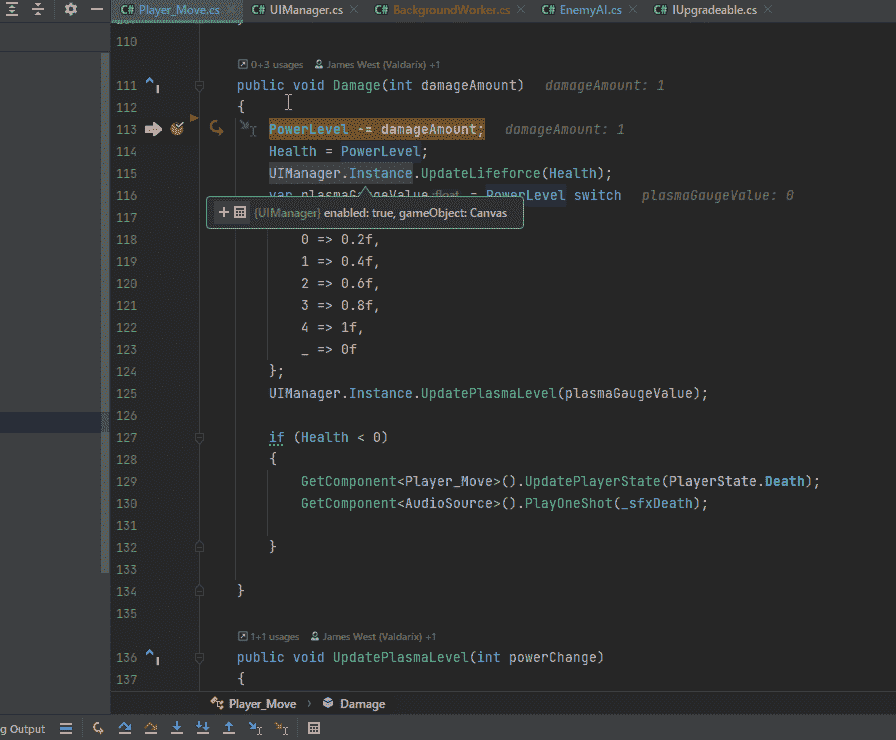

在行动中超越

首先，我们单步执行一些代码，然后使用鼠标来查看是否发生了预期的变化。生命值确实被设定为力量等级的值。

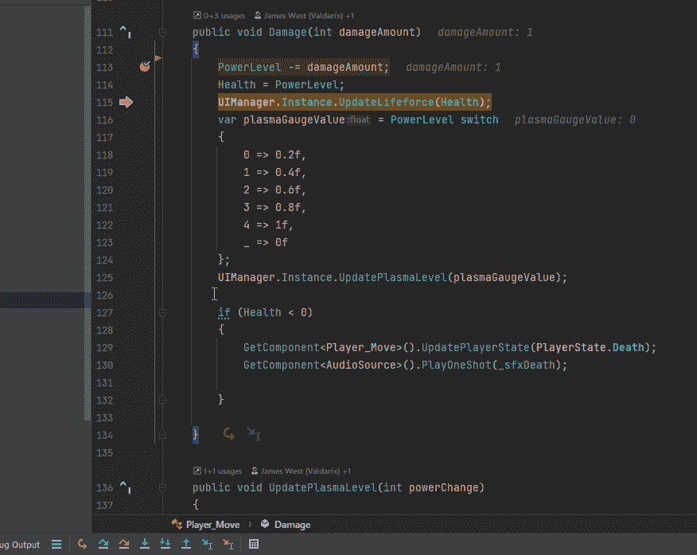

运行到光标处

在这里，我使用内联控件中的 Run to Cursor 来跳过 switch 语句。然后检查之后的值。我的异能水平是-1 所以 0 确实是我想要的结果。

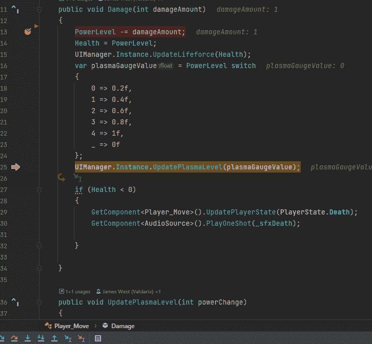

走进走出

最后，我使用 Step Into 跳转到 UpdatePlayerState()方法，意识到这不是一个问题，并退出以返回到我的代码。

现在，这个代码不是最好的代码。但是我也没有在里面追踪什么特别的 bug。这只是向您展示控件的演示。

## 结论

使用您最喜欢的 IDE 中的调试工具可以让您比 Debug.Log 更快地定位错误。我在 JetBrains Rider 中使用的所有控件都可以在 Visual Studio 和 VS 代码中使用。使用这些控件以及鼠标悬停信息和堆栈中的详细信息是快速修复问题的有效方法。你调试得越多，你就能更好地修复和预防它们。

作为一名 Unity 游戏开发者，希望这能给你的工具箱增加更多的东西。