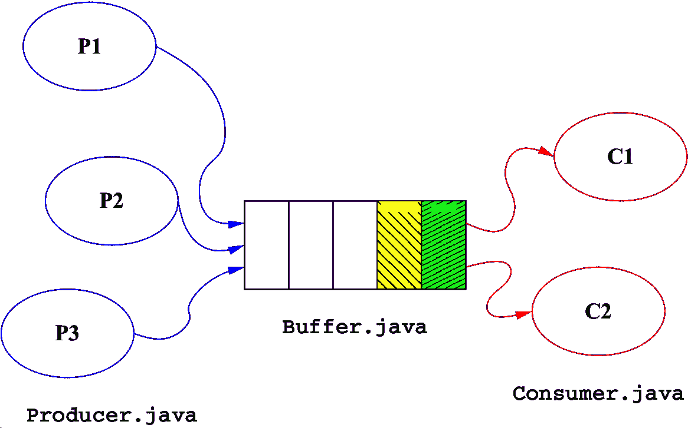
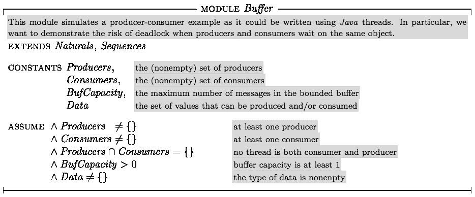
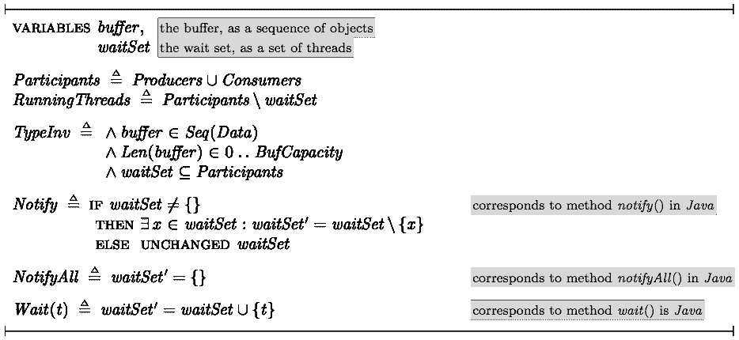
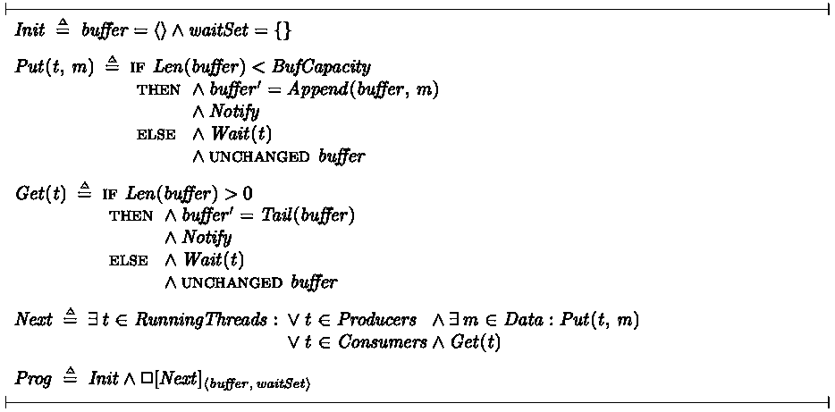
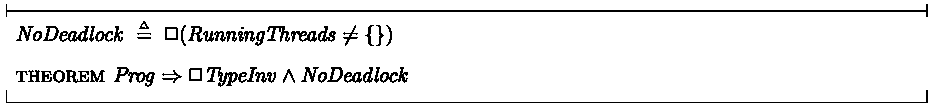

# 用模型检查器调试并发系统

> 原文：<https://levelup.gitconnected.com/debugging-concurrent-systems-with-a-model-checker-c7eee210d86f>

当测试不够时，使用正式的方法！



*生产者和消费者共享一个有限的缓冲区*

# 多线程程序(Java 语言)

编写并发程序很难。在很大程度上，这种困难源于缺乏良好的测试和调试策略。当我们写顺序程序时，我们也会犯错误，但是我们有更好的能力去检测和纠正它们。

使处理并发系统更加困难的是它们固有的不确定性:相同的程序，相同的输入，在不同的运行中会有不同的表现。这导致了极少发生的错误，并且不容易重现。这样的 bug 可能是真正的噩梦。你的系统有问题，你知道它，你已经看到它，但是直到你能让它再次发生，你不知道如何处理这个问题。

为了说明这个困难，考虑生产者和消费者系统中共享缓冲区的经典例子。这样的缓冲区保存由生产线程创建的数据，直到它们被消费线程检索。更重要的是，缓冲区充当同步器，在线程无事可做时阻塞和挂起线程。当缓冲区为空时，任何消耗线程都需要被阻塞，直到缓冲区中有数据为止。相反，如果缓冲区容量有限，当缓冲区满了时，生产线程必须挂起。

一个不幸的程序员没有使用`java.util.concurrent`中的缓冲实现，而是写了下面的`Buffer`类:

缓冲区被实现为循环列表。方法`get`使用`wait`挂起调用线程，直到缓冲区不为空。然后线程从缓冲区中移除一个对象，并对`notify`进行一次调用来(潜在地)解锁一个生产线程。方法`put`是对称的。这两个方法都是`synchronized`，以便它们的执行对所有线程来说都是原子的。特别是，当缓冲区被另一个线程修改时，一个线程看不到中间状态。(这也是为什么对`notify`的调用可以在缓冲区被实际修改之前发生。)

这里使用的挂起 Java 线程的基本机制是方法`Object.wait`，它无条件地挂起一个线程。每个调用`x.wait()`的线程都被挂起并放入对象`x`的*等待集*(每个 Java 对象都有一个等待集)。对`x.notify()`的调用选择`x`的等待集中的线程，如果有的话，以恢复执行。对`x.notifyAll()`的调用允许`x`的等待集中的所有线程恢复执行。如果等待集为空，对`notify`或`notifyAll`的调用无效。(这是对这些方法过于简化的描述；详见 [Java 语言规范](https://docs.oracle.com/javase/specs/jls/se17/html/jls-17.html#jls-17.2)。)

该缓冲区实现中使用的策略是使用缓冲区对象的等待集(即在`this`上调用`wait()`，并允许一个被阻塞的线程在每次缓冲区修改后恢复执行。这个想法是，在将一个对象放入*缓冲区后(或移除一个对象后)，没有理由通知*多个*线程。*

# 一只虫子！

有一天，`Buffer`类的作者接到一个客户的电话，通知他他写的系统完全冻结了，什么也没有发生，一切都停滞了，数百万的钱正在流失，这是不可接受的。

在用程序员解决每个问题的方式解决了眼前的问题(也就是说，拔掉插头，重新启动整个该死的东西)之后，在为给他的客户造成的任何不便深表歉意之后，我们的开发人员决定，如果他能保证这种情况在将来不会再次发生，他的工作会更安全。因此，他开始了一项调试任务。

我们的伙伴有点过时(他使用打印语句进行调试)，但并不完全愚蠢。他猜测(正确地)他的缓冲区实现会导致线程死锁(T21)。因此，他决定编写缓冲区的注释版本，以便研究死锁后的执行跟踪:

然后，他编写了一个程序来创建生产和消费线程，试图重现几乎毁掉他最重要的客户的死锁。他使用`Thread.sleep`来模拟真实系统的处理任务(在将对象添加到缓冲区之前创建对象所花费的时间，以及在将对象从缓冲区中移除之后处理对象所花费的时间)，它将一个线程挂起一段指定的时间(就好像该线程正忙于正在模拟的工作一样):

使用`Thread.sleep`有两大好处。首先，挂起的线程不使用 CPU 资源，所以客户的大型系统可以在一台便宜的笔记本电脑上模拟——这是我们的错误代码作者所能负担的。第二，`sleep`方法可以输入随机值来模拟一大类短、中和长的处理任务。这是必要的，因为系统是不确定的，只有*一些*计时值可以产生期望的死锁。因此，使用尽可能多的不同值的组合是必要的，对于这些组合，伪随机数是合适的(虽然不是很好，但那是改天讨论的内容)。

最后一步，我们的程序员编写一个主程序来监控生产者-消费者应用程序。这个程序每分钟都会检查缓冲区等待集的大小。如果等于线程总数，则意味着*所有的*线程都在等待，没有线程运行来通知它们，这是客户观察到的死锁情况:

# 靠运气

剩下的工作就是运行程序直到死锁发生，然后分析产生的跟踪以了解哪里出错了。抛开分析跟踪的问题(这可能很棘手，因为来自不同线程的打印语句往往以令人困惑的方式交织在一起)和理解后解决实际问题的问题，第一个挑战是获得合适的跟踪，也就是说，让死锁再次发生。

在他的第一次尝试中，我们勇敢的程序员如下开始他的程序:

```
java AnnotatedBuffer 10 5 5 50 50
```

这创建了一个容量为 10 的缓冲区，5 个生产者，5 个消费者，并模拟生产和消费任务，随机计时在 0 到 50 毫秒之间。

几个小时后——因为他的廉价笔记本电脑中的风扇开始产生难闻的烟雾——他放弃了，决定尝试不同的参数组合。经过多次尝试后，参数组合最终在不到两个小时的时间内产生了一个死锁，并带有一个跟踪:

```
java AnnotatedBuffer 5 10 3 10 3
20:53:45.695: DEADLOCK after 13963562 messages and 6477.4 seconds!
```

然而，跟踪是很难的，部分是因为在线程被通知的时刻和它打印*“我被通知了”*的时刻之间有延迟(和额外的消息)，而且还因为有 13 个线程要跟踪。

正如爱因斯坦所说，由于 CPU 周期比灰质便宜，我们的程序员决定继续寻找一个包含更少线程的死锁。他最终得到了一个，碰巧是这个系统最小的非平凡死锁情况:

```
java AnnotatedBuffer 2 3 2 3 2
01:35:39.047: DEADLOCK after 3970423422 messages and 1576335.9 seconds!
```

请注意，这几乎是 40 亿条消息，并且连续超过 18 天！(本页使用的输出是真实的。它来自于在 8 核机器上的实际运行，而不是我们不幸的程序员的笔记本电脑)。

跟踪分析揭示了缓冲区实现中的缺陷:所有线程(生产者和消费者)都在*相同的*等待集中等待。当方法`get`调用`notify`时，目的是通知*生产者*缓冲区中有一个可用的槽。但是这个调用有时会通知一个*消费者*，如果这种情况发生几次，就会导致死锁。

# 应用正式方法

在对他的代码进行快速修复之后——用`notifyAll`替换`notify`,从而以低效为代价带回了正确性——我们如释重负的程序员认为他可以开始放松了。但是他不能。一个问题一直困扰着他:如果这发生在一个更复杂的系统上呢？如果他下次没这么幸运呢？如果下一个 bug 一个月才出现一次呢？一年一次？如果在部署的代码中产生 bug 的特定时间不能在他的测试设置中重现，该怎么办？

因此，我们的程序员决定报名参加[正式方法课程](https://catalog.unh.edu/search/?search=cs+745)，在那里他接触到了跟踪并发软件中棘手 bug 的替代技术。他学习了 TLA+，动作的 [*时序逻辑*](http://research.microsoft.com/en-us/um/people/lamport/tla/tla.html) ，以及 TLA+的模型检查器 TLC。他意识到像这样的符号和工具会对他的工作有所帮助，并开始在他的有界缓冲区问题上练习使用它们。

有界缓冲器的中心算法可以被建模为 TLA+模块:

```
EXTENDS Naturals, Sequences

CONSTANTS Producers,
          Consumers,
          BufCapacity,
          Data

ASSUME /\ Producers # {}
       /\ Consumers # {}
       /\ Producers \intersect Consumers = {}
       /\ BufCapacity > 0
       /\ Data # {}
...
```

TLA+是一种基于集合论的数学符号，大量使用数学符号(很少使用“关键词”)。由于这个原因，它漂亮的打印形式比原始的 ASCII 源代码更具可读性。因此，我们将以漂亮的印刷形式继续描述`Buffer`模块:



TLA+模块以几个常量开始，这些常量充当参数:一组生产线程、一组消费线程、一个缓冲区容量和一个数据类型(把*数据*想象成 java 类中的类型参数`E`)。为了使模块有意义，我们需要假设线程集是不相交的且非空的，缓冲区容量至少为 1，并且至少有一条数据可以通过缓冲区发送。



然后，该模块为缓冲区(作为一系列数据元素)及其等待集(作为一组线程)引入变量。 *RunningThreads* 定义为所有线程(*参与者*)与当前等待集合中的线程之间的集合差。因此，它是当前正在运行的一组线程。

接下来，该模块定义了三个“宏”(*操作符*，在 TLA+)来对 Java 方法`wait`、`notify`和`notifyAll`进行建模。这些定义可能看起来很奇怪(有点吓人)，但是你会习惯的。然而，为了理解它们，我们需要深入一点 TLA+语义。

基本上，TLA+模块定义了一个*状态转换系统*。一个状态(变量名到值的映射)*通过代表系统行为的动作转移*到一个新的状态。动作在逻辑上被定义为动作前状态下的值和动作后状态下的值之间的关系。例如，Java 赋值语句`x = 3*x + 1;`对应于关系`x' = 3*x + 1`。请注意，这是一个布尔公式，`=`是古老的数学等式，*不是*赋值。因此，`x’ ≥ x`或`(x' - x) % 7 = 1`是可能的 TLA 动作，尽管它们在 Java 这样的编程语言中没有对等词。特别是，人们可以编写*不确定的*动作(就像上面的最后两个动作，给定`x`，有几个可能的`x'`值)，这在建模并发系统时非常有用。

考虑到这一点，现在有可能破译`wait`(无条件地将线程`t`添加到等待集)；`notifyAll`(从变为空的等待集中移除每个线程)和`notify`(如果等待集不为空，移除一个线程，否则不做任何事情)的 TLA+公式。`notify`的情况是最有趣的，因为它的建模是非确定性的:*某个*线程被从等待集中移除，但是我们没有指定是哪一个(Java 语言规范也没有指定)。



使用这些类似 Java 的操作符，模块继续形式化`put`和`get`方法。TLA+公式模仿 Java 代码，很直接:`Put(t, m)`:如果缓冲区未满，在末尾加`m`并通知；否则，线程`t`等待，缓冲区保持不变。因为 Java 方法是*同步的*，所以它可以被建模为单个 TLA+转换。

最后，该模块指定可接受的初始状态(在本例中，只有一种可能的初始状态:所有线程都在运行，缓冲区为空)以及系统所有可能的转换。`Next`的定义如下:为了使系统转换到下一个状态，*当前正在运行的某个*线程`t`执行一个操作；要么`t`是生产者，它试图将*的某个*数据块`m`放入缓冲区；或者`t`是一个消费者，它试图从缓冲区中检索一些数据。

确定性系统对于给定的输入只有一种可能的行为。不确定性系统可以有很多，这就是为什么它们很难测试和调试的原因。这里研究的死锁发生在*这些行为中的一些*中，但不是全部(正如我们之前看到的，有*许多*行为没有发生死锁)。TLA+模型的不确定性有三个来源:调用`notify`时哪个线程被唤醒；哪个线程获得了缓冲区的锁，并可以尝试一个`put`或`get`操作；以及当线程是生产者时，将哪段数据放入缓冲区。请注意，所有这些不确定性是如何使用逻辑析取或存在量词(基本上是一回事)引入的。还要注意，不确定性的第三个来源在 Java 程序中可能不存在(生产者倾向于生产特定的元素)，而且无论如何也是不相关的。不确定性的另外两个来源是那些使系统分析复杂化并导致潜在死锁的来源。(实际上，进一步的研究将表明，即使`notify`成为 FIFO，死锁仍然是可能的，所以它实际上是不确定性的第二个来源，线程的调度和锁的争用，这是我们所有麻烦的原因。)



TLA+模块以系统的期望属性的形式化结束，即它是无死锁的。`NoDeadlock`公式表示总有至少一个线程在运行(◻时间操作符使其适用于*系统的所有*状态)，该定理表示系统是类型正确的并且满足`NoDeadlock`属性。

# 薄层色谱模型检查器

TLA+模块可用于多种用途。它可以作为随机模拟的基础，类似于用`AnnotatedBuffer` Java 程序所做的。更重要的是，人们可以正式地*证明*模块的正确性，即模型满足期望的属性。TLA+有证明规则——基于经典概念，如*归纳不变量*和*良好基础集合——这些规则*可用于正式推导模块结尾陈述的逻辑含义。

作为证明的替代， [*模型检测*](http://cacm.acm.org/magazines/2008/7/5378-qa-talking-model-checking-technology/fulltext) 是一种在工业上应用相当成功的方法。它比随机模拟强大得多，也比形式证明容易实现得多。模型检查的工作原理基本上是枚举系统所有可能的行为，并检查它们是否都具有所需的属性。

[TLC](http://research.microsoft.com/en-us/um/people/lamport/tla/toolbox.html) 是 TLA+的*型号检查器*。虽然它非常有用，但从概念上讲，TLC 是一个相当笨的工具。当面对几种可能性时(如在非确定性系统的行为中)，它拒绝选择。不像 Buridan 的屁股(更像非确定性图灵机)，TLC 不会卡在可能性之间；它探索了所有这些。更具体地说，TLC 试图以广度优先的方式计算系统的所有可达状态。这与我们的程序员之前所做的测试形成对比，之前的测试只尝试了*一些*随机选择的路径。

由此可见，该工具的优势和局限性显而易见。一方面，它不是靠运气找到 bug 的；另一方面，即使是小的非确定性系统也可能有太多的状态需要进行模型检查。这个问题——状态数量的指数增长——多年来一直是模型检验社区的研究人员最讨厌的问题。

尽管如此，模型检查仍然是一项非常有用的技术，这可以通过将其应用于我们的有界缓冲区问题来证明。要启动 TLC，需要通过给所有常量赋值来实例化一个模块。对于缓冲区示例，TLC 配置文件可能如下所示:

```
SPECIFICATION Prog
CONSTANTS     Producers = {p1,p2,p3,p4,p5}
              Consumers = {c1,c2,c3,c4,c5}
              BufCapacity = 10
              Data = {m1}
INVARIANT     TypeInv
PROPERTY      NoDeadlock
```

(因为放入缓冲区的内容是不相关的，所以使用非常小的`Data`集合大大减少了要探索的状态的数量。)

给定这种配置，TLC 产生以下输出:

```
Computing initial states...
Finished computing initial states: 1 distinct state generated.
Model checking completed. **No error has been found**.
  Estimates of the probability that TLC did not check all reachable states because two distinct states had the same fingerprint:
  calculated (optimistic):  val = 3.9E-14
  based on the actual fingerprints:  val = 1.3E-15
3461 states generated, 223 distinct states found, 0 states left on queue.
The depth of the complete state graph search is 20.
```

换句话说，如果缓冲区的容量为 10，并且在 5 个生产者和 5 个消费者之间共享，则系统是无死锁的。这是我们的程序员在他的笔记本电脑开始冒烟时放弃的配置。他放弃是正确的:这个体系永远不会陷入僵局。

但是，如果 TLC 在具有 3 个生产者、2 个消费者和容量为 2 的缓冲器的配置上启动，它会产生以下输出:

```
Computing initial states...
Finished computing initial states: 1 distinct state generated.
Error: Invariant NoDeadlock is violated.
```

就其本身而言，这并不是很有用。这很像客户打来的投诉电话，说什么都挂了。关于 TLC 最好的事情是接下来发生的事情，*导致死锁状态的系统的明确跟踪:*

```
Error: The behavior up to this point is:
State 1: <Initial predicate>
/\ buffer = <<>>
/\ waitSet = {}

State 2: <Action line 52, col 9 to line 53, col 62 of module Buffer>
/\ buffer = <<m1>>
/\ waitSet = {}

State 3: <Action line 52, col 9 to line 53, col 62 of module Buffer>
/\ buffer = <<m1, m1>>
/\ waitSet = {}

State 4: <Action line 52, col 9 to line 53, col 62 of module Buffer>
/\ buffer = <<m1, m1>>
/\ waitSet = {p1}<...>State 24: <Action line 52, col 9 to line 53, col 62 of module Buffer>
/\ buffer = <<m1, m1>>
/\ waitSet = {p1, p2, p3, c1, c2}

385 states generated, 86 distinct states found, 2 states left on queue.
The depth of the complete state graph search is 24.
```

达到死锁需要 23 次转换。因为 TLC 以广度优先的方式工作，所以没有导致死锁的更短的行为。对于 Java 程序来说，这 23 个动作实际上以正确的顺序发生，需要运气(测试时的*好运气*，部署后的*坏运气*)。因此，故意让它发生是困难的。

其中有几个转变值得注意，比如这个:

```
State 10: <Action line 52, col 9 to line 53, col 62 of module Buffer>
/\ buffer = <<>>
/\ waitSet = {p3, c1, c2}

State 11: <Action line 52, col 9 to line 53, col 62 of module Buffer>
/\ buffer = <<m1>>
/\ waitSet = {c1, c2}
```

某个生产者(`p1`或`p2`，因为`p3`被挂起)成功地将`m1`放入缓冲区并调用`notify`。但是，*生产者* `p3`被通知并从等待集合中移除，而不是消费者。如前所述，这个缓冲区实现的问题是生产者和消费者等待同一个集合。同理，从状态 19 到状态 20 的转换有`p1`调用`notify`，通知`p2`；从状态 20 到 21，另一个`put`操作通知`p1:`

```
State 21: <Action line 52, col 9 to line 53, col 62 of module Buffer>
/\ buffer = <<m1, m1>>
/\ waitSet = {c1, c2}
```

此时，缓冲区已满，没有用户线程正在运行。情况无望，最终导致状态 24:

```
State 24: <Action line 52, col 9 to line 53, col 62 of module Buffer>
/\ buffer = <<m1, m1>>
/\ waitSet = {p1, p2, p3, c1, c2}
```

所有五个线程都在等待集合中:死锁！(完整的轨迹可在[这里](https://gist.github.com/charpov/45cf6010f188764dbd864332131c2e43)获得。)

# 模型检查的局限性

当然，如果事情总是像这样很好地工作，模型检查将会在小学被教授。作为一种技术，模型检查有一个严重的缺点，称为*状态爆炸*。(从技术上来说，*状态空间爆炸*是一个更好的术语。爆发的不是国家。事实上，没有什么真正的*爆炸*和模型检查是一个非常安全的活动。)由于原子动作的所有可能的交错，如果一些状态变量是无界的，则系统可达到的状态的数量可以迅速变得巨大，或者甚至是无限的。事实上，大多数与模型检查相关的研究都集中在状态爆炸问题上，不管是哪种方式(符号模型检查、抽象等等)。

作为说明，再次考虑容量为 10 但有 21 个线程(11 个生产者和 10 个消费者)的缓冲区示例。这个系统可能会死锁。最短的轨迹是 431 步，TLC 必须生成 2，219，959，047 个状态(其中 23，011，357 个是不同的)才能找到它。随机计时的 Java 程序会发生多长时间？

这里描述的缓冲区示例恰好在线程数量最多是缓冲区容量的两倍时是无死锁的。但这不是通过模型检查就能显示出来的。如前所述，在 TLA 模型上进行数学证明是可能的，但这并不像运行模型检查器那么容易。然而，证明(可能结合一些模型检查)仍然是处理无限(或大型)状态空间的唯一方法。

这里的教训是，一个正式的模型可以用于许多目的，简单的模型检查可以是发现由不确定性导致的错误的一种方式，对于这种情况，测试可能非常棘手(并且需要耐心、计算资源，以及更成问题的运气)。

TLA+/TLC 已经被用于在比我们简单的缓冲区复杂得多的系统中发现错误。例如，亚马逊的工程师已经用它来寻找他们的 aws 分布式系统中的缺陷(例如，参见 [*亚马逊网络服务如何使用正式方法*](https://dl.acm.org/doi/10.1145/2699417) )。

存在其他正式的符号，但是 TLA+被证明是最有用的符号之一，尽管它的语法过于数学化，一开始可能会令人生畏。如果需要，可以通过使用 [PlusCal](http://lamport.azurewebsites.net/tla/high-level-view.html#pluscal?unhideBut=hide-pluscal&unhideDiv=pluscal) (一种从伪代码中生成 TLA+的工具)，或者其他模型检查器，如 [Spin](http://spinroot.com/spin/whatispin.html) (它依赖于一种类似 C 语言的模式系统)来避免一些数学运算。