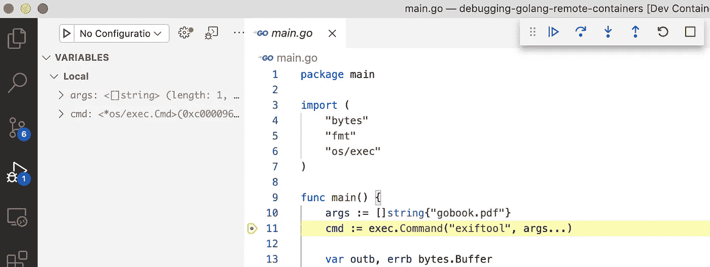
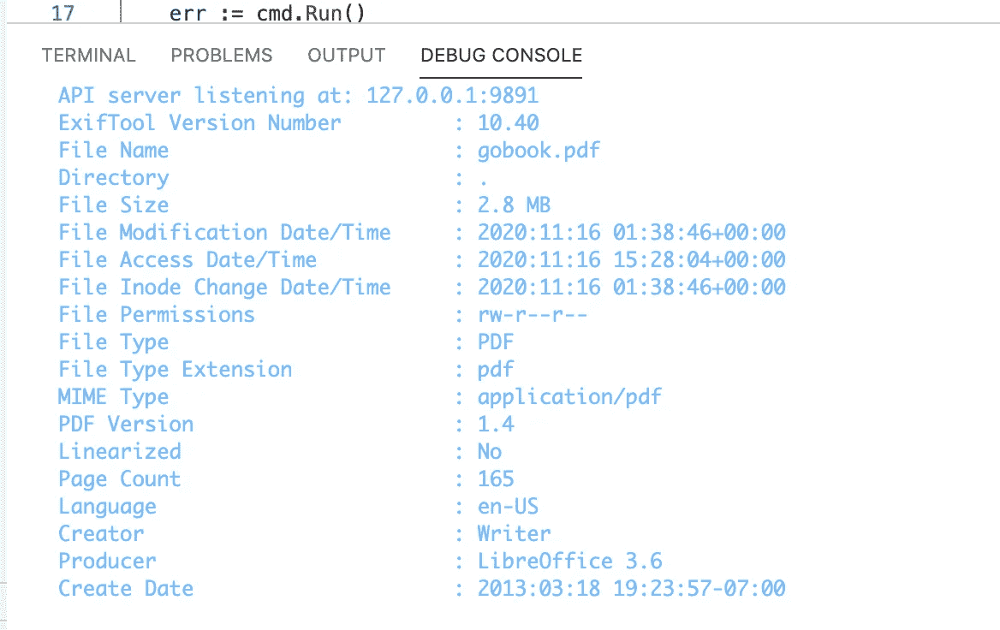

# 调试在 Docker 内部进行，使用 Visual Studio 代码和远程容器

> 原文：<https://levelup.gitconnected.com/debugging-go-inside-docker-using-visual-studio-code-and-remote-containers-5c3724fe87b9>


在我的职业生涯中或从事个人项目时，我曾多次需要一些开源可执行文件来帮助我完成任务。我用过像 [Weasyprint](https://weasyprint.org/start/) 、 [WKHTMLTOPDF](https://wkhtmltopdf.org/) 、 [Exiftool](https://exiftool.org/) 、 [Ghostscript](https://www.ghostscript.com/) 这样的东西，不胜枚举(这些只是最近的一些)。这些都是很棒的工具，我相信还有成百上千种。它们提供了惊人的功能，节省了我无数的工作时间，我要么不用写，要么就是不知道如果必须写的话该从哪里开始写！我感谢这些工具以及更多免费和开源的工具。

但是，我不想将它们安装在我的本地计算机上。我 100%反对在我的个人电脑上安装项目所需的额外软件，而不是为了在日常生活中帮助我。如果你碰巧为一家锁定他们机器的公司工作，在本地安装这个软件可能是不可能的。谢天谢地，我们有 Docker 和它所有的荣耀来帮助我们。利用 Docker，我可以很容易地安装所有这些软件，并使用它没有放弃。即使我的机器被锁定了，Docker 也可以来帮忙。

我在这些场景中多次使用 Docker，感觉非常棒。但是这种情况下的调试体验并不大。由于我没有在本地安装这个软件，为了真正了解我的代码是否正常工作，我需要在 Docker 容器中运行它。这并不可怕，但它往往会导致大量日志语句和不必要的额外时间消耗。幸运的是，微软对 Visual Studio 代码有一个惊人的扩展，叫做[远程容器](https://code.visualstudio.com/docs/remote/containers)。从他们的页面:

> Visual Studio Code Remote-Containers 扩展允许您使用一个 [Docker 容器](https://docker.com/)作为全功能开发环境。它允许您打开容器内(或装入容器中)的任何文件夹，并利用 Visual Studio 代码的完整功能集。项目中的 [devcontainer.json 文件](https://code.visualstudio.com/docs/remote/containers#_create-a-devcontainerjson-file)告诉 VS 代码如何使用定义良好的工具和运行时堆栈来访问(或创建)开发容器。该容器可用于运行应用程序或沙盒工具、库或运行时，这些都是使用代码库所需的。

在这篇文章中，我们将编写一个非常简单的 Go 应用程序，它将利用 Exiftool 从 PDF 中提取并显示元数据。使用远程容器扩展，我们将只在 Docker 容器中安装 Exiftool，并在容器中调试应用程序。我们走吧！

# 设置

这个应用程序非常简单，它所做的就是对存储在容器中的 PDF 运行 Exiftool。这篇文章的目标是探索使用远程容器扩展，所以不需要太复杂的东西。这是我们的代码:

```
package mainimport ( "bytes" "fmt" "os/exec") func main() { args := []string{"gobook.pdf"} cmd := exec.Command("exiftool", args...) var outb, errb bytes.Buffer cmd.Stdout = &outb cmd.Stderr = &errb err := cmd.Run() if err != nil { fmt.Println(&errb) } fmt.Println(&outb)}
```

让我们快速分解一下。如前所述，这段代码没有做太多事情。首先，我们创建一个参数的字符串数组，它保存我们想要处理的 PDF 文件的名称。接下来，我们创建一个命令，告诉它使用前面的参数运行 Exiftool。我们创建一些变量来保存命令函数的输出，运行命令，并打印出结果。这样做的结果只是将文件的元数据打印到屏幕上。

如果我们现在运行这段代码，这个命令肯定会失败，因为 Exiftool 没有安装在本地。因为这篇文章是关于不在本地安装的，所以让我们来看看支持这个应用程序的 docker 文件。

```
FROM golang:1.14.12-stretchRUN apt-get update && \ apt-get install -y exiftoolCOPY main.go gobook.pdf ./ENTRYPOINT ["go", "run", "main.go"]
```

与应用程序非常相似，这个 docker 文件非常简单明了。首先，我们基于官方 Golang Stretch 映像创建映像，然后更新“apt-get”并安装 Exiftool。接下来，我们复制“main.go”文件和我们想要处理的 PDF。最后，我们设置入口点运行“main.go”文件，简单！

> **注意**:我正在使用的 PDF 是 Caleb Doxsey 的《Go 编程入门》。你可以在这里阅读和下载 PDF:[http://www.golang-book.com/books/intro](http://www.golang-book.com/books/intro)

# 安装远程容器扩展

就像 Visual Studio 代码中的任何其他扩展一样，只需在 IDE 中单击扩展图标，然后搜索“remote”。它应该在列表的顶部。


在这个图像中，我已经安装了扩展，如果您没有，请单击“安装”按钮进行安装。一旦安装了扩展，我们会在 IDE 的左下角看到一个新按钮。


在这张截图中，我的鼠标图标消失了，但我将鼠标悬停在现在出现的绿色按钮上，它显示“打开一个远程窗口”。这实际上只是命令面板的一个方便快捷的方式。单击按钮，您将看到面板打开，已经为远程容器进行了过滤。


这里有很多选项，我们不会一一介绍。你可以在这里了解更多关于这些选项的信息:[https://code.visualstudio.com/docs/remote/containers](https://code.visualstudio.com/docs/remote/containers)

我们将关注第一个选项“在容器中重新打开”。这个命令基本上是说，重新打开我当前在一个容器中打开的这个项目。我可以用“打开容器中的文件夹”做同样的事情，这将要求我打开一个特定的文件夹，但我已经在这里了，所以让我们跳过一步。点击“在容器中重新打开”会给我们带来一些问题。


同样，我们不会涵盖这两个选项。在这篇文章中，我们将关注“来自‘Dockerfile’”选项，因为我们已经为这个项目构建了一个 docker file。你可以在这里了解更多这些选项:【https://code.visualstudio.com/docs/remote/containers

单击此选项将重新启动 Visual Studio 代码，您将看到创建了一个新的 JSON 文件。这基本上是在容器中运行和调试代码的启动配置。


查看“devcontainer.json”文件，有相当多的选项可供您选择。


有很多非常酷的功能，比如能够定义只适用于容器的 Visual Studio 代码扩展，以及能够在容器创建后运行命令。如果运行 API，还可以定义端口转发。这些都是非常酷的东西，远远超过了我们在一篇文章中所能涉及的范围。

您还应该注意到，当 Visual Studio 代码重新启动时，我们不仅获得了一个新的 JSON 文件，而且我们的 Dev 容器也启动了，并且在该运行容器中打开了一个终端会话！


我们可以通过简单地运行“ls”命令来验证我们是否在容器中！


这看起来很棒，但是你应该注意到一些奇怪的事情。我让 Visual Studio 代码使用我现有的 Dockerfile，它不会将文件夹中的所有内容都复制到容器中。我们可以通过从 Dockerfile 文件构建映像、运行容器并检查其内容来验证这一点。


这就是我所期望的，仅仅是我复制的两个文件，加上任何来自 Golang 的图片。显然，远程容器做的有点不同，这是为了支持调试。

# 调试您的代码

现在我们已经安装了扩展，有了新的 JSON 配置文件，并且有了一个正在运行的 Dev 容器。让我们调试代码吧！首先，我们需要设置一个断点，这很简单。对于这个例子，我们将在设置完参数后立即中断，并确保它们设置正确。


接下来，我们打开“运行”面板，单击“运行和调试”按钮。您可能会被提示选择一个“环境”，在我们的例子中是“Go”。


我们应该像预期的那样命中断点，并且可以检查我们的代码。



从这里，我们可以像往常一样单步调试代码。这一切都发生在运行的 Dev 容器中！我们可以通过单击“Debug Console”选项卡查看代码输出来验证这一点。



这显然是可行的，因为我没有在本地安装 Exiftool！多牛逼啊！

# 包扎

在这篇文章中，我们仅仅触及了 Docker 容器中调试代码的皮毛。但是即使这个非常简单的例子也展示了远程容器扩展的强大功能。这为我在当地的发展提供了很多选择。这个用例特别强大，但它也让我们更接近于在一个代码最终会运行的环境中进行开发。在最终进入生产环境的容器中进行调试，可以让您在管道运行之前就发现问题。这是一件令人惊奇的事情！

更多关于远程容器的阅读和深入研究，请查看以下链接:
-在容器内开发:[【https://code.visualstudio.com/docs/remote/containers】](https://code.visualstudio.com/docs/remote/containers)
-远程-容器 Visual Studio 市场:【https://marketplace.visualstudio.com/items?】T4itemName = ms-vs Code-remote . remote-containers
-高级容器配置:[https://Code . visual studio . com/docs/remote/containers-Advanced](https://code.visualstudio.com/docs/remote/containers-advanced)
-GitHub 代码:[https://GitHub . com/atkinsonbg/debugging-golang-remote-containers](https://github.com/atkinsonbg/debugging-golang-remote-containers)

[](https://ko-fi.com/O5O63ENS7)