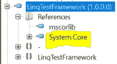

# LINQ 的调试问题

> 原文：<https://levelup.gitconnected.com/debugging-issues-with-linq-7f8704136072>

## 不要总是相信智能感知

假设您有以下代码:

在调试过程中，您决定要在`dict`中查看一些过滤后的数据。

您已经包含了`System.Linq`，并且可以看到从智能感知中弹出的`Where()`方法。

但是，当它执行时，您会得到以下错误:

> 错误 CS1061:“字典<int string="">”**不包含“Where”**的定义，并且找不到可访问的扩展方法“Where”接受“Dictionary < int，string >”类型的第一个参数(是否缺少 using 指令或程序集引用？)</int>

## 编译优化

因为。cs 文件不包含来自`System.Linq`的任何代码，包含该代码的 dll(`System.Core.dll`)在编译期间不包含，这意味着 LINQ 扩展方法不可用。

## 伊尔斯皮

为了仔细检查，我打开了。我可以看到 System.Core.dll 肯定不在其中:

## 吸取的教训

你不能总是相信智能感知。它基于`using` 语句访问方法签名，而不是基于编译期间包含了什么 dll。

## 在运行时访问 LINQ 扩展方法

为了在调试期间访问`System.Linq.Enumerable`中的扩展方法，您可以添加类似这样的内容，强制编译器包含`System.Core.dll`文件:

`var filteredData = dict.Where(x => x.Value.Contains(“D”));`

现在，当您在 ILSpy 中查看应用程序时，您可以看到 dll 已包含在内，并且在运行时可用:

## 系统。Core.dll 包括在内，但不可用

仅仅因为在编译过程中包含了 System.Core.dll，并不意味着你可以在运行时访问它的代码。

看看这个:

以下是此应用程序中包含的 dll:

正如您所看到的，System.Core.dll 已经被包括在内，因为`SomeClass`类中的`System.Linq.Enumerable`调用了`Where()`。

然而，运行时是智能的，可以看到`SomeClass` 在任何地方都没有被访问，所以 System.Core.dll 的代码仍然不可用:

## System.Core.dll 什么时候有空？

查看完全相同的代码，但是没有注释`SomeClass.SomeMethod()`:

在调试期间，您可以在监视窗口中看到`Where()`调用成功。

## 另一途径

您不必调用使用 Linq 扩展方法的代码来使 System.Core.dll 在调试期间可用。

您可以将`SomeClass.SomeMethod()`调用注释掉，并在调试期间在即时窗口中运行它:

`System.Reflection.Assembly.Load(“System.Core”)`

这将加载程序集，并使它在调试期间可供您使用。

请记住，如果在编译期间没有包括 System.Core.dll，这将失败，这只会发生在应用程序中的某个地方有代码(不必调用)使用 Linq 扩展方法的情况下。

## 结论

了解如何在编译期间包含 dll，以及如何在运行时使 dll 可用，可以帮助您理解为什么有些方法在调试时不可用。