# 使用控制台对象调试 JavaScript 应用程序

> 原文：<https://levelup.gitconnected.com/debugging-javascript-apps-with-the-console-object-4c7ebe6810dc>


Jeffrey Buchbinder 在 [Unsplash](https://unsplash.com?utm_source=medium&utm_medium=referral) 上拍摄的照片

JavaScript 内置了很棒的调试工具。一种简单但强大的调试方法是使用`console`对象。这个对象有许多方法，允许我们在任何给定的时间检查程序的状态。`console`如何工作的细节因浏览器而异，但是在大多数流行的浏览器中,`console`对象已经标准化了。

# 控制台方法

`console`对象是一个全局对象。它是大多数浏览器中`window`的属性，可以通过`window.console`或简单的`console`来引用。`console`对象有以下方法:

*   `console.assert(boolStatement, message)`如果第一个参数是`false`，则将消息和堆栈跟踪记录到控制台。
*   `console.clear()`清空控制台。
*   `console.count(label)`用给定的标签记录该方法被调用的次数。
*   `console.countReset()`重置给定标签的计数器值。
*   `console.debug(message)`用日志级别“调试”将消息记录到控制台。
*   `console.dir(obj)`列出给定 JavaScript 对象的属性。内容将有三角形来显示子对象的内容。
*   `console.dirxml(obj)`如果可能，显示对象的 HTML 或 XML 表示。
*   `console.error(message)`将错误信息记录到控制台。我们可以使用字符串替换和附加参数来格式化日志消息。
*   `console.group()`创建一组控制台消息，按级别缩进。我们可以用`groupEnd()`移出一个关卡。
*   `console.groupCollapsed()`创建一组控制台消息，按项目折叠的级别缩进。我们可以用`groupEnd()`走出一个关卡
*   `console.groupEnd()`退出当前内联组。
*   `console.info(message)`记录信息性消息。我们可以使用字符串替换和附加参数来格式化日志消息。
*   `console.log(message)`用于信息的一般记录。我们可以使用字符串替换和附加参数来格式化日志消息。
*   `console.table()`以表格形式记录和显示数据。
*   `console.time(name)`以参数中指定的名称启动定时器。在给定的页面上可以同时运行 10000 个计时器。
*   `console.timeEnd(name)`停止指定的计时器，并以秒为单位记录它启动后所经过的时间。
*   `console.timeLog()`将指定定时器的值记录到控制台。
*   `console.trace()`记录堆栈跟踪。
*   `console.warn(message)`向控制台记录一条警告消息。我们可以使用字符串替换和附加参数来格式化日志消息。

# 不同级别的日志记录

记录数据是`console`对象最常见的用途。为此，我们可以使用`console.log()`、`console.info()`、`console.warn()`或`console.error()`，这取决于您正在记录的信息类型。它们都有不同的风格。

`console.error()`在 Chrome 中使用红色背景，`console.warn()`在 Chrome 中使用黄色背景，`console.log()`在 Chrome 中没有特殊背景。

我们可以向它们传递任何 JavaScript 数据。例如，我们可以这样写:

```
const obj = {a: 1, b: 2, c:3};
const message = { message: 'Error occurred' };console.log(obj);
console.info('Info logged', 123); 
console.warn('Warning logged');
console.error('Error', message);
```

如果文运行上面的代码，我们会得到这样的结果:

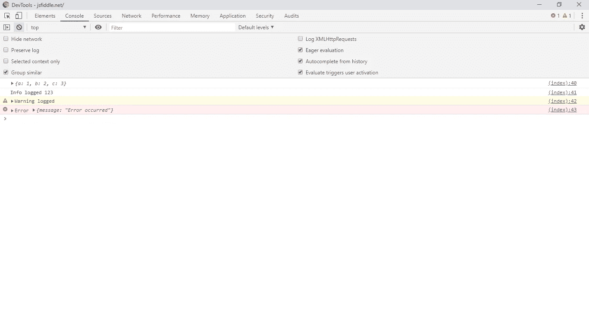

我们可以在一行中输出任意多的内容，因为`console.log()`、`console.info()`、`console.warn()`或`console.error()`方法都可以接受多个参数。所以我们可以这样写:

```
const obj = {
  a: 1,
  b: 2,
  c: 3
};
const message = {
  message: 'Error occurred'
};
console.log(obj, obj, message);
console.info('Info logged', 123, obj, message);
console.warn('Warning logged', obj, message);
console.error('Error', obj, message);
```

一切都会被记录下来。我们记录了以下内容:

```
{a: 1, b: 2, c: 3} {a: 1, b: 2, c: 3} {message: "Error occurred"}Info logged 123 {a: 1, b: 2, c: 3} {message: "Error occurred"}Warning logged {a: 1, b: 2, c: 3} {message: "Error occurred"}Error {a: 1, b: 2, c: 3} {message: "Error occurred"}
```

# 字符串替换

通过字符串替换，我们可以用一种更容易阅读的方式来格式化我们的控制台。它的工作原理是将字符串中的占位符替换为传入字符串右侧的参数。以下占位符可用于字符串替换:

*   这个占位符将被一个 JavaScript 对象替换。当您在控制台中单击对象时，可以单击对象名称来获取有关该对象的更多数据。
*   `%d`或`%i`该占位符将被替换为整数。我们可以使用这个占位符来格式化数字。我们可以编写类似于`%.3d`的代码，将数字四舍五入到 3 位有效数字，并以 0 开头。
*   `%s`该占位符将被替换为字符串
*   `%f`该占位符将被替换为浮点值。我们可以使用这个占位符来格式化数字。我们可以编写类似于`%.3d`的代码，将数字四舍五入到 3 位有效数字，并以 0 开头。

```
const obj = {
  a: 1,
  b: 2,
  c: 3
};
const message = {
  message: 'Error occurred'
};
console.log('Object %o', obj);
console.info('Number is %.3d', 123.456);
console.warn('Warning: number is: %.3d', 123.456);
console.error('Error - Error is %o. Error message is %s', message, message.message);
```

如果我们运行上面的代码，只要有`%o`占位符并记录一个对象，我们就可以点击三角形来查看更多数据。每当我们有一个带数字的`%.3d`时，我们会看到参数中的数字四舍五入到 3 位有效数字。弦留为弦。

# 设计消息

控制台消息也可以使用带有`%c`指令的 CSS 样式。在`%c`指令之后的任何文本都将使用指定的样式。我们将带有`%c`指令的字符串作为第一个参数，将带有样式的字符串作为第二个参数。例如，我们可以写:

```
console.log("This is a %cMy colorful message", "color: lightgreen; font-style: italic; background-color: black;padding: 2px");
```

然后在控制台中，我们将看到以下内容:

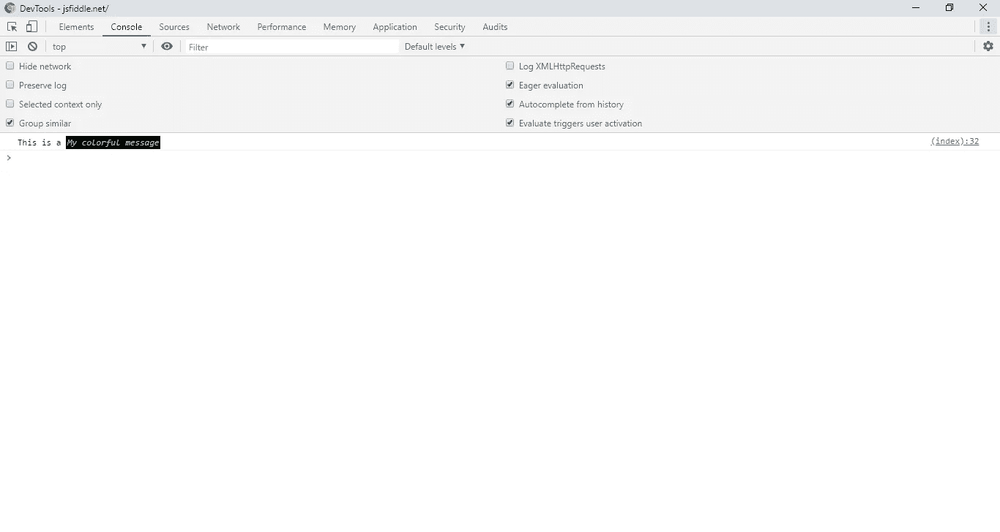

样式字符串中允许使用以下语法:

*   `background`及其等同的手写本。注意`background-image`似乎在 Firefox 中不起作用，尽管它在 Chrome 中确实起作用。
*   `border`及其等同的手写
*   `border-radius`
*   `box-decoration-break`
*   `box-shadow`
*   `clear`和`float`
*   `color`
*   `cursor`
*   `display`
*   `font`及其正楷等价物
*   `line-height`
*   `margin`
*   `outline`及其正楷等价物
*   `padding`
*   `text-*`等属性`text-transform`
*   `white-space`
*   `word-spacing`和`word-break`
*   `writing-mode`

# 控制台分组

我们可以通过使用`console.group()`创建组和使用`console.groupEnd()`方法结束组来对控制台输出进行分组。`console.groupCollapsed()`方法类似于`console.group()`方法，但会创建一个折叠组。要查看折叠组的输出，可以单击三角形按钮打开输出。例如，我们可以使用以下代码创建多个控制台日志组:

```
console.log("Outer level");console.group("Group 1");
console.log("Message in group 1");console.group("Group 2");
console.log("Message in group 2");console.group("Group 3");
console.log("Message in group 3");console.group("Group 4");
console.log("Message in group 4");
console.groupEnd();console.groupEnd();console.groupEnd();console.log("Back in group 3");
console.groupEnd();console.log("Back in group 2");
```

一旦我们运行上面的代码，我们就会在 Chrome 中看到下面的屏幕:

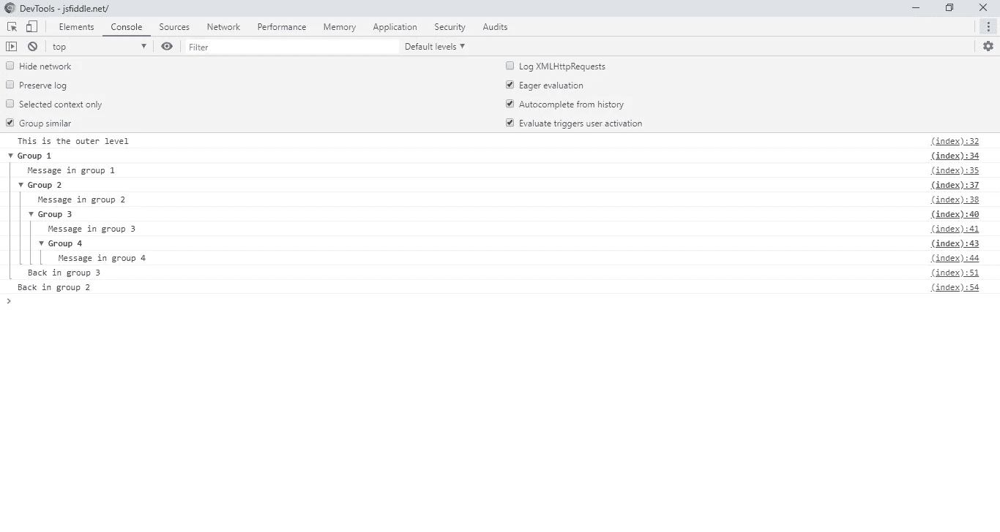

# 找出某物运行需要多长时间

为了计算一些代码运行所需的时间，我们可以使用控制台计时器对象。我们可以使用`console.time()`方法启动一个定时器，用一个字符串作为定时器的标签。然后，您可以调用`console.timeLog()`来记录计时器运行的时间，并调用`console.timeEnd()`来结束计时器。例如，我们可以编写以下代码来查看循环在元素中循环的时间:

```
const arr = Array.from({
  length: 5
}, (v, i) => i);(async () => {
  console.time("loop time");
  for await (let i of arr) {
    console.log(i)
    console.timeLog("loop time");
    await new Promise((resolve, reject) => setTimeout(() => resolve(i), 1000))
  }
  console.timeEnd("loop time");
})();
```

当我们运行上面的代码时，我们会看到如下内容:

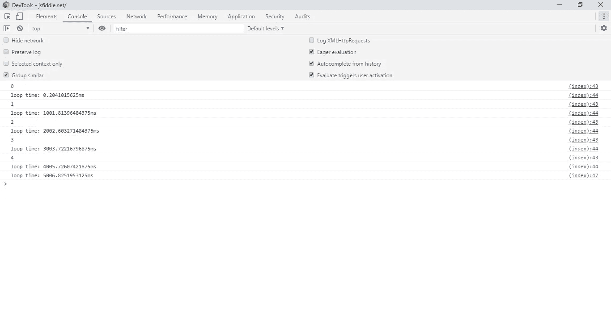

我们可以同时设置多个计时器，如下面的代码所示:

```
const arr = Array.from({
  length: 5
}, (v, i) => i);const arr2 = Array.from({
  length: 10
}, (v, i) => i);const asyncLoop1 = async () => {
  console.time("loop time");
  for await (let i of arr) {
    console.log(i)
    console.timeLog("loop time");
    await new Promise((resolve, reject) => setTimeout(() => resolve(i), 1000))
  }
  console.timeEnd("loop time");
}const asyncLoop2 = async () => {
  console.time("loop time 2");
  for await (let i of arr2) {
    console.log(i)
    console.timeLog("loop time 2");
    await new Promise((resolve, reject) => setTimeout(() => resolve(i), 1000))
  }
  console.timeEnd("loop time 2");
}(async () => {
  await asyncLoop1();
  await asyncLoop2();
})()
```

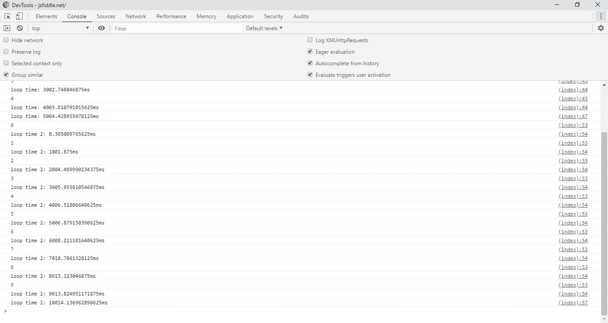

如果两个定时器有不同的名字，那么它们就是两个不同的定时器。每个定时器的运行时间将被单独记录。它们可以同时运行，如下面的代码所示:

```
const arr = Array.from({
  length: 5
}, (v, i) => i);const arr2 = Array.from({
  length: 10
}, (v, i) => i);const asyncLoop1 = async () => {
  console.time("loop time");
  for await (let i of arr) {
    console.log(i)
    console.timeLog("loop time");
    await new Promise((resolve, reject) => setTimeout(() => resolve(i), 1000))
  }
  console.timeEnd("loop time");
}const asyncLoop2 = async () => {
  console.time("loop time 2");
  for await (let i of arr2) {
    console.log(i)
    console.timeLog("loop time 2");
    await new Promise((resolve, reject) => setTimeout(() => resolve(i), 1000))
  }
  console.timeEnd("loop time 2");
}asyncLoop1();
asyncLoop2();
```

然后我们看到这两个计时器同时来自控制台的日志:

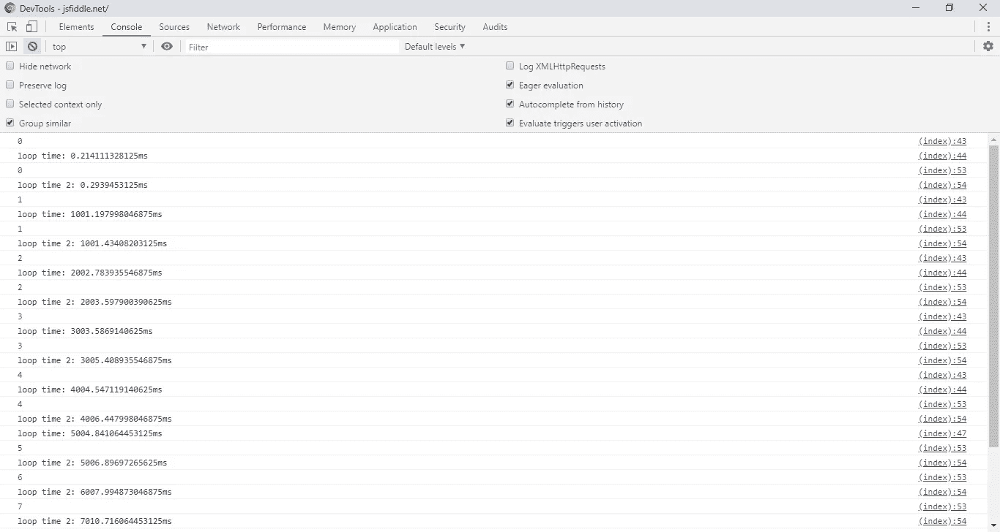

# 日志堆栈跟踪

我们还可以用`console.trace()`方法记录函数调用的堆栈跟踪。我们只要把它放在我们想要得到堆栈跟踪的函数中，就可以得到整个函数调用链。例如，我们可以写:

```
const a = () => console.trace()
const b = () => a()
const c = () => b()
const d = () => c()
const e = () => d()e();
```

然后我们得到:

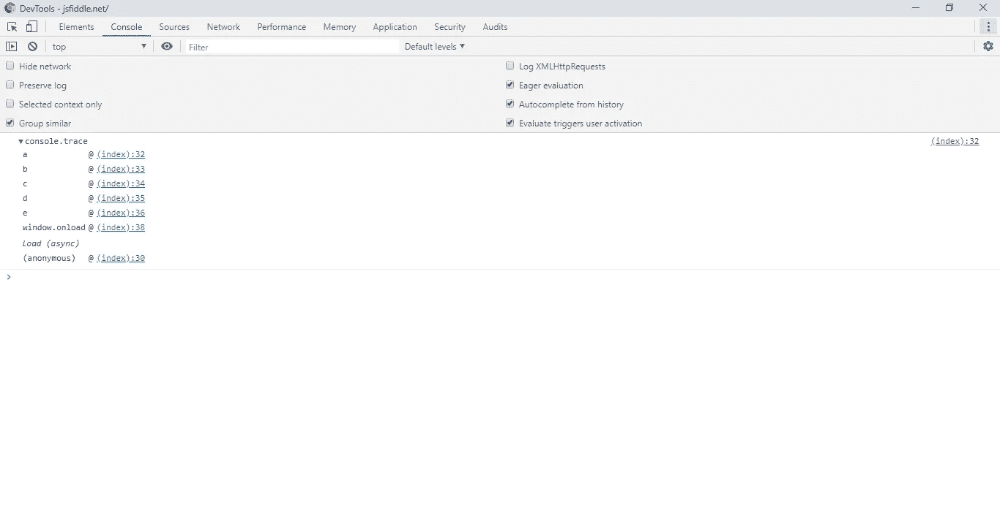

# 在表中记录对象和数组值

当我们记录对象时，为了在表格中显示日志数据，我们可以使用`console.table`命令。它对对象和数组都有效。对于对象，如果对象有两层，它将记录行和列中的属性。例如，如果我们有:

```
const family = {
  son: {
    firstName: 'John',
    lastName: 'Jones'
  },
  daughter: {
    firstName: 'Jane',
    lastName: 'Jones'
  }
}console.table(family)
```

然后我们得到:

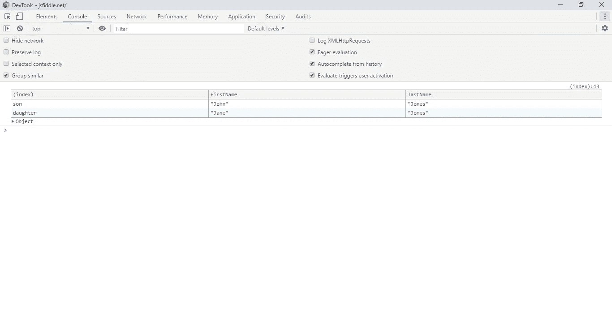

如果我们有一个单一级别的对象，那么我们得到的键在左边，值在右边。例如，如果我们运行:

```
const son = {
  firstName: 'John',
  lastName: 'Jones'
}console.table(son)
```

然后我们得到:

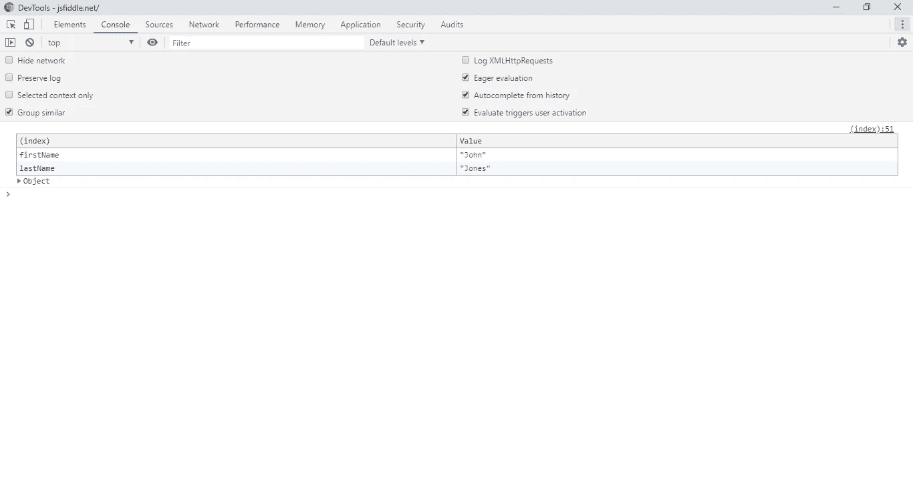

`console.table()`也适用于数组。我们可以用它来记录一维和二维数组。对于一维数组，左边是数组的索引，右边是数组的值。例如，如果我们有:

```
const arr = [1, 2, 3];
console.table(arr)
```

然后我们得到:

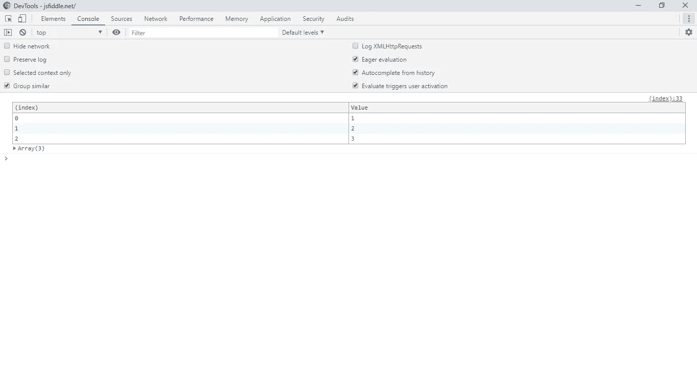

如果我们已经使用`console.table()`来记录一个二维数组，我们将在左边得到顶层数组的索引，在表的顶部得到嵌套数组的索引，以及表中每个条目的值。例如，如果我们有:

```
const arr = [
  ['a', 1],
  ['b', 2],
  ['c', 3]
];
console.table(arr);
```

然后我们得到:

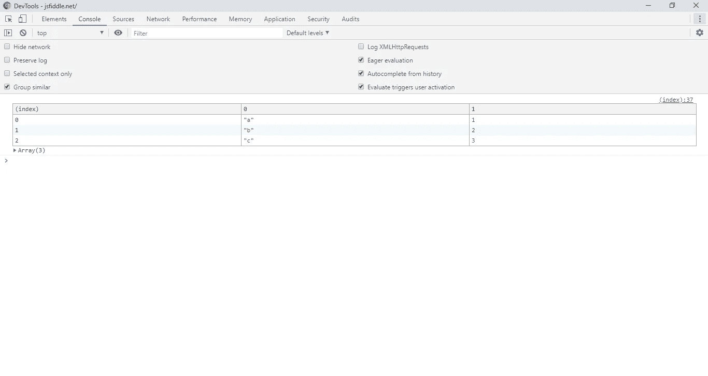

`console.table()`方法有第二个参数，通过用我们想要显示的对象的键或我们想要记录的数组的索引设置一个数组来限制显示的列。这只适用于两层深度的嵌套对象。例如，我们可以写:

```
const family = {
  son: {
    firstName: 'John',
    lastName: 'Jones'
  },
  daughter: {
    firstName: 'Jane',
    lastName: 'Jones'
  }
}
console.table(family, ['firstName'])
```

然后我们只得到显示的`firstName`列和相应的值。这只适用于嵌套对象的第二级属性。

正如我们所见，`console`对象对于在我们的 JavaScript 程序中记录数据非常有用。我们可以使用`console.log()`、`console.info()`、`console.warn()`和`console.error()`方法进行不同级别的日志记录。我们可以用`console.table()`在一个表中显示对象和数组。我们可以看到用`console.time()`和相关方法运行代码需要多长时间，我们可以用`console.group()`和相关方法对消息进行分组。