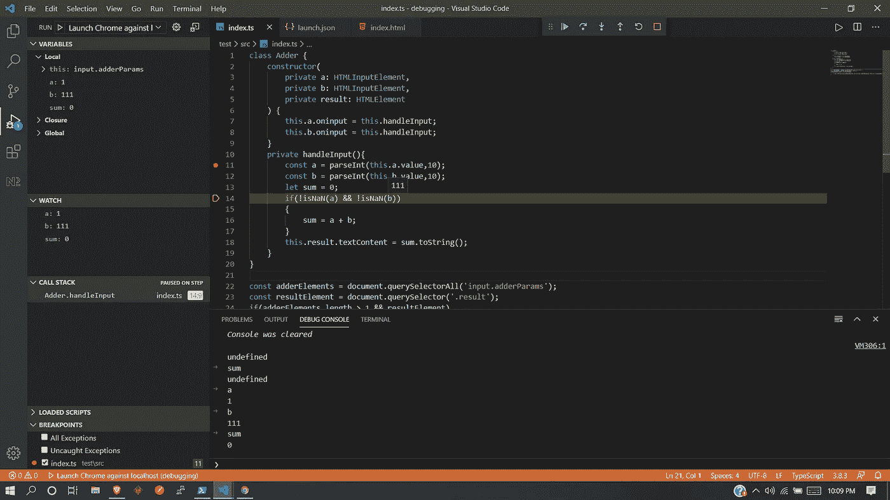

# 调试类型脚本

> 原文：<https://levelup.gitconnected.com/debugging-typescript-3b3aaf059f76>

我理解那种感觉，当反复尝试解决问题却没有解决问题时的愤怒和沮丧。Console.log 语句，以查看哪些方法被调用，哪些方法先完成。不要在屏幕上打孔，用调试器代替。🙃

调试器是一项非常漂亮但有时未被充分利用的技术，可用于逐行运行程序，查看所有变量的状态变化，堆栈信息，并在程序运行时检查整个程序的状态。

当我使用 Java 作为后端时，这是很容易做到的。如果出现意外情况，我会使用调试器来找出发生了什么。然而，对于 JavaScript，我的第一反应总是放下一堆 console.logs 并重复运行代码来找出发生了什么。我猜这是由于我当时工作的前端和后端环境之间的巨大差异。

现在我已经转向了面向前端和后端的 TypeScript，统一调试的体验非常愉快。我将在本文中分享一些调试 TypeScript 的方法。这些方法也适用于 JavaScript。这些都在 **VS 代码**中，因为那是我使用的代码，但是其中的一些部分对于其他 ide 来说是相似的。我会在最后附上一些可能对其他 ide 有用的链接。

# 设置

记住，运行的不是 TypeScript。它被转换成 JavaScript，这就是执行的内容。我们需要一种方法将输出 JavaScript 映射到源代码。很简单。只需在 **tsconfig.json** 中添加`“sourceMap”: true,`到`compilerOptions` 即可。这将告诉编译器为我们生成 **.js.map** 文件。这被称为**源映射**，它保存了关于源代码如何被转换成输出的信息，使得浏览器/节点能够重构原始源代码并将其呈现在调试器中。

这是 tsconfig 的最小版本。

```
{
  "compilerOptions": {
    "target": "es5",
    "module": "commonjs",
    "rootDir": "src",
    "outDir": "build",
    "sourceMap": true
  }
}
```

# 节点-后端

当我们启动一个带有`--inspect`标志的程序时，节点将开始监听默认主机和端口`127.0.0.1:9229`上的调试客户端。然后，我们可以使用任何 IDE 将调试器客户端附加到正在运行的进程，并开始调试。

有两种方法可以解决这个问题。要么我们让 VS 代码处理整个生命周期，要么我们可以在调试模式下单独运行程序，并使用 VS 代码为它附加一个调试器。

## VS 代码处理一切

1.  对于单个文件，程序在文件打开时按 F5 键。它将在调试模式下运行文件，就这样。通常不会出现这种情况。

2.创造。并添加以下代码。更换<>中的任何东西。

3.转到调试/运行面板，从配置下拉菜单中选择*启动程序*并点击运行。

## 附加调试器

1.  创造。并添加以下代码。

2.使用`--inspect`标志启动您的应用程序。

3.转到调试/运行面板，从配置下拉列表中选择*连接*并点击运行。

# 铬合金前端

Chrome 可以使用 chrome.exe`--remote-debugging-port=9222`在调试模式下启动。这将告诉 Chrome 监听端口`127.0.0.1:9222`来调试客户端。然后，我们可以使用任何可以与 chrome 调试协议接口的 IDE 来为它附加一个调试器。

Chrome 有一个扩展[调试器，需要安装它才能工作。之后，有两种与 Node 相同的设置调试器的方法。](https://marketplace.visualstudio.com/items?itemName=msjsdiag.debugger-for-chrome)

## 通过 VS 代码启动

1.  创造。并添加以下代码。更换<>中的任何东西。

2.转到调试/运行面板，从配置下拉列表中选择*启动 Chrome 对抗本地主机*并点击运行。

## 附加调试器

1.  创造。并添加以下代码。

2.用`--remote-debugging-port=9222`启动 chrome 并导航到你的页面。

3.转到调试/运行面板，从配置下拉列表中选择*连接到本地主机*并点击运行。

## 问题

chrome 的初始设置有点问题。设置`webRoot` 和`sourceMapPathOverrides` 可能有点挑战。我发现 Github 上的[这个](https://github.com/Microsoft/vscode-chrome-debug/issues/582)线程有助于我为自己的项目做出决定。

# 使用调试器

*   调试器运行时，将鼠标悬停在。VS 代码中的 ts 文件。出现了一个暗红色的圆圈。点击它来设置断点。
*   调试时，文件名旁边的顶部会显示一个栏。即有*步过*、*步入*、*步出*、*重启*、*停止*和*暂停*的命令。
*   在 VS 代码中有一个调试控制台，我们可以在调试模式下使用它来编写脚本，与程序进行交互。无论调试器是否在断点处停止，这些都将运行。`Ctrl+Shift+Y`将打开调试控制台。



调试器在运行

延伸阅读:

1.  [节点 js 检查员](https://nodejs.org/en/docs/guides/debugging-getting-started/)
2.  [Chrome DevTools 协议](https://chromedevtools.github.io/devtools-protocol/)
3.  [VS 代码——调试打字稿](https://code.visualstudio.com/docs/typescript/typescript-debugging)
4.  [WebRoot 一期](https://github.com/Microsoft/vscode-chrome-debug/issues/582)