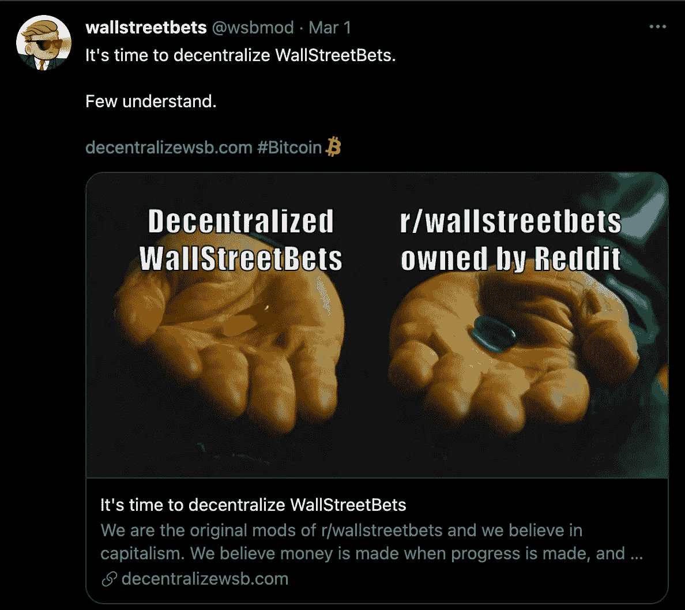
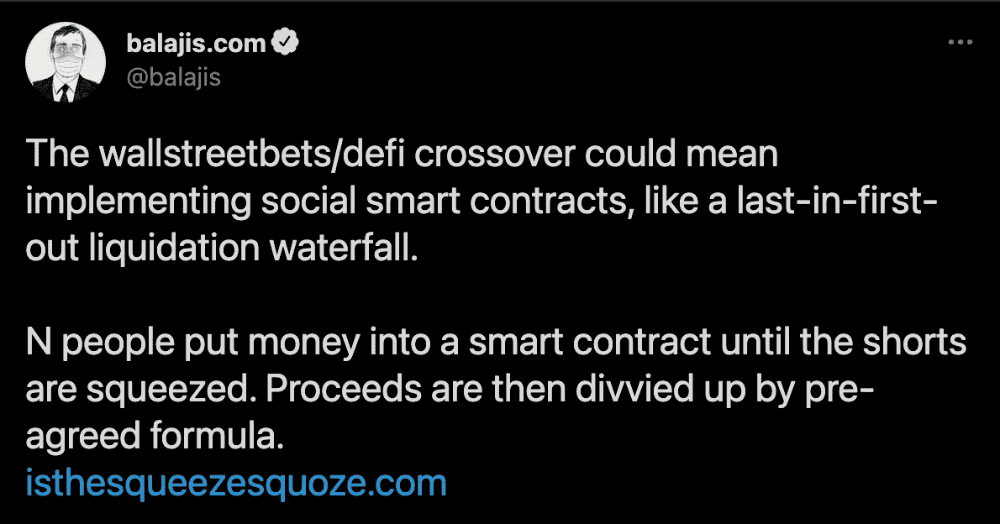

# Reddit 的 WallStreetBets 计划去中心化

> 原文：<https://levelup.gitconnected.com/decentralize-wallstreetbets-5d0763434f1e>

## 区块链/社交媒体/金融

## 这可能意味着什么

来源:作者

看起来 Reddit 的 WallStreetBets 社区正在分裂。多亏了 GameStop 泵，subreddit 现在已经为全世界所知。现在论坛的主持人已经分裂了——根据他们的推特[T2 的说法，其中一部分人有着令人兴奋的大计划。](https://twitter.com/wsbmod/status/1366388480440471553)

直到几周前，Twitter 账户 [wsbmod](https://twitter.com/wsbmod) 还是 subreddit 中链接的官方账户。另一个列在 Reddit 上，Reddit 被认为是 Twitter 上 mods 的官方喉舌。

wsbmod 背后的前 mod 可能正在**计划分散**华尔街赌注——这意味着什么以及他们为什么想要这样做。

来源:[推特](https://twitter.com/wsbmod/status/1366388480440471553)

# 分权是什么意思？

这是一个只有加密货币世界才知道的术语。

在我们传统的财务系统中，一切都是集中组织的。我们的钱的价值取决于我们对国家和银行等机构的信任程度。WallStreetBets subreddit 是集中组织的，因为它属于 reddit，位于官方服务器上。

因此，如果 reddit 决定删除 subreddit，这不会是一个问题，至少在技术上是这样的——只有 Reddit 是中央权威。

加密货币的去中心化可以总结为:所有交易都存储在所有相关的计算机上，因此没有中央实体。只有通过各种系统相互通信，才能达成共识。

子网站也可以这样组织。网站上的所有帖子都存储在所有计算机上。只有在超过 50%的计算机上出现特定帖子时，才认为是真实的。没有人可以单独删除、审查或以这种方式影响论坛——毕竟它是分散的。

# 对金融业进行更严厉打击的尝试

GameStop 的大肆宣传在金钱世界引起了不小的轰动。Reddit 用户的动机是挤压大型对冲基金的空头头寸——为此，他们导致 GME 股价飙升。

你可以谈论许多人在互联网上密谋购买一只股票——只是基于其他人也会购买的信任，这样做空就会成功。

发生的事情令人难以置信——尤其是从博弈论的角度来看。因为有一个问题:Reddit 用户需要确保其他人也会购买并持有股票，直到做空成功。

为了解决这个问题，有人建议让 WSB 碾过区块链。

来源:[推特](https://twitter.com/balajis/status/1356364836704186374)

智能合同可以用来捆绑和投资用户的资金。

只有当某个事件发生时，利润才分配给所有参与者。通过这种方式，所有用户的利益都被捆绑在一个分散的平台上，个人的购买力被捆绑在一起——而不存在必须信任他人的问题。

这一步不需要重新发明轮子。虽然任何人都可以设计自己的区块链，但现有的已经具备了必要的功能。这种可编程区块链最著名的例子可能是以太坊。

几个星期以来，向 WSB 放权的计划已经摆在桌面上。从技术上来说，这是可能的，但从法律角度来看，值得怀疑。在 Twitter 上，许多用户指出，一起买卖股票的想法是一种幻想——在法律上被归类为市场操纵。

# 来源

[1]:[https://www . insider . com/wallstreetbets-Reddit-sub-stock-版主-want-to-start-new-community-2021-3](https://www.insider.com/wallstreetbets-reddit-sub-stock-moderators-want-to-start-new-community-2021-3)