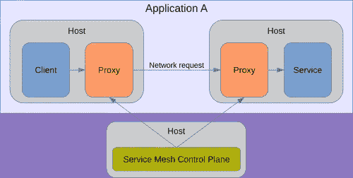
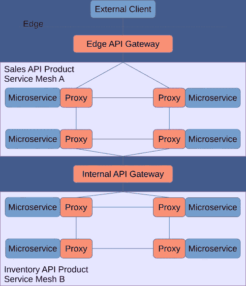

# 解读服务网格和 API 网关之间的区别

> 原文：<https://levelup.gitconnected.com/deciphering-the-difference-between-a-service-mesh-and-api-gateway-c57e4abec302>

在微服务架构中，应用程序用调用堆栈的刚性和稳定性来换取网络的灵活性和混乱。延迟、中断重试、安全性和可追溯性等问题在调用栈中并不重要，但在服务调用中却变得重要了。服务网格是一种模式，它将这些问题从编码人员手中拿走，这样他们就可以专注于编码业务解决方案。

API 网关和服务网格之间有很多重叠。本文探讨了什么是服务网格，它对您的组织的好处，它与 API 网关的区别，并提供了服务网格的使用建议。

# 建议的执行摘要

任何构建在容器上运行的大型分布式组件化应用程序的应用程序团队都应该使用服务网格来管理、保护和监控他们的服务。这些应用程序内部服务之间的流量是服务网格最适合的。相比之下，API 网关应该用于管理业务和合作伙伴之间的交互，或者一个内部业务单元和另一个内部业务单元之间的交互。

服务网格有多种模式，但是您应该利用的理想模式是在容器中运行的 sidecar 代理。虽然 Istio 是最常见的服务网格产品，但 Consul、Linkerd、捆绑了 open shift(Istio 的一个分支)的服务网格 Red Hat 等等也是基于 Kubernetes 的容器的选项。在投资服务网格之前，您应该评估服务网格产品的前景、它们的成熟度，以及行业是否已经确定了明确的赢家(例如，在容器领域，Kubernetes 赢得了事实上的容器行业标准)。

尽管服务网格与 API 网关、安全性、弹性和监控有很大重叠，但最好将其视为云技术，因为它与容器紧密相连，旨在支持云原生应用。请注意，我所说的“原生云”包括设计用于在公共云和私有(内部)云容器上运行的应用。

# 什么是服务网格？

从函数调用的调用堆栈转移到网络调用会带来安全性、不稳定性和调试方面的问题。服务网格是一组用于处理这些问题的架构模式和支持工具。例如，函数调用知道被调用的函数总是可用的，而网络调用却不知道。服务网格将通过对客户端应用透明地执行重试来帮助客户端端点处理这种网络不稳定性。它还将通过基于如何路由流量的配置策略将请求路由到最能够处理的服务器节点来帮助服务器端点。

服务网格通常由两层实现:数据平面和控制平面。数据平面充当连接的客户端和服务器端点的代理，执行从控制平面接收的策略，并向控制平面的监控工具报告运行时指标。控制平面管理数据平面的服务策略和编排。

服务网格的拓扑结构。

最受欢迎的数据平面是 Envoy，这是一个由 Lyft 创建的开源代理，作为云原生应用程序(包括内部私有云)的辅助程序运行。最受欢迎的控制平面是 Istio，这是一个由 Lyft、Google 和 IBM 联合创建的开源服务网格，用于将 Envoy 实例作为容器 sidecar 注入和管理到云原生应用程序中。

下面是一些典型的服务网格特性，尽管不是每个服务网格实现都有这些特性。

## 交通路线

服务网格可以基于策略或配置将请求路由到服务实例。来自客户端应用的流量可以被区分优先级，或者流量可以被选择性地路由到不同版本的服务，以支持:

*   金丝雀释放。
*   AB 测试。
*   服务版本/向后兼容性。

## 可观察性

代理代表每个客户端和服务记录调用，而不是开发人员实现登录到每个客户端和服务。从这些日志中，下游监控工具可以分析和报告性能和可用性。它们还可以提供跨调用链的基本跟踪。通过额外的编码，开发人员可以增强调用链分析，以包括业务事务跟踪。

一些典型的可观察性特征:

*   显示服务如何相互连接的服务图和仪表板(代码不变)。
*   针对延迟、吞吐量和错误率的信号和警报(无代码更改)。
*   跟踪请求或业务事务如何在网格中传递(只需更改最少的代码就可以在报头中传递事务 ID)。

## 弹性

代理强制的重试策略将开发人员与被调用服务暂时不可用的场景完全隔离开来。代理也可以尝试到服务的备用路径，或者故障转移到备份服务。例如，如果网飞的个性化推荐服务离线，它可能会回到默认的非个性化推荐服务。只有在尝试了所有这些努力之后，它才会返回一个错误。开发人员可以相信，如果对服务的调用失败，代理已经尽力处理通信错误。此外，网格可以提供以最低延迟路由到服务实例以获得最佳性能的能力。

您可以配置和实施的弹性模式示例:

*   重试策略。
*   断路器模式。
*   速率限制/节流。

还可能有机会构建[混沌工程](https://medium.com/swlh/an-architects-introduction-to-chaos-engineering-21b9ee20d997)功能，因为服务网格在网格内每个连接的两个端点上注入自身(正是您想要注入“混沌”的位置)，并提供监控混沌测试健康状况所需的可观察性。

## 安全策略

将一个单一的应用程序分解成许多独立的服务会大大增加它的攻击面。每个服务都是要保护的潜在入口点。对于服务网格，客户端和服务器端点上的代理都应用策略来保护两者之间的通信。服务网格通过不依赖开发人员将安全性正确地手动编程到每个服务中来培养一致的安全性。代理负责身份验证、授权和加密。结果是服务网格内的[零信任安全](https://threatpost.com/practical-guide-zero-trust-security/151912/)。

## 身份

服务网格可以管理和维护哪些身份可以访问哪些服务，并维护谁在何时访问了哪些服务的日志。JWT 可以验证身份，允许基于最终用户和调用服务的授权。

## 加密

如上所述，服务之间的通信是加密的。控制平面提供证书管理功能，如证书生成和证书轮换。它将这些证书和相关的
配置数据推送到数据平面。

对相互 TLS 身份验证的支持非常强大。Mutual TLS 是指两个端点都列出哪些证书可以位于连接的另一端。它提供认证和加密。

一些组织倾向于使用 OAuth 而不是双向 TLS 身份验证作为他们的 API 网关的身份验证协议。这是因为对于 mutual TLS，您必须手动维护证书并不时刷新它们。当人工维护没有正确进行时，这可能导致维护问题和生产中断，正如曾经发生在微软团队身上的著名事件[。需要手动维护，因为 API 网关只管理连接的一个端点，因此您必须与拥有另一个端点的组织进行手动协调，以便刷新任何一方的证书。相比之下，服务网格可以在没有人工流程的情况下动态发布新证书。这是因为网格管理客户端和服务器端点，并且可以控制在运行时在连接的两端使用和期望什么证书。](https://www.theverge.com/2020/2/3/21120248/microsoft-teams-down-outage-certificate-issue-status)

# 服务网格与 API 网关

尽管一开始服务网格和 API 网关看起来很相似，但是当您深入了解微服务和 API 服务于不同需求的细节时，它们会有很大的不同。

## 微服务和 API 服务于不同的需求

微服务和 API 解决两个不同的问题，前者更技术性，后者更面向业务。

*   微服务(或 [miniservices](https://tweedegolf.nl/blog/32/from-monolith-to-miniservice) )应该用于有界上下文内的通信(参见[域驱动设计](https://martinfowler.com/bliki/DomainDrivenDesign.html)“[有界上下文](https://martinfowler.com/bliki/BoundedContext.html)”)。它们的设计是由连接组成有界上下文的组件的需求驱动的，因此就像远程过程调用(RPC)一样。
*   API(通常是 REST，但也可以包括事件流和其他协议，如 SOAP、gRPC 或 GraphQL)应该提供接口，由一个有界的上下文向外界公开。理想情况下，他们的界面设计是由业务价值驱动的，而不仅仅是作为一个 RPC。

换句话说，API 将一个有界上下文的业务价值对外公开给另一个，而微服务是组成有界上下文内部黑盒的几个组件。在传统架构中，这些组件可能是通过进程的调用堆栈进行通信的类或 dll。在微服务架构中，它们可能成为独立的服务，通过网络进行通信。

## 服务网格和 API 网关满足不同的需求

为了理解服务网格和 API 网关之间的区别，首先我必须定义定向流量。东西向流量通常指数据中心内的数据，而南北向流量则指进出数据中心的流量。在本文中，我指的是从有界上下文的角度:在有界上下文内的流量是东西向的，在有界上下文外的流量是南北向的。

服务网格旨在管理东西向流量。虽然 API 网关可以管理东西向流量，但服务网格更适合。这是因为服务网格在连接的两端都有代理。这种配置在 east-west 中是可行的，因为两个端点都由同一个应用程序开发组织控制。

服务网格管理同一应用程序(或有界上下文)的两个组件之间的东西向流量的客户端和服务器端点。

虽然服务网格可以管理南北流量，但是 API 网关更适合于此。因为连接的一部分不在服务网格的控制之内，所以管理两端会失去它提供的大部分价值。

API 网关管理不同应用程序之间(或不同的有界上下文之间)南北流量的服务端点。

此外，南北流量通常涉及业务合作伙伴，需要管理最终用户的体验。API 网关更侧重于管理这种最终用户体验。它们通常是更大的 API 管理解决方案的一部分，具有集成的 API 目录和开发人员门户，旨在支持内部开发人员和外部业务合作伙伴。API 网关通常还支持 API 的货币化，要么通过直接的每次呼叫收费，要么通过根据协商的合同或客户购买的等级管理 SLA 策略。

相比之下，服务网格并不专注于管理服务客户端的最终用户体验。因为服务网格旨在管理组成应用程序/有界上下文的服务，所以它的所有客户端通常由拥有该服务的同一个 IT 部门构建。因此，如果团队需要更改影响客户端的微服务的接口，他们可以更容易地进行更改，因为影响不会超出一个 IT 领域。在 IT 组织的同一个领域中，需要帮助解决如何调用服务的开发人员可以简单地询问附近的队友。

另一个区别是有界上下文的边缘应该是一致的。当所有团队为有界上下文如何相互交互建立了共同的实践时，就有了企业价值。对于有界上下文来说，共享同一个联合 API 管理基础设施更有效，这样可以为 APl 客户提供跨企业的统一体验，并在 API 设计上进行协作。

由于团队控制之外的外部依赖网络，与组成它的黑盒内部服务相比，绑定上下文的接口更难更改。例如，您货币化的 API 可能被几个外部客户公司调用，或者客户通信 API 可能被您企业中的几个应用程序调用；对这些 API 的更改需要与那些外部公司和团队进行协调。因此，微服务架构所提供的更高敏捷性的价值在受限上下文的边缘被削弱了，这使其更适合于专注于管理 API 的各种最终用户的 API 网关。

总之，API 网关和服务网格互为补充:API 网关处理面向外部的流量，而服务网格处理面向内部的流量，从而形成一个类似下图的拓扑。

两个 API 产品的拓扑结构，每个都由微服务组成。

# 服务网格所有权

正如您在上图中所看到的，您希望为单独的应用程序使用单独的服务网状集群。否则，对于一个全球服务网状集群，最终会有两个应用程序相互耦合。例如，如果发生服务网格中断，最好是影响一个应用程序，而不是几个。

如果你有拥有代码和基础设施的全栈跨职能团队，你的服务网格应该由在其上托管应用的团队拥有。

另一方面，如果你有支持 Kubernetes 和应用程序开发团队的 API 基础设施的集中团队，哪一个应该拥有它？乍一看，服务网格似乎解决了许多与 API 网关相同的问题，因此应该归与 API 网关一致的团队所有。然而，理想情况下，它应该与 Kubernetes 团队保持一致，原因有两个。

*   一个服务网格与 Kubernetes 相耦合。将您的 API gateway 团队放在后面，意味着在发生事故时，又多了一个团队来参与实现和生产支持。相比之下，由于任何使用服务网格的应用程序都将运行 Kubernetes，让您的 Kubernetes 基础架构团队拥有服务网格并不会增加一个团队。
*   这些工具的目标各不相同。服务网格和私有云 Kubernetes 的目标是将应用程序的内部组件化，以获得更高的敏捷性和可伸缩性。尽管 API 具有灵活性，但 API 管理主要是构建 API 产品来推动新的合作关系和渠道，而企业应用程序集成通常是将应用程序相互隔离，而不是管理应用程序的内部。

# 何时使用服务网格

如果您的分布式组件化架构(即微服务或微服务架构)具有动态、频繁变化的服务和大量东西向通信，您可能需要一个服务网格。以下是一些帮助您做出决定的注意事项。如果任何一个问题的答案是“是”，请评估服务网格的价值

*   **环境。**您的网络拓扑是否会随着多种服务的扩展和缩减而频繁变化？
*   **代码变更。**您的代码是每周更改一次还是更频繁？
*   **服务数量。**你有十个或十个以上的微服务吗？您是否有大量的东西向网络流量？在任何时候，每一个都扩展到五个或更多实例吗？
*   **安全。**您是否需要 mutual TLS 来保障您的服务，但是这么多服务的证书手动维护却跟不上？请注意，自动双向 TLS 是采用服务网格的主要原因。
*   **可观察性。**您需要观察服务之间的交互并通过系统跟踪业务交易吗？不过，请注意，可观察性可以使用其他监控工具(AppDynamics 等)来实现。).仅仅为了可观察性而使用服务网格是很少见的。

# 何时不使用服务网格

在下列情况下，服务网格可能不会带来任何额外的好处。

*   **很少服务。**您的服务很少(少于 10 个是一个好的基准)，或者您的服务不能扩展到很多实例(少于 5 个是一个好的基准)。
*   **可观察性。**您不需要服务之间的细粒度跟踪。或者可观察性是您唯一的需求，也许可以用 AppDynamics 这样的简单工具更容易地解决。
*   **没有东西向交通。**你的应用程序中的所有通信都保持在一个单一的边界内，没有或几乎没有内部网络通信。
*   **固定网络拓扑。**您的应用程序的网络拓扑是固定的，变化非常有限。IE——就像具有非短暂虚拟机或裸机服务器的传统网络拓扑。
*   **代码改动很少。**当业务仅需要偶尔更改应用程序时，微服务和服务网格提供的敏捷性就不适用。

# 评估服务网格

几乎所有的服务网格都使用特使侧车作为数据平面。他们最明显的区别是在控制平面上。虽然大多数控制平面都使用 Istio，但 Istio 仍然面临着许多竞争。此外，由于 Istio 是开源的，各种基于 Istio 的控制平面可能会有很大的不同。因此，对不同服务网格的评估应该侧重于控制平面的功能以及哪些控制平面满足您的需求，因为控制平面而不是数据平面是服务网格供应商相互区分的方式。

一些注意事项:

*   控制平面在您的 Cl/CI 渠道中提供的价值最大吗？
*   控制计划是声明性的吗？理想情况下，您希望配置声明您想要的最终状态的文件，并让控制平面知道如何到达那里。一个不受欢迎的控制平面是命令式脚本，你告诉它*如何*达到你想要的状态。
*   它允许自助服务吗？您的基础设施和运营团队应该拥有入口，因为您不希望开发人员随意向外界开放端口。但是，一旦连接通过入口，它能否路由到开发人员可以管理的控制平面的自助服务子模块？如果没有自助服务，您的中央基础架构和运营可能会成为瓶颈，影响服务网格和微服务的目标。

# 结论

服务网格采用了许多并不新的概念，但是以一种专门为管理组成分布式组件化应用程序的微服务或微服务而构建的方式对它们进行了打包。它们与 API 网关有很多重叠，但主要区别在于它们的关注点。服务网格管理组成应用或有界上下文的黑盒服务的东西向流量；API 网关管理公共接口的南北流量，重点是管理用户与 API 的关系。服务网格管理连接的两个端点，并且仅限于容器化的应用；API 网关只管理连接的服务器端点，但是可以管理任何 API，甚至是单一的 API 服务。

采用分布式组件化应用的现代云原生架构的团队将发现使用服务网格来管理该架构所带来的复杂性的价值，包括网络不可靠性、安全性、运营监控和其他问题。