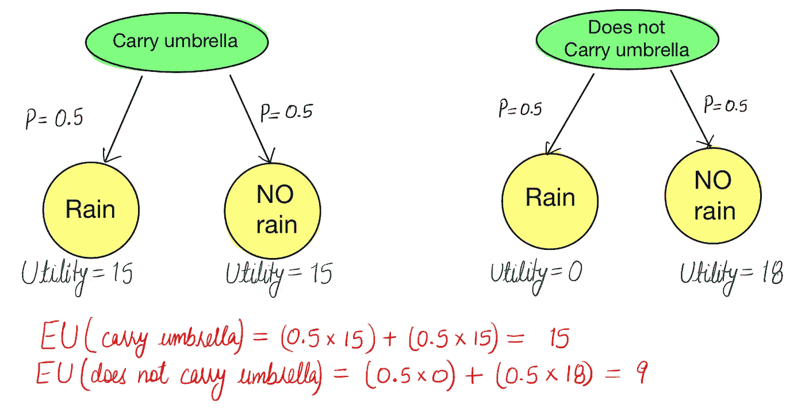
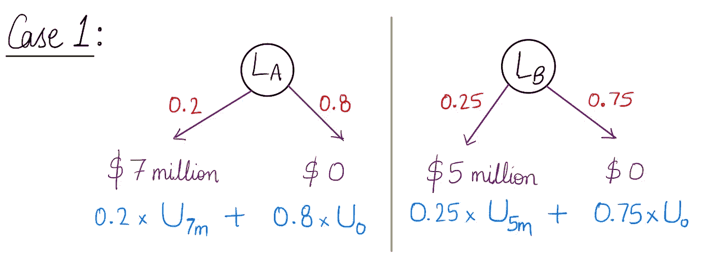
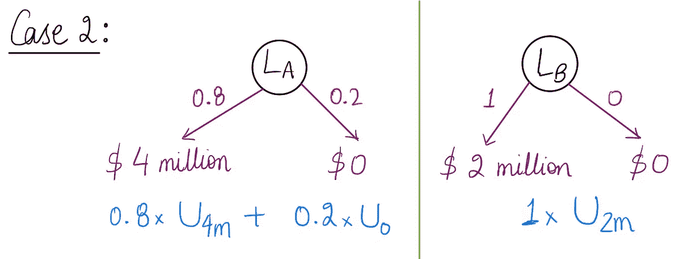
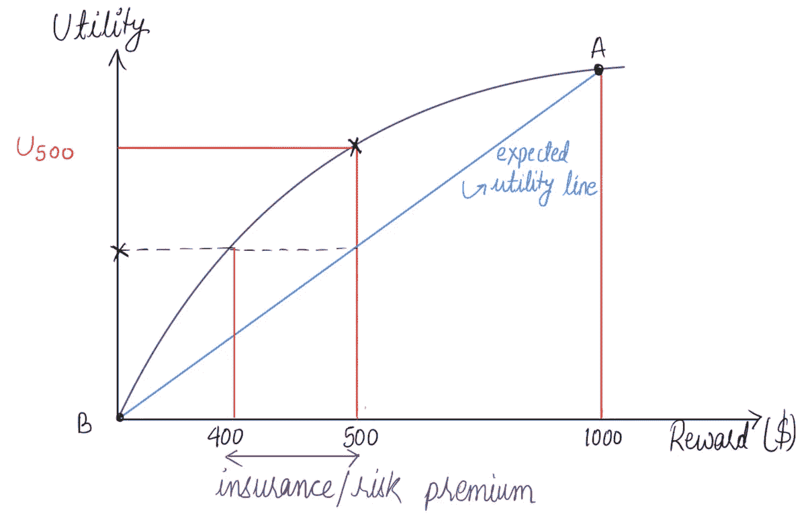

# 决策理论:期望效用和风险规避

> 原文：<https://levelup.gitconnected.com/decision-theory-expected-utility-and-risk-aversion-9c568a00f54>

## 本文详细阐述了期望效用、风险规避和效用函数，以帮助人工智能主体决定行动。

两个下棋的人。[ [来源](https://www.peakpx.com/en/hd-wallpaper-desktop-vlnto)

这篇文章描述了为什么在决策中需要找到最佳效用函数。本文使用了多个示例来更好地理解这些主题。

# 决策论

决策理论研究代理人的理性选择，有助于推进人工智能。它着眼于决策是如何做出的，多种选择如何相互影响，以及决策者如何处理不确定性。当我们不确定要采取什么行动时，决策理论会根据即时结果的合意性来选择各种行动。

以下是决策理论的一些真实场景。

1.  **我想买一部 iPhone。我应该购买当前的模型还是等待最新的模型到达？当前的 iPhone 型号看起来不错，但如果我再等几个月，我会找到一款价格相同但功能更多的新型号。**
2.  **我会抽下一支烟吗？一支烟没问题，但如果我多次做出同样的决定，它可能会要了我的命？**
3.  我今天要带雨伞吗？这个决定取决于我不知道的事情，即是否会下雨。

# 效用函数

代理的偏好由效用函数*‘U’，*捕获，该函数返回一个数值来表示状态的合意性。

## 预期效用(欧盟)

行动的预期效用是结果的平均效用值，用结果发生的概率加权。

## 最大预期效用(MEU)

最大期望效用原则表明，理性的代理人应该选择最大化代理人期望效用的行动。换句话说，MEU 原理是智能行为的处方。

为了说明，考虑下面的例子。我需要弄清楚我是否需要带雨伞？鉴于此，如果下雨，我没有伞，我的效用是 0 单位，而如果我有伞，它是 15 单位。如果不下雨，我没有伞，我的效用是 18 单位，而如果我有伞，它是 15 单位。任何一天下雨的可能性都是 50%。

图一。分析欧盟，以确定我是否应该携带雨伞。(图片由作者提供)

在上面的例子中，我们计算了两种情况下的 EU，根据 MEU 的说法，左边部分的 EU 更高；因此，我应该带着伞。

# 货币的效用

效用理论源于经济学，经济学为效用度量提供了一个明显的候选对象:货币(代理人的总净资产)。几乎所有的商品和服务都可以用货币来交换，这意味着货币在人类的效用函数中扮演着重要的角色。如果其他条件相同，在所有情况下，代理人都更喜欢更多的钱。我们说代理人表现出对更多钱的单调偏好。

效用函数对于比较包含不确定性和风险的复杂场景至关重要。考虑图 2 所示的**情况 1** 。在这里，有两种彩票，*‘拉’*和*‘磅’，*，具有获得奖励的概率。你更喜欢概率为 0.2 的 700 万美元还是概率为 0.25 的 500 万美元？我们需要通过给这些不同的结果分配一个数值效用来形式化这个场景中代理的决策过程，如图 2 所示。

图二。两种彩票方案各自概率的比较(案例 1)。(图片由作者提供)

假设效用应该与收益线性相关可能是很自然的。例如，我们可以为 700 万美元的奖励选择 7c 的效用，为 500 万美元的奖励选择 5c 的效用，为 0 美元的奖励选择 0 的效用值，其中 c 是常数。通过将等式中的效用值代入**情况 1** ，我们得到左边部分的 EU = 1.4c，右边部分的 EU = 1.25c。因此，遵循 MEU 原则，一个人更倾向于彩票。

这种方法适用于所有场景吗？要回答这个问题，请考虑图 3 所示的**案例 2** 。如果我们按照上面的方法，我们将在*【LA】*上得到 3.2c，在*【LB】上得到 2c*那么，我们要不要去*【LA】*？不尽然……一个人总是更喜欢有 100%可能性的 200 万美元的奖励，而不是有 80%可能性的 400 万美元。

图 3。两种彩票方案各自概率的比较(案例 2)。(图片由作者提供)

总而言之，效用并不与货币价值成正比，因为第一个一百万的效用非常高，而第二个一百万的效用就比较小。换句话说，如果 500 万美元的效用是 10c，那么 1000 万美元的效用就不是 20c 会比那个少。在一项对实际效用函数的研究中，格雷森教授发现，金钱的效用几乎与回报的对数(凹函数)成正比，如图 4 所示。

图 4。效用曲线。(图片由作者提供)

让我们考虑一个包含风险的彩票。获得 1000 美元奖励的概率是 0.5 (p)，一无所获的概率也是 0.5 (1-p)。对于 1000 美元奖励概率为 50%的点，效用值低于 500 美元的效用。在这里，400 美元是相当于彩票的确定性。我们将愿意交易这个数额，以从彩票中获得一定的钱。这两个数字(预期报酬和彩票效用)之差称为 ***保险或风险溢价*** 。所以，一个人愿意拿更少的钱有把握，而不是拿更高的比例去冒险。研究表明，大多数人会接受 400 美元，而不是一半时间给 1000 美元的赌博；确定性等同于彩票是 400 美元，而预期的货币价值是 500 美元。我们可以说，面对彩票的效用，小于把彩票的预期货币价值作为一件确定无疑的事情的效用。所以， *U_500* 总是大于 *EU_500 (0.5 x U_0 + 0.5 x U_1000)。*

## 风险规避

对于规避风险的代理人来说，获得一次赌博的预期价值的效用肯定大于获得该预期价值的赌博的预期效用。风险厌恶是保险业的基础，因为它意味着保险费是正的。人们宁愿付一小笔保险费，也不愿拿房子的价格去赌火灾的可能性。从保险公司的角度来看，房子的价格与公司的总准备金相比是很小的。这意味着保险公司的效用曲线在这样一个小区域内近似为线性，并且公司几乎没有任何损失。

# **结论**

本文讨论了决策理论和使用的效用函数。此外，用几个例子阐述了选择非线性效用函数的原因。最后，文章介绍了决策理论中的效用曲线和风险规避机制。

# 参考

1.  彼得·诺维格和斯图尔特·j·拉塞尔。教科书-人工智能:现代方法。
2.  [https://www.youtube.com/watch?v=dDv5PmzpSM0&t = 591s](https://www.youtube.com/watch?v=dDv5PmzpSM0&t=591s)