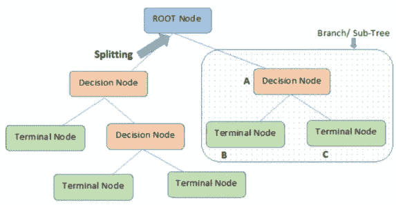

# 决策树回归

> 原文：<https://levelup.gitconnected.com/decision-tree-regression-df9e24ffe59a>

**决策树**是一种预测模型，它使用一组二元规则来计算因变量。每棵树都由树枝、节点和树叶组成。在继续之前，让我们先熟悉一些术语:

*   **根节点**代表整个群体，并被分成两个或多个同类集合。
*   一个**决策节点**是当一个子节点分裂成更多的子节点时。
*   **叶**是节点不分裂的时候。*这些也被称为“终端节点”。*

改编自:[https://gdcoder . com/decision-tree-regressor-explained-in-deep/](https://gdcoder.com/decision-tree-regressor-explained-in-depth/)

决策树会对数据提出一系列问题，每个问题都会缩小可能的值，直到模型经过良好的训练可以进行预测。这些问题完全由模型决定，包括它们的内容和顺序，并以*对/错*形式*提问。*你可能想知道，*决策树回归器模型是如何形成问题的？*决策树被归类为**监督学习模型**。监督学习模型是在给定不可预见的输入实例的情况下进行预测的模型。它基于一组已知的输入数据和已知的数据响应进行学习。决策树能够通过遍历整个树，询问对/错问题，直到到达一个叶节点来进行预测。最终预测由该叶节点中因变量的平均值给出。

## 让我们来看看这是怎么回事吧！

这是我上一篇关于简单和多元线性回归模型初学者指南的文章的延续。查看这篇文章，看看在创建房价预测模型之前，我使用了哪些数据预处理工具。

导入库、导入数据集、处理空值并删除任何必要的列之后，我们就可以创建决策树回归模型了！

***第一步:确定你的因变量(y)和自变量(* X)**

我们的因变量将是 *prices* ，而我们的自变量是数据集中剩余的列。

我们有 16 个自变量和 1 个因变量。

***第二步:将数据集分成训练集和测试集***

训练和测试分割的重要性在于，训练集包含模型从中学习的已知输出。然后，测试集根据从训练集中获得的信息来测试模型的预测。让我们看看这是怎么回事！

***第三步:在训练集*** 上训练决策树回归模型

从包含线性模型的 sklearn 包中，我们导入类 **DecisionTreeRegressor** ，创建它的一个实例，并将其赋给一个变量。的。 *fit()* 函数允许我们训练模型，根据数据值调整权重以达到更好的准确性。经过训练后，我们的模型就可以进行预测了，这就是所谓的*。预测()*法。

***第四步:预测测试集结果***

既然我们已经成功地创建了决策树回归模型，我们必须评估它的性能。

R score 通过与因变量的平均线进行比较，告诉我们模型与数据的拟合程度。如果分数接近 1，则表明我们的模型表现良好，反之，如果分数远离 1，则表明我们的模型表现不佳。

我们获得了大约 66%的准确率。如果我们将其与使用 50%的简单线性回归和 65%的多元线性回归得到的分数进行比较，并没有太大的改善。

# 结论

在本指南中，我们复习了决策树回归模型的基础知识。我们了解到以下情况:

*   决策树由分支、节点和叶子组成。
*   决策树根据模型自身产生的一组对/错问题做出预测。
*   R score 评估我们模型的准确性。

一如既往，还有改进的空间！在接下来的文章中，我将探索同一数据集上的支持向量机(SVR)和随机森林回归模型，看看哪个回归模型对房价的预测最好。

感谢您的阅读。非常感谢您的反馈！