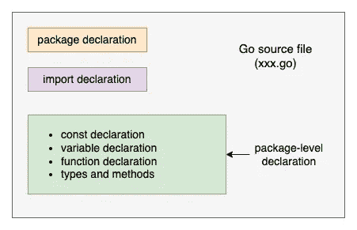
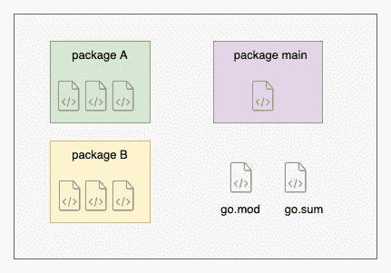

# Go 中的声明

> 原文：<https://levelup.gitconnected.com/declarations-in-go-4dcfeb2606dd>

一个*声明*命名一个程序实体并指定它的一些或全部属性。

在本帖中，我们将讨论 Go 中的各种*声明*。



Go 中的各种声明

*   包装声明
*   进口报单
*   变量声明
*   常数声明
*   函数声明
*   类型声明

# 包装声明



围棋程序的结构

Go 程序是包的组合，每个包都有一个或多个文件名以`.go`结尾的源文件

在每个源文件中，**包声明**告诉我们当前文件属于哪个包。它是位于源文件第一行的必需子句。

我们使用下面的语法来声明一个包。

```
**package** <packagename>
```

# 进口报单

要使用其他包中的标识符，我们必须首先导入它们。这是通过一个名为 *import declaration 的构造完成的。*

例如

```
package main**import (
    "fmt"
    "math"
)**func main() {
    fmt.Println(math.**Exp**(0)) // 1
}
```

包`math`中的函数`Exp`用于计算一个数的指数。包`math`需要在这个源文件的导入声明部分导入。

请记住，导入的范围是文件块。导入的标识符只能从整个文件中访问，而不能在整个包中访问。

这里有一个关于*进口报关的好帖子。*高度 *r* 建议有个样子*。*

[](https://medium.com/golangspec/import-declarations-in-go-8de0fd3ae8ff) [## 在 Go 中导入申报

### Golang 中的程序由包组成。通常，一个包依赖于其他包，无论是内置于…

medium.com。](https://medium.com/golangspec/import-declarations-in-go-8de0fd3ae8ff) 

# 变量声明

变量声明具有以下一般形式(带有可选的初始化器)。

```
**var** <identifier> <type> = <initializer>
```

*   <*标识符* >:变量的名称
*   <*类型*:变量的类型
*   <*初始化器* >:变量将被初始化的值，可选。

如果没有指定初始值，变量被初始化为该类型的零值。另一方面，如果没有指定类型，变量的类型将从初始化器中推断出来。

举个例子，

```
var s string
fmt.Println(s)   //  zero value of string is ""
```

变量`s`的声明没有初始值设定项，这使得它的字符串值为零。

变量声明的另一种形式，称为*短变量声明*，因其简洁和灵活而被广泛使用。这里有一个关于如何正确使用它的好帖子。

[](https://blog.learngoprogramming.com/golang-short-variable-declaration-rules-6df88c881ee) [## 短变量声明规则

### 如何正确使用短变量声明？](https://blog.learngoprogramming.com/golang-short-variable-declaration-rules-6df88c881ee) 

# 常数声明

const 声明定义了语法上看起来像变量但却是常量的命名值，以防止程序执行过程中的意外(或恶意)变化。

例如，常数比变量更适合存储像 pi 这样的数学值，因为不能在运行时编辑它。

```
const pi = 3.14159 // approximately; math.Pi is better
```

# 函数声明

函数声明是声明函数的语句。它由名称标识符、参数列表、可选结果列表和主体组成:

```
func <identifier>(<parameter-list>) (<result-list>) {
    // body
}
```

*   <identifier>:函数的名称</identifier>
*   <parameter-list>:指定函数参数的名称和类型</parameter-list>
*   <result-list>:指定函数返回值的类型</result-list>
*   :定义功能实现

下面是一个函数示例。它接收一个`int`变量并将其乘以 2，然后返回结果。

```
**func** tripleNumber(a int) int {     
    return a * 3
}
```

# 类型声明

一个类型声明定义了一个名为类型的新*，其基础类型*与现有类型*相同。它具有以下形式:*

```
type <identifier> <underlying-type>
```

*   <identifier>:新类型的名称。</identifier>
*   <underlying-type>:新类型所基于的类型。</underlying-type>

我们来举个例子。

```
package mainimport (
 "fmt"
)// Celsius is a temperature in the Celsius scale.
type Celsius float64func (c Celsius) String() string { return fmt.Sprintf("%g°C", c) }func CToF(c Celsius) Fahrenheit { return Fahrenheit(c*9/5 + 32) } // Fahrenheit is a temperature in degrees Fahrenheit.
type Fahrenheit float64func (f Fahrenheit) String() string { return fmt.Sprintf("%g°F", f)}func FToC(f Fahrenheit) Celsius { return Celsius((f - 32) * 5 / 9) }func main() { var c Celsius = 40
    var f Fahrenheit = CToF(c)
    fmt.Println(c, f)
}
```

在上面的例子中，我们声明了两种类型:摄氏*类型和华氏*类型。**

*   尽管它们是不同的类型，但它们都有相同的基础类型，float64。
*   它们都实现了 string 接口，所以我们可以使用函数`fmt.Println`以人类可读的格式打印它们。
*   它们都声明了从一种类型转换到另一种类型的函数。

请记住，命名类型提供了一种方法，可以将基础类型的不同用法(也许是不兼容的用法)分开，这样它们就不会被无意中混合在一起。

我希望你喜欢读这篇文章😄。

如果你想支持我☕作为一个作家，考虑注册[成为一个媒体成员](https://jerryan.medium.com/membership)。你还可以无限制地访问媒体上的每个故事。