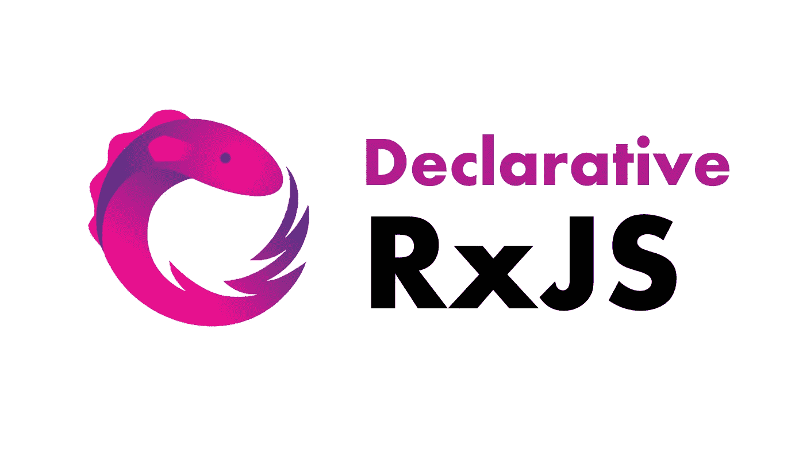

# 带有自定义运算符的声明性 RxJS

> 原文：<https://levelup.gitconnected.com/declarative-rxjs-with-custom-operators-2d1892bb1b4b>



通常，当需要大量管道操作符时，RxJS 流会变得有点混乱和不可读。这种不可读取性的一个原因是这些 RxJS 流的命令性。因此，通过使用自定义操作符使它们成为声明性的，会使您的流更加清晰易读。

本文原帖[**ng-journal.com**](http://ng-journal.com)

[](https://ng-journal.com/blog/2022-12-12-declarative-rxjs/) [## 带有自定义运算符的声明性 RxJS

### 通常，当需要大量管道操作符时，RxJS 流会变得有点混乱和不可读。…的一个原因

ng-journal.com](https://ng-journal.com/blog/2022-12-12-declarative-rxjs/) 

# 声明式编程与命令式编程

不一定专门针对 Angular 或 Typescript，关于声明式编程与命令式编程的讨论是所有编程语言的普遍讨论。其核心是让代码更自然地可读，缺点是提取更多的代码。一般来说，声明式方法被认为更简洁，因为它可读性更好。它基本上通过函数提取隐藏了许多底层细节，并定义了非常明确和易读的函数名。

```
// Imperative

const arr = [1, 2, 3, 4, 5, 6];
const even = [];

for (const item of arr) {
  if (item % 2 === 0) {
    even.push(item);
  }
}

console.log(even); // 2, 4, 6
```

```
// Declarative

const arr = [1, 2, 3, 4, 5, 6];

const even = arr.filter(item => isEven(item));

console.log(even); // 2, 4, 6

function isEven(value: number): boolean {
  return value % 2 === 0;
}
```

这两个例子都是完全有效且可执行的代码，但后者在可读性方面更好，因为它将许多低级功能提取到具有显式命名的不同函数中。但是这个概念怎么翻译成 RxJS 呢？所有 RxJS 代码本质上不都是声明性的吗？是的，但也不是…

我们使用管道操作符，并以任意顺序将它们链接起来，这本身就是声明性的，但是当在操作符中添加更多的逻辑时，它往往更具有命令性。为了防止命令式范式，我们可以创建自定义管道操作符，并将逻辑提取到其中。

# 自定义管道操作符

编写自定义操作符比人们想象的要容易得多。最简单的算子就是得到一个可观测值并返回一个可观测值的函数。因此，我们可以简单地返回传递的可观察值，然后通过管道传递并添加一些操作符。但更准确地说，我们应该写一个高阶函数，它返回一个函数，然后这个函数得到一个可观测值，并返回一个新的可观测值。这一句话包含了很多意思，但不要担心，因为下面的代码会对此做更好的解释:

```
export function log<T>(): (source$: Observable<T>) => Observable<T> {
  return (source$) => source$.pipe(tap(console.log));
}
```

我们使用泛型，这样就不会通过我们的自定义管道操作符改变类型。然后我们返回一个匿名函数来获取 source$，它基本上只是外部的可观察对象，然后返回它的一个管道。

# 例子

这个例子包含了一个表单控件，用户可以在其中输入计算数字的命令。这样的命令可能如下所示:

*   添加，1，2，3，4
*   减去，1，1，1，2
*   相乘，3，4，5

在重构之前，result$ stream 非常大，在一个地方包含了所有的逻辑。因此，不仔细看就不容易开始阅读。重构之后，result$ stream 更具声明性，因为自定义管道操作符隐藏了实现细节，只告诉它们的名字，操作符在做什么。因此，直接阅读很简单，无需处理底层实现细节。

# 一.以前

```
result$ = this.control.valueChanges.pipe(
  debounceTime(800),
  distinctUntilChanged(),
  filter((v): v is string => !!v && typeof v === 'string'),
  map((v) => v.split(',')),
  filter((v) => v.length >= 1),
  map((v) => {
    if (v[0] === 'add') {
      return v
        .slice(1)
        .map((v) => +v)
        .reduce((acc: number, current: number) => {
          return acc + current;
        }, 0);
    } else if (v[0] === 'subtract') {
      return v
        .slice(1)
        .map((v) => +v)
        .reduce((acc: number, current: number) => {
          return acc - current;
        }, 0);
    } else if (v[0] === 'multiply') {
      return v
        .slice(1)
        .map((v) => +v)
        .reduce((acc: number, current: number) => {
          return acc * current;
        }, 1);
    }
    return null;
  })
);
```

# 二。在...之后

```
import {
  assertNumber,
  assertString,
  command,
  lookAhead,
  split,
} from './custom-operators';

[...]

result$ = this.control.valueChanges.pipe(
  lookAhead(),
  assertString(),
  split(),
  command(),
  assertNumber()
);
```

```
export function lookAhead<T>(): (source$: Observable<T>) => Observable<T> {
    return (source$) => source$.pipe(debounceTime(800), distinctUntilChanged());
  }

  export function assertString(): (
    source$: Observable<unknown>
  ) => Observable<string> {
    return (source$) =>
      source$.pipe(
        filter((value): value is string => !!value && typeof value === 'string')
      );
  }

  export function assertNumber(): (
    source$: Observable<unknown>
  ) => Observable<number> {
    return (source$) =>
      source$.pipe(
        filter((value): value is number => !!value && typeof value === 'number')
      );
  }

  export function split(): (source$: Observable<string>) => Observable<string[]> {
    return (source$) =>
      source$.pipe(
        map((v) => v.split(',')),
        filter((v) => v.length >= 1)
      );
  }

  export function command(): (
    source$: Observable<string[]>
  ) => Observable<number | null> {
    return (source$) =>
      source$.pipe(
        map((v) => {
          if (v[0] === 'add') {
            return v
              .slice(1)
              .map((v) => +v)
              .reduce((acc: number, current: number) => {
                return acc + current;
              }, 0);
          } else if (v[0] === 'subtract') {
            return v
              .slice(1)
              .map((v) => +v)
              .reduce((acc: number, current: number) => {
                return acc - current;
              }, 0);
          } else if (v[0] === 'multiply') {
            return v
              .slice(1)
              .map((v) => +v)
              .reduce((acc: number, current: number) => {
                return acc * current;
              }, 1);
          }
          return null;
        })
      );
  } 
```

# GitHub 知识库

您可以在页面底部找到 GitHub Repo 链接:

[](https://ng-journal.com/blog/2022-12-12-declarative-rxjs/) [## 带有自定义运算符的声明性 RxJS

### 通常，当需要大量管道操作符时，RxJS 流会变得有点混乱和不可读。…的一个原因

ng-journal.com](https://ng-journal.com/blog/2022-12-12-declarative-rxjs/) 

# 谢谢你🤗

感谢您阅读本文！我希望你喜欢它，并能学到一些新的和有趣的东西。如果你还有任何问题，请不要犹豫，通过 [Twitter](https://twitter.com/StefanvHaas) 或 [LinkedIn](https://www.linkedin.com/in/stefan-haas-686a921b4/) 联系我进行讨论。

[](https://medium.com/@stefan.haas.privat/membership) [## 通过我的推荐链接-斯特凡·哈斯加入媒体

### 阅读斯特凡·哈斯的每一个故事(以及媒体上成千上万的其他作家)。您的会员费直接支持…

medium.com](https://medium.com/@stefan.haas.privat/membership)