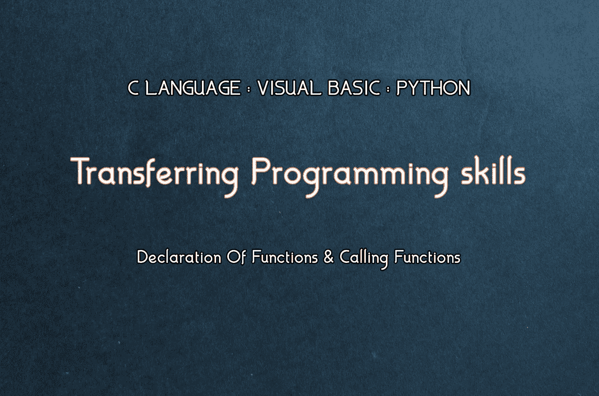
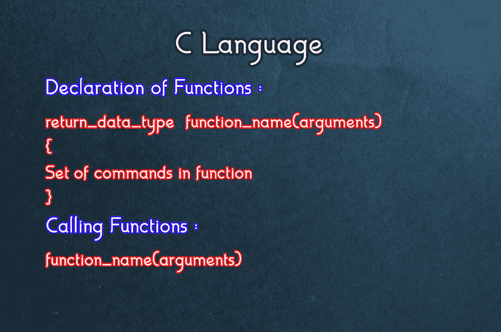
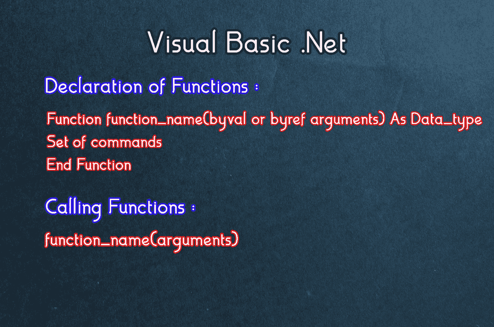
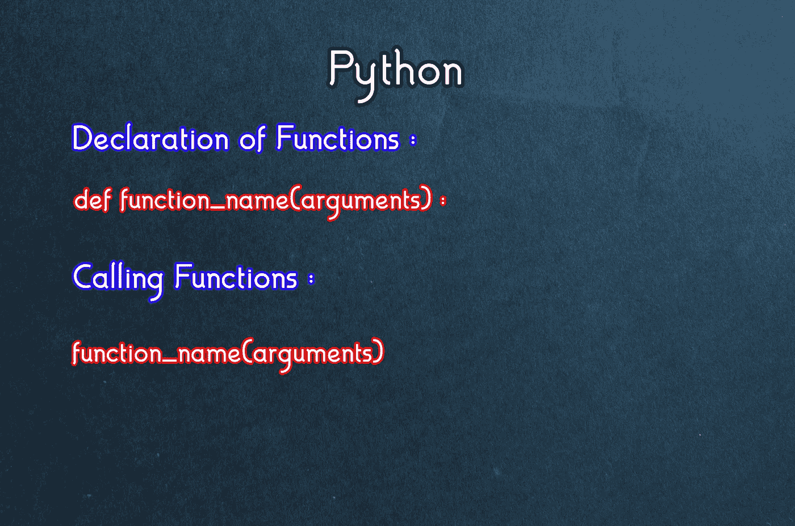

# 声明并调用 F()

> 原文：<https://levelup.gitconnected.com/declaring-calling-f-333592b8b8e4>

转移编程技能

## 从 C 语言→可视化 Basic.Net→Python

## 通过对比了解任何初学者如何用这三种语言声明函数并调用它们。

**功能**可以定义为执行特定任务的小代码块。函数主要用于减少代码中命令的重复。程序员可以在函数中编写不同的命令集，并在必要时调用它们，而不是重写整个命令集。

这里我们将学习如何用这三种语言在程序中声明和调用函数。

在我们继续下一步之前，您应该查看一下我关于基础知识的文章:

 [## 转移编程技能:基础

### 了解任何初学者如何通过比较将其编程技能从一种编程语言转移到另一种编程语言。

medium.com](https://medium.com/swlh/transferring-programming-skills-basics-92c3d7e17c3b) 

这将帮助你理解一些基础知识，如头文件、变量声明和用户输入输出命令。

> *“简单是效率的灵魂。”——奥斯汀·弗里曼*

C 语言中的函数声明和调用函数

# 对于 C 语言:

让我们理解语法，然后在任何 basic 程序中应用它，以便更好地理解。

首先，在 main() (main function)之外，我们必须声明函数，以便稍后在代码中使用它。

我们要知道函数返回值的数据类型。如果我们希望函数返回整数值，那么我们通过放置“int”→return _ data _ type 来声明函数。之后我们可以给函数起任何名字，假设我们把它命名为 add()。在括号中，我们写下将作为函数输入的参数，例如 add( int firstnum，int secondnum)。现在我们用花括号写一组命令，这就是函数的声明方式。

为了调用函数，我们只需要使用函数名和输入参数。例如，前面我们声明了一个函数:

**int add( int firstnum，int secondnum )**

**{**

**命令集**

**}**

然后，让我们想象我们在花括号之间写了一组命令，并声明了函数。要调用我们刚刚声明的函数:

**add ( firstnum，second num)；**

类似地，如果我们想将返回值存储在任何其他变量中，我们只需使用“=”对其赋值。

在 Visual Basic 中声明函数和调用函数。网

# 对于可视 Basic.Net:

在我们开始解释语法之前，我们应该知道“ **byval 和 byref** 是什么意思。

Byval 代表按值，byref 代表按引用。在 visual basic 中，使用函数时，byval 是默认值。Byval 表示当函数被调用时使用变量的副本，所以当函数中的变量被修改时，它不会改变函数外变量的值，而在 T2 ByRef T3 中则完全相反。使用对变量的引用，当函数被调用并且变量在函数中被修改时，它也在函数外修改变量的值。

现在让我们理解语法。首先，为了声明函数，我们必须在 visual basic 中使用“函数-结束函数”。所以首先我们写函数，然后我们写我们选择的函数名。再说说 add()。我们将使用 byval，并有两个参数，就像在 C 语言中，我们也希望整数输出。因此，函数声明将是:

**函数加法(ByVal first 为整数，ByVal secon 为整数)为整数**

**命令集**

**结束功能**

要调用该函数:

**添加(第一个，第二个)**

而如果我们要把返回值赋给任何一个变量，我们首先声明 variable，用“=”赋值。

python 中的函数声明和调用函数

# 对于 Python:

就我个人而言，我觉得 python 很难，这可能是因为我从视觉 Basic.Net 开始，并对它产生了极大的兴趣。python 中很少有事情是非常简单的，但这同样取决于程序员的选择和偏好。

为了在 python 中声明一个函数，你只需要先写“def”。就像 visual basic 里有“函数-结束函数”一样，python 里有“def”。然后我们写我们选择的函数名，在括号中我们只写参数，不需要在 python 中声明参数，这取决于程序员的选择，他们是否想返回任何值。假设我们在 python 中声明函数 add，下面是如何声明:

**def add(x，y):**

在大多数语言中，调用函数的语法几乎是一样的。要调用我们声明的函数:

**加(x，y)**

如上所述，为了在变量中存储返回值。我们只需使用“=”将返回值赋给变量。

希望你通过比较学会了如何在这三种语言中声明和调用函数。

记住，

> “经验是每个人给自己的错误起的名字。”—奥斯卡·王尔德

 [## 转移编程技能:基础

### 了解任何初学者如何通过比较将其编程技能从一种编程语言转移到另一种编程语言。

medium.com](https://medium.com/swlh/transferring-programming-skills-basics-92c3d7e17c3b)  [## 转移编程技能:制作自己的计算器

### 通过比较了解任何初学者如何使用不同编程语言中的算术运算。

medium.com](https://medium.com/swlh/transferring-programming-skills-make-your-own-calculator-f9d5db43418)  [## 三思:自杀还是自残

### 生活是一条充满障碍的道路。如果你被任何障碍物撞倒，你不必自残或自杀。

medium.com](https://medium.com/blueinsight/thinking-twice-suicide-or-self-harm-8bcc418228b9)  [## 在线教育为什么是一个失败的选择？

### 这个世界没有为这样的疫情做好准备，而受害最深的群体是学生。

medium.com](https://medium.com/@khizarzaidi18/online-education-a-failed-alternative-5b0b9921a629)  [## 通过 Uptrennd 挣钱:一个被忽视的加密货币平台。

### 你想赚闲钱吗？Uptrennd 是一个加密货币赚取平台。一个平台，其功能相当于大多数…

medium.com](https://medium.com/predict/uptrennd-an-overlooked-cryptocurrency-platform-4580c2490d01)  [## 用善行终结种族主义

### 我曾经是个种族主义者，但他的行为彻底改变了我。

medium.com](https://medium.com/illumination/ending-racism-by-good-acts-90ac1e806348)