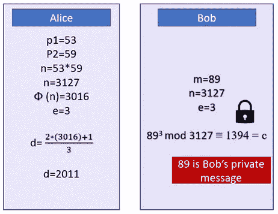

# 解密 RSA 算法

> 原文：<https://levelup.gitconnected.com/decoding-the-rsa-algorithm-ecc5caca1392>

## 密码术系列 III —如何手动生成 RSA 密钥对？

我相信你听说过 RSA。如果你没听说，我可以告诉你，你今天已经在电脑上用 RSA 了！RSA 是关于什么的？数字签名！RSA 加密几乎无处不在，包括比特币和大多数区块链！

在本密码学系列的前两篇文章中，我已经谈到了:

*   随机数:区块链最重要的东西！和
*   [质数——以及为什么区块链不能没有质数！](https://henriquecentieiro.medium.com/prime-numbers-and-why-blockchains-cant-exist-without-them-f629bdc54bb3)

如果您想了解关于强私钥的更多信息，也请阅读那些文章！

RSA 被用作加密方案和数字签名，用于电子邮件、网站消息、聊天应用程序和许多其他类型的通信中，以保护消息。当然，这在区块链世界也很重要。

RSA 加密算法是由罗恩·里弗斯、阿迪·萨莫尔和伦纳德·阿德曼于 1978 年发明的。RSA 使用公钥基础架构和数字签名实施非对称加密。RSA 是全球最常用的公钥算法，也是人类历史上被复制最多的软件。每个互联网用户每次进行在线交易或支付时都会使用 RSA，我们每次签署区块链交易或向某人发送比特币时也会使用它。

在公钥加密中，生成两种密钥:可以与任何人共享的公钥和只有其所有者知道的私钥。公钥用于加密数据，私钥可以解密数据，这意味着只有拥有相应私钥的用户才能解密数据或签署交易。在交易交换中，两个用户都生成用作数字签名的公钥/私钥对。

你可以从下面的方式看到这个加密系统:

1.  爱丽丝有一把锁和相应的钥匙(公钥是锁，私钥是锁的钥匙)
2.  她给鲍勃发了一把打开的锁
3.  鲍勃把信息放进锁里，然后把它送回给爱丽丝
4.  爱丽丝可以用她的私人钥匙打开锁。

在这种公钥基础设施中，用户的数字签名用于验证交易签名的真实性，从而提供了一种安全的方式来检查用户的交易是否由其拥有的私钥签名。任何人都可以使用收件人的公钥发送消息，只有收件人才能用他的私钥打开消息。

这就是 [**质数**](https://henriquecentieiro.medium.com/prime-numbers-and-why-blockchains-cant-exist-without-them-f629bdc54bb3) 和 [**随机数**](/random-numbers-the-single-most-important-thing-in-blockchain-e850d4e23a51) 发挥作用的地方。

RSA 签名是非常安全的，因为它们是由很难分解的大素数的乘法运算生成的。RSA 概念由 4 个步骤组成:生成密钥、分发密钥、加密数据和解密数据。

为什么随机数很重要？我们看到的随机数将帮助我们选择大素数，我们将使用这些大素数来生成 RSA 密钥。在得到随机数(一个巨大的数)后，如果这个随机数不是一个质数，函数将搜索下一个最接近的质数。

让我们看看生成 RSA 密钥对的步骤:

1.  生成一个随机数。尝试使用随机数生成器。这个数字需要很大，比如 154 位数或者 10 个⁵⁴
2.  如果随机数不是质数，使用函数 *nextprime()* 选择最接近的质数。另选一个质数。让我们称这两个质数为 **p1** 和 **p2**
3.  得到 p1 和 p2 的乘积，即 N = p1 x p2，如你所见，这个合数 N 将超过 300 位数，因为你要乘以 2 个大质数
4.  得到φ或φ:φ(N)(欧拉定理)，用 P1–1 和 p2–1 代替素数，并相乘:φ(N)=(P1–1)x(p2–1)。注意φ是一个数的“可破性”。给定 n，φ测量有多少小于或等于 n 的整数不与 n 共享任何公因数。例如φ8 = 4。计算φ在一种情况下很难预料。任何素数的φ总是 P1–1。一旦有了φ(N)=(P1–1)x(p2–1)，如果有了 N 的因式分解，那么求φ(N)就很容易了。比如 77 =7x11 的质因数分解。
5.  选择一个指数。选 e:1 < e < Phi(N)
6.  Lock: Lock (N,e)
7.  Chose private key: choose d:d x e mod Phi(N) = 1
8.  Key: your key result is (d, N), where d is the private key and N is the public key

In step 5, we connect the phi (Φ) function to modular exponentiation, exploring [欧拉定理](https://en.wikipedia.org/wiki/Euler's_theorem)phi 函数与模幂运算的关系:*m^φ(n)≡1 mod n*。

这意味着我们可以选择任意两个没有公因数的数字，比如 5 和 8，并替换等式中的 m 和 n:

*5^φ(8)≡1 mod 8*

也就是 625 1 mod 8

现在我们可以稍微改变一下，我们得到

*m^k*φ(n)+1≡m mod n 或 m^e*d ≡ m mod n 也就是 e * d = k *φ(n)+1*

现在很容易计算 d，只要知道 n 的因式分解:

我们需要这个来签字！

意味着 d 是私钥！

让我们做一个简单的例子来看看 Alice 和 Bob 之间的关键点。

Alice 将生成两个素数，p1 和 p2(为了便于举例，让我们挑选两个小素数)并将它们相乘得到 n。

正如你在下面的例子中看到的，我们“随机选择”的素数是 53 和 59。我们将它们相乘，得到 n=3127。这个 n 是爱丽丝的公钥。

然后，Alice 很容易计算，因为她知道 n 的因式分解，结果是 3016。然后，她选择了一个“公共”指数，这个指数必须是奇数，而且不能与本例中的 3 相同。最后，她找到了自己的私钥值 *d* 。如你所见，爱丽丝的私钥是 2011 年。

现在她有了 *d* ，私钥和 *n* 和 *e* 是公钥。 *n* 和 *e* 就像一把打开的锁，她可以送给 Bob！在这个例子中，Bob 的消息只是数字 89。所以我们有 m=89。现在，Bob 可以发送一条消息 *m* ，通过计算 m 的 e 次方 mod n，在数学上锁定该消息。这里，m 是 Bob 的消息，让我们将这个新的“c”称为 Bob 的加密消息。这样，Bob 就用 Alice 的公钥 n 和 e 加密了他的消息！

现在 Bob 将 c(加密的消息)发送回 Alice，Alice 将使用她的私钥 d 解密该消息。

请注意，其他任何人最终都可以听到他们交换的消息(中间人攻击)。然而，如果没有 c、n 或 e，他们就找不到指数 d，而指数 d 是解密消息所必需的私钥。这是加密消息的聪明方法。

正如你所看到的，还需要很多很多年才能发现相乘得到 n 的两个质数。要发现如此大的数的因式分解(RSA 至少有 200 个十进制数字(663 位)长)，需要花费 10000000 长的时间，这在计算上是不可行的。即使是量子计算机也可能需要很长时间才能破解 1024 位 RSA 密钥。

我有一个挑战给你:按照 RSA 算法，手动签名一个解密一个消息自己！

**🚀跟着我，也请查看我的🧱区块链课程:**

**🐶** [**有史以来第一个 Dogecoin 课程**](https://www.udemy.com/course/-dogecoin-course-the-first-complete-dogecoin-course/?referralCode=9416B1408224CE309DD8)

**👨‍🎓** [**Fintech、云和网络安全课程**](https://www.udemy.com/course/fintech-technologies-cloud-and-cybersecurity/?referralCode=F1D4EA005A2881735A36)

**📖** [**完整的 NFTs 教程**](https://www.udemy.com/course/the-complete-nft-course-learn-everything-about-nfts/?referralCode=AAEE908D13D0E2276B19)

**👨‍🎓** [**Unblockchain 课程**](https://www.udemy.com/course/blockchain-deep-dive-from-bitcoin-to-ethereum-to-crypto/?referralCode=B8463EE382E6D313304B) **—脑洞大开的区块链课程**