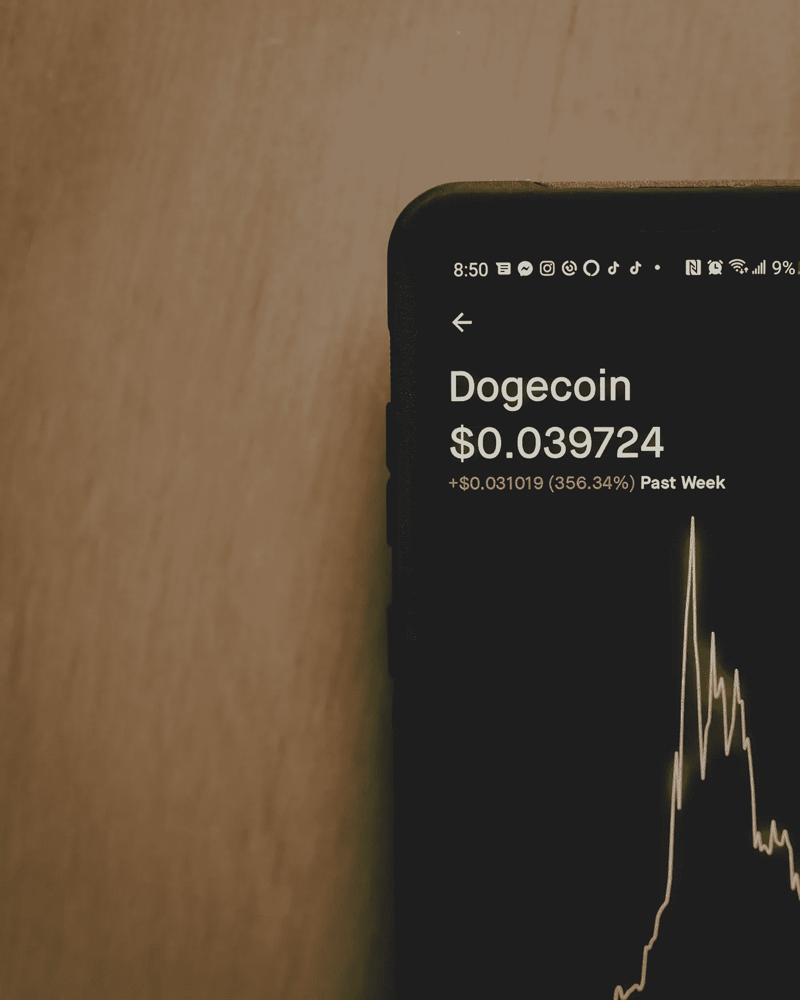

# 解构 doge coin——并非所有加密货币都是平等的

> 原文：<https://levelup.gitconnected.com/deconstructing-dogecoin-not-all-cryptocurrencies-are-equal-ee347b29700f>

## 当影响者同时传播热情和困惑时

[粘土银行](https://unsplash.com/@claybanks?utm_source=unsplash&utm_medium=referral&utm_content=creditCopyText)在 [Unsplash](https://unsplash.com/s/photos/investment?utm_source=unsplash&utm_medium=referral&utm_content=creditCopyText) 拍摄的照片

谈到加密货币，埃隆·马斯克有很多问题要回答。他用一条推特就能影响数百万人的能力，一定让全世界想要影响他的人羡慕不已。

他是比特币世界中少数几个名字经常出现在头条的关键人物之一。他最近更改了他的 Twitter 个人资料，直接显示为“比特币”——仅这个手势就促使单个比特币的价格今年第二次攀升至 40，000 美元以上。

[埃隆热爱比特币](https://twitter.com/elonmusk/status/1359791422711492608?s=20)

原来，通过他的滑稽动作，他在取笑特斯拉正在将其公司金库的 15 亿美元投资于比特币。这笔投资在媒体上公布后，价格攀升，并继续逼近 50，000 美元。

对于像我这样的比特币投资者来说，这样的干预和影响是受欢迎的。大规模的企业支持将比特币带入了公众话题，这有望鼓励人们接受这方面的教育。这反过来应该有助于比特币被更广泛地接受，或者至少被更普遍地容忍。对于那些长期持有的人来说，这种增值也是受欢迎的。

然而，他的热情并不局限于比特币。最近几周，埃隆定期在推特上表达他对另一种加密货币 Dogecoin 的喜爱。

[埃隆·马斯克对多吉非常尊重](https://twitter.com/elonmusk/status/1357236825589432322?s=20)

# 市值 80 亿美元的“笑话”

如果比特币在汽车领域类似于特斯拉 Model S，那么 Dogecoin 似乎就相当于[Herbie](https://en.wikipedia.org/wiki/Herbie)——迪士尼电影中有自己思想的大众甲壳虫。它最初是为了娱乐它的创造者，而不是出于创造新的或真正有用的东西的严肃愿望。

我不会试图套用维基百科上 Dogecoin 的定义，而是直接引用它:

> “Dogegoin 是由软件工程师比利·马库斯和杰克逊·帕尔默发明的，他们决定创建一个即时、有趣、免于传统银行费用的支付系统。Dogecoin 以“[Doge](https://en.wikipedia.org/wiki/Doge_(meme))”[meme](https://en.wikipedia.org/wiki/Internet_meme)中的[柴犬](https://en.wikipedia.org/wiki/Shiba_Inu)的脸作为其标志和同名物
> 
> ——[维基百科](https://en.wikipedia.org/wiki/Dogecoin)

比特币被认为是为数字货币建立了一个全新的范式——一个不受监管和去中心化的金融系统和一个新的防通胀数字价值存储。Dogecoin 最初被认为是一个笑话。

# 不仅仅是一个迷因

和比特币一样，Dogecoin 自推出以来也疯狂增长。

虽然它的市值大约是比特币的百分之一，但存在的比特币要多得多——在总共 1270 亿个比特币中，有 1130 亿个已经被挖掘出来，相比之下，在 2100 万个比特币中，只有大约 1960 万个比特币。虽然它是基于幽默而创建的，并以一个迷因命名，但很明显，Dogecoin 有一个严肃而有效的位置。

自从 2013 年提出概念以来，它已经发展到允许 Dogecoin 用户之间交换点对点支付。它现在也在密码交易所广泛交易。2021 年 1 月，部分由于埃隆·马斯克和他的恶作剧推文(以及 GameStop 事件的影响)，Dogecoins 的价值攀升了 800%。它拥有一批狂热的所有者和用户，许多人都热衷于买卖它，以利用马斯克在 Twitter 上的评论引发的繁荣。

Dogecoin 只是数百种不同的所谓替代硬币中的一种，但就价值和可信度的相对规模而言，它接近比特币和以太坊。在概念层面上，替代硬币更类似于货币代币，被其用户群承认拥有价值，并可以在点对点的基础上进行交换。我认为它们是数字化和加密版本的游乐场代币、垄断货币或比特币是“严肃”货币——美元、欧元或英镑。

在未来，替代硬币在取代全球金融体系的内部运作方面可能不会发挥那么积极的作用，但尽管如此，它们仍可能有一席之地。毕竟，我们的世界已经在不依赖单一货币的情况下存在了数百年——为什么不应该有多种加密货币的空间呢？

我对 Dogecoin 或其他加密货币没有任何特别的问题。相对而言，我是加密投资的新手，我已经决定听从许多人的建议，即比特币和以太坊是目前的两个主要参与者——在试图了解它们的工作原理后，这是我唯一感到放心的投资。但这并不意味着我忽视了与替代硬币相关的可能性([以及不可避免的，欺诈风险的增加](https://www.cnet.com/features/beyond-bitcoin-the-wild-world-of-altcoin-cryptocurrency-trading/))。

投资者已经能够通过投资 Dogecoin 这样的公司获得丰厚的利润，这应该有助于巩固加密货币作为未来金融系统一部分的地位。

# 谁把狗放出来了(这有帮助吗？)

我对 Dogecoin 唯一的担心是，当埃隆马斯克和其他不太可能的名人，包括史努比道格和吉恩·西蒙斯(前摇滚乐队 Kiss)在与比特币相同的氛围和背景下提到它时，它无助于更广泛的世界看待加密货币的严肃性。集体的理解和相互的接受在密码世界中是很短暂的。

[探听犬](https://twitter.com/SnoopDogg/status/1358141965930426368?s=20)

大多数人对比特币的理解和参与程度一开始就相对较低。许多人似乎决心抓住它的缺点和弱点，并愤怒地将这些作为比特币是一种不可信的时尚的原因。

恐惧和冷嘲热讽主导了加密怀疑论者，许多评论者(包括那些被认为拥有权威和知识的人)很快就利用“笑话加密货币”Dogecoin 的性质作为贬低和破坏比特币的理由。

# 最终想法

加密货币社区非常喜欢埃隆·马斯克，他显然相信比特币将在未来发挥重要作用。特斯拉将很快接受比特币支付其电动汽车也证明了这一点——这不仅仅是他在 Twitter 上寻求人气的一个例子。

作为一名加密投资者，在我有限的时间里，我观察到这个领域里有很多[两极分化的观点](https://medium.com/in-bitcoin-we-trust/why-does-bitcoin-attract-extreme-emotions-and-reactions-a200cf1f456c)。那些热爱并相信它的人热情地发声。那些不信任它、不相信它有未来的人也同样直言不讳。

由于其去中心化的性质，加密货币没有任何个人或实体来管理它，这被视为一个积极因素。但同样，也没有一个负责让公众参与进来的中央营销部门。因此，我认为我们都有帮助彼此更好地理解它的既得利益，我只是不确定将一种更具争议性和滑稽的加密货币与比特币相提并论是否有帮助？

综上所述，在研究和撰写这个故事的过程中，我对 Dogecoin 有了更多的了解。如果马斯克、西蒙斯和多格先生略带挑衅的推文可以被认为鼓励了我和其他人更多地了解 Dogecoin，那么他们如此直言不讳也许并不是那么糟糕！

注意:*本文仅供参考。不应将其视为财务或法律建议。在做任何重大财务决定之前，先咨询财务专家。*

## [***如果你喜欢这篇文章，我希望你能加入我的邮件列表。***](http://bit.ly/TobyHazlewoodList)