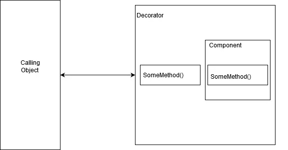

# 装饰设计模式

> 原文：<https://levelup.gitconnected.com/decorator-design-pattern-4a9ca2c51061>

## 流行设计模式的实际实现。

照片由 [Fotis Fotopoulos](https://unsplash.com/@ffstop?utm_source=medium&utm_medium=referral) 在 [Unsplash](https://unsplash.com?utm_source=medium&utm_medium=referral) 上拍摄

让我们从一个概念图开始，图示将帮助我们理解流程。

装饰设计模式的概念图

类 ***DecoratorOne*** 正在注入一个 ***IComponent*** 接口。这允许您注入您想要添加的任何行为，例如，传递您想要装饰的对象。

所以 ***DecoratorOne*** 就是充当装饰的包装器。在上图中，您可以看到 Decorator 类保存了对被修饰对象的引用。在这种情况下，是一个组件类。

不仅我们的 ***DecoratorOne*** 类是-A***I component***而且它还有-A***I component***。这是因为 decorator 类实现了与原始 Component 类相同的接口，所以它现在有机会拦截接口上的任何方法调用，并向这些调用中注入一些额外的行为。

举个例子，我们点一份晚餐。

1.  订购比萨饼:接口 Ipizza
2.  晚餐:班级晚餐:伊皮扎
3.  添加百事可乐:班级聚餐:Ipepsi
4.  添加意大利面:班级晚餐:Ipasta

最后，我们点了一份晚餐，有披萨、百事可乐和意大利面。我们不断地注入新的需求，不断地修饰旧的类，以获得额外的东西。

所以当你听到 decorator 这个词的时候，你真正在做的是设计一系列的对象，这些对象可以互相包装，并根据需要注入行为。

事实上，您可以一起定义和使用多个装饰器对象，这样您就可以在原始对象周围拥有一个分层结构，就像洋葱一样。

每个 decorator 类都可以定义不同的行为，所以您保持了关注点的强烈分离。

装饰设计模式的概念

因为所有的 decorator 类都实现了与原始对象相同的接口，所以您不必修改任何客户端代码来添加这些不同的新行为。

让我们从代码开始，实现以下设计:

智能手机的一个例子

让我们添加界面 IMobile:

接下来，添加另一个接口 IAndroid:

现在，对于 Android 类的默认实现，让我们通过函数返回一些字符串和值。

最后，我们需要一个装饰类，为函数添加额外的信息。

observer 覆盖的方法向注入的类添加了额外的信息，因此这是一种 IS-A & HAS-A 关系。

让我们通过程序调用它。

运行应用程序，看看神奇之处。

# 万岁！！！

如您所见，它是两个对象的组合。一个默认实现&另一个装饰默认对象。

能够在这种分层结构中将对象分层，然后拦截和修改方法调用是一个非常强大的想法，因为它允许我们分离关注点，并在新需求出现时动态添加新功能。因此，当您使用装饰模式时，请记住这些想法。

我希望你从这篇文章中有所收获，祝你好运。

干杯！！

 [## Rikam Palkar -软件工程师-小天鹅-威德福| LinkedIn

### 通过编写可伸缩的代码让世界变得更美好。我从来没有在大学里发现我对编码的热情，也没有在…

www.linkedin.com](https://www.linkedin.com/in/rikampalkar/)