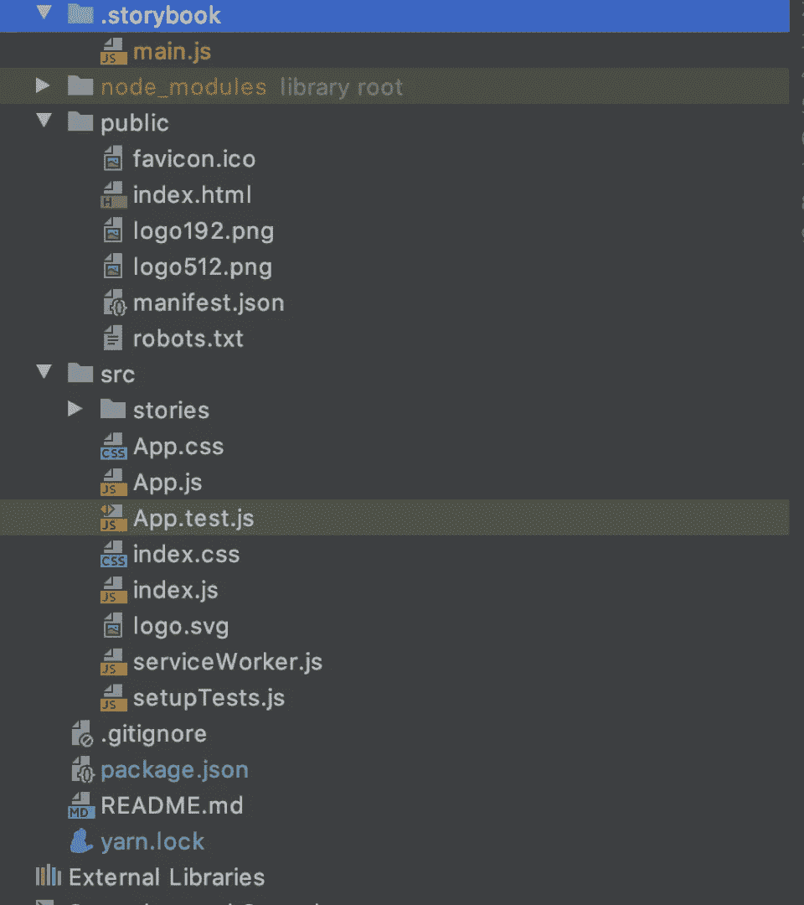

# 为初学者解耦大型 React 项目

> 原文：<https://levelup.gitconnected.com/decoupling-big-react-projects-for-beginners-bd15000f1af5>

在这篇文章中，我想分享我如何从一个大项目中分离出一些重复的逻辑，如何托管私有 npm 模块，如何创建一个合适的持续集成以及这样做可能会遇到的所有问题。

几个月前我开始了一份令人兴奋的新工作，产品非常棒，非常有趣，是每个开发人员的梦想——我们建立一个物联网平台。在我参与之前，该项目是一个客户可能会感兴趣的概念的生产证明。他们做到了🎉。因此，我公司里聪明的业务人员想:如果这个产品在一个物联网设备上卖得很好，为什么不为其他设备制作多个实例呢？

我来了，我的工作是尽可能多地分离可重用项目中的公共逻辑。我有两项任务:

1.  分离所有的用户界面组件，并用我们公司的颜色重新命名
2.  将这个完全独立的项目分离出来，这个项目中有复杂的业务逻辑。它有 Redux 和中间件，但也存在于我们将拥有的每个其他项目中。它被用作一个插件。

我们的小项目将组装 Voltron:)

所以经过简短的讨论，我们决定创建我们自己的本地托管的 npm 模块，并将它们安装在我们未来的项目中。


我们的目标项目结构。

# 解耦 UI 项目

对于这个项目，我决定用 Storybook 进行开发。Storybook 是一个很棒的 UI 元素界面。它适合于设计驱动的开发，并且符合我们正在构建的产品的规格。

网上和媒体上有很多关于故事书是什么以及为什么它是一个很棒的开发工具的信息，所以我不会花时间去推销它。对不熟悉它的人来说，一个非常简单的介绍是:Storybook 是一个组件风格的游乐场。它展示了组件及其在隔离环境中的行为。

我们从这个项目中得到的重要的东西是:

1.  有一个专门的空间来查看我们的组件(Storybook 的主要目标)
2.  有一个简单的方法来构建这些组件，这样我们就可以将它们导入到我们的主项目中。

我将继续讨论如何安装 Storybook 和编写故事，所以如果你知道所有这些，或者你只是对如何创建一个 npm 模块感兴趣，就跳过这一节。结尾将用三个点(…)标记。

说到这里，决定如何开始你的故事书是很重要的。当你打开它的文档时，你会看到一个选项:用 create-react-app 启动它。但是你还有一个:手动配置。我更喜欢后者，因为我想尽可能多地控制这个项目。我对这个过程进行了充分的思考，使自己形成了“利弊”表:


我对创建 React 应用程序与手动配置的看法。

如果你决定使用 **Create React App** 解决方案，那就再简单不过了。只需输入您的终端:

```
cd my-library-directory
npx create-react-app my-library-name
npx -p @storybook/cli sb init
```

Storybook 是智能的，例如，它会检测 CRA 是否被使用，并将安装在 react-scripts 给你的结构之上。项目结构将如下所示:



带故事书的 CRA

您将获得 react 脚本的所有好处，如测试脚本、配置等等。

**手动**配置并不难，虽然。这就像跑步一样简单:

```
cd my-library-directory
npm init // follow the prompt to set up a new package.jsonnpm i @storybook/react -D // adds the react instance of storybooknpm i react react-dom -D // add the react dependenciesnpm i babel-loader @babel/core -D // add babel as dependency
```

之后，我们需要在我们的 package.json 中添加一个启动脚本

```
{
  "scripts: {
    "storybook": "start-storybook"
  }
}
```

我们还需要在。故事书文件夹。它用于配置，可以告诉 storybook 如何加载它的故事。我更喜欢下面的脚本，因为它允许我有一个清晰的组件结构:

最后，安装一个打字系统，linter，测试库。

## 写故事

故事书建议保留这个文件夹配置:


故事书推荐的文件夹配置

我同意一个例外，即当你创建一个库时，你应该把你的组件保存在 src 文件夹中。我也倾向于在一个组件中包含几个文件:

1.  index . js——当你创建一个库时，在每一层导出你的组件是一个非常好的实践
2.  风格。[js/css/scss ] —取决于样式库首选项
3.  component.spec.js —使用 storyshots 进行测试。快照测试的绝佳工具。

我还在 src/components 级别导出我的组件，这样以后导入就很容易了。

# 构建和部署库

## 建设

当最困难的部分结束时:编码所有的组件，使它们看起来很好，由设计师和 PM 测试和验证，是时候创建我们的本地 npm 模块并开始使用它们了。

我注意到，对我来说，构建库就像跑步一样简单:

```
"build": "babel src -d lib --ignore src/**/*.story.jsx,src/**/*.spec.js,src/**/*.test.js"
```

翻译成:从文件夹“src”构建到“lib”并忽略我不需要的文件。我使用普通的 babel，只是因为我不需要 webpack 加载器的复杂性。如果你需要图像等，你可能需要用 webpack 玩一会儿，然而，当它们是 lightware 时，库是最好的。也许如果你需要一个图像，你应该问自己:我能用 SVG 做这个吗？它将极大地减小你的库的大小并优化你的库。

所以上面的脚本会产生一个类似这样的结构:


UI 库结构示例

你可能会注意到我有两个额外的文件夹:“风格”和“实用工具”。我也倾向于从 UI 库中导出像主题(位于样式中)这样的东西，并且在 utils 中我保留了我经常使用的实用函数:deepclone、deepmerge、deepequal、classnames 等等。它们都是简短的实用程序，所以通常你可以自己编写它们，而不是使用像 lodash 或其他 npm 模块这样的沉重的库。为了清楚起见，所有内容都应该在 index.js 中导出，这样，以后，您就可以在您的主要项目中有这个干净的导入:

```
import { Avatar, Card, Flex, deepclone, cn } from 'my-lib/lib'
```

## 部署

部署是一个非常个人化的过程，每个人似乎都有自己的观点，但是我想介绍一种方法来完成它。在我看来，拥有本地 npm 模块的概念非常有效。

部署代码的第一步是提交代码。承诺的标准化不是为了让你的生活变得更糟而创造的额外步骤。如果正确使用，它会使事情变得更容易。自动 npm 模块部署的一个很好的提交规范是**常规提交**。

**约定俗成**来自角界。传统提交之所以伟大，是因为它们为创建显式提交历史提供了一组简单的规则，这使得自动化过程变得非常容易。

要编写常规提交，您需要以下结构:

```
{type}:({scope}) - [message in lower case][longer message]Optional: [BREAKING CHANGE]
```

整个[文档](https://www.conventionalcommits.org/en/v1.0.0/)只有一页。


提交消息的示例

如果您不想经常查阅文档，一些有用的工具可以帮助您编写传统的提交。我最喜欢《T7》和《T8》。

**提交、提交和常规变更日志**:

**Commitizen** 是一个提示工具，它将帮助您在提交时填写必填字段。与 **husky** 和**commit list**结合使用，您将始终需要正确填写您的提交。这非常重要，因为与传统提交完美结合的持续集成依赖于那些提交消息来决定如何更新我们的包的版本。我们需要确保我们的团队遵循惯例。这就是为什么我们需要与哈士奇重新承诺钩。**传统的变更日志**执行一个写得很好的变更日志。


使用 commitizen 自动提交，后跟来自 commitlint 的消息检查。

设置非常简洁和容易。用`yarn add commitizen commitlint cz-conventional-changelog -D`安装后，在 package.json 中定义用法:

```
{
  "name": "my-styleguide",
  "version": "x.x.x",
  (...)
  "scripts": {
    "commit": "git add . & git-cz",
    (...)
  },
  "config": {
    "commitizen": {
       "path": "cz-conventional-changelog"
    },
  "husky": {
    "hooks": {
      "commit-msg": "commitlint -E HUSKY_GIT_PARAMS"
    }
  }
}
```

我还添加了“git add”作为启动命令，因为需要在工作目录中添加更改。这里的缺点是，如果此时您只想在这个提交中添加一些文件(“git add”)，那么很难实现自动化。意味着它将添加所有已更改的内容)。好消息是，您可以只分别写两行，只添加您想要的文件。

好了，提交被覆盖了。我们在拉请求中提交。我们的同行认可它，它应该去硕士。但是要进入 master，我们还需要完成一个额外的步骤——我们需要想办法在我们的 package.json 上添加版本。因为每次提交都要手工完成，这实在是太烦人了！正如我们所知:


对不起卓伟，这次我们不会失败了:)

版本碰撞对于 npm 模块是必不可少的。它确保了包管理器将拥有我们包的最新版本，当然还有:它的过去版本。另外，它们中的大多数(如果不是全部的话)不允许你上传同一个包的相同或更小的版本。很抱歉，你需要修改你的版本。

我们的梦想是提交一个提交，然后评估这个提交，并根据提交的内容修改版本。(只有在我们已经标准化提交的情况下，它才起作用，因此:)

**标准版**是我们所有问题的解决方案。这是一个实用的版本控制工具，适用于传统的提交。工作原理:

1.  它通过跟踪我们的 bumpFiles (package.json，package-lock.json)来检索我们的存储库版本。它还获取我们所在的 git 标签。标准版本主要使用 git 标签。
2.  它会根据我们的提交修改版本。
3.  它用我们的 bump 文件和 CHANGELOG 中的更改创建一个新的提交
4.  创建一个新的 git 标记，以便在下次提交时读取。

它可以在本地工作，但我认为它最适合于 CI 代理，因为在当今时代，我们很难在没有拉请求的情况下提交。并且我们应该在我们的分支准备好进入 master 之后才删除文件。

设置也非常简洁和容易。我们需要用纱线或者 npm 来安装:`yarn add standard-versiov -D`。在我们的 package.json 中，我们需要为 CI 提供一个要执行的命令:

```
{
  "scripts": {
    "release": "standard version"
  }
}
```

## 这一切是如何联系在一起的？

所有这些助手看起来都不错，但是想象一下他们在一起做什么:


整个持续集成流程。

1.  我们编写了一个新的组件，它必须进入我们的库，由另外两个项目使用
2.  我们使用 commitizen 提交代码。Commitlint 评估提交消息是否正确，并允许将其推入新的分支。
3.  我们运行 git push 并创建一个新的 pull 请求。
4.  我们的同事批准了拉取请求，持续集成被触发。
5.  CI 安装所有 node_modules 并构建项目。
6.  CI 运行标准版本。它评估提交消息，并智能地决定删除主要版本、次要版本或补丁版本。它在 package.json 上写入数据，并再次在 CHANGELOG 中创建一个新日志:基于提交消息。
7.  CI 使用 package.json 和 CHANGELOG 向 master 进行新的提交
8.  CI 将编译后的代码发布到私有注册中心(或者公共 npm，如果这是我们的目标的话:)
9.  我们在项目中安装新版本
10.  我们使用我们的新组件。

这可能看起来工作量很大，但请记住，设置完成后，CI 会涵盖大部分内容。我的构建在 Azure 上运行，通常不到 5 分钟。


你永远不会老到哭不出来😭

*您可能遇到的问题:*

1.  **CI“package/CHANGELOG”推送到 master 创建了版本碰撞的无限循环！是的，这是一个令人讨厌的问题。但是有一个简单的解决方法——配置您的标准版本。在项目的根目录下创建一个名为. versionrc 的文件。例如，如果提交消息中出现[ci skip]字符串，Azure 就会跳过提交。因此您的提交消息必须包含它。我的。versionrc 看起来像:`releaseCommitMessageFormat: "chore(release): {{currentTag}} [ci skip]`**
2.  **CI 和标准版不能在 master 中提交？** —如果您没有在 git 中进行身份验证，就会发生这种情况。因此，请确保将“git config”作为 CI 的第一步！

我将在第 2 部分的文章中更多地讨论如何在 Azure 中设置 CI，所以我将详细解释所有需要的步骤。

# 将包添加到现有项目中

现在我们已经用新的闪亮的本地 npm 包设置好了一切，是时候将它添加到现有的项目中了。

为此，我们需要连接到本地提要。这是通过。npmrc 文件，它放在我们接收项目的根目录下。在这个文件中，我们希望在本地指定要连接到哪个注册表。典型的。npmrc 文件可能类似于:

```
registry=https:*//your_local_registry.com/*
always-auth=true
```

一个简单的`yarn install my-local-package`就可以了！


这听起来好得令人难以置信

*您可能遇到的问题:*

1.  **我有混合包:一些来自全球 npm 注册中心，一些来自我的私人注册中心。运行** `yarn install` **失败**？—发生这种情况是因为您需要将您的私有注册表上游到全局 npm 注册表。什么？npmrc 文件的作用是覆盖下载这些包的位置。因此，很明显，如果它不包含托管在全球 npm 中的所需软件包，它就没有权力下载它们。上游解决了这个问题。关于如何在 Azure 中做到这一点的更多信息，请参阅第 2 部分。

# 在本地调试包

但是，如果(合理地)您想要调试您正在编写的库，然后将它提交给注册表，该怎么办呢？好纱和 npm 在“链接”上给我们祝福。运行`yarn link`将通过以下方式创建符号链接:

1.  转到要链接的项目。那是你的图书馆项目。
2.  在根目录(package.json 所在的位置)运行`yarn link`。这将使用 package.json 中的名称创建符号链接。您不能更改该名称。
3.  导航到要将库链接到的项目
4.  运行`yarn link 'the-name-of-my-package'`
5.  如果你已经安装了，它会得到一个覆盖。如果一切顺利，您将在宿主项目的 node_modules 中拥有本地库。


我开始讨厌这个形象了…

*您可能遇到的问题:*

当然，我们在这里谈论的是反应。所以一旦你做了这个本地链接，你会立刻被迫观察这个美丽的屏幕:


再多的重启也不会让它消失。

**无效挂机呼叫**。不太好描述。好消息是，因为我已经经历了掉头发和调试，我在这里分享问题是什么— *因为符号链接，我们正在运行 React 的两个实例，*！

所以我们来谈谈我们应该怎么做！

1.  我们需要在 package.json 中正确定义我们的库依赖关系。当我们创建一个库时，我们不应该在 dev-dependencies 和 dependencies 中随机安装，因为这里的位置很重要:):
    a .**dependencies section**—我们的库在生产中工作所需的一切
    b .**dev dependencies**section—我们开发项目所需的东西:Ex-formatting libraries — eslint，bundlers — webpack 等。
    c .**peer dependencies**部分——我们标明了我们使用的重要库的版本，这样我们导入库的项目就可以知道它是否兼容！所以这里我们需要放入所有我们可能有的“复制品”:react、redux、material-ui 等等。
2.  我们需要配置一个 webpack 别名！通过这样做，webpack 将知道将 React 的哪个实例加载到您的项目中。*注意！如果您正在使用 Create React App，您将无法修改您的 webpack 配置，因此您需要通过*[*React-App-rewired*](https://github.com/timarney/react-app-rewired)*进行修改。或者弹出，这总是个好主意*👌*。*


解决 React 应用程序重新布线的无效挂钩错误

# 创建复杂的 npm 模块

最后，我想简单谈谈复杂的国家预防机制模块。有时候一个纯粹的反应对于你的模块来说是不够的。您可能需要状态，甚至可能需要中间件。考虑一个复杂的模块:比如 Redux-forms。

那么我们该如何着手呢？不幸的是，我们没有太多选择。如果我们想让一个包进入另一个项目并拥有自己的 Redux 状态，我们有两个选择:

*   导出我们的动作、缩减器、选择器，我们的包使用项目的 redux 状态
*   封装 Redux 存储，预构建它并让它与自己的存储一起工作，而不将其暴露给父项目


[https://github . com/markerikson/redux-ecosystem-links/blob/master/widgets . MD](https://github.com/markerikson/redux-ecosystem-links/blob/master/widgets.md)

呸，那是篇很长的文章！感谢您的关注，我希望我对所有从事这样一个项目并花时间阅读本文的人有一点帮助！