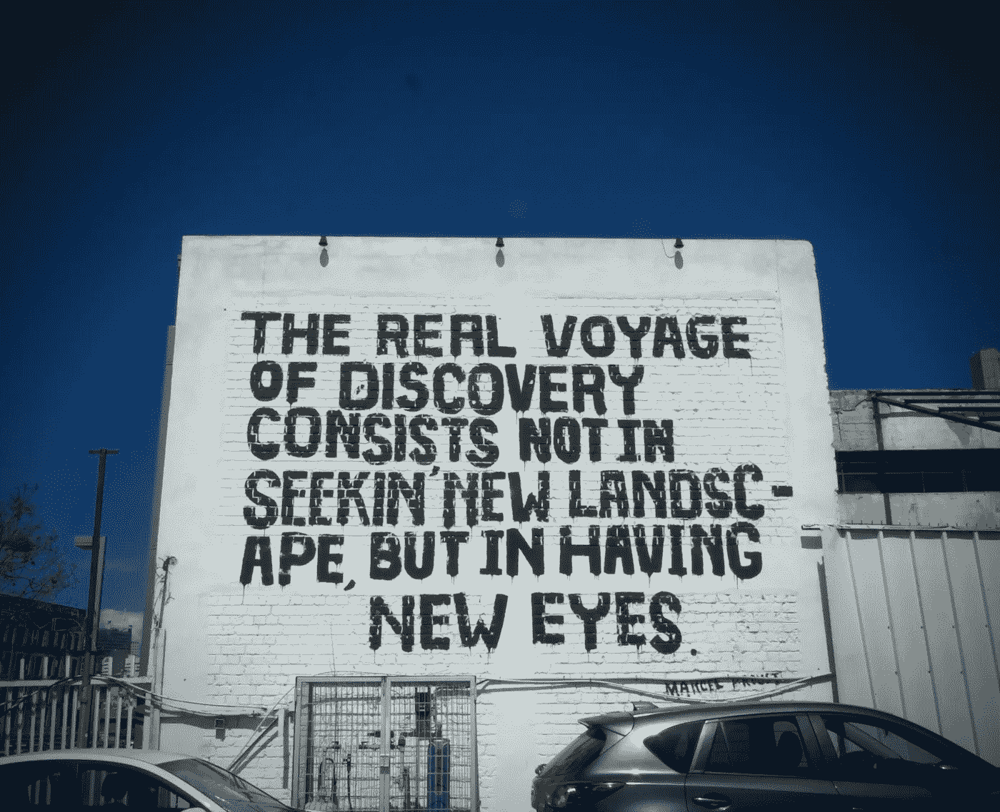

# 演绎推理与人工智能中的偏见，简化

> 原文：<https://levelup.gitconnected.com/deductive-inference-vs-bias-in-artificial-intelligence-simplified-74774e65393a>

人工智能如何从哲学中学习，以真实世界的人工智能应用为例改进算法

来自 Unsplash 的 Tingey Injury 律师事务所

每当我有机会从社会科学的馅饼中分一杯羹，并将它与人工智能(AI)融合在一起时，我都觉得自己像是来自过去的幽灵。我受过正式训练，主修社会科学(哈佛大学的本科学位)，我总是倾向于给这个学科一个热情洋溢的评价。

我写这篇文章的目的是当偏见和推论应用于人工智能时，把它们轻轻地联系起来。你将会对演绎推理及其在人工智能中的应用有更深入(但简单)的理解。

来自 Unsplash 的 Gabriella Clare Marino

# **积木**

人工智能(AI)是计算机科学和工程的一个领域，专注于智能代理的构建，智能代理是可以自主思考、学习和行动的系统。人工智能中的术语“推理”是指从数据或证据中得出结论的过程[6]。换句话说，推理就是利用手头的信息进行逻辑推理和预测。推理主要有两种类型:归纳推理和演绎推理。与仅仅依赖于演绎相反，归纳推理允许根据从某一特定范围内的特定观察中得出的概括推断出新的情况。当进行演绎推理时，人们从更广泛的前提开始，然后使用逻辑得出更狭窄的结论；这种推理方式不依赖于任何类型的插值。

# **偏向**

人工智能系统中的偏差是指影响算法决策的任何偏好或倾向。因此，当人工智能系统被训练为更喜欢某些结果而不是其他结果时，就会出现偏差。当没有足够的信息来正确训练模型时，它会开始建立并不存在的联系。此外，在数据收集(通过选择性采样等技术)或准备期间，人们可能会无意中向训练数据添加偏差(例如，特征选择)。

人工智能算法可以在几个方面减少偏差。数据清理算法首先试图找到并消除异常，否则这些异常会导致调查结果出现偏差。过采样和欠采样是另外两种技术，可以用来增加不频繁出现的表示。此外，加权会根据个案的相对重要性修改总数。最后但同样重要的是，事后编辑需要重新评估先前的预测，并根据需要进行调整。

由来自 Unsplash 的[尤瓦尔·朱克曼](https://unsplash.com/@yuvalz)

# **人工智能中的演绎推理**

通过演绎推理，人工智能系统将逻辑规则应用于一组给定的公理或前提，以得出关于世界的结论。通过使用演绎法则，我们可以推断狮子是凡人，因为“动物是凡人”和“狮子是动物”都是真实的。正向链接[8]指的是从先前建立的前提中推导出新知识的行为，这种行为可以用来证明进一步的推导是正确的。

哲学界和人工智能界都对演绎推理这一主题进行了大量研究。诺姆·乔姆斯基对演绎的哲学定义是，它是使用转换规则从另一个短语(前提)推导出一个短语的过程，其中每一步都保持真理[9]。回想一下我们试图推断狮子是动物的时候，看看这是如何工作的。

乔姆斯基的定义提出了一些基本问题:我们在寻找什么样的真理？有没有可能用非演绎的方式从一个句子推断出另一个句子？人们提出了无数的逻辑体系，试图提供一个演绎的正式解释，就像学术界的那些追求一样(在我的社会科学本科学习期间再次回忆起这里)。另一方面，人工智能领域的研究人员更关心通过开发更有效的算法来改善自动推理。为了进一步分解这个概念，假设演绎推理是使用一组预先确定的规则，基于预先存在的句子(或信息)构建新句子(或信息)的过程。以下是演绎的定义:

正向推理，或演绎推理，是使用一套先前建立的规则从一系列前提中逻辑地得出结论的行为[10]。

注意，我们不要求前提或结论为真；它们很可能是错误的(事实上，许多有趣的推论都会导致错误的结论)。关键的一点是，如果前提为真，结论必然为真，前提是用于演绎的规则是正确的(即，正确应用时产生前提)。

来自 Unsplash 的 K. Mitch Hodge

# **人工智能和演绎推理**

演绎已经在人工智能中广泛应用于证明定理等任务[11]。

一些应用包括以下内容:

—人工智能系统可以使用演绎推理来识别数据中的模式，并根据这些模式进行预测。

—从现有知识库中生成新知识。

—生成计划和时间表。

—发现问题并提出解决方案。

—验证软件程序(和算法)的正确性。

对于这类问题，需要一个演绎推理框架，通过应用问题空间特有的规则，从现有数据中推断出新的信息。当在定理证明的上下文中使用时，这样的规则通常采取逻辑蕴涵的形式。如果 A 句包含 B 句，那么无论何时 A 句为真，B 句也必须为真(例如，考虑动物和狮子都是凡人的例子)。显然，描述所有潜在的逻辑蕴涵规则将是一项巨大的任务；有一些基本原则可以用来指导他们的发展[10]。概括来说，这是三个基本准则:

—如果 A 必然产生 B and B 必然产生 C，那么 A 必然也必然产生 C；

—反之不一定成立(即，如果 A 不需要 C，这并不意味着 B 或 B 和 C 都不需要)；和

—如果 A 句逻辑上蕴涵 B 句，那么 B 句的否定不能由 A 句产生[12]。

来自 Unsplash 的 Praveen Thirumurugan

# 离别的思绪

我用一种更简单的方式将演绎推理的主题领域打乱，温和地引入了与人工智能相交的理论。

如果你对这篇文章有任何修改的建议或者扩展话题的想法，请告诉我。

如果你喜欢阅读这样的故事，并想支持我成为一名作家，可以考虑报名成为一名媒体成员。一个月 5 美元，你可以无限制地阅读媒体上的所有报道。如果你注册使用我的链接，我会赚一小笔佣金，不需要你额外付费。

 [## 通过我的推荐链接加入 Medium-Anil til be

### 阅读阿尼尔·蒂尔贝(以及媒体上成千上万的其他作家)的每一个故事。你的会员资格直接支持作家…

medium.com](https://medium.com/@AnilTilbe/membership) 

## 考虑阅读以下两个帖子:

 [## 前 20 个机器学习算法，每个用不到 10 秒钟解释

### 对 20 个最重要的机器学习算法的简单解释，每个都在 10 秒内完成。

levelup.gitconnected.com](/top-20-machine-learning-algorithms-explained-in-less-than-10-seconds-each-8fd728f70b19)  [## 7 大深度学习方法，每种方法用不到 10 秒钟的时间解释

### 对 7 个最重要的深度学习算法的简单解释，每个都在 10 秒内完成。

levelup.gitconnected.com](/top-7-deep-learning-methods-each-explained-in-less-than-10-seconds-3683120de455) 

还有，这是我的时事通讯；我希望你能好心地**考虑订阅**。

 [## 产品。风险时事通讯

### 产品和人工智能交汇处的想法。点击阅读产品。投资时事通讯，作者阿尼尔…

pventures.substack.com](https://pventures.substack.com) 

*参考文献*

*1。蒂尔贝，阿尼尔。(2022 年 7 月 24 日)。监督学习:31 个重要模型。走向 AI。*[*https://pub . toward sai . net/supervised-learning-31-of-the-most-important-models-5-are-a-must-learn-9c 62444905 fa*](https://pub.towardsai.net/supervised-learning-31-of-the-most-important-models-5-are-a-must-learn-9c62444905fa)

*2。蒂尔贝，阿尼尔。(2022 年 7 月 24 日)。无监督学习:14 种算法。走向 AI。*[*https://pub . toward sai . net/unsupervised-learning-14-of-the-most-important-algorithms-b3e9e 07350 c 9*](https://pub.towardsai.net/unsupervised-learning-14-of-the-most-important-algorithms-b3e9e07350c9)

*3。蒂尔贝，阿尼尔。(2022 年 7 月 31 日)。5 个必须知道的数学概念，深度学习。升级编码。*[*https://level up . git connected . com/top-5-must-know-math-concepts-for-deep-learning-95fd 09 ef 038 b*](/top-5-must-know-math-concepts-for-deep-learning-95fd09ef038b)

*4。蒂尔贝，阿尼尔。(2022 年 8 月 2 日)。简化的 20 种机器学习方法。升级编码。*[*https://level up . git connected . com/top-20-machine-learning-algorithms-explained-in-less-10-seconds-each-8fd 728 f 70 b 19*](/top-20-machine-learning-algorithms-explained-in-less-than-10-seconds-each-8fd728f70b19)

*5。蒂尔贝，阿尼尔。(2022 年 8 月 14 日)。7 大深度学习算法，简化。升级编码。*[*https://level up . git connected . com/top-7-deep-learning-methods-each-explained-in-less-10-seconds-3683120 de 455*](/top-7-deep-learning-methods-each-explained-in-less-than-10-seconds-3683120de455)

*6。相对熵、概率推理和人工智能。(未注明)。科学指导。检索于 2022 年 8 月 17 日，来自*[*https://www . science direct . com/science/article/ABS/pii/b 9780444700582500206*](https://www.sciencedirect.com/science/article/abs/pii/B9780444700582500206)

*7。Wright 等人,《哈金、鲨鱼和塔尔金:为科学数据的事后分析提供案例》。*[*https://journals . sage pub . com/doi/full/10.1177/0149206316679487*](https://journals.sagepub.com/doi/full/10.1177/0149206316679487)

*8。Jahromi 等人提出的词义消歧专家系统:基于数据挖掘和正向链接的演绎歧义消解。*[*https://onlinelibrary.wiley.com/doi/abs/10.1111/exsy.12075*](https://onlinelibrary.wiley.com/doi/abs/10.1111/exsy.12075)

*9。诺姆·乔姆斯基。句法理论面面观。麻省理工学院出版社，1965 年。*

10。人工智能:Rich，e . Knight，k . Knight，Kevin:9780071008945:Amazon . com:Books。(未注明)。检索 2022 年 8 月 17 日，来自[*https://www . Amazon . com/Artificial-Intelligence-Rich/DP/0071008942*](https://www.amazon.com/Artificial-Intelligence-Rich/dp/0071008942)

11。摩尔等人的计算逻辑手册。[*https://books . Google . com/books/about/A _ Computational _ Logic _ handbook . html？id=xuFQAAAAMAAJ*](https://books.google.com/books/about/A_Computational_Logic_Handbook.html?id=xuFQAAAAMAAJ)

*12。人工智能:现代方法(人工智能中的皮尔森系列):罗素，斯图尔特，诺维格，彼得:9780134610993:亚马逊网站:书籍。(未注明)。2022 年 8 月 17 日检索，来自*[*https://www . Amazon . com/Artificial-Intelligence-A-Modern-Approach/DP/0134610997*](https://www.amazon.com/Artificial-Intelligence-A-Modern-Approach/dp/0134610997)

# 分级编码

感谢您成为我们社区的一员！在你离开之前:

*   👏为故事鼓掌，跟着作者走👉
*   📰查看[升级编码出版物](https://levelup.gitconnected.com/?utm_source=pub&utm_medium=post)中的更多内容
*   🔔关注我们:[Twitter](https://twitter.com/gitconnected)|[LinkedIn](https://www.linkedin.com/company/gitconnected)|[时事通讯](https://newsletter.levelup.dev)

🚀👉 [**加入升级人才集体，找到一份惊艳的工作**](https://jobs.levelup.dev/talent/welcome?referral=true)