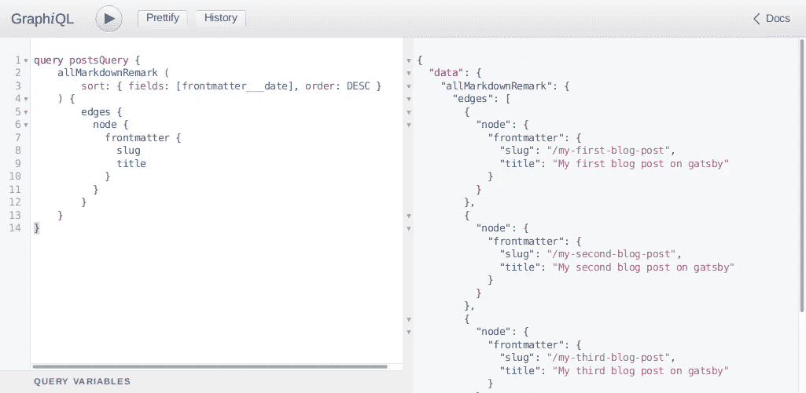

# 深入了解 Gatsby——使用 Gatsby、React 和 GraphQL 构建静态博客

> 原文：<https://levelup.gitconnected.com/deep-dive-into-gatsby-building-a-static-blog-using-gatsby-react-and-graphql-f8cb8d8fd036>


Gatsby.js 是这十年来发布的最令人兴奋的 web 技术之一。建设闪电般快速的网站从未如此简单。Gatsby 结合了 React 的灵活性和 GraphQL 的特性，轻松构建静态网站。为了不与盖茨比的工作相混淆，网站上的描述清楚地说明了盖茨比是什么。

> js 是一个静态 PWA(渐进式 Web 应用程序)生成器。您可以获得开箱即用的代码和数据分割。Gatsby 只加载关键的 HTML、CSS、数据和 JavaScript，所以你的站点加载得越快越好。一旦加载完毕，Gatsby 就会预取其他页面的资源，因此点击网站的速度快得令人难以置信。

*官方* [*盖茨比网站*](https://www.gatsbyjs.org/) *。*

## 入门指南

Gatsby 提供了一个惊人的 CLI 来轻松启动任何 Gatsby 项目。本教程的大部分内容都集中在 Linux/Mac 机器上。如果你使用的是安装了最新版本 Node.js 和 NPM 的 Windows，你就可以开始了。如果你还没有安装，看看我们的文章，如何在 Linux/mac 系统和 Windows 系统上安装 Node.js 和 npm

## 第一步。安装 Gatsby-CLI

[Gatsby CLI](https://www.gatsbyjs.org/docs/gatsby-cli/) 是一个简单的工具，可以帮助我们使用任何 [Gatsby starter 模板](https://www.gatsbyjs.org/starters/)。在这里，我们将使用一个简单的入门模板和基本的样板文件。启动终端并执行以下命令，使用 npm 安装 Gatsby-CLI

```
npm install -g gatsby-cli
```

这将在您的系统上快速安装 Gatsby-CLI。接下来，我们将使用一个入门模板来创建我们的博客。

注意:本文中使用的所有代码和创建的示例项目都可以在我们的 [GitHub repo](https://github.com/zocada/gatsby-blog-tutorial-1) 中获得。如果你在下面的说明中迷失了方向，去那里先睹为快吧。

## 第二步。使用启动器创建新项目

一旦您准备好了 Gatsby CLI，我们就可以开始创建您的第一个 Gatsby 项目了。将您的终端导航到您想要的目录，并执行以下命令。

```
gatsby new my-blog
```


这将克隆 [Gatsby-Starter-Default](https://www.gatsbyjs.org/starters/gatsbyjs/gatsby-starter-default/) 并执行一个`npm install`来安装所有的依赖项和插件。

## 第三步。正在启动 gatsby 开发服务器

进入项目文件夹，打开你最喜欢的编辑器(显然，VSCODE ❤).启动一个终端，在项目目录下运行`gatsby develop`来启动开发服务器。


一旦服务器启动，你可以在浏览器中访问`localhost:8000`,看到令人愉快的盖茨比登陆页面。


厉害！您已经成功完成了基本步骤！现在，让我们开始编码吧！

## 第三步。了解项目结构。

在引擎盖下，Gatsby 项目是 react 应用程序。嗯，这是一个完整的 react 应用程序，Gatsby 参与的唯一部分是通过执行所有 graphql 查询、优化图像、从数据源导入必要的数据以及使用 webpack 等技术将网站分解为静态内容来构建网站。如果您有使用 React 开发的背景，当前的项目结构可能看起来很熟悉。

```
my-blog/
│
├── node_modules/
│   └── [You don't wanna get in here]
│
├── public/
│   ├── [Your site's static contents]
│   └── [Automatically generated by gatsby]
│
├── src/
|   ├── components/
│   │   ├── [These are the building blocks of your website]
│   │   └── [All your react components]
│   │
│   ├── images/
│   │
│   └── pages/
│       ├── 404.js [Your site's 404 page]
│       ├── index.js [the front/first page of your site]
│       └── page-2.js [yet another page]
│
├── gatsby-browser.js
├── gatsby-config.js
├── gatsby-node.js
├── gatsby-ssr.js
├── package.json
├── package-lock.json
└── LICENSE
```

让我们仔细看看这些文件和目录是什么..

**node_modules/ :** 这个目录包含了你的项目所依赖的所有代码模块(npm 包)都是自动安装的。

**public/ :** 包含自动生成的站点静态构建。这是由盖茨比在发出命令`gatsby build`或`gatsby develop`时自动完成的

**src/ :** 该目录将包含所有与您将在网站前端看到的内容(您在浏览器中看到的内容)相关的代码，例如您的网站标题或页面模板。src 是“源代码”的约定。

**src/components/ :** 该子目录将包含 react 应用程序构建块所需的所有组件。

**src/pages/** : Gatsby 对这个目录的处理方式不同，在这个目录中作为 react 组件添加的任何 Javascript 文件都将被视为你网站的一个页面。您只需从浏览器导航到这些页面，无需文件扩展名。例如`localhost:8000/404`或`localhost:8000/page-2`，其中`index.js`将被视为您的默认登录页面。

**Gatsby-browser . js:**Gatsby 期望在这个文件中找到 [Gatsby 浏览器 API(如果有的话)](https://www.gatsbyjs.org/docs/browser-apis/)的任何用法。这些允许自定义/扩展影响浏览器的默认 Gatsby 设置。

gatsby-node.js : 这个文件是 gatsby 期望找到 Gatsby 节点 API 的任何用法(如果有的话)的地方。这些允许定制/扩展影响站点构建过程的默认 Gatsby 设置。

**gatsby-SSR . js:**Gatsby 希望在这个文件中找到 Gatsby 服务器端呈现 API 的任何用法(如果有的话)。这些允许影响服务器端呈现的缺省 Gatsby 设置的定制。

**gatsby-config.js :** 这是 gatsby 站点的主配置文件。在这里你可以指定关于你的站点的信息(元数据),比如站点标题和描述，你想要包含哪些 Gatsby 插件等等。(查看[配置文件](https://www.gatsbyjs.org/docs/gatsby-config/)了解更多详情)。

## 第四步。安装必要的插件

如果你对这个概念不熟悉的话，《盖茨比》就是关于果酱堆的:

> **JAMstack** : *名词\'jam-stak'\*
> 基于客户端 JavaScript、可重用 API 和预建标记的现代 web 开发架构。

在这里，我们将使用 markdown 编写我们的博客，使用 GraphQL 查询我们的 markdown 文件(就像一个 API)并使用 React 显示数据。因此，我们需要一些 Gatsby 插件来开始在 markdown 中编写博客，并使用 GraphQL 查询它们。在项目目录中执行下面的命令来安装必要的插件。

```
npm install --save gatsby-source-filesystem gatsby-transformer-remark gatsby-remark-images
```

## 应用您的插件

我们需要向 Gatsby 指定我们正在使用哪些插件，以便 Gatsby 可以使用它们来集成到我们项目的工作流中。将下面几行添加到您的`gatsby-config.js`文件中以启用插件。在此之前，我们需要创建一个目录来存储我们所有的帖子，这些帖子将被写入 markdown。因此，在`src/`目录中创建一个新的子目录，名为`posts`。您的目录结构现在应该看起来有点像这样。

```
.
.
.
├── src/
|   ├── components/
│   ├── pages/
│   ├── posts/  <-- The directory you need to create
│   └── images/
│   
.
.
```

现在应用`gatsby-config.js`中的插件，这样你的文件应该看起来像这样。

我们正在创建我们的博客文章，并将它们作为降价文件进行查询。盖茨比使用备注库来实现这一点。因为我们已经安装了插件，我们可以把我们的博客文章写在 markdown 文件中，并把它们放在`posts`目录中。一个示例帖子将类似于此。

```
---
slug: /my-first-blog-post
date: 2018-10-27
author: Jhone Doe
title: My first blog post on gatsby
---

The contents of your blog in either markdown or html.
Lorem ipsum dolor sit amet, consectetur adipiscing elit, sed do eiusmod tempor incididunt ut labore et dolore magna aliqua.
Ut enim ad minim veniam, quis nostrud exercitation ullamco laboris nisi ut aliquip ex ea commodo consequat.
Duis aute irure dolor in reprehenderit in voluptate velit esse cillum dolore eu fugiat nulla pariatur.
Excepteur sint occaecat cupidatat non proident, sunt in culpa qui officia deserunt mollit anim id est laborum.
```

你可能想知道什么是`---`破折号？用破折号括起来的部分称为文件的开头部分。它通常在 Jekyll 中使用，作为在 markdown 中存储附加数据的一种便捷方式。减价商品里的数据是用 YAML 格式写的。你可以在[这里](https://docs.ansible.com/ansible/latest/reference_appendices/YAMLSyntax.html)了解更多关于 YAML 语法的知识。请注意，你的 frontmatter 中的`slug`是你的博客在你的网站中的相对 url。也就是说，您的博客文章将在哪里可见。

在`src/posts/`子目录中创建几篇博文，这样我们就可以开始创建我们网站的主页，上面列出了所有的博文。

```
.
.
.
├── src/
|   ├── components/
│   ├── pages/
│   ├── posts/ 
│   │   ├── my_first_blog.md
│   │   ├── my_second_blog.md
│   │   └── my_third_blog.md
│   └── images/
│   
.
.
```

## 第五步。使用 GraphQL 获取数据并显示在主页上

Gatsby 提供了对使用 GaraphQL 的现成支持，并附带了一个内置的 GraphiQL IDE。如果你已经在你的终端上运行了`gatsby develop`，你可能会看到 gatsby 打印出一个额外的 URL 到 Graphiql 作为`localhost:8000/___graphql`。让我们创建一个 graphQL 查询来获取博客文章的标题，并将其显示在主页上。在`localhost:8000/___graphql`从浏览器进入 GraphQL 编辑器，执行下面的查询来获取所有帖子的 JSON 数据。

```
query postsQuery {
    allMarkdownRemark (
        sort: { fields: [frontmatter___date], order: DESC } 
    ) {
        edges {
          node {
            frontmatter {
              slug
              title
            }
          }
        }
    }
}
```



在这篇文章中，我们不会深入 GraphQL，但是为了记录在案:`edges`意味着，我们让 graphQL 知道我们正在寻找一个数组，而`node`提到每个元素应该是什么样子。在提到我们从降价文件中查询的内容时,`node`中的内容非常直白。

您可以将`src/pages/index.js`修改成这样，使用 graphQL 获取数据并将它们传递给 React 组件。

一旦您通过从您的`src/pages/index.js`文件中删除不必要的元素并添加 GraphQL 查询完成了上述更改。重新启动开发服务器。你可以在浏览器上看到你的网站，上面列出了你创建的所有博客。


所有的链接将呈现一个 404 错误页面，因为我们还没有创建任何页面来显示我们的博客文章的内容。

## 第六步。创建模板以显示博客文章

在这一步，我们将创建一个简单的模板，将我们的博客文章的内容呈现到一个模板中，并在指定的 slug url 上查看它们。所以，让我们从在`src/`中创建一个新的子目录作为`src/templates/`开始。创建一个名为`blog_template.js`的新文件，并添加以下代码行。它包含一个简单的 react 组件和一个 GraphQL 查询，用于从 gatsby 提供的特定 url 获取数据。

## 第七步。使用 Gatsby 的节点 API 生成页面

我们需要与 Gatsby 的节点 API 进行交互，告诉 Gatsby 使用所有的 markdown 文件，并使用上面创建的模板生成页面。打开`gatsby-node.js`文件，添加以下代码，使用 Gatsby 完成简单博客的构建。

在这里，我们使用 Gatsby 的 [createPages()](https://www.gatsbyjs.org/docs/node-apis/#createPages) 节点 API 来告诉 Gatsby 执行一个查询来查找所有 markdown 文件，并使用模板在文件的 frontmatter 中提供的 slug 处创建页面。

重启 Gatsby dev 服务器，进入`localhost:8000`查看你的网站，点击任何博客链接查看你的博客文章。啊啊。


在接下来的文章中，我们将会更多地探讨如何添加封面图片并设计静态博客的风格。到那时，干杯！

*最初发表于*[*zocada*](https://zocada.com/deep-dive-gatsby-building-a-simple-static-blog-using-gatsby-react-and-graphql/)*。*

[](https://levelup.gitconnected.com)[](https://gitconnected.com/learn/graphql) [## 学习 GraphQL -最佳 GraphQL 教程(2019) | gitconnected

### 9 大 GraphQL 教程-免费学习 GraphQL。课程由开发人员提交并投票，使您能够…

gitconnected.com](https://gitconnected.com/learn/graphql)