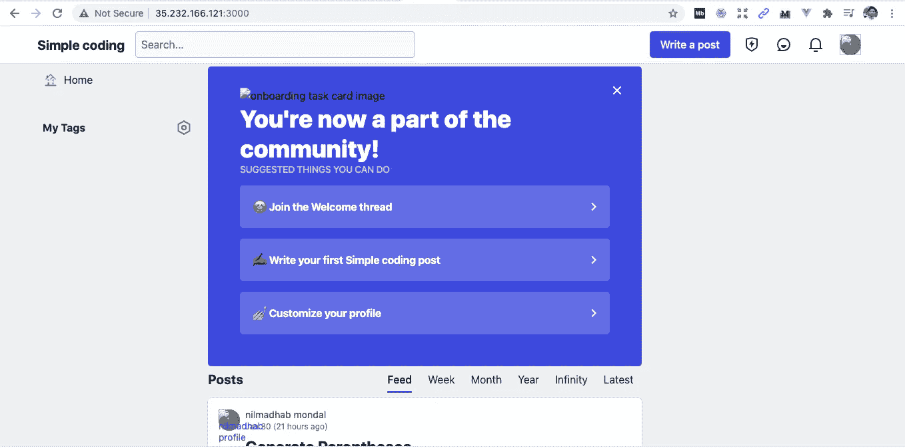

# 我如何使用开发社区的开源代码库来构建我自己的网站

> 原文：<https://levelup.gitconnected.com/deep-dive-into-opensource-codebase-of-dev-community-82286f8cb39f>

我们将使用 Dev.to 的 Ruby on Rails 后端作为管理面板，并为我们的网站创建一个自定义前端 Vue.js。

# **最终结果**

[https://www.simplecoding.dev/](https://www.simplecoding.dev/)

# 介绍

我对算法和开源技术非常感兴趣。我一直在写关于如何解决 Leetcode 问题的故事。虽然我喜欢 Medium 和 [Dev](http://dev.to) 编写的界面，但是我觉得它们缺少某些功能，比如

1.  将在线代码编译器与故事集成
2.  创建自定义标签，如 BFS、DFS、堆栈、队列
3.  标记用户的进度
4.  更好地组织文章，如 coursera 或 Udemy。

因此，我决定创建自己的开源网站，它将具有以下特点

1.  我将使用我的管理面板开发的代码库，写故事
2.  为我的网站创建一个 Vue.js 前端
3.  在谷歌云中托管它
4.  为优质文章创建基于订阅的功能，一对一辅导。

# 体系结构

[dev.to](https://dev.to/) 网站使用 Forem。Forem 是用于构建社区的开源软件。驱动 [Dev](http://dev.to) 的 GitHub 代码可以在[这里](https://github.com/forem/forem)找到。

[Forem 的堆栈由](https://docs.forem.com/technical-overview/stack/)组成

*   [*Puma*](https://github.com/puma/puma) 作为 webserver
*   Ruby on Rails 作为后端
*   [*PostgreSQL*](https://www.postgresql.org/) 作为主数据库
*   [*Redis*](https://redis.io/) 用来存储缓存的数据
*   [*Sidekiq*](https://github.com/mperham/sidekiq) 和 [*主动工单*](https://guides.rubyonrails.org/active_job_basics.html) 为后台工人
*   [*弹性搜索*](https://www.elastic.co/elasticsearch/) 用于在应用程序中搜索

我认为这也是一个学习`caching`、`authentication`、`background jobs`最佳实践的好机会

# **Forem 代码库的问题**

*   后端和前端是紧密耦合的。所以，如果我以后想创建一个移动应用程序，这将是一个问题。
*   与微服务架构不同，整体代码很难维护。

无论如何，我现在只关心第一个问题，所以第一个目标是创建我的前端可以使用的 API。我们将在本系列的下一篇教程中讨论如何创建前端。

# 当心

如果你想看这个教程而不是看，可以在这里看。这个视频还解释了前端部分，这将在本系列的下一个教程中讨论。

Forem 后端快速介绍

# 后端(管理面板)

我的第一个目标是在谷歌云上安装后端，创建一些帖子，并制作一个 API 来列出所有帖子，以便我的 Vue，js 前端可以显示这些帖子。

运行和部署它有点困难，但是一旦我做到了，我看到它在谷歌云中运行。

主页

管理页面

文章

现在，下一个目标是制作一个新的控制器，它可以以 JSON 格式列出所有文章以及与这些文章相关联的元数据。

首先，我创建了一条名为`/all`的路线。我打算使用这个途径以 JSON 格式返回文章列表。然后，我创建了一个***SimplecodingArticlesController***，它是***device***:***registration controller，*** 的子类，因为我想使用**require _ no _ authentic ation**方法，这样我就可以显示那些文章，而不需要任何身份验证。稍后，我将使用一个访问令牌来认证 API。眼下，一个快速而肮脏的方法足以开始。

# 扶持 CORS

正如我们前面提到的，我们将使用 Forem 作为我们的后端，并在 vuejs 中创建一个与后端分开托管的前端。

当这个前端向 Forem 后端发出请求时，这些请求将是跨源请求，因为前端和后端是分开托管的。因此，要让 web 浏览器允许来自前端的跨来源请求，我们必须从后端启用 CORS。

为此，我们只需在目录`config`位于 Forem 的 Github repo 的根文件夹中的`/config/initializers/cors.rb`中添加以下代码。

# 用于获取一个标签的所有文章的 API

现在，我想创建一个 API 来获取与单个标签相关联的所有文章。这个很简单。我只需要在`simplecodingarticlescontroller`类中创建一个路由和一个新方法。

如下所示修改`route.rb`文件

在`simplecoding_articles_controller.rb`中创建新方法

如启用 CORS 部分所示，通过修改`/config/initializers/cors.rb`文件，确保允许此路线上的 CORS

该 api 的 JSON 响应与显示的`/all` API 相同

# 获取特定文章的 API

我们之前创建的 API 发送所有文章的列表。假设，我们只需要一个特定的文章。在这种情况下，我们必须从 API 中获取所有文章，然后搜索特定的文章。这是低效的。让我们创建一个只返回特定文章的 API。

让我们在`routes.rb`中创建一条新路线`/articles/:id`，如下图所示。

让我们也在`simplecoding_articles_controller.rb`里面创建一个新的方法

这个 API 的 JSON 响应如下所示

记住也要为此路由启用 CORS

# 通过 Slugs 获取文章的 API

目前，我们有一个 API 来使用文章的 id 获取一篇文章。让我们添加另一个 API，使我们能够使用它的 slug 获取一篇文章。

在`routes.rb`创建新路线

在`simplecoding_articles_controller.rb`中创建新方法

这个 API 的响应类似于前面的 API。

此外，记住也要为这个 API 启用 CORS。

# 再见！

在接下来的教程中，我们将在前端使用这些 API，并制作 API 来获取属于一个标签的文章。

完整的后端代码可以在这里找到

 [## webtutsplus/简单编码-rails

### 为社区赋权欢迎来到 Forem 代码库，这是一个为开发者赋权的平台。我们很高兴有你…

github.com](https://github.com/webtutsplus/simple-coding-rails)