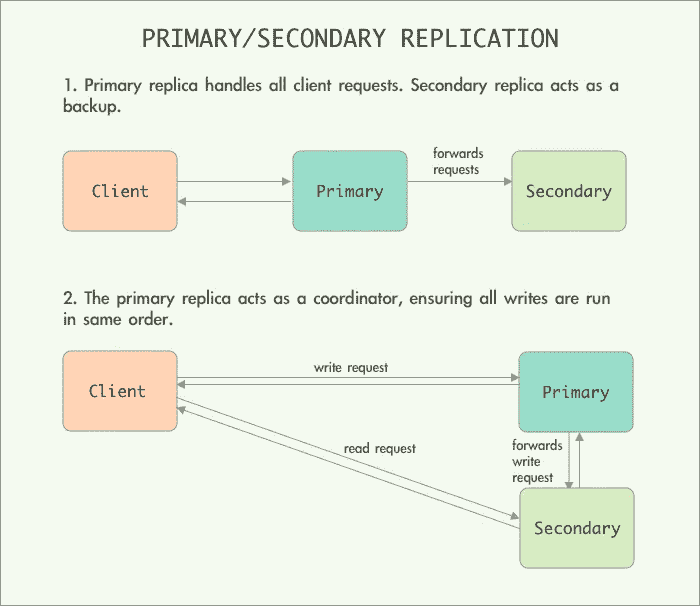
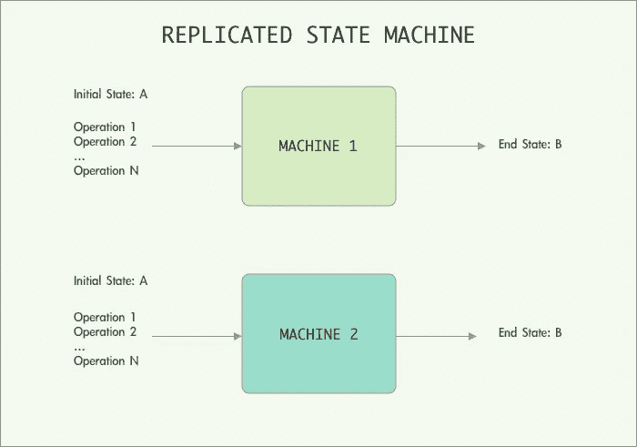

# 深入研究主/辅助复制以实现容错

> 原文：<https://levelup.gitconnected.com/deep-dive-into-primary-secondary-replication-for-fault-tolerance-6ba203b06901>

## 你真的了解复制是如何工作的吗？

照片由[奥斯汀·尼尔](https://unsplash.com/@arstyy?utm_source=medium&utm_medium=referral)在 [Unsplash](https://unsplash.com?utm_source=medium&utm_medium=referral) 拍摄

# 为什么要关心复制？

当今分布式系统中一个非常常见的折衷模式如下:为了扩展服务并获得高性能，一个常用的策略是在许多服务器上水平地共享数据。拥有许多服务器意味着故障的概率成比例地增加，我们不再能够避免故障。我们唯一能做的就是确保我们为他们做好了充分的准备。为了实现这种容错能力，公司将复制部署为提供数据高可用性的关键策略。

# 为什么要看这篇文章？

虽然复制看起来似乎很简单(只是复制不同服务器中的状态)，但在生产中实现复制之前，必须考虑各种因素。例如，我们如何检测服务器何时出现故障，以及如何快速预热替换服务器以接管出现故障的服务器。

**本文旨在为读者提供:**

1.  对复制的深刻理解。
2.  在生产中实施复制的高级注意事项。
3.  当今工业中采用的典型策略。

# 什么是主/辅助复制？

主/辅助(P/S)复制是两种主要的复制形式之一，其中主副本通常将操作中继到辅助副本，以确保操作以相同的顺序执行。另一种形式的复制是当所有复制品具有相同的权重时(即，没有主/主复制品)。

图 1:主/辅助复制的两个用例:1)主/备份复制和 2)带协调器的复制。

在图 1 中，我们描述了 P/S 复制的两个用例。

1.  **主/备份** **复制**:主副本处理所有客户端请求，并直接响应客户端。主副本将客户端请求或新状态转发给辅助副本，以保持辅助副本同步。在这里，辅助复制副本更像是备份，仅在主复制副本出现故障时承担主复制副本的角色。
2.  **带协调器的复制:**主副本充当协调器，其主要作用是确保所有副本中的状态同步。对于改变状态的操作，主副本将确保操作以相同的顺序在所有副本中重播。对于不改变状态的操作，客户端可以从任何副本请求。

如上所述，为了复制状态，我们可以 I)每次状态改变时将整个状态从主副本转移到辅助副本，或者 ii)采用复制状态机方法，其中我们仅中继导致状态改变的操作。很明显，如果状态非常大，转移整个状态是非常低效的。事实上，正是因为这个原因，今天大多数行业解决方案都实现了复制状态机方法。

## 复制状态机

图 2:一个复制的状态机。假设所有副本都从相同的状态开始，并且只以相同的顺序执行确定性操作，我们可以预期所有副本都具有相同的结束状态。

在复制状态机方法中，我们不转移整个状态，而只是中继导致状态改变的操作。复制状态机方法背后的直觉是，系统通常可以被建模为确定性状态机。如果两个确定性状态机以相同的初始状态开始，并以相同的顺序提供相同的输入，那么它们将经历相同的状态序列，并产生相同的输出。

在复制的状态机中，客户端向主副本发送写操作，主副本将排序并以相同的顺序向所有辅助副本发送操作。然后，所有副本将执行这些操作。假设所有副本都从相同的状态开始，并且只以相同的顺序执行确定性操作，我们可以预期所有副本都与相同的结束状态同步。

# 关于复制需要思考的大问题

胡安·鲁米普努在 [Unsplash](https://unsplash.com?utm_source=medium&utm_medium=referral) 上的照片

在分布式系统中实现复制是具有挑战性的，尤其是当我们没有一个协调者来做决定的时候。即使有了协调员，我们也必须准备应对协调员的失败，不要让这成为单一的失败点。主要困难在于:

1.  **处理失去通信**:如何处理暂时失去通信导致的错误，如 TCP 超时，甚至永久性错误，如网络分区？
2.  **处理缺乏准确的故障检测**:在异步分布式系统中，消息延迟没有上限。因此，不可能区分是服务器出现故障，还是消息根本没有到达。也很难区分服务器故障和网络分区(最初相互连接的服务器，现在失去通信并认为彼此已经崩溃)。

我们将列出一些在实现复制之前需要回答的微调问题，以便为生产环境中的服务提供高可用性。随后，我们将在当今行业中部署的大型分布式系统的背景下讨论其中的一些问题。

1.  我们希望副本在什么程度上是相同的？
2.  在回复客户端之前，主复制副本是否需要等待辅助复制副本完成其操作？
3.  我们如何检测故障并执行到辅助副本的快速故障转移？
4.  如果辅助副本出现故障，我们如何快速预热替代副本？
5.  我们如何处理主副本和辅助副本失去通信的裂脑情况？
6.  我们假设可以将我们的系统建模为一个确定性的状态机。我们如何处理非确定性操作，比如生成时间戳？

## 我们希望副本在什么程度上是相同的？

我们必须决定我们要在哪个层次上复制。最常见的方法是在应用程序级状态进行复制。例如，对于像 SQL 这样的分布式数据库，我们复制数据库的表。这通常更有效，因为主副本只向辅助副本发送应用程序级操作。然而，这也意味着服务器中的应用程序代码经常需要修改，并且必须理解容错是如何实现的。例如，在分布式 SQL 数据库中，主服务器将操作写入 Binlog，其行为与辅助服务器不同。

另一种方法(不常用)是在机器级别复制状态，即复制寄存器和 RAM 内容。这使我们能够复制任何现有的服务器，而无需修改应用程序级代码！事实上，这就是 VMware vSphere 4.0 实施其复制方案的方式[1]。然而，这种方法最大的缺点是需要转发机器事件，比如中断，因此可能需要机器级别的修改。

## 主复制副本是否需要等待辅助复制副本完成其操作来响应客户端？

我们之前知道，主副本会将一系列操作转发给辅助副本。但是，有时辅助复制副本可能无法执行操作，并处于与主复制副本不同的状态。Google 文件系统(GFS)[2]实现的一个简单解决方案是让辅助副本在执行操作后向主副本发送一个成功状态。如果主复制副本没有收到至少一个辅助复制副本的消息，它将要求客户端重试该操作。然而，如果操作不是等幂的，即使重试，这也会导致副本的不一致。虽然一个副本可能无法执行，但其他副本可能会成功完成写入操作，从而导致不同的状态。请注意，对于 GFS 用例，这种不一致性是可以接受的，并且可以通过应用程序级别的检查来缓解。

此问题的另一个解决方案是使用两阶段提交，其中辅助副本必须向主副本发送确认，表明它已准备好执行。只有当所有副本都回复了主副本时，所有副本才会同时执行操作。

## 我们如何检测故障并对辅助副本执行快速故障转移？

检测故障的一种常见策略是在主服务器和辅助服务器之间定期发送心跳消息。如果在一段固定的时间内没有收到心跳消息，则宣布服务器出现故障。如果检测到主副本失败，其中一个辅助副本将成为新的主副本。

## 我们如何处理主副本和辅助副本失去通信的裂脑情况？

我们可以预见到使用 heartbeat 检测故障时出现的问题。缺少心跳消息可能表示服务器出现故障，但也可能是由网络分区或主副本和辅助副本之间的连接丢失引起的。如果发生网络分区，辅助副本可能会误认为主副本已经失败(当它没有失败并且仍在主动处理客户端请求时)，并过早地承担主副本的角色。现在，我们有两个主服务器处理客户端请求并将操作中继到辅助副本。这就是众所周知的裂脑问题，它会导致副本中状态的分离。

VMware vSphere 4.0 [1]通过让主复制副本和辅助复制副本访问相同的共享内存来防止裂脑问题，并且在承担主角色之前，需要辅助复制副本来运行 cas 操作。如果操作失败，这意味着主服务器仍在运行。Google 文件系统[2]实现了一个不同的解决方案。它使用一个主服务器来协调主服务器和辅助服务器的分配。

## 如果辅助副本出现故障，我们如何快速预热替代副本？

我们可以采用从现有副本到新的替换服务器的状态转移。如果国家很大，这个过程可能会很艰难。如果生成了操作日志，我们还可以向新服务器重放所有(最近的)操作。

# 什么时候复制值得 Nx 花费？

乔希·阿佩尔在 [Unsplash](https://unsplash.com?utm_source=medium&utm_medium=referral) 上的照片

与理解技术方面同样重要的是论证复制的业务用例。为了实现 N 因子的复制，我们需要多 N 倍的服务器，因此需要多 N 倍的费用。为了确定复制的价值，我们必须考虑在故障中丢失数据的严重程度。在像 Google 文件系统[2]这样的大型系统中，复制是至关重要的，因为丢失数据的代价很高。

## 复制可以处理什么样的故障？

我们还必须注意，并不是所有的故障都可以通过复制来缓解。

通常，复制可以处理服务器崩溃和停止运行时的故障停止故障。故障停止故障的原因可能包括电力供应中断和自然灾害。拥有更多副本(可能在不同的地理位置)有助于限制由故障停止故障导致的客户端停机时间。

但是，复制无法处理由硬件缺陷或软件和配置中的错误导致的故障。通常，这种故障通常是相互关联的，这意味着它们会导致所有副本同时崩溃。我们有时有一些机制，比如校验和，可以检测到这样的错误。

# **后记**

我们大部分时间都在谈论核心思想，但不可能在一篇短文中深入所有细节。希望这篇文章能成为你自己探索更多的起点。如果您有兴趣了解更多关于大型分布式系统的知识，请查看我以前的一些帖子:

 [## Google 文件系统:Google 构建的分布式文件系统

### 从分布式文件系统中学到的经验是，像 BigTable、MapReduce 这样的 Google 应用程序都是建立在分布式文件系统之上的。

levelup.gitconnected.com](/the-google-file-system-the-distributed-file-system-that-google-built-68463670ac57)  [## 在生产中扩展 Memcached 的经验教训

### 为业务用例构建高可用性缓存解决方案的主要考虑事项和策略

levelup.gitconnected.com](/lessons-learnt-from-scaling-memcached-in-production-86778ab616c7)  [## [论文摘要] MapReduce:大型集群上的简化数据处理

### 从谷歌建立的分布式大规模计算管道中吸取的教训。

levelup.gitconnected.com](/paper-summary-mapreduce-simplified-data-processing-on-large-clusters-58dac068462e) 

# 参考

[1]丹尼尔·j·斯凯尔斯、迈克·尼尔森和加内什·文基塔查拉姆。VMware 公司(2010 年)。一个实用的容错虚拟机系统的设计。[http://nil.csail.mit.edu/6.824/2020/papers/vm-ft.pdf](http://nil.csail.mit.edu/6.824/2020/papers/vm-ft.pdf)

[2]桑杰·格玛瓦特，霍华德·戈比奥夫，梁舜德(2003)。谷歌文件系统。https://pdos.csail.mit.edu/6.824/papers/gfs.pdf

[3]麻省理工 6.824 笔记【https://pdos.csail.mit.edu/6.824/notes/l-vm-ft.txt 