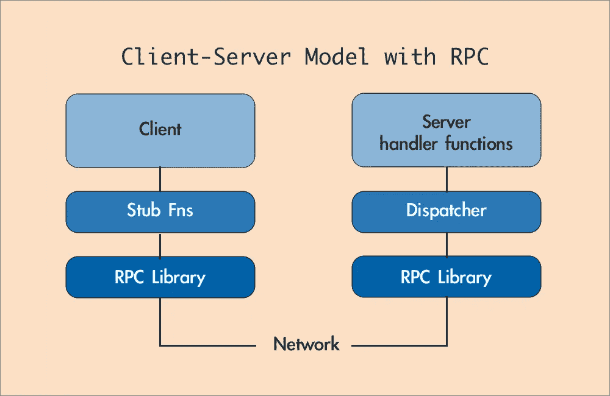
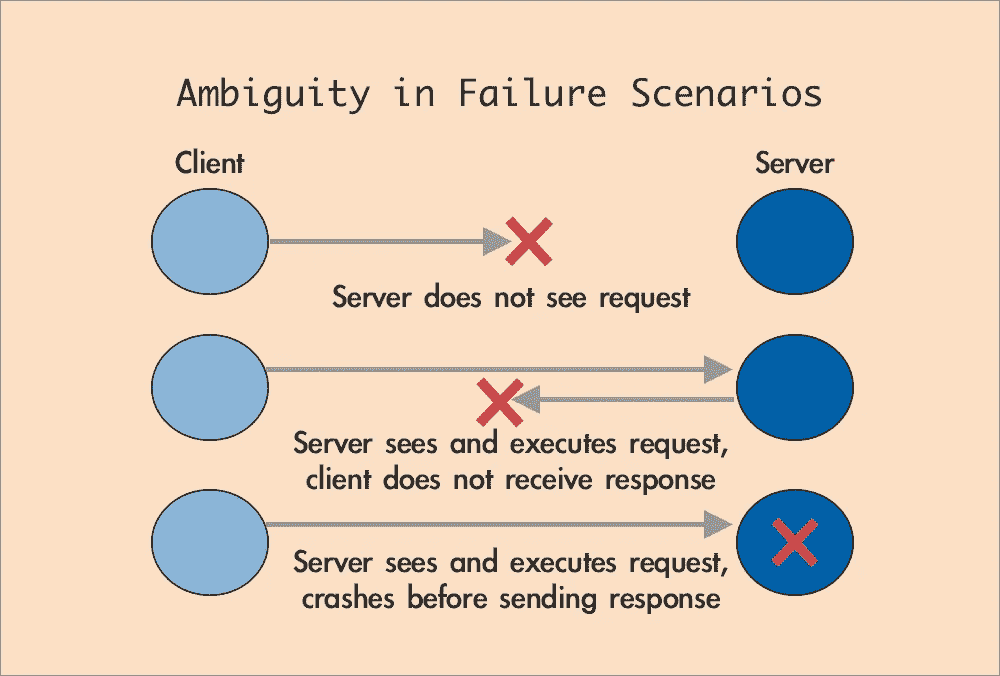

# 深入研究远程过程调用(RPC)

> 原文：<https://levelup.gitconnected.com/deep-dive-into-remote-procedural-calls-rpc-41d72fb98293>

## 使用 RPC 的目的是使客户机和服务器之间的通信看起来像一个常规的过程调用。

弗拉季斯拉夫·克拉平在 [Unsplash](https://unsplash.com?utm_source=medium&utm_medium=referral) 上的照片

我第一次被介绍给**R**emote**P**procedural**C**all(RPC)是在去年 12 月的一次软件工程入门任务中。我很快了解到 RPC 是我公司的许多分布式基础设施中使用的一个基本组件。作为一名新的实习生，我没有完全理解 RPC 给桌面带来的好处。我只是满足于完成我的入学任务，并开始我的实习项目。

如果你和我同病相怜，我来试着解释一下 RPC 是什么。RPC 是一个**抽象层，支持客户端和服务器**之间易于编程的通信。使用 RPC，网络协议的混乱细节被封装和隐藏起来。众所周知，RPC 在当今的分布式系统中扮演着重要的角色。

在撰写这篇短文的过程中，我希望提供 RPC 背后的一些直觉，这是我希望在实现我的入口任务时能够更加欣赏的东西。我还将讨论网络和服务器故障时的一些边缘情况，以及可以用来处理这种故障的一般技术。

> 本文是深入研究分布式系统系列的第二篇文章，旨在深入研究分布式系统中使用的常见概念或机制。查看这里的第一个帖子。

 [## 深入研究主/辅助复制以实现容错

### 你真的了解复制是如何工作的吗？

levelup.gitconnected.com](/deep-dive-into-primary-secondary-replication-for-fault-tolerance-6ba203b06901) 

# RPC 在客户机-服务器体系结构中的作用

为了理解 RPC 如何作为分布式系统机器的一个关键部分发挥作用，我们必须检查 RPC 的目标和需要 RPC 的上下文。RPC 主要用在客户机-服务器模型中，作为一个抽象层来简化客户机和服务器之间的交互。

在许多分布式系统中，客户机-服务器模型用于在称为服务器的服务提供者和称为客户机的服务请求者之间划分工作负载[1]。通常，客户端和服务器在独立的硬件上通过计算机网络进行通信，但是客户端和服务器可能驻留在同一台机器上[1]。客户端通常启动与服务器的通信服务，服务器等待传入的请求。例如，在 web 应用程序中，客户端是指用户直接与之交互的前端，而服务器是指处理请求并将结果返回给客户端进程的后端。

RPC 的目标是使客户机和服务器之间的通信看起来像一个常规的过程调用。从客户端的角度来看，RPC 抽象出了进行网络调用、解析请求和响应的细节，使得客户端看起来只是调用一个常规函数来处理请求。这简化了客户端的工作——客户端可以专注于应用程序的主要逻辑，而将细节留给 RPC 库。

RPC 如何在客户端-服务器通信中使用的结构。

如上图所示，客户端将调用存根函数(看起来像另一个常规函数)，其中包含对 RPC 库的调用。RPC 库整理请求并通过网络将它们发送到服务器。请求由 RPC 库接收和解组，然后被分派给服务器中相应的处理函数。在处理函数生成所需的结果之后，RPC 库将结果整理成一个响应，该响应被发送回客户机进行解组。客户机将接收结果，作为最初调用的存根函数的返回值。

# 边缘案例:如何处理失败

分布式系统通常包括几万到几千台机器。失败不可避免。我们必须处理故障，以提供可靠和可用的服务。一些最常见的故障形式包括数据包丢失、网络通信中断、服务器运行缓慢或崩溃。

## 对于客户端 RPC 库来说，失败看起来像什么？

然而，很难直接检测出发生了什么故障。让我们考虑一下从客户端 RPC 的角度来看失败会是什么样子。下面，我们列出了在发生故障时可能发生的几种情况:

*   客户端永远看不到来自服务器的响应。
*   客户端不知道服务器是否看到了请求！
*   也许服务器没有看到这个请求。
*   也许服务器执行了，但是在发送回复之前崩溃了。
*   也许服务器执行了，但是网络在发送回复之前就死机了。

下图描述了三种故障场景，其中客户端没有收到响应，并且无法区分这三种故障。

从客户端的角度来看，上述三种情况都是一样的——在这三种情况下，客户端都没有收到响应。

## 在 RPC 中处理故障

处理失败的最简单的方法是使用“尽力而为”的方法，在这种方法中，客户端将在放弃之前重试几次。例如，让我们考虑一个客户机在一个简单的键值存储(服务器)中执行 Get(key)命令:

1.  Get(key)将在预定义的超时时间内等待响应。
2.  如果超时后没有收到响应，请重新发送请求。
3.  重复几次。
4.  放弃并向客户端返回一个错误。

然而，正如你们中的一些人所知，尽力而为的方法并不是最好的(双关语)。在某些应用中，它有时甚至会导致严重的问题。考虑这种情况，当同一个客户端试图执行 2 个不同的 Put(key，value)命令时:

*   Put(5，10)
*   Put(5，20) —在 Put(5，10)之后立即运行

什么会得到(5)产量？根据网络条件和数据包延迟，即使客户端在 Put(5，10)之后执行 Put(5，20)，仍有可能从 Get(5)得到值 10。你能看出为什么吗？

对于非等幂的操作(即多次应用操作将导致不同的结果)，尽力而为的方法也可能导致意想不到的结果。例如，加法不是幂等运算，因为如果 Add(1)对初始值为 0 的变量执行两次，我们将得到 2，而不是 Add(1)只执行一次时的 1。相比之下，一个幂等运算将被放置(5，5)，因为执行它两次将导致与只执行它一次相同的结果。假设客户端在超时后重试执行 Add(1)命令，但是，第一个 Add(1)命令在超时后到达服务器。状态将是 2，而不是预期的 1。

根据服务的业务需求，这些行为可能是不可接受的。处理失败的一个更好的方法是“最多一次”计划。其思想是，服务器将使用唯一的 id 检测重复的请求，并返回以前的回复，而不是重新运行处理程序函数。这意味着非幂等操作最多执行一次，从而避免了上述问题。

一个“恰好一次”的方案怎么样？在这个方案中，我们可以保证发送的每个请求最终只执行一次。这是理想的情况，但是在实践中实现起来更复杂。这种方案背后的直觉是使用带有重复检测的无限重试。还需要一个容错系统来确保不会因为服务器崩溃而丢失请求。

# 参考

[1]客户端-服务器模式—维基百科[https://en.wikipedia.org/wiki/Client%E2%80%93server_model](https://en.wikipedia.org/wiki/Client%E2%80%93server_model)

[2]麻省理工学院 6.824 RPC 和线程注【https://pdos.csail.mit.edu/6.824/notes/l-rpc.txt 