# 深入了解 TLS 握手

> 原文：<https://levelup.gitconnected.com/deep-dive-into-tls-handshake-e029e28e2eb3>

## 逐步解释 TLS 1.2 握手过程

叶卡捷琳娜·博洛夫索娃摄于[佩克斯](https://www.pexels.com/photo/man-people-woman-business-6077239/?utm_content=attributionCopyText&utm_medium=referral&utm_source=pexels)

前阵子我给[写了一篇关于如何解决 SSL 证书错误](/how-to-resolve-certificate-errors-in-nodejs-app-involving-ssl-calls-781ce48daded)的文章。本文简要讨论了 TLS 握手。还有很多细节没有披露。

令我惊讶的是，自从[我开始写技术博客](/what-i-learnt-from-writing-technical-blogs-d4e9163ff24c)以来，这篇文章成为我的媒体文章中被浏览次数最多的一篇。我猜读者会感兴趣，因为这篇文章用简单的英语解释了 SSL 概念。这促使我写这篇文章。

让我们深入了解一下 TLS 握手过程。

向前跳:

*   [概述](#c43f)
*   [第一步:客户问候](#4d66)
*   [第二步:服务器 Hello](#d84e)
*   [步骤 3:客户端密钥交换](#80d8)
*   [步骤 4:服务器更改密码规范](#124d)
*   [结论](#1aab)

## 什么是 TLS 握手？

TLS 握手负责在客户端和服务器之间建立安全连接。当您通过 HTTPS 访问网站时，TLS 握手发生在您的浏览器和 web 服务器之间，因此您的浏览器可以通过安全连接与 web 服务器通信。

TLS 握手的主要目的是

*   协商密码套件和 TLS 版本
*   对服务器和客户端进行身份验证
*   交换密钥

TLS 握手有两个常见版本:TLS 1.2 和 TLS 1.3。TLS 1.3 于 2018 年被 IETF 发布为 [RFC 8446](https://datatracker.ietf.org/doc/rfc8446/) 。它是 TLS 1.2 的改进版本。

在本文中，我们只讨论 TLS 1.2。如果你理解 TLS 1.2 握手过程，TLS 1.3 会很容易，因为它是一个简短的版本。

## 概观

握手过程包括客户端和服务器之间交换的大量消息。它们可以分为 4 个主要步骤。

*   客户你好
*   服务器你好
*   客户端密钥交换和更改密码规范
*   服务器更改密码规范

下面的截图是 [Wireshark](https://www.wireshark.org/) 捕捉到的握手过程。

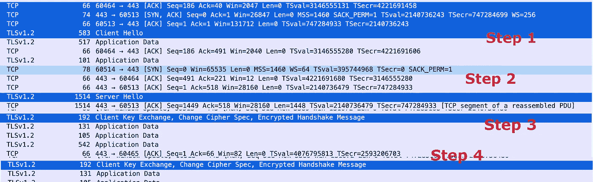

wireshark 的握手过程

让我们一个一个地研究它们。

## 第一步:客户问候

“`Client hello"`消息是请求服务器开始 TLS 握手。

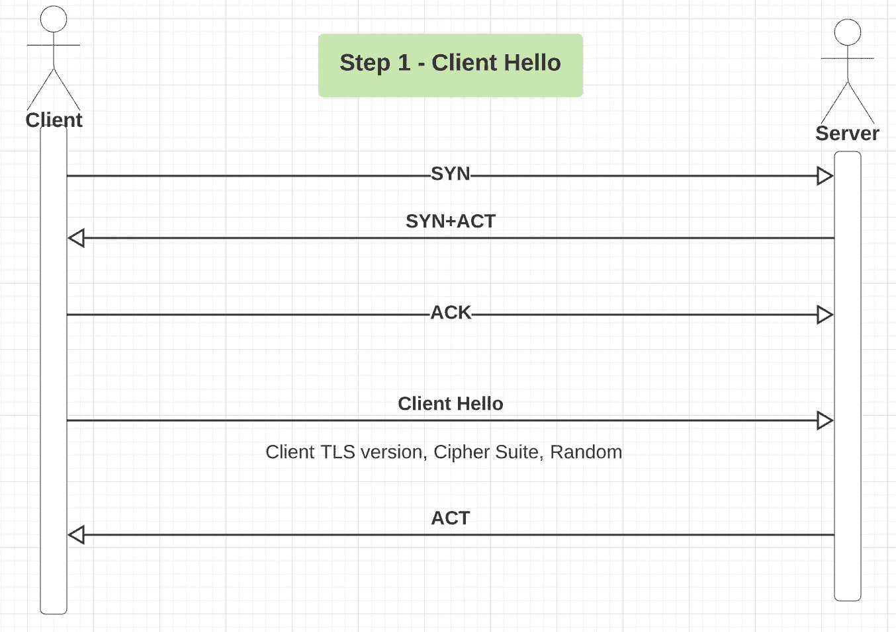

握手步骤 1

下面是捕获的`client hello`请求包。该消息包括客户端的 TLS 版本、随机值和支持的密码套件列表。

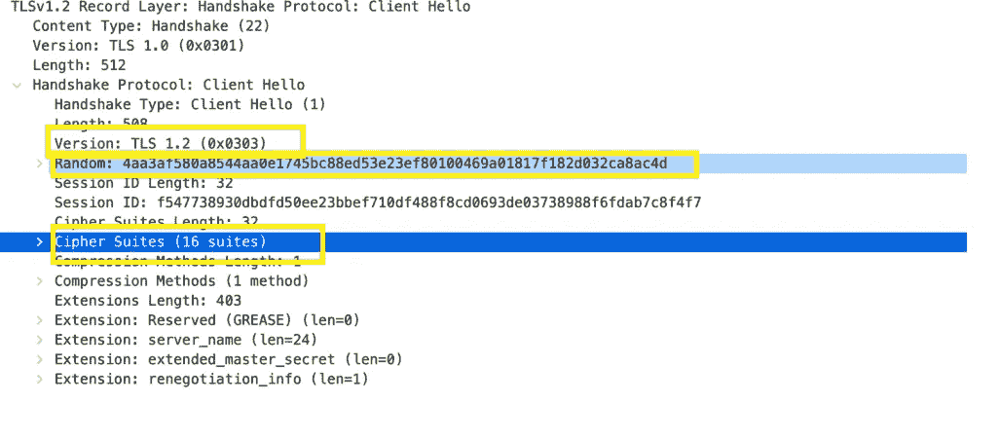

客户你好

随机值将由服务器保存，以便稍后生成预主密钥。支持的密码套件列表允许服务器选择双方可以用来通信的密码套件。

## 第二步:服务员你好

收到`Client Hello`消息后，服务器将

*   确认它是否支持 TLS 版本
*   从`Client Hello`消息的列表中选择一个密码套件
*   生成服务器随机值

服务器将通过发送一个包含 TLS 版本、随机值和选择的密码组的`Server Hello`消息来响应。

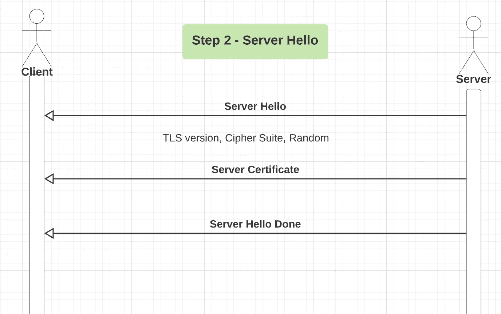

握手步骤 2:服务器你好

从下面的 Wireshark 数据包捕获中，我们可以看到服务器 Hello 消息的内容。它确认 TLS 版本 1.2 是相互支持的，并且是密码套件首选项。

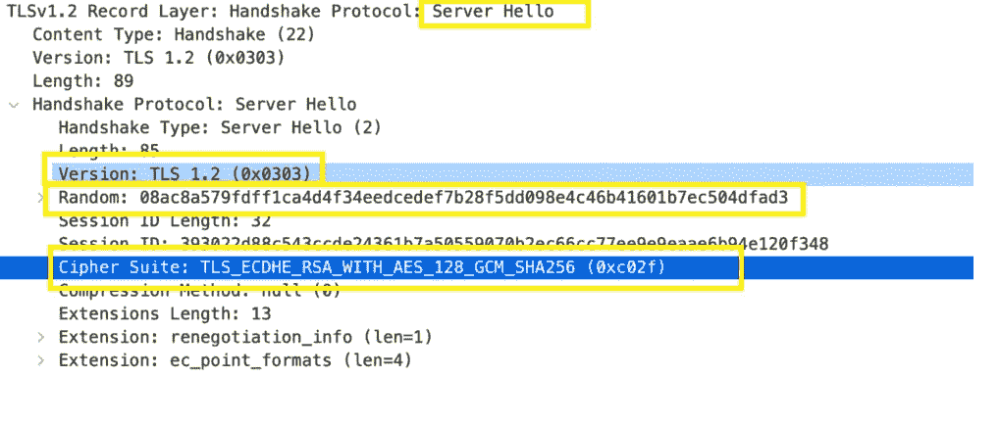

服务器你好

上面的密码套件命名可能看起来令人困惑。一般规则如下所示。

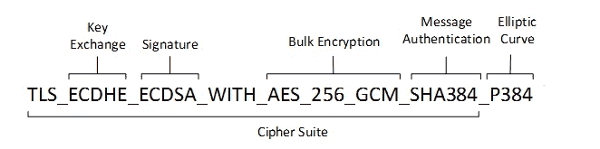

来源:微软密码套件

因此，上面选取的密码套件:`TLS_ECDHE_RSA_WITH_AES_128_GCM_SHA256 (0xc02f)`表示:

*   我们使用 [ECDHE](https://en.wikipedia.org/wiki/Elliptic-curve_Diffie%E2%80%93Hellman) 来交换密钥
*   RSA 是身份验证算法
*   AES_128_GCM 是加密算法
*   SHA256 是哈希算法

出于身份验证的目的，服务器还会将其 SSL 证书链发送给客户端。它还可以向客户端请求证书。

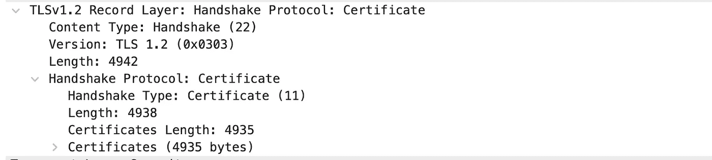

服务器证书

该步骤中的最后一条消息是`Server Hello Done`消息。就是告诉客户端所有的消息都已经发给你了。

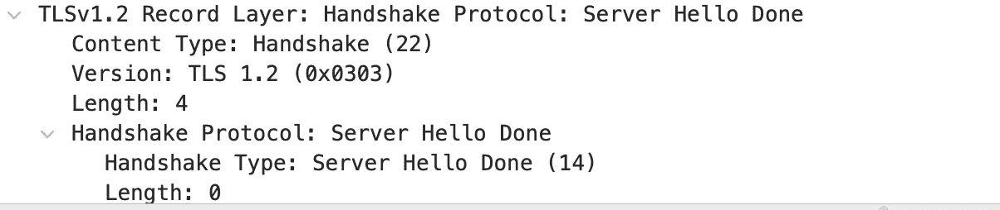

服务器 Hello 完成

**客户端证书请求**

可选地，服务器可能也想要验证客户端。在这个步骤中，服务器可以发送一个`client certificate request`。该请求包括支持的证书类型和 ca 的列表。服务器将在收到客户端的响应后验证客户端的证书。

`client certificate request`通常是服务器到服务器通信所必需的。例如，当一个内部 web 服务器试图与另一个 web 服务器通信时，它们需要相互验证。

## 步骤 3:客户端密钥交换

在客户端接收到服务器证书后，它将执行一系列验证步骤来[验证证书](https://en.wikipedia.org/wiki/Certificate_authority)。如果结果是肯定的，那么客户端将继续到`Client Key exchange`。

`Client Key exchange`消息取决于从前面步骤中选择的公钥算法。客户端使用由 RSA 算法加密的预主密钥或 ECDHE 进行密钥交换和身份验证。

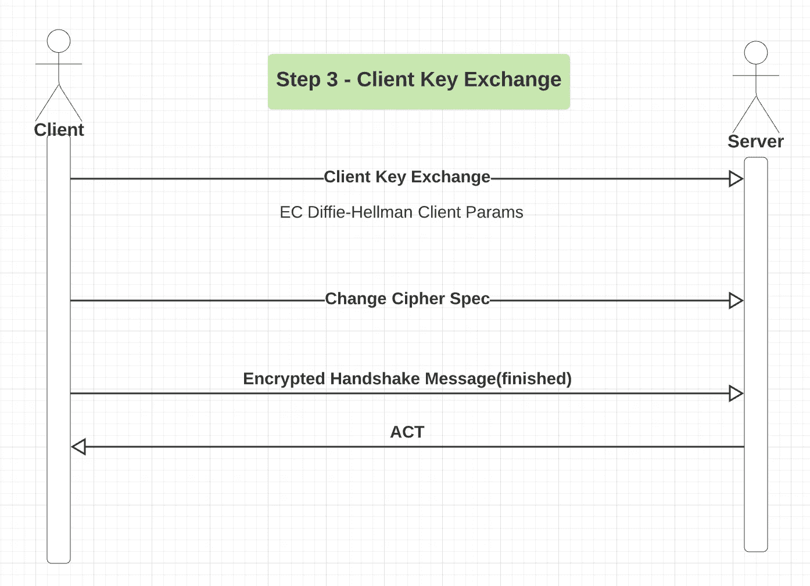

握手步骤 3

在我们的示例中，密钥交换是通过 ECDHE 完成的，如下面的数据包捕获。这意味着客户端和服务器使用 ECDHE 参数来生成预主密钥。

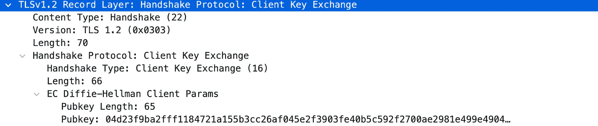

客户端密钥交换

服务器收到`Client Key exchange`消息后，将使用 ECDHE 参数和随机值计算预主密钥。

然后，客户端和服务器都使用预主密钥来生成会话密钥。客户端发送“更改密码规范”消息，通知另一方它正在切换到加密。

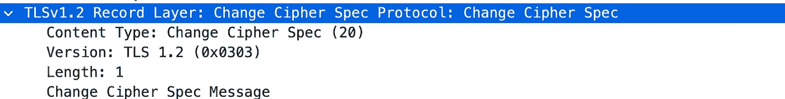

更改密码规格

客户端发送一个最终的“完成”消息，表示它已经完成了握手的一部分。从现在开始，所有的信息都被加密了。

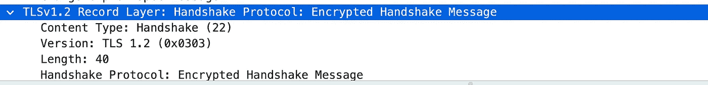

握手完成消息

**可选客户端证书**

如果服务器已经向客户端请求了证书(步骤 2)，则客户端会将证书发送给服务器。

## 步骤 4:服务器更改密码规范

作为最后一步，服务器做同样的事情。它发送“更改密码规范”消息以指示它更改为加密通信。

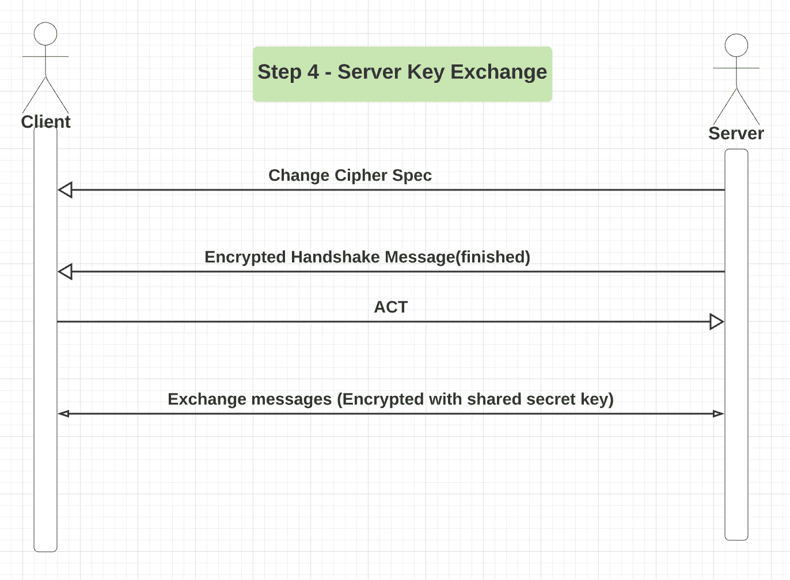

握手步骤 4 —服务器密钥交换

在`Change Cipher Spec`消息之后发送完成消息。这是为了确认密钥交换和身份验证过程已成功完成。下面的数据包捕获显示了服务器“完成”消息的示例。

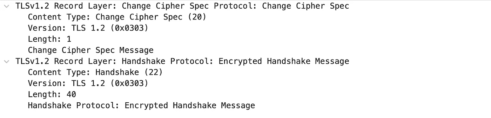

握手完成

## 摘要

TLS 握手在幕后悄悄地发生。对于互联网来说，这是一个必不可少的过程，就像水和电对于现代社会一样。我们可能只有在它不能正常工作时才意识到它的存在。

作为开发人员，了解内部机制可以帮助您在复杂的环境中对应用程序进行故障排除。

希望这篇文章对你有用。

*如果您还不是 Medium 的付费会员，* [***您可以访问此链接***](https://sunnysun-5694.medium.com/membership) *。你可以无限制地阅读媒体上的所有报道。我会收你一部分会员费作为介绍费。*

# 参考

[1]Docs.microsoft.com。2021.*TLS/SSL(Schannel SSP)中的密码套件— Win32 应用*。[在线]可从以下网址获取:<https://docs . Microsoft . com/en-us/windows/win32/sec authn/cipher-suites-in-schannel>【2021 年 10 月 10 日获取】。

[2]En.wikipedia.org。2021.*椭圆曲线迪菲-赫尔曼-维基百科*。[在线]见:<https://en . Wikipedia . org/wiki/Elliptic-curve _ Diffie % E2 % 80% 93 hellman>【2021 年 10 月 10 日获取】。

[3]Ibm.com。2021. *IBM 文档*。【在线】可在:<https://www.ibm.com/docs/en/ibm-mq/7.5?topic = SSL-overview-TLS-handshake>【2021 年 10 月 10 日访问】。