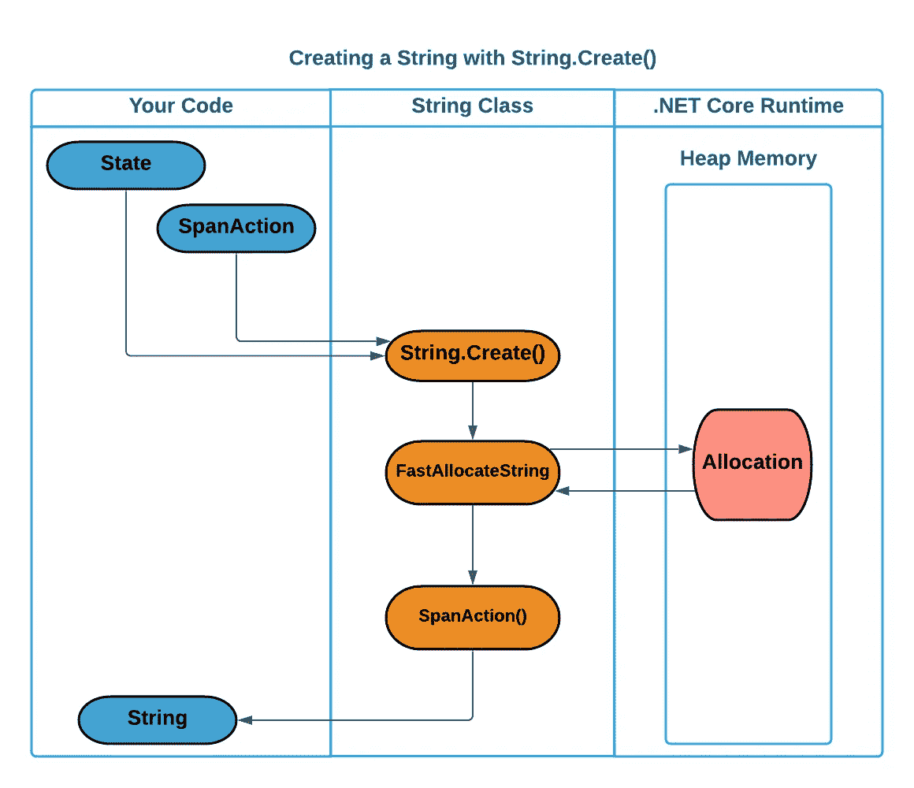

# 开始深潜。网芯串。创建()性能

> 原文：<https://levelup.gitconnected.com/deep-dive-on-net-core-string-create-performance-6597bb47f3c6>

## 我研究了提高字符串性能的策略。NET 和 ASP.NET 核心。创建()

上一次一个无关紧要的细节在你的大脑中引发一场运动是什么时候？作为一名软件工程师，我习惯于关注新代码块中我从未见过的微小细节。那时，我大脑中的齿轮开始转动。我喜欢这些时刻。最微小的琐事都会让我陷入探索的兔子洞。

上次你想到的时候是什么样子的？

最近我在浏览 Twitter 时遇到了这种情况。我偶然发现大卫福勒和达米安爱德华兹之间的交流，讨论。NET `Span<T>` API。我以前用过`Span<T>` API，但是我在 tweets 中发现了一些新的和不同的东西。

这是一件小事，也是我开始潜入兔子洞的原因。**字符串。上面使用的创建**方法是我从未见过的。**字符串。Create** 是一颗隐藏的宝石，我决心揭开它的神秘面纱。我发现自己问了一个问题:

> *“为什么使用这种方法创建字符串？”*

我开始了旅程，它带我去了几个有趣的地方，我想和你们分享。在本文中，我们将深入探讨几个主题…

*   什么是**字符串。创建**和其他 API 有什么不同？
*   **什么字符串。Create** 做得更好，如何能让我的 C#代码更快？
*   它还能实现多少性能？
*   可以并且应该避免哪些陷阱？

# 定义

为了使文章简单一点，我将引用几个例子。NET 核心 API 的方式如下:

*   **创造**——指使用`String.Create()`。
*   **Concat** —指使用`String.Concat()`或加号(`+`)运算符。
*   **格式** —指的是使用`String.Format()`，它的许多重载之一，或者使用`$""`语法的字符串插值。
*   **StringBuilder** —指用 fluent `StringBuilder`类和 API 构造一个字符串。

# 它是如何工作的？

的。NET 核心代码库是开源的，在 GitHub 上开发的[。这为深入分析微软自己的实践提供了一个很好的机会。他们提供了 **Create** API，因此观察他们如何使用它应该会提供有价值的见解。让我们从深入研究`String`对象及其相关的 API 开始。](https://github.com/dotnet/runtime/blob/master/src/libraries/System.Private.CoreLib/src/System/String.cs)

为了从原始字符数据中构建一个字符串，您需要使用需要一个指向 `[char](https://github.com/dotnet/runtime/blob/master/src/libraries/System.Private.CoreLib/src/System/String.cs#L57)` [数组](https://github.com/dotnet/runtime/blob/master/src/libraries/System.Private.CoreLib/src/System/String.cs#L57)的[指针的构造函数。直接使用这个 API 需要将单个字符放入特定的数组位置。下面是使用此构造函数分配字符串时运行的代码。还有许多其他方法来创建字符串，但这是我认为最能与 **Create** 方法相提并论的。](https://github.com/dotnet/runtime/blob/master/src/libraries/System.Private.CoreLib/src/System/String.cs#L57)

来自的字符串构造函数。NET 核心运行时

重要步骤总结如下:

1.  输入经过验证。空数组返回`String.Empty`。
2.  我们基于数组`Length`使用`FastAllocateString`分配内存。`FastAllocateString`在内部实现。NET 运行时本身，并支持几乎所有的字符串分配。
3.  我们调用`Buffer.Memmove`，将原来数组的所有字节复制到新分配的字符串中。
4.  返回结果字符串。

要使用这个构造函数，我们需要为它提供一个`char`数组。它的工作完成后，我们得到了一个(现在不必要的)`char`数组和一个`string`，每个数组都有相同的数据。如果我们要修改原始数组，那么`string`将保持不变，因为它是数据的一个单独且不同的副本。在一个高性能。NET 环境中，保存对象和数组分配非常有价值，因为它减少了。NET 垃圾收集器在运行时需要做的事情。留在内存中的每一个额外的对象都会增加收集的频率，降低整体性能。

如果您想了解更多关于。NET 垃圾收集及其对性能的影响，网上有许多精彩的资源:

*   [ASP.NET 核心红隼:构建快速网络服务器的冒险——达米安·爱德华兹&大卫·福勒](https://youtu.be/kej3YJDMAW4?t=505)
*   避免 GC 压力并提高 C#性能的 8 个技巧。净
*   [垃圾收集器如何导致随机变慢](https://www.red-gate.com/simple-talk/dotnet/asp-net/how-the-garbage-collector-can-cause-random-slowness/)

为了与构造函数对比并消除这种不必要的数组分配，我们来看看为 **Create** 方法运行的代码:

字符串。从创建()。NET 核心运行时

这些步骤很相似，但有一个关键区别:

1.  输入经过验证。无效的`action`或负的`Length`将抛出异常，为 0 的`Length`返回空；
2.  我们基于`length`参数使用`FastAllocateString`分配内存。
3.  将新分配的`string`转换为`Span<char>`。
4.  调用提供的`action`并传入新的`Span<char>`和提供的`state`。
5.  返回结果`string`。

这种方法通过允许我们传入一个`SpanAction`来避免额外的分配，它的功能是作为一组应该如何创建我们的字符串的指令，而不是要求我们需要放入字符串的所有字节的第二个副本。

从平面设计中可以得出一个类比。你可能想为你的企业创建一个专业的标志，你可能决定你想用 SVG 或 EPS 这样的矢量格式来创建它。您创建了一个文档，其中详细介绍了徽标的主题、颜色和总体外观。您现在有几个选择:

1.  自己画初稿，尽量接近专业版，发给平面设计师，让他们创作定稿。
2.  将您的原始详细文档发送给平面设计师，他会根据您提供的信息创建最终的徽标。

在第一种情况下，您最终有两个图像，但只有一个是您计划使用的。你的原件可能不需要任何仪式就可以扔掉，因为你现在有了你专业设计的版本。在第二种情况下，你没有生产任何额外的产品，因此产生了较少的浪费。

**Create** 方法的过程更接近于将文档发送给设计者的情况。通过告诉他们你从一开始就想要什么，你只能以你需要的形式生成一个最终的工件。

# 弦怎么样。创建()更好？

此时，您可能对**创建**方法感到好奇，但是您不一定知道为什么它比您以前使用的方法更好。**Create**API 的有用性是视情况而定的，但是在适当的上下文中它会非常强大。

*   它预先分配一个桶，然后给你一个接口来安全地装满这个桶。产生类似结果的其他方法可能需要编写不安全的代码或管理缓冲池。
*   它避免了额外的数据复制操作，这通常会导致较少的分配。这减少了来自垃圾收集器的压力，从而加快了整个程序的速度。
*   它允许您将高性能代码集中在应用程序的业务需求上，而不是将字符串构建代码与复杂的内存管理交织在一起。

# 字符串的用例。创建()

当你已经知道最终字符串的长度时，你只能使用 **Create** 方法。然而，您可以创造性地处理这个约束，并发现几种利用 **Create** 的方法。我搜索了 [dotnet/aspnetcore](https://github.com/dotnet/aspnetcore) 和 [dotnet/runtime](https://github.com/dotnet/runtime) 的代码库，看看微软团队决定在哪里使用这个 API。本文的其余部分将深入探讨我发现的三个趋势:

*   生成 id
*   对性能敏感的连接
*   格式化复杂字符串

## 生成 id

考虑来自 ASP.NET 核心存储库的这个类，用于为每个 web 请求生成关联 id。它以从数字(0–9)和大多数大写字母(A-V)中选择的 13 个字符的格式生成一个相关 ID。

算法很简单:

1.  从 UTC 的最新刻度计数开始您的相关 ID。滴答计数是一个 64 位整数。
2.  对新 ID 的每个请求增加 1。
3.  对于 13 个字符中的每一个:
    -将值移动 5 个额外的(`character_index * 5`)位。
    -抓取最右边的 5 位(`shifted_value & 31`)，并根据预定的表格选择一个字符。

对于我们的基线比较，我使用了一个利用了`StringBuilder`的简单实现。我选择这个选项是因为`StringBuilder`是[经常推荐的](https://docs.microsoft.com/en-us/troubleshoot/dotnet/csharp/string-concatenation)API，在性能上优于常规的字符串连接。我编写了额外的实现，试图使用`StringBuilder`(有容量)、`StringBuilder`(没有容量)和简单的连接。

**执行基准**

**内存基准**

`String.Create()`方法在性能(16.58 纳秒)和分配(只有 48 字节)方面表现最好！).有趣的是，没有指定容量的`StringBuilder`也显示出比常规`StringBuilder`小的优势(它仍然输给`String.Create()`，但这对于未来的`StringBuilder`使用来说是有趣的)。

## 对性能敏感的串联

C# Roslyn 编译器在优化不良连接方面非常聪明。编译器倾向于将加号`+`操作符的多次使用转换成对 **Concat** 的单次调用，并且可能有许多我不知道的额外技巧。由于这些原因，串联通常是一个快速的操作，但是对于简单的场景，它仍然可以被 **Create** 挤掉。

演示用 **Create** 方法连接的示例代码非常简单。

在发现[只有一个真实的例子](https://github.com/dotnet/runtime/blob/a9b1173e64f628c7233850be6b762a58897bc6be/src/libraries/System.Diagnostics.TextWriterTraceListener/src/System/Diagnostics/XmlWriterTraceListener.cs)之后，我精心制作了这个特殊的案例。NET 核心源代码。这看起来像是一个可以被合理地抽象出来并散布在频繁过度使用加号`+`操作符或`String.Concat`的代码库中的案例。我没有找到更多案例的可能原因是基准测试证明这是一个边际收益。

*注意:内存基准没有什么可报告的，因为两种方法生成了相同数量的分配内存。*

我发现这些结果很有趣。即使对于通用的 **Concat** 用法， **Create** 方法也略微快了几个百分点。然而，由于有可能推广一个快速字符串连接方法库，维护和性能之间的权衡将变得更加清晰。您可以将所有串联方法包装在一个静态类中，添加您的单元测试，并且再也不用接触它们。

从维护的角度来看， **Concat** 仍然更干净，因为对团队中的其他开发人员来说非常容易识别。然而，如果你以每秒数百万的速度连接字符串(比如一个高流量的[ASP.NET](http://ASP.NET)应用程序)，这几个百分点可能是值得的。总的来说，我仍然建议剖析您的具体案例，以证明您的专用方法更快。

## 复杂字符串的格式

当您知道所涉及的所有较小片段的长度时，也可以使用 **Create** 构建复杂的格式。通常，当您将这些字符串封装为单个类的属性或单个方法的参数时，就会出现这种情况。当处理固定宽度或分隔数据行时，如 CSV 文件，使用 **Create** 可能也是有利的。

我在[ASP.NET](http://ASP.NET)核心库中发现了一个[很好的例子](https://github.com/dotnet/aspnetcore/blob/8a81194f372fa6fe63ded2d932d379955854d080/src/Http/Headers/src/SetCookieHeaderValue.cs)，以`SetCookieHeaderValue`类的形式。这个类包含写出 cookie HTTP 头所需的所有属性。方便的是，这个类还包含了一个使用 **StringBuilder** 来完成相同格式化任务的方法。这给了我一个很好的机会来编写快速基准测试。

下表显示了这两种方法的不同之处:

对于像 cookie 头这样的复杂字符串， **Create** 将性能提高了近 33%！像这样的复杂格式表明，当使用 **Create** 方法时会有很多收获。

虽然`SetCookieHeaderValue`类提供了一个理想的数据点，但它的逻辑相当长且复杂。我编写了一个简单的类来演示相同的格式化原则。

上面的`Dog`类包含三个应该产生相同输出的方法:`StringCreate`、`Concatenation`和`StringFormat`。每种方法都使用与其名称相匹配的格式策略。尽管复杂得多，但`StringCreate`的实际策略相对简单:

1.  抢先计算`Dog`类的每个属性的长度。有些属性可能需要一些创造性的逻辑来计算长度，而不需要具体化整个字符串(`Int32`就是一个很好的例子)。
2.  使用当前类(`this`)作为`state`参数以及预先计算的长度调用`String.Create`。
3.  使用`Span<T>`API 填充新实例化的`buffer`变量并返回最终字符串。

总的来说，`StringFormat`和`Concatenation`方法要短得多，也不复杂。这举例说明了在使用 **Create** 方法正确格式化复杂字符串时可能遇到的困难，以及为什么它应该只用于代码中的性能关键路径。然而，适当地利用这种方法可以在整体性能上获得显著的好处。

**执行时间基准**

**内存基准**

对于更复杂的情况，使用 **Create** 方法格式化要快 25%到 35%。我选择的基准方法显示了仔细考虑这个用例的另一个原因，即 **Create** 方法。您可以看到，当需要格式化的元素较少时，简单串联的性能会稍好一些。在`Dog`没有`Age`或`Color`值的情况下，计算和格式化字符串所需的工作掩盖了使用 **Create** 带来的性能提升。

一旦我们填充了这些属性， **Concat** 很快就变成了较差的选项。这说明了为什么在使用这种方法之前理解您的数据也很重要。如果 99%的案例都很简单，你就不需要这么多帮助。**格式**方法始终是最慢的选择，尽管可以说是最初编写最快的方法，并且很可能是未来最易维护的方法。

# 何时不使用字符串。创建()

**Create** 在性能关键型代码中显示出巨大的潜力，但是有许多合理的理由避免它。作为软件工程师，我们经常以牺牲大局为代价，变得更加依赖于我们系统的度量标准。一般来说，我认为体面但可维护的代码应该优先于出色的性能。这让我开出了三种通常情况下应该避免使用 **Create** 的方法，即使这会牺牲性能。

## 1)可读性很重要时不要使用

最终，这个 API 不是易于维护的。你的场景应该要求非常高的性能，你的代码应该是分解良好的，并且包含单元测试。当编写需要偶尔维护的代码时，您可以很容易地坚持使用这些更简单的格式化方法之一:

*   **格式**或**字符串插值**生成带有动态值的简单字符串。
*   **StringBuilder** 创建需要循环或许多条件元素的字符串时。
*   **Concat** 或者简单的`+`当你只需要组合少量字符串的时候。

## 2)当文化很重要时不要使用

**格式**、**字符串插值**，大多数`ToString()`方法都尊重文化格式化选项。这为您的代码提供了适应特定于区域性的日期、数字和货币格式的重要能力，而不必自己编写逻辑代码。 **Create** 本身并不提供对这些 API 的任何支持，试图在代码中模仿行为可能需要分配额外的字符串，从而消除了使用 **Create** 方法的优势。

## 3)(可能)不要在输出给人类时使用

这个情况有点主观。我不推荐使用 **Create** 为人类格式化的原因是人类**经常希望事情发生变化**。由于使用 **Create** 方法进行格式化极其冗长，随着时间的推移，任何更改都可能导致复杂性增加，从而产生越来越多的技术债务。在我看来， **Create** 的最佳用法是在机器可读的字符串上，或者在将来不太可能改变的更一般化的字符串编写 API 上。正如软件开发中经常出现的情况一样，您的具体情况是最重要的，但是我认为这是一个很好的通用规则，可以避免您预期在将来频繁修改的任何代码出现这种情况。

# 是字符串。创建()适合你吗？

这个问题的答案肯定是**看情况**。我通过关注对我来说新的东西开始了这项研究:字符串。创建方法。我一头扎进兔子洞，寻找使用这个 API 的新的有趣的方法。在这个过程中，我发现了使用该方法的三种主要方式:(1)生成 id，(2)快速连接，以及(3)复杂的字符串格式化。我们的基准测试表明，我们可以，**以合理的一致性**，使用**字符串产生一个更快的方法。以更简单、更易读的代码为代价来创造**。回答上述问题时，您应该始终考虑:

*   这段代码的可读性有多重要？
*   改变的可能性有多大？
*   我的程序会在多大程度上使用这段代码，它会获得多少性能？

这些都取决于你的代码和你的团队的实力，但我今天的希望是，我已经给了你一些工具来帮助你确定你的道路。

本文基准测试的代码可以在 GitHub 上获得[。](https://github.com/cmcquillan/StringCreateBenchmarks)