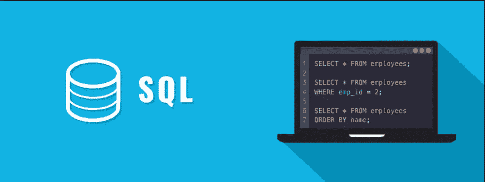
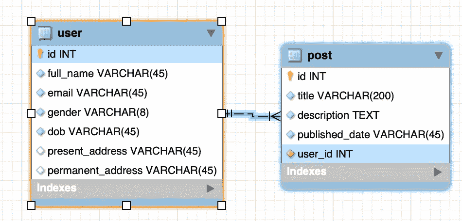
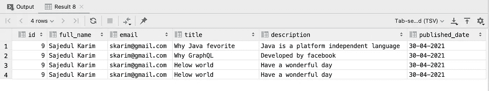
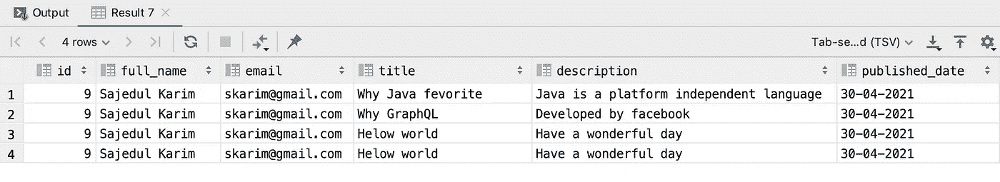

# 使用 MySQL 数据库深入了解存储过程

> 原文：<https://levelup.gitconnected.com/deep-dive-on-stored-procedure-with-mysql-database-3fa02669e2be>

## **存储过程**是编译后的代码，您可以从 SQL 语句或客户端应用程序中调用它。



图像信用—www.tutorialrepublic.com

存储过程是一组具有指定名称的结构化查询语言(SQL)语句，作为一个组存储在关系数据库管理系统(RDBMS)中，因此可以由多个程序重用和共享。

因此，如果您有一个反复编写的 SQL 查询，请将其保存为存储过程，然后调用它来执行它。

一旦存储过程运行，它就保留在内存中，因此下一个用户可以运行它，而不会产生将它加载到内存中的开销。

在本文中，我们将讨论以下主题

*   什么是存储过程？它有哪些用例？
*   存储过程的优缺点
*   如何编写一个存储过程并描述它的关键字，如输入和输出参数。
*   在 MySQL 数据库中编写不同标准的存储过程。

# 什么是存储过程

*   存储过程(也称为 proc、storp、sproc、StoPro、StoredProc、StoreProc、sp 或 SP)是访问关系数据库管理系统(RDBMS)的应用程序可用的子例程。
*   存储过程是分组为一个逻辑单元并存储在数据库中的一批语句。存储过程接受参数并执行过程中的 T-SQL 语句，如果有结果集，则返回结果集。
*   这样的过程存储在数据库数据字典中。
*   存储过程是一批 SQL 语句，可以用几种方式执行。大多数主要的 DBMS 都支持存储过程；然而，并不是所有人都这样做。您将需要验证您的特定 DBMS 帮助文档的细节。
*   还可以将参数传递给存储过程，以便存储过程可以根据传递的参数值进行操作。

# 使用存储过程的好处

## **很容易修改**

*   我们可以轻松地修改存储过程中的代码，而无需重启或部署应用程序。
*   例如，如果 SQL 查询是在应用程序中编写的，并且如果我们需要更改逻辑，我们必须更改应用程序中的代码并重新部署它。
*   存储过程通过将代码存储在数据库中来消除这种挑战。因此，当我们想改变过程内部的逻辑时，我们可以通过简单的 ALTER PROCEDURE 语句来实现。

## **表演**

*   SQL Server 存储过程在第一次执行时会创建一个计划并将其存储在缓冲池中，以便下次执行时可以重用该计划。
*   使用存储过程可以减少客户端和服务器之间的网络流量，因为命令是作为一批代码执行的。这意味着只通过网络发送执行过程的调用，而不是单独发送每一行代码。

## **可重复使用**

存储过程可以由多个用户或多个客户端应用程序执行，而无需重新编写代码。

## **安全**

存储过程通过消除对表的直接访问来减少威胁。我们还可以在创建存储过程时对其进行加密，这样存储过程内部的源代码就不可见了。

## 更容易排除故障

*   与在图形用户界面(GUI)中嵌入查询相比，存储过程具有优势。
*   由于存储过程是模块化的，所以当应用程序中出现问题时，更容易排除故障。
*   存储过程也是可调的，这样就不需要修改 GUI 源代码来提高性能。
*   编写存储过程比通过 GUI 构建查询更容易。

# 存储过程的缺点

## 难以测试

*   首先，封装在存储过程中的业务逻辑变得非常难以测试(如果要测试的话)。
*   一些开发人员喜欢在存储过程之上编写一个瘦数据访问层来解决这个问题，但是即使在这种情况下，测试的范围也仅限于一些集成测试。
*   为存储过程中的任何业务逻辑编写单元测试是不可能的，因为没有办法清楚地将域逻辑与实际数据分开。嘲笑、假装或磕碰也是不可能的。

## 难以调试

*   根据数据库技术的不同，调试存储过程要么根本不可能，要么极其笨重。
*   一些关系数据库，如 SQL Server，具有一些调试功能，而其他的则没有。
*   没有什么比使用数据库概要分析器来跟踪应用程序问题或通过打印语句调试数据库更糟糕的了。

**版本控制**

*   版本控制是存储过程不支持的另一个关键特性。
*   将存储过程更改放入可重新运行的脚本中，并将其放入版本控制系统中，这当然是明智的，但这并没有解决以下问题:存储过程中没有任何东西可以告诉我们存储过程处于哪个版本，以及在应用最新的脚本后是否有任何其他更改。

**难以驾驭的历史**

*   与版本控制类似，存储过程没有历史记录。
*   具体来说，如果业务逻辑跨越多个存储过程，那么在给定的时间点建立不同存储过程的不同版本的精确组合会非常困难。

## 害怕变化

*   存储过程的最大缺点之一是很难区分系统的哪些部分使用它们，哪些部分不使用它们。
*   特别是如果软件被分解成多个应用程序，那么通常不可能一次找到所有的引用(或者如果开发人员没有对所有项目的读取权限，则根本不可能找到),因此可能很难确定某个变化将如何影响整个系统。
*   因此，存储过程带来了引入重大变更的巨大风险，开发团队通常会回避任何变更。有时，这可能会导致新的技术创新瘫痪。

# 如何编写存储过程

## 存储过程的结构

通常，存储过程有参数。这些参数使存储过程更加有用和可重用。存储过程中的参数有三种模式:`IN,OUT`或`INOUT`。

`**IN**`参数**参数**

`IN`是默认模式。当您在存储过程中定义一个`IN`参数时，调用程序必须向存储过程传递一个参数。

此外，`IN`参数的值受到保护。这意味着，即使您在存储过程中更改了参数`IN`的值，它的原始值在存储过程结束后也不会改变。换句话说，存储过程只对`IN`参数的副本起作用。

`**OUT**`参数**参数**

一个`OUT`参数的值可以在存储过程中改变，它的新值被传递回调用程序。

请注意，存储过程在启动时无法访问`OUT`参数的初始值。

`**INOUT**` **参数**

一个`INOUT`参数是一个`IN`和`OUT`参数的组合。意味着调用程序可能会传递实参，存储过程可以修改`INOUT`参数，并将新值传递回调用程序。

我们的数据库 ER 图如下所示



图片来源—作者

在这里，它是一个典型的博客数据库。

*   在用户表中，它的 ID 列是主键
*   在 post 表中，用户 id 是一个外键，来自用户表

## 不带 out 参数的存储过程

这里，IN 参数是 emailNo，给出的响应是 userId、全名、电子邮件、文章标题、描述和发布日期

调用过程如下所示

```
call blog.get_userList(‘[skarim@gmail.com](mailto:skarim@gmail.com)’);
```

在这种情况下，输出是



图片来源—作者

## 不带 OUT 参数的存储过程

这里，IN 参数是 emailNo，OUT 参数是 userId、全名、电子邮件、文章标题、描述和发布日期

调用过程如下所示

```
all blog.get_userList('[skarim@gmail.com](mailto:skarim@gmail.com)',[@id](http://twitter.com/id), [@fullname](http://twitter.com/fullname), [@email](http://twitter.com/email), [@title](http://twitter.com/title),[@description](http://twitter.com/description), [@publishDate](http://twitter.com/publishDate));
```

在这种情况下，输出是



图片来源—作者

# 结论

希望你喜欢这篇文章。快乐阅读:)

**参考文献** 1。[https://dusted . codes/deprects-of-stored-procedures](https://dusted.codes/drawbacks-of-stored-procedures)2。[https://www . SQL shack . com/SQL-server-stored-procedures-for-初学者/](https://www.sqlshack.com/sql-server-stored-procedures-for-beginners/)
3 .[https://www.w3schools.com/sql/sql_stored_procedures.asp](https://www.w3schools.com/sql/sql_stored_procedures.asp)4。[https://search Oracle . tech target . com/definition/stored-procedure](https://searchoracle.techtarget.com/definition/stored-procedure)